# Kompendium Wiedzy - Egzamin Magisterski

**Studia II stopnia**
* **Kierunek:** Informatyka
* **Specjalność:** Cyberbezpieczeństwo

---

# Pytanie 1: Mechanizm wstrzykiwania zależności oraz rola i podstawowa funkcjonalność kontenera IoC.

## Kluczowe pojęcia
- **Inversion of Control (Odwrócenie sterowania - IoC)**: Ogólna zasada projektowania oprogramowania, w której kontrola nad przepływem programu zostaje przekazana zewnętrznemu frameworkowi lub kontenerowi.
- **Dependency Injection (Wstrzykiwanie zależności - DI)**: Konkretny wzorzec projektowy będący realizacją zasady IoC. Polega na dostarczaniu gotowych obiektów (zależności) z zewnątrz, zamiast tworzenia ich wewnątrz klasy korzystającej z tych obiektów.
- **Kontener IoC**: Narzędzie/biblioteka (np. Spring w Java/Kotlin, Microsoft.Extensions.DependencyInjection w .NET) odpowiedzialne za zarządzanie cyklem życia obiektów (komponentów) oraz ich automatyczne wstrzykiwanie.
- **Zależność (Dependency)**: Obiekt (serwis, repozytorium itp.), którego inna klasa potrzebuje do prawidłowego działania.

## Szczegółowe omówienie tematu

### 1. Inwersja sterowania (IoC) a Wstrzykiwanie zależności (DI)
W tradycyjnym podejściu programistycznym to klasa decyduje, kiedy i jaki obiekt utworzyć (np. używając słowa kluczowego `new`). Powoduje to silne sprzężenie (tight coupling). IoC odwraca ten schemat – to framework decyduje o tworzeniu obiektów i zarządzaniu nimi. DI to najpopularniejsza technika implementacji IoC, obok np. Service Locator lub wzorca Template Method.

### 2. Sposoby wstrzykiwania zależności (DI)
Wstrzykiwanie może odbywać się na kilka sposobów:
- **Przez konstruktor (Constructor Injection)**: Najbardziej zalecana metoda. Wszystkie wymagane zależności są przekazywane przy tworzeniu obiektu. Zapewnia niezmienność (immutability) i ułatwia testowanie (wszystkie zależności muszą być jawnie przekazane).
- **Przez metody ustawiające (Setter Injection)**: Zależności są wstrzykiwane za pomocą metod typu `setX(...)`. Przydatne dla opcjonalnych zależności, ale może prowadzić do niespójnego stanu obiektu (obiekt może zostać zainicjalizowany bez wymaganych zależności).
- **Przez pole (Field Injection)**: Bezpośrednie oznaczanie pola adnotacją (np. `@Autowired` w Springu). Niepopularyzowane i uważane za antywzorzec, ponieważ utrudnia testowanie jednostkowe (wymaga refleksji) i ukrywa rzeczywiste zależności klasy.

### 3. Rola i funkcjonalność kontenera IoC
Kontener IoC jest sercem nowoczesnych aplikacji biznesowych. Jego główne zadania to:
- **Zarządzanie cyklem życia obiektów (Lifecycle Management)**: Tworzenie instancji klas (tzw. "ziaren" / "beans" lub "services"), inicjalizacja, oraz czyszczenie zasobów przy ich niszczeniu.
- **Rozwiązywanie zależności (Dependency Resolution)**: Analiza struktury klas (np. poprzez refleksję lub metadane) i automatyczne dopasowywanie wymaganych obiektów do konstruktorów/metod.
- **Zarządzanie zasięgiem (Scope Management)**: Decydowanie o tym, jak długo dany obiekt żyje i jak jest współdzielony:
  - **Singleton**: Jedna instancja na cały kontener (domyślna dla większości kontenerów).
  - **Prototype/Transient**: Nowa instancja przy każdym żądaniu.
  - **Request**: Jedna instancja na jedno żądanie HTTP (w aplikacjach webowych).
  - **Session**: Jedna instancja na sesję użytkownika HTTP.

## Wizualizacja

Oto schemat blokowy / diagram ułatwiający zrozumienie zagadnienia:

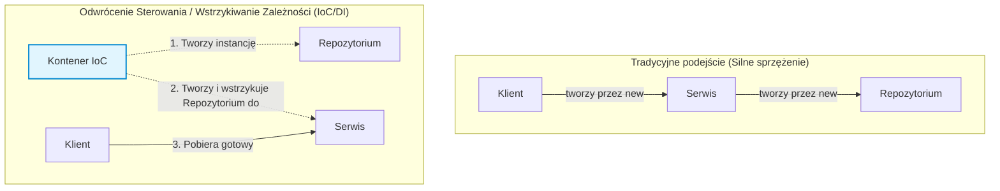

## Podsumowanie
Stosowanie IoC i DI pozwala na tworzenie kodu o niskim stopniu sprzężenia (loose coupling), co znacząco zwiększa testowalność (łatwość mockowania zależności), modułowość i czytelność aplikacji. Kontener IoC zwalnia programistę z ręcznego tworzenia skomplikowanych drzew obiektów, automatyzując ten proces.


---

# Pytanie 2: Koncepcja rozwoju oprogramowania sterowanego testami (TDD).

## Kluczowe pojęcia
- **TDD (Test-Driven Development - Rozwój sterowany testami)**: Metodyka tworzenia oprogramowania polegająca na pisaniu testów przed napisaniem właściwego kodu implementacji.
- **Cykl Red-Green-Refactor**: Trzyetapowy, fundamentalny cykl pracy w TDD: napisz test, który nie przechodzi (Red), napisz minimalny kod, aby test przeszedł (Green), popraw jakość kodu bez zmiany jego zachowania (Refactor).
- **Test jednostkowy (Unit Test)**: Test sprawdzający poprawność działania małego, odizolowanego fragmentu kodu (np. pojedynczej metody) z mockowaniem zewnętrznych zależności.
- **Regresja**: Sytuacja, w której zmiana w kodzie powoduje błąd w innej, dotychczas poprawnie działającej części systemu.

## Szczegółowe omówienie tematu

### 1. Przebieg cyklu Red-Green-Refactor
Praca w TDD odbywa się w mikro-krokach:
1. **RED (Czerwony)**: Programista projektuje interfejs nowej metody/funkcji i pisze dla niej test jednostkowy. Test zostaje uruchomiony i musi zakończyć się niepowodzeniem (ponieważ implementacja jeszcze nie istnieje lub jest pusta). Krok ten gwarantuje, że test jest poprawny i nie przechodzi bez powodu.
2. **GREEN (Zielony)**: Pisana jest minimalna konieczna implementacja kodu produkcyjnego tak, aby uruchomiony test przeszedł na zielono. Dopuszczalne są tu uproszczenia (np. zwracanie zahardkodowanej wartości), o ile test kończy się sukcesem.
3. **REFACTOR (Refaktoryzacja)**: Kod produkcyjny oraz kod testu są czyszczone. Usuwa się powtórzenia (zasada DRY), poprawia czytelność zmiennych, dzieli zbyt duże metody, bez zmiany funkcjonalności zewnętrznej. Każda zmiana jest natychmiast weryfikowana ponownym uruchomieniem testów.

### 2. Korzyści wynikające z TDD
- **Wymuszenie modularności**: Aby klasę dało się łatwo przetestować w izolacji, musi być ona luźno powiązana z innymi (loose coupling). TDD naturalnie promuje wstrzykiwanie zależności i stosowanie interfejsów.
- **Mniejsza liczba defektów**: Stałe testowanie sprawia, że błędy są wykrywane niemal natychmiast po ich wprowadzeniu.
- **Dokumentacja techniczna**: Testy są najbardziej precyzyjną formą dokumentacji – pokazują konkretne przypadki użycia, wejścia i oczekiwane wyjścia.
- **Odwaga w zmianach**: Posiadanie bogatego zestawu testów daje programistom pewność, że refaktoryzacja nie popsuje istniejących mechanizmów.

### 3. Bariery i ograniczenia TDD
- **Czas i koszty początkowe**: Czas programisty potrzebny na dostarczenie pierwszej wersji kodu jest większy niż w przypadku pominięcia testów (choć w długiej perspektywie TDD skraca czas fazy stabilizacji i debugowania).
- **Próg wejścia**: Wymaga dyscypliny i doświadczenia w projektowaniu testowalnego kodu. Złe testy (np. zbyt mocno powiązane z wewnętrzną implementacją klasy zamiast z jej kontraktem) utrudniają refaktoryzację.

## Wizualizacja

Oto schemat blokowy / diagram ułatwiający zrozumienie zagadnienia:

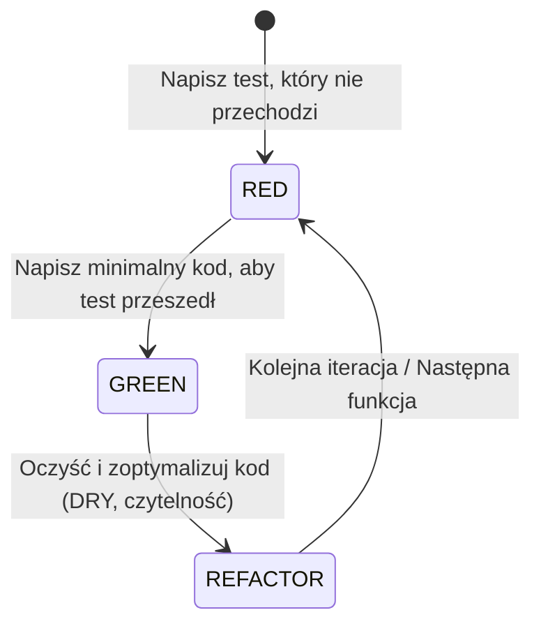

## Podsumowanie
TDD to metodyka projektowa, w której testy pełnią rolę wymagań projektowych i specyfikacji. Zapewnia ona tworzenie oprogramowania o wysokiej jakości technicznej, ułatwiając ciągłą integrację i elastyczność w modyfikacji kodu.


---

# Pytanie 3: Wzorzec architektury Business Delegate, obszar zastosowań.

## Kluczowe pojęcia
- **Business Delegate (Delegat biznesowy)**: Wzorzec projektowy warstwy prezentacji (często kojarzony ze specyfikacją Enterprise Java Beans - EJB / J2EE), którego celem jest odizolowanie warstwy prezentacji od fizycznej lokalizacji i implementacji usług biznesowych.
- **Service Locator (Lokalizator usług)**: Pomocniczy wzorzec projektowy odpowiedzialny za wyszukiwanie i pobieranie referencji do usług biznesowych (np. przy użyciu JNDI w środowiskach Java).
- **Business Service (Usługa biznesowa)**: Komponent realizujący logikę biznesową (np. Session Bean w EJB, serwis Springowy).
- **Luźne sprzężenie (Loose Coupling)**: Minimalizowanie bezpośrednich powiązań między warstwami, co ułatwia testowanie i modyfikację kodu.

## Szczegółowe omówienie tematu

### 1. Problem architektoniczny i rola Business Delegate
W złożonych systemach rozproszonych warstwa prezentacji (np. servlety, kontrolery MVC, aplikacje klienckie) musi wchodzić w interakcję z usługami biznesowymi działającymi na serwerze aplikacji. Bez stosowania delegata, kod prezentacji musiałby bezpośrednio:
- Znać API wyszukiwania usług rozproszonych (np. JNDI lookups).
- Radzić sobie ze specyficznymi wyjątkami sieciowymi (np. `RemoteException`).
- Być podatnym na zmiany w interfejsach i konfiguracji wdrożeniowej usług backendowych.

Wprowadzenie **Business Delegate** polega na stworzeniu lokalnej klasy pośredniczącej, która przejmuje te obowiązki. Warstwa prezentacji wywołuje metody na lokalnym obiekcie delegata, nie wiedząc, czy pod spodem wywoływana usługa znajduje się na tym samym serwerze, czy jest rozproszona geograficznie.

### 2. Architektura i komponenty wzorca
Wzorzec składa się z czterech głównych elementów:
1. **Client**: Warstwa prezentacji, która inicjuje żądanie.
2. **Business Delegate**: Pojedynczy punkt kontaktu dla klienta. Zapewnia kontrolę dostępu do usług biznesowych, ukrywa szczegóły techniczne wywołań zdalnych oraz obsługuje wyjątki systemowe/sieciowe.
3. **Service Locator**: Komponent używany przez `Business Delegate` do lokalizowania usług biznesowych. Odpowiada za enkapsulację logiki wyszukiwania i ewentualne buforowanie (caching) referencji do usług w celu poprawy wydajności.
4. **Business Service**: Rzeczywista usługa realizująca logikę biznesową aplikacji.

```
[ Client ] ---> [ Business Delegate ] ---> [ Service Locator ]
                       |
                       +-----------------> [ Business Service ]
```

### 3. Obszar zastosowań
- **Tradycyjne aplikacje typu Enterprise**: Systemy oparte na architekturze wielowarstwowej z fizycznie wydzielonym serwerem aplikacji i serwerem webowym.
- **Integracja z usługami zewnętrznymi**: Sytuacje, w których system integruje się z wieloma zewnętrznymi API (np. systemy płatności, kurierskie) i chcemy uchronić kod aplikacji przed zmianami w ich implementacji.
- **Zwiększenie odporności systemów rozproszonych**: Kiedy zachodzi potrzeba centralnego wdrożenia mechanizmów ponawiania prób (retry), obwodów ochronnych (circuit breaker) lub konwersji wyjątków technicznych na zrozumiałe dla użytkownika komunikaty biznesowe.

### 4. Zalety i wady
- **Zalety**:
  - Ukrycie przed klientem złożoności wyszukiwania usług i komunikacji zdalnej.
  - Zwiększenie niezależności warstw (zmiana lokalizacji usługi biznesowej nie wpływa na kod prezentacji).
  - Możliwość implementacji buforowania danych wewnątrz delegata w celu redukcji narzutu sieciowego.
- **Wady**:
  - Wprowadzenie dodatkowej, często nadmiarowej warstwy (boilerplate code) w mniejszych aplikacjach monolitycznych.
  - Potencjalne maskowanie problemów sieciowych, co może utrudnić debugowanie w skomplikowanych środowiskach.

## Wizualizacja

Oto schemat blokowy / diagram ułatwiający zrozumienie zagadnienia:

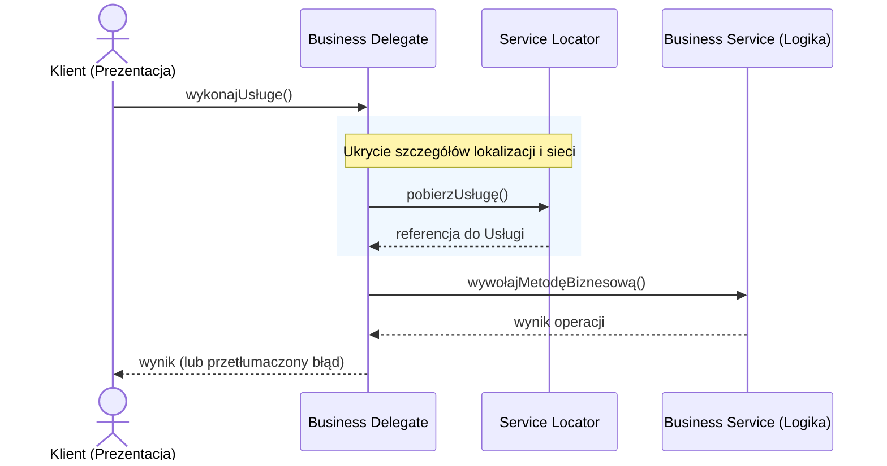

## Podsumowanie
Wzorzec Business Delegate jest kluczowym narzędziem do redukcji sprzężenia w aplikacjach o architekturze wielowarstwowej. Działa jako tarcza ochronna dla warstwy prezentacji, przejmując na siebie całą złożoność integracji sieciowej i wyszukiwania usług, co zwiększa czytelność i łatwość konserwacji kodu klienta.


---

# Pytanie 4: Model dojrzałości usług sieciowych (usług RESTful) wg. Richardsona.

## Kluczowe pojęcia
- **REST (Representational State Transfer)**: Styl architektoniczny systemów rozproszonych określający zbiór reguł komunikacji (bezstanowość, jednolity interfejs, architektura klient-serwer itp.).
- **Richardson Maturity Model (RMM)**: Model stworzony przez Leonarda Richardsona, dzielący stopień wdrożenia zasad REST w danej usłudze na cztery poziomy (0 do 3).
- **Zasób (Resource)**: Kluczowa abstrakcja w REST. Każdy element informacji (np. użytkownik, faktura, plik) reprezentowany przez unikalny identyfikator URI.
- **HATEOAS (Hypermedia As The Engine Of Application State)**: Warunek pełnej REST-owości, według którego interakcja z API odbywa się dynamicznie za pośrednictwem hiperłączy dostarczanych przez serwer w odpowiedziach.

## Szczegółowe omówienie tematu

Leonard Richardson zaproponował model klasyfikacji API sieciowych, aby ułatwić zrozumienie i prawidłowe wdrażanie zasad stylu architektonicznego REST. Model ten składa się z czterech kroków:

```
Poziom 3: Kontrola hipermediów (HATEOAS)
      ^
Poziom 2: Czasowniki HTTP (HTTP Verbs) i kody statusu
      ^
Poziom 1: Podział na zasoby (Resources / URI)
      ^
Poziom 0: Bagno POX (HTTP jako tunel komunikacyjny / RPC)
```

### Poziom 0: Swamp of POX (Bagno Plain Old XML)
Na tym poziomie HTTP jest traktowane wyłącznie jako protokół transportowy do przesyłania danych. Usługa nie korzysta z żadnych mechanizmów REST.
- **URI**: Istnieje tylko jeden punkt końcowy (np. `/api/service`).
- **Metody HTTP**: Zazwyczaj wszystkie zapytania wysyłane są metodą `POST`.
- **Logika**: To, co ma się wydarzyć, jest definiowane w ciele zapytania (np. SOAP lub XML-RPC).
- *Przykład*: Wywołanie operacji pobrania danych i zapisu danych odbywa się pod tym samym adresem `/service` przy użyciu metody `POST` z różną zawartością XML/JSON.

### Poziom 1: Resources (Zasoby)
Poziom pierwszy wprowadza podział monolitycznego punktu końcowego na pojedyncze zasoby, co jest pierwszym krokiem ku właściwej strukturze REST.
- **URI**: Każdy logiczny obiekt w systemie ma swój unikalny identyfikator URI (np. `/uzytkownicy`, `/uzytkownicy/15`, `/ksiazki/99`).
- **Metody HTTP**: Nadal najczęściej wykorzystuje się tylko jedną metodę (np. `POST` do wszystkich operacji).
- *Przykład*: Aby pobrać użytkownika o ID 15, wysyłamy `POST /uzytkownicy/15`, a żeby go usunąć, wysyłamy `POST /uzytkownicy/15/usun`.

### Poziom 2: HTTP Verbs (Czasowniki HTTP)
Na tym poziomie API w pełni wykorzystuje semantykę protokołu HTTP, czyli standardowe metody (czasowniki) oraz kody statusów odpowiedzi.
- **Metody HTTP**:
  - `GET`: Bezpieczne pobieranie zasobów (brak efektów ubocznych).
  - `POST`: Tworzenie nowych zasobów.
  - `PUT`: Nadpisywanie całych zasobów (operacja idempotentna).
  - `PATCH`: Częściowa aktualizacja zasobów.
  - `DELETE`: Usuwanie zasobów.
- **Kody odpowiedzi**: Zamiast zwracać zawsze kod `200 OK` z opisem błędu wewnątrz JSON-a, serwer zwraca natywne statusy HTTP:
  - `201 Created` dla pomyślnego utworzenia zasobu.
  - `400 Bad Request` w przypadku błędów walidacji.
  - `404 Not Found`, gdy dany zasób nie istnieje.
  - `401 Unauthorized` / `403 Forbidden` do kontroli uprawnień.

### Poziom 3: Hypermedia Controls (Kontrola Hipermediów - HATEOAS)
To najwyższy poziom dojrzałości, który czyni API prawdziwie "RESTful". Zapewnia on pełne uniezależnienie klienta od sztywnej struktury adresów URL serwera.
- **Mechanizm**: Serwer w odpowiedzi na zapytanie o zasób przesyła nie tylko dane tego zasobu, lecz również tablicę linków (hiperłączy) informujących o dopuszczalnych w tym momencie akcjach.
- **Zaleta**: Klient nie musi z góry znać schematu URI dla kolejnych kroków procesu. Jeśli użytkownik ma uprawnienia do edycji profilu, serwer zwróci w odpowiedzi link z relacją `rel="edit"`. Jeśli konto jest zablokowane, link ten nie zostanie wysłany.
- *Przykład*:
  ```json
  {
    "id": 12,
    "nazwisko": "Kowalski",
    "saldo": 150.00,
    "_links": {
      "self": { "href": "/klienci/12" },
      "wplata": { "href": "/klienci/12/wplaty" },
      "wyplata": { "href": "/klienci/12/wyplaty" }
    }
  }
  ```

## Wizualizacja

Oto schemat blokowy / diagram ułatwiający zrozumienie zagadnienia:

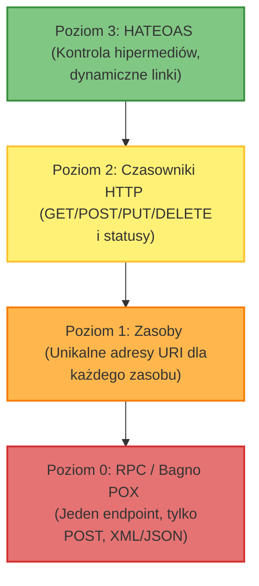

## Podsumowanie
Większość komercyjnych usług sieciowych określanych jako REST API w rzeczywistości plasuje się na **Poziomie 2** modelu dojrzałości Richardsona. Wdrożenie **Poziomu 3 (HATEOAS)** jest rzadsze, ponieważ wymaga większego nakładu pracy przy tworzeniu i konsumowaniu API, jednak reprezentuje ono pełną, teoretyczną definicję stylu REST, zapewniając elastyczność i ewolucyjność API.


---

# Pytanie 5: Omów doktrynę cyberbezpieczeństwa RP - przedstaw przyjęte definicje.

## Kluczowe pojęcia
- **Doktryna Cyberbezpieczeństwa Rzeczypospolitej Polskiej**: Dokument strategiczny wydany przez Biuro Bezpieczeństwa Narodowego (BBN) we współpracy z innymi organami, określający cele, zasady i kierunki działań mających na celu zapewnienie bezpieczeństwa RP w cyberprzestrzeni.
- **Cyberbezpieczeństwo (wg ustawy o KSC)**: Odporność systemów informacyjnych na działania naruszające poufność, integralność, dostępność i autentyczność przetwarzanych danych lub powiązanych z nimi usług oferowanych przez te systemy.
- **Krajowy System Cyberbezpieczeństwa (KSC)**: Ramy organizacyjno-prawne powołane ustawą z 2018 r. w celu zapewnienia niezakłóconego świadczenia usług kluczowych i cyfrowych w państwie.
- **Incydent**: Zdarzenie, które ma lub może mieć niekorzystny wpływ na cyberbezpieczeństwo.

## Szczegółowe omówienie tematu

### 1. Geneza i cel Doktryny Cyberbezpieczeństwa RP
Doktryna Cyberbezpieczeństwa RP stanowi rozwinięcie Strategii Bezpieczeństwa Narodowego RP. Jej głównym celem jest zdefiniowanie i usystematyzowanie działań państwa w nowym wymiarze operacyjnym, jakim jest cyberprzestrzeń. Dokument ten określa:
- Zagrożenia, wyzwania oraz szanse RP w cyberprzestrzeni.
- Cele strategiczne (np. ochrona suwerenności w wymiarze cyfrowym, podnoszenie odporności infrastruktury krytycznej).
- Kierunki przygotowań obronnych i prewencyjnych (współpraca cywilno-wojskowa, partnerstwo publiczno-prywatne, edukacja społeczna).

### 2. Krajowy System Cyberbezpieczeństwa (KSC) i kluczowe podmioty
Ustawa z dnia 5 lipca 2018 r. o krajowym systemie cyberbezpieczeństwa (wdrażająca dyrektywę unijną NIS) definiuje strukturę organizacyjną odpowiedzialną za obronę cyberprzestrzeni RP. Do kluczowych podmiotów należą:

1. **Zespoły CSIRT poziomu krajowego (Computer Security Incident Response Team)**:
   - **CSIRT GOV (prowadzony przez Szefa Agencji Bezpieczeństwa Wewnętrznego)**: Odpowiada za ochronę infrastruktury administracji rządowej oraz systemów infrastruktury krytycznej.
   - **CSIRT NASK (prowadzony przez Naukową i Akademicką Sieć Komputerową)**: Odpowiada za ochronę sektora cywilnego, w tym samorządów, przedsiębiorców oraz zgłoszeń od obywateli.
   - **CSIRT MON (prowadzony przez Dowództwo Komponentu Wojsk Obrony Cyberprzestrzeni)**: Odpowiada za resort obrony narodowej oraz Siły Zbrojne RP.

2. **Operatorzy Usług Kluczowych (OUK)**:
   Podmioty z sektorów kluczowych (np. energetyka, transport, bankowość, ochrona zdrowia), których zakłócenie działania miałoby poważne konsekwencje dla państwa. Mają oni obowiązek wdrażania odpowiednich zabezpieczeń, szacowania ryzyka i zgłaszania incydentów.

3. **Dostawcy Usług Cyfrowych (DUC)**:
   Wyszukiwarki, platformy handlowe i dostawcy usług w chmurze, na których ciążą obowiązki bezpieczeństwa dostosowane do specyfiki ich działalności.

### 3. Klasyfikacja i definicje incydentów
W polskim systemie prawnym i doktrynalnym wyróżnia się trzy główne kategorie incydentów:
- **Incydent w podmiocie publicznym**: Incydent powodujący lub mogący spowodować obniżenie jakości bądź zakłócenie realizacji zadania publicznego (np. niedostępność e-usług urzędu gminy).
- **Incydent istotny**: Incydent, który ma istotny wpływ na świadczenie usługi przez dostawcę usług cyfrowych lub operatora usługi kluczowej. Kryteria istotności są ściśle określone (np. liczba dotkniętych użytkowników, czas trwania).
- **Incydent krytyczny**: Incydent skutkujący znaczną szkodą dla bezpieczeństwa lub obronności państwa, bezpieczeństwa publicznego, życia i zdrowia ludzi lub funkcjonowania instytucji państwowych (rozstrzyga o nim właściwy CSIRT poziomu krajowego).

## Wizualizacja

Oto schemat blokowy / diagram ułatwiający zrozumienie zagadnienia:

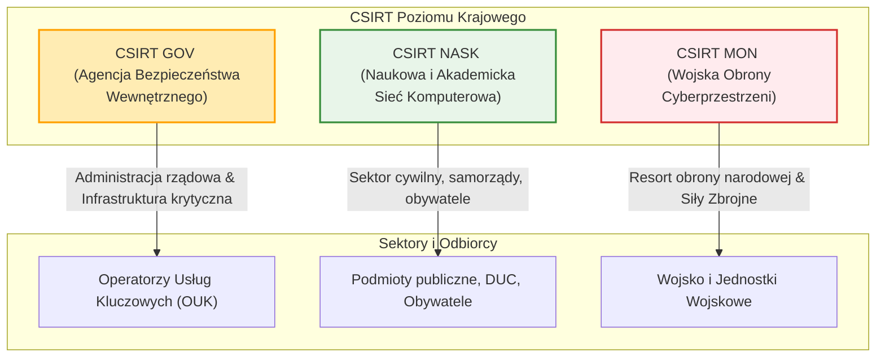

## Podsumowanie
Doktryna Cyberbezpieczeństwa RP określa podejście państwa do obrony w sieci, oparte na współpracy trójfilarowej (wojskowym, rządowym i cywilnym). System ten stawia jasne wymagania bezpieczeństwa przed podmiotami kluczowymi i publicznymi, narzucając im ścisłe ramy czasowe na zgłaszanie incydentów (zazwyczaj do 24 godzin od wykrycia) oraz nakazuje ciągłe monitorowanie zagrożeń w koordynacji z krajowymi zespołami CSIRT.


---

# Pytanie 6: Zdefiniuj pojęcie złośliwego oprogramowania. Przedstaw taksonomię złośliwego oprogramowania. Scharakteryzuj trzy wybrane zagrożenia.

## Kluczowe pojęcia
- **Malware (Złośliwe oprogramowanie)**: Oprogramowanie stworzone w celu wyrządzenia szkody użytkownikowi, systemowi komputerowemu lub sieci, działające bez wiedzy i zgody ofiary (skrót od *malicious software*).
- **Taksonomia malware**: Klasyfikacja złośliwego kodu oparta na metodach infekcji, replikacji oraz szkodliwym działaniu (payload).
- **Wirus komputerowy**: Złośliwy kod wymagający programu-nosiciela do uruchomienia i replikacji.
- **Robak (Worm)**: Samodzielny złośliwy program rozprzestrzeniający się automatycznie przez sieć komputerową bez konieczności interakcji użytkownika.
- **Trojan (Koń trojański)**: Szkodliwe oprogramowanie maskujące się pod postacią legalnej i przydatnej aplikacji.

## Szczegółowe omówienie tematu

### 1. Definicja złośliwego oprogramowania (Malware)
Złośliwym oprogramowaniem nazywamy każdy program, skrypt lub instrukcję, która celowo narusza bezpieczeństwo systemu komputerowego. Działania te mogą obejmować:
- Naruszenie poufności (kradzież haseł, szpiegowanie).
- Naruszenie integralności (modyfikacja plików, manipulacja danymi).
- Naruszenie dostępności (szyfrowanie danych, niszczenie systemu operacyjnego).

### 2. Taksonomia złośliwego oprogramowania
Tradycyjna taksonomia dzieli złośliwe oprogramowanie na kategorie według mechanizmu replikacji i propagacji oraz według celu ich działania:

#### A. Podział ze względu na sposób rozprzestrzeniania się i uruchamiania:
- **Wirusy (Viruses)**: Infekują inne pliki wykonywalne (np. `.exe`, `.dll`) lub sektory rozruchowe dysków. Wykonują się wtedy, gdy użytkownik uruchomi zainfekowany plik.
- **Robaki (Worms)**: Wykorzystują luki w protokołach sieciowych (np. SMB, RDP) do samodzielnego kopiowania się z jednego komputera na drugi w sieci. Nie potrzebują pliku-nosiciela.
- **Trojany (Trojans)**: Nie rozprzestrzeniają się same. Wymagają, aby użytkownik został oszukany (np. pobrał rzekomy instalator gry, a w rzeczywistości zainstalował złośliwy program).

#### B. Podział ze względu na szkodliwe działanie (Payload):
- **Ransomware**: Szyfruje dane użytkownika i blokuje ekran, żądając okupu (ransom) za klucz deszyfrujący.
- **Spyware (Oprogramowanie szpiegujące)**: Monitoruje aktywność użytkownika, historię przeglądania oraz zbiera dane wrażliwe. Specjalną odmianą są **Keyloggery** rejestrujące uderzenia w klawisze.
- **Rootkity**: Narzędzia zaprojektowane w celu ukrycia procesów, plików i połączeń sieciowych malware przed oprogramowaniem antywirusowym poprzez głęboką modyfikację jądra systemu operacyjnego (OS kernel).
- **Botnet i Boty**: Programy włączające zainfekowane komputery do sieci maszyn-zombie sterowanych przez jeden serwer C2 (Command & Control), wykorzystywanych m.in. do masowych ataków DDoS.
- **Adware**: Programy natrętnie wyświetlające niechciane reklamy w systemie lub przeglądarce.

---

### 3. Charakterystyka trzech wybranych zagrożeń

#### Zagrożenie 1: Ransomware (np. WannaCry, LockBit)
- **Charakterystyka**: Po przedostaniu się do systemu (często przez załącznik phishingowy lub lukę w sieci), ransomware uruchamia proces szyfrowania plików użytkownika za pomocą silnych algorytmów kryptograficznych (np. AES-256 dla plików i RSA-2048 do zaszyfrowania klucza AES). Po zakończeniu szyfrowania oryginalne pliki są usuwane, a użytkownik widzi komunikat z żądaniem okupu w kryptowalutach (np. Bitcoin, Monero). Nowoczesne grupy stosują **podwójny szantaż (double extortion)** – przed zaszyfrowaniem dane są eksfiltrowane, a w razie odmowy zapłaty grozi się ich publikacją w darknecie.
- **Metody obrony**: Regularne tworzenie kopii zapasowych w architekturze 3-2-1 (3 kopie, 2 różne nośniki, 1 kopia offline/w chmurze), aktualizowanie systemów operacyjnych w celu łatana luk podatności (np. MS17-010 dla WannaCry).

#### Zagrożenie 2: Spyware / Keylogger (np. Agent Tesla, Pegasus)
- **Charakterystyka**: Keyloggery i oprogramowanie szpiegujące działają w tle, starając się pozostać niezauważonymi. Przechwytują dane wprowadzane z klawiatury (loginy, hasła, numery kart kredytowych), robią zrzuty ekranu, a Pegasus potrafi dodatkowo podsłuchiwać rozmowy telefoniczne i aktywować kamerę. Przechwycone informacje są okresowo wysyłane na serwer kontrolowany przez atakującego.
- **Metody obrony**: Używanie uwierzytelniania dwuskładnikowego (2FA/MFA), systemy antywirusowe klasy EDR (Endpoint Detection and Response) z analizą behawioralną (wykrywanie podejrzanych operacji zapisu i czytania z pamięci procesów).

#### Zagrożenie 3: RAT (Remote Access Trojan - Trojan Zdalnego Dostępu, np. Gh0st RAT, njRAT)
- **Charakterystyka**: RAT to trojan, który po instalacji otwiera ukryty port i nawiązuje połączenie zwrotne (reverse shell) do serwera C2 atakującego. Daje to cyberprzestępcy pełną kontrolę administracyjną nad zainfekowanym komputerem. Atakujący może modyfikować rejestr, pobierać i uruchamiać inne złośliwe pliki, kraść pliki lokalne czy użyć komputera ofiary jako punktu przesiadkowego (pivot) do dalszego ataku w sieci lokalnej.
- **Metody obrony**: Filtrowanie ruchu wychodzącego na zaporach sieciowych (Firewall egress filtering), wykrywanie anomalii sieciowych (np. niespodziewane połączenia na nietypowe porty zewnętrzne), zasada minimalnych uprawnień dla użytkowników systemu.

## Wizualizacja

Oto schemat blokowy / diagram ułatwiający zrozumienie zagadnienia:

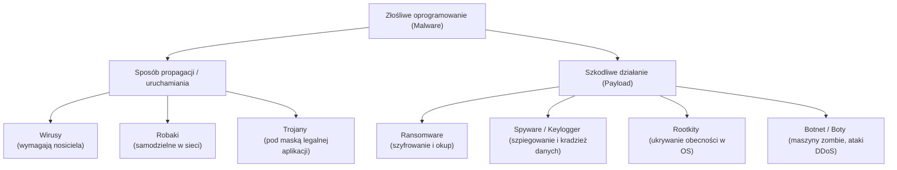

## Podsumowanie
Współczesna taksonomia malware staje się coraz bardziej płynna, ponieważ złośliwe programy są modułowe – jedno zagrożenie może być jednocześnie trojanem (dropperem), pobierać robaka do propagacji w sieci lokalnej, instalować spyware w celu kradzieży danych, a na końcu zaszyfrować dysk jako ransomware. Skuteczna ochrona wymaga kompleksowego podejścia (Defense in Depth) na poziomie sieci, punktów końcowych oraz edukacji użytkowników.


---

# Pytanie 7: Przedstaw ideę ataków typu DoS i krótko scharakteryzuj ich rodzaje.

## Kluczowe pojęcia
- **DoS (Denial of Service - Odmowa usługi)**: Atak mający na celu uniemożliwienie uprawnionym użytkownikom dostępu do usługi, systemu komputerowego lub sieci.
- **DDoS (Distributed Denial of Service - Rozproszona odmowa usługi)**: Odmiana ataku DoS przeprowadzana jednocześnie z wielu maszyn (często z tysięcy zainfekowanych komputerów tworzących tzw. botnet), co znacznie utrudnia obronę.
- **SYN Flood**: Atak na warstwę transportową TCP polegający na zasypywaniu serwera pakietami inicjującymi połączenie (SYN) i ignorowaniu odpowiedzi (SYN-ACK), co prowadzi do przepełnienia kolejki połączeń.
- **Slowloris**: Atak na warstwę aplikacji polegający na powolnym wysyłaniu nagłówków HTTP, co zmusza serwer do utrzymywania otwartych połączeń i wyczerpuje jego zasoby wątków.
- **Amplifikacja (Wzmocnienie ataku)**: Technika wykorzystująca publiczne usługi sieciowe (np. DNS, NTP) do zwielokrotnienia wolumenu ruchu skierowanego w ofiarę.

## Szczegółowe omówienie tematu

### 1. Idea ataków DoS i DDoS
Głównym celem ataku DoS/DDoS jest **naruszenie dostępności** (jednego z trzech filarów bezpieczeństwa informacji CIA Triad). W przeciwieństwie do włamań, intruz nie próbuje wykraść danych, lecz dąży do paraliżu infrastruktury ofiary. Paraliż ten osiąga się poprzez:
- **Przeciążenie łącza sieciowego** (ruchem sieciowym o wolumenie przekraczającym przepustowość).
- **Wyczerpanie zasobów sprzętowych** serwera (procesora, pamięci RAM, limitu otwartych plików/procesów).
- **Wykorzystanie błędów w oprogramowaniu** prowadzących do awarii systemu (tzw. crash).

---

### 2. Klasyfikacja i rodzaje ataków DoS / DDoS

Ataki DDoS dzieli się najczęściej ze względu na warstwę modelu OSI, w którą są wymierzone:

#### A. Ataki wolumetryczne (Volumetric Attacks)
Ich celem jest całkowite zapewnienie (zatkanie) dostępnego pasma sieciowego ofiary. Mierzy się je w bitach na sekundę (bps) lub pakietach na sekundę (pps).
- **UDP Flood**: Atakujący wysyła masowo pakiety UDP na losowe porty ofiary. Serwer próbuje obsłużyć te pakiety, sprawdzając, czy nasłuchuje na nich jakaś usługa, a gdy jej nie ma, generuje pakiet ICMP "Destination Unreachable", co dodatkowo obciąża procesor i łącze.
- **Ataki z amplifikacją i refleksją (np. DNS/NTP Amplification)**: Atakujący wysyła zapytania do otwartych serwerów DNS lub NTP, fałszując adres IP nadawcy (IP Spoofing) i wpisując tam adres IP ofiary. Zapytanie jest celowo małe (np. kilkadziesiąt bajtów), natomiast odpowiedź odsyłana przez serwer DNS do ofiary jest bardzo duża (np. kilka kilobajtów). Dzięki temu atakujący generuje ruch o sile wielokrotnie większej niż jego własne łącze.

#### B. Ataki na protokoły (Protocol Attacks)
Koncentrują się na wyczerpaniu zasobów systemowych urządzeń sieciowych (zapór ogniowych, load balancerów, systemów operacyjnych).
- **SYN Flood**: Atakujący wykorzystuje mechanizm nawiązywania połączenia TCP (tzw. trójstopniowy uścisk dłoni - *three-way handshake*). Wysyła pakiety `SYN` z fałszywych adresów IP. Serwer odpowiada pakietem `SYN-ACK` i rezerwuje zasoby w pamięci (w tzw. SYN Backlog), oczekując na ostateczny pakiet `ACK` od klienta. Ponieważ adresy są sfałszowane, pakiet `ACK` nigdy nie przychodzi, a zasoby serwera pozostają zablokowane do momentu przekroczenia limitu czasu (timeout).
- **Ping of Death / Smurf Attack**: Wysyłanie zniekształconych lub zbyt dużych pakietów ICMP (ping), które podczas składania po stronie odbiorcy powodują przepełnienie bufora pamięci i awarię systemu.

#### C. Ataki na warstwę aplikacji (Application Layer Attacks)
Najbardziej wyrafinowane ataki, naśladujące zachowanie legalnych użytkowników. Wymierzone są w konkretne aplikacje (np. serwery WWW WordPress, IIS, Apache). Mierzy się je w zapytaniach na sekundę (rps).
- **HTTP Flood**: Symulacja masowych żądań pobrania strony internetowej (np. `GET /`) lub wywoływania skomplikowanych obliczeniowo skryptów (np. wyszukiwarek, generowania PDF).
- **Slowloris**: Narzędzie to otwiera setki połączeń HTTP z serwerem WWW i utrzymuje je otwarte tak długo, jak to możliwe. Robi to poprzez wysyłanie niepełnych nagłówków HTTP (np. wysyła kolejny nagłówek tuż przed upływem limitu czasu serwera). Serwer rezerwuje osobny wątek dla każdego połączenia, co szybko blokuje całą pulę dostępnych wątków serwera (np. 150-250 wątków), uniemożliwiając obsługę prawdziwych klientów.

---

### 3. Metody przeciwdziałania atakom DoS / DDoS
Obrona przed atakami o dużym nasileniu jest trudna i wymaga zaawansowanych systemów:
- **SYN Cookies**: Technika obrony przed SYN Flood, w której serwer nie rezerwuje pamięci na połączenie półotwarte, lecz generuje unikalny numer sekwencyjny (cookie) w pakiecie `SYN-ACK`. Dopiero po otrzymaniu poprawnego pakietu `ACK` od klienta alokowane są zasoby.
- **Centra czyszczące (Scrubbing Centers)**: Rozwiązania dostawców chmurowych (np. Cloudflare, AWS Shield), gdzie cały ruch sieciowy przechodzi przez serwery filtrujące, które odrzucają pakiety DoS na podstawie sygnatur oraz analizy behawioralnej, wpuszczając do serwera docelowego jedynie czysty ruch.
- **Rate Limiting i WAF (Web Application Firewall)**: Ograniczanie liczby połączeń z jednego adresu IP oraz analiza reguł aplikacji (np. blokowanie ruchu wykazującego cechy narzędzi typu Slowloris).

## Wizualizacja

Oto schemat blokowy / diagram ułatwiający zrozumienie zagadnienia:

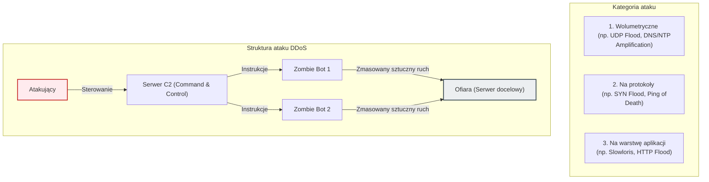


---

# Pytanie 8: Wymień i omów siedem zasad RODO.

## Kluczowe pojęcia
- **RODO (Rozporządzenie o Ochronie Danych Osobowych / ang. GDPR)**: Ogólne rozporządzenie unijne z 2016 r. regulujące zasady ochrony danych osobowych osób fizycznych na terenie UE.
- **Dane osobowe**: Wszelkie informacje pozwalające bezpośrednio lub pośrednio zidentyfikować osobę fizyczną (np. PESEL, e-mail, IP, dane lokalizacyjne).
- **Administrator Danych Osobowych (ADO)**: Organ, jednostka organizacyjna lub podmiot decydujący o celach i sposobach przetwarzania danych osobowych.
- **Privacy by Design**: Projektowanie systemów IT z uwzględnieniem ochrony prywatności od samego początku procesu tworzenia oprogramowania.

## Szczegółowe omówienie tematu

Artykuł 5 ust. 1 i 2 rozporządzenia RODO formułuje siedem fundamentalnych zasad, według których musi odbywać się każde przetwarzanie danych osobowych. Złamanie którejkolwiek z nich grozi wysokimi karami administracyjnymi.

---

### 1. Zgodność z prawem, rzetelność i przejrzystość
- **Zgodność z prawem (legalność)**: Dane mogą być przetwarzane tylko na podstawie przynajmniej jednej z przesłanek prawnych wymienionych w art. 6 RODO (np. dobrowolna zgoda użytkownika, konieczność wykonania umowy, obowiązek prawny ciążący na administratorze).
- **Rzetelność**: Przetwarzanie danych nie może odbywać się w sposób ukryty, manipulacyjny lub wbrew uzasadnionym oczekiwaniom osoby.
- **Przejrzystość**: Administrator ma obowiązek sformułować politykę prywatności i klauzule informacyjne prostym, zrozumiałym i łatwo dostępnym językiem (koniec z drobnym drukiem i zawiłym językiem prawniczym).

### 2. Ograniczenie celu
Dane osobowe mogą być zbierane wyłącznie w konkretnych, wyraźnych i prawnie uzasadnionych celach. Niedozwolone jest dalsze przetwarzanie danych w sposób niezgodny z tymi celami.
*Przykład*: Jeśli sklep zbiera dane adresowe w celu wysłania paczki, nie może ich bez dodatkowej zgody przekazać zewnętrznej firmie pożyczkowej do celów marketingowych.

### 3. Minimalizacja danych
Administrator może zbierać tylko te dane, które są absolutnie niezbędne do osiągnięcia celu przetwarzania. Dane muszą być adekwatne i ograniczone do minimum.
*Przykład*: Aplikacja latarki na smartfon nie powinna wymagać dostępu do lokalizacji GPS, listy kontaktów czy galerii zdjęć, gdyż narusza to zasadę minimalizacji.

### 4. Prawidłowość
Dane osobowe muszą być poprawne i w razie potrzeby aktualizowane. Administrator jest zobowiązany podjąć wszelkie działania, aby dane nieprawidłowe (np. przedawnione lub błędne) były niezwłocznie usuwane lub prostowane (np. na wniosek osoby, której dotyczą).

### 5. Ograniczenie przechowywania
Dane osobowe mogą być przechowywane w formie umożliwiającej identyfikację osoby przez okres nie dłuższy, niż jest to niezbędne do celów, w których są przetwarzane. Po tym czasie dane powinny być trwale usunięte lub zanonimizowane.
*Wyjątek*: Przetwarzanie do celów archiwalnych w interesie publicznym, do celów badań naukowych lub historycznych.

### 6. Integralność i poufność (Bezpieczeństwo)
Zasada ta nakłada na administratora obowiązek zapewnienia odpowiedniego bezpieczeństwa technicznego i organizacyjnego przetwarzanych danych. Obejmuje to m.in. ochronę przed:
- Nieautoryzowanym lub bezprawnym przetwarzaniem (dostęp osób trzecich).
- Przypadkową utratą, zniszczeniem lub uszkodzeniem.
*Metody techniczne*: Szyfrowanie (np. protokół TLS/HTTPS, szyfrowanie baz danych), pseudonimizacja danych, silna kontrola dostępu (RBAC) oraz regularne testy penetracyjne.

### 7. Rozliczalność
Jest to zasada kluczowa, spajająca pozostałe. Administrator jest nie tylko odpowiedzialny za przestrzeganie wszystkich sześciu zasad opisanych powyżej, ale musi być w stanie **wykazać (udowodnić)** ich przestrzeganie przed organem nadzorczym (w Polsce jest to UODO - Urząd Ochrony Danych Osobowych).
*Dowody rozliczalności*: Posiadanie Rejestru Czynności Przetwarzania (RCP), procedur zgłaszania wycieków (w ciągu 72 godzin), analiz ryzyka (DPIA) czy powołanie Inspektora Ochrony Danych (IOD).

## Wizualizacja

Oto schemat blokowy / diagram ułatwiający zrozumienie zagadnienia:

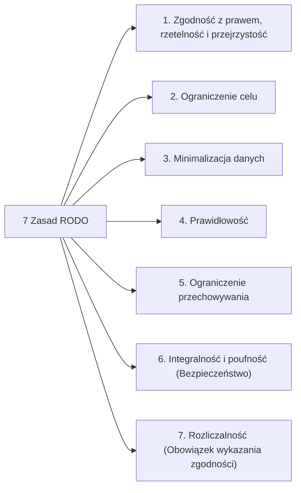

## Podsumowanie
Siedem zasad RODO stanowi ramy projektowe dla współczesnych inżynierów oprogramowania. Zgodnie z nimi, systemy IT powinny domyślnie chronić prywatność (**Privacy by Default** – np. domyślnie niezaznaczone zgody marketingowe) oraz wbudowywać mechanizmy ochrony danych w samą strukturę aplikacji (**Privacy by Design** – np. szyfrowanie haseł w bazie danych przy użyciu algorytmów typu bcrypt).


---

# Pytanie 9: Zdefiniuj pojęcie podatności aplikacji internetowej na ataki, podaj przykłady luk i uzasadnij dlaczego aplikacje internetowe są podatne na ataki.

## Kluczowe pojęcia
- **Podatność (Vulnerability)**: Słabość lub błąd w projekcie, implementacji, konfiguracji lub administracji systemu/aplikacji, który może zostać wykorzystany przez zagrożenie (atakującego) do naruszenia bezpieczeństwa (poufności, integralności lub dostępności).
- **OWASP Top 10**: Cyklicznie aktualizowany raport przedstawiający dziesięć najbardziej krytycznych podatności w aplikacjach internetowych.
- **Sanitacja danych**: Proces oczyszczania danych wejściowych pochodzących od użytkownika z potencjalnie złośliwych znaków lub kodu przed ich przetworzeniem przez system.
- **IDOR (Insecure Direct Object Reference)**: Podatność polegająca na braku autoryzacji dostępu do zasobu identyfikowanego kluczem (np. zmiana ID użytkownika w adresie URL umożliwia odczyt danych innej osoby).

## Szczegółowe omówienie tematu

### 1. Definicja podatności aplikacji internetowej
W kontekście aplikacji webowych, podatność to każda cecha systemu (błąd w kodzie źródłowym, niepoprawna konfiguracja serwera, brak zabezpieczeń w zewnętrznej bibliotece), która pozwala atakującemu na wykonanie nieautoryzowanych akcji. Podatności mogą prowadzić do wycieku danych, przejęcia serwera (RCE - Remote Code Execution), kradzieży sesji użytkowników lub paraliżu usługi (DoS).

---

### 2. Przykłady luk bezpieczeństwa w aplikacjach internetowych
Podatności w aplikacjach internetowych klasyfikuje się zazwyczaj w oparciu o standardy takie jak OWASP Top 10. Główne przykłady to:

- **Błędy wstrzykiwania (Injection)**: Występują, gdy dane dostarczone przez użytkownika są interpretowane przez aplikację jako polecenie. Najbardziej znanym przykładem jest **SQL Injection (SQLi)**, gdzie atakujący modyfikuje zapytanie SQL wysyłane do bazy danych. Innym przykładem jest **Command Injection** (uruchomienie poleceń powłoki systemu operacyjnego serwera).
- **Cross-Site Scripting (XSS)**: Wstrzyknięcie złośliwego skryptu JavaScript na stronę internetową wyświetlaną innym użytkownikom. Umożliwia m.in. kradzież ciasteczek sesyjnych.
- **Błędy kontroli dostępu (Broken Access Control)**: Sytuacja, w której aplikacja nie weryfikuje poprawnie uprawnień użytkownika do wykonania określonej akcji lub odczytu zasobu. Przykładem jest wspomniany **IDOR** lub możliwość wejścia do panelu administratora bez logowania przez bezpośrednie wpisanie adresu URL `/admin`.
- **Niewłaściwa konfiguracja zabezpieczeń (Security Misconfiguration)**: Pozostawienie domyślnych haseł do baz danych, włączona konsola debugowania na produkcji, brak nagłówków bezpieczeństwa (np. Content Security Policy - CSP) lub wystawienie na świat wrażliwych plików konfiguracyjnych (np. `.git`, `.env`).
- **CSRF (Cross-Site Request Forgery)**: Wymuszenie na przeglądarce zalogowanego użytkownika wykonania niechcianej akcji (np. zmiana hasła, transfer środków) na podatnej witrynie bez jego wiedzy.

---

### 3. Dlaczego aplikacje internetowe są podatne na ataki?
Aplikacje internetowe stanowią główny cel cyberataków z kilku kluczowych powodów:

1. **Dostępność z każdego miejsca na świecie**: Aplikacje webowe muszą być otwarte dla użytkowników (porty 80 i 443 są zawsze otwarte na zaporach sieciowych). Oznacza to, że każdy, w tym potencjalny atakujący z dowolnego zakątka globu, ma bezpośredni dostęp do punktu wejścia aplikacji.
2. **Architektura klient-serwer i brak kontroli nad klientem**: Kod frontendu (HTML/JS) jest w pełni kontrolowany przez użytkownika. Atakujący może dowolnie modyfikować żądania HTTP, nagłówki, ciasteczka czy parametry formularza za pomocą narzędzi deweloperskich lub proxy (np. Burp Suite). Zabezpieczenia zaimplementowane wyłącznie po stronie klienta są bezużyteczne.
3. **Złożoność techniczna i łańcuch dostaw (Software Supply Chain)**: Współczesne aplikacje webowe korzystają z tysięcy zewnętrznych pakietów (np. npm, Maven, NuGet). Błąd w jednej małej bibliotece (przykład podatności w bibliotece `Log4j` w Javie) natychmiast czyni podatną całą aplikację.
4. **Presja biznesowa i brak edukacji**: Często priorytetem w projektach IT jest czas dostarczenia na rynek (*time-to-market*). Programiści skupiają się na funkcjonalnościach biznesowych, a nie na bezpieczeństwie. Dodatkowo, brak systematycznego szkolenia z zakresu bezpiecznego kodowania (*Secure Coding*) sprawia, że w kodzie powielane są te same klasyczne błędy.

## Wizualizacja

Oto schemat blokowy / diagram ułatwiający zrozumienie zagadnienia:

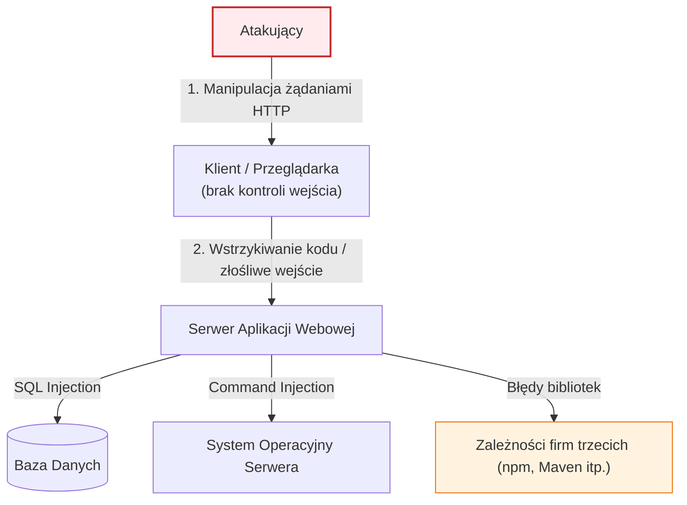

## Podsumowanie
Podatności są stałym elementem cyklu życia oprogramowania. Zapewnienie bezpieczeństwa aplikacji internetowej nie jest jednorazowym zadaniem, ale ciągłym procesem (DevSecOps), który obejmuje automatyczne testy kodu (SAST/DAST), walidację wszystkich danych wejściowych po stronie serwera oraz regularne audyty i testy penetracyjne.


---

# Pytanie 10: Zdefiniuj pojęcie exploit i payload w kontekście ataków na aplikacje internetowe, podaj przykłady narzędzi do tworzenia exploitów oraz wykrywania podatności w aplikacjach internetowych.

## Kluczowe pojęcia
- **Exploit**: Kod, program lub sekwencja danych wykorzystująca lukę bezpieczeństwa (podatność) w oprogramowaniu w celu wywołania nieoczekiwanego lub niezamierzonego zachowania (np. przejęcie kontroli nad wątkiem procesora).
- **Payload (Ładunek)**: Właściwa część kodu złośliwego (np. shellcode), która jest dostarczana i wykonywana na maszynie ofiary po pomyślnym zadziałaniu exploita.
- **Skaner podatności (Vulnerability Scanner)**: Narzędzie automatyzujące proces wykrywania podatności w systemach, sieciach i aplikacjach.
- **DAST (Dynamic Application Security Testing)**: Testowanie bezpieczeństwa aplikacji w fazie uruchomieniowej (od zewnątrz), bez dostępu do kodu źródłowego.

## Szczegółowe omówienie tematu

### 1. Definicja: Exploit a Payload
W teorii bezpieczeństwa komputerowego te dwa pojęcia reprezentują dwa różne etapy ataku:

- **Exploit (Wykorzystanie podatności)**:
  Jest to "klucz" lub "narzędzie" otwierające zamknięte drzwi. Exploit ma za zadanie oszukać aplikację lub system operacyjny, wykorzystując konkretny błąd (np. przepełnienie bufora, brak walidacji wejścia w zapytaniu SQL). Sam exploit nie realizuje ostatecznego celu atakującego (np. nie pobiera plików, nie szyfruje dysku) – jego zadaniem jest jedynie zmanipulowanie programu tak, aby pozwolił na uruchomienie kodu zewnętrznego.
  
- **Payload (Ładunek)**:
  Jest to właściwe działanie, które atakujący chce podjąć po przełamaniu zabezpieczeń. Payload jest wykonywany dzięki temu, że exploit przejął kontrolę nad przepływem programu. Przykłady payloadów:
    - *Reverse Shell*: Zmuszenie serwera do nawiązania połączenia zwrotnego z komputerem atakującego i udostępnienia linii poleceń.
    - *Downloader*: Skrypt, który pobiera i instaluje w systemie kolejne moduły malware.
    - *Exfiltration Payload*: Kod mający na celu odczytanie bazy danych i przesłanie jej na zewnątrz.

---

### 2. Narzędzia do tworzenia exploitów i automatyzacji ataków
Tworzenie i uruchamianie exploitów w celach testowych (lub przestępczych) jest ułatwiane przez gotowe frameworki:

- **Metasploit Framework**: Najpopularniejsza platforma typu open-source ułatwiająca testy penetracyjne. Zawiera bazę tysięcy gotowych exploitów i payloadów (w tym zaawansowany payload *Meterpreter*). Pozwala użytkownikowi wybrać podatność, dopasować do niej odpowiedni ładunek, a następnie przeprowadzić automatyczny atak.
- **Exploit-DB**: Internetowe repozytorium gromadzące publicznie dostępne kody exploitów i dokumentacje podatności (PoC - Proof of Concept).
- **Python / Bash / C**: Języki programowania najczęściej używane do pisania dedykowanych exploitów (np. manipulujących surowymi pakietami sieciowymi za pomocą biblioteki `scapy`).

---

### 3. Narzędzia do wykrywania podatności w aplikacjach internetowych
Bezpieczeństwo aplikacji weryfikuje się za pomocą narzędzi do analizy dynamicznej (DAST), statycznej (SAST) oraz narzędzi typu intercepting proxy:

#### A. Narzędzia typu Intercepting Proxy (do testów manualnych i automatycznych):
Działają jako pośrednik między przeglądarką testera a serwerem aplikacji, umożliwiając przechwytywanie, analizę i modyfikowanie ruchu HTTP/HTTPS "w locie":
- **Burp Suite (Community/Professional/Enterprise)**: De facto standard w branży cybersecurity. Posiada zaawansowany moduł *Repeater* (do ręcznego modyfikowania żądań i wysyłania ich ponownie), *Intruder* (do automatyzacji ataków słownikowych i fuzzingu) oraz automatyczny skaner podatności (w wersji płatnej).
- **OWASP ZAP (Zed Attack Proxy)**: Bezpłatny, otwartoźródłowy odpowiednik Burp Suite wspierany przez organizację OWASP. Świetnie nadaje się do integracji ze środowiskiem CI/CD (automatyczne testy bezpieczeństwa przy każdym wdrożeniu).

#### B. Automatyczne skanery podatności (DAST):
Skanują aplikację poprzez wysyłanie tysięcy złośliwych zapytań (np. prób SQLi, XSS) i badanie odpowiedzi serwera:
- **Acunetix**: Zaawansowany, komercyjny skaner wyspecjalizowany w wykrywaniu podatności webowych.
- **Nessus**: Globalny skaner podatności sieciowych, potrafiący wykryć niepoprawne konfiguracje serwerów, przestarzałe usługi oraz otwarte porty.

#### C. Narzędzia analizy statycznej kodu (SAST):
Badają kod źródłowy aplikacji pod kątem błędów bezpieczeństwa zanim zostanie ona uruchomiona:
- **SonarQube / Semgrep**: Skanują repozytoria kodu źródłowego w poszukiwaniu podatności (np. zahardkodowane hasła, brak walidacji parametrów wejściowych).

## Wizualizacja

Oto schemat blokowy / diagram ułatwiający zrozumienie zagadnienia:

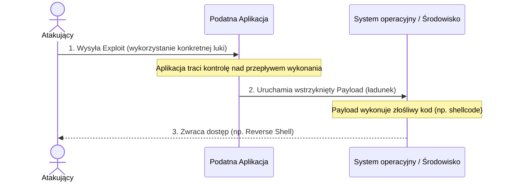

## Podsumowanie
W cyberbezpieczeństwie narzędzia są obosieczne. Te same skanery (np. OWASP ZAP) i frameworki (np. Metasploit) są wykorzystywane przez administratorów i pentesterów (tzw. *White Hat*) do zabezpieczania systemów, jak i przez cyberprzestępców (*Black Hat*) do wyszukiwania celów i przeprowadzania ataków. Skuteczna obrona wymaga regularnego audytowania aplikacji za pomocą tych narzędzi w celu usunięcia luk przed ich publicznym ujawnieniem.


---

# Pytanie 11: Zdefiniuj atak Cross-Site Scripting na aplikację internetową, podaj typy ataków XSS oraz przykłady kontekstów ataków i metod obrony przed nimi.

## Kluczowe pojęcia
- **Cross-Site Scripting (XSS)**: Podatność aplikacji internetowej polegająca na wstrzyknięciu złośliwego kodu (najczęściej JavaScript) do zaufanej witryny, który jest następnie wykonywany w przeglądarce użytkownika.
- **SOP (Same-Origin Policy)**: Podstawowy mechanizm bezpieczeństwa przeglądarek blokujący skryptom z jednej domeny dostęp do zasobów (np. ciasteczek) innej domeny. XSS pozwala na obejście SOP, ponieważ złośliwy skrypt uruchamia się "w imieniu" zaufanej domeny.
- **Content Security Policy (CSP)**: Nagłówek HTTP określający zasady ładowania i wykonywania skryptów oraz innych zasobów przez przeglądarkę.
- **HttpOnly**: Atrybut ciasteczka HTTP uniemożliwiający dostęp do niego z poziomu kodu JavaScript.

## Szczegółowe omówienie tematu

### 1. Istota ataku XSS
XSS występuje, gdy aplikacja przyjmuje dane od użytkownika (np. pole wyszukiwania, komentarz) i umieszcza je w strukturze dokumentu HTML generowanego dla odbiorców bez uprzedniej walidacji, oczyszczenia (sanitacji) lub zakodowania znaków specjalnych. Z perspektywy przeglądarki złośliwy skrypt JavaScript wygląda jak integralna część strony internetowej i wykonuje się z pełnymi uprawnieniami zalogowanego użytkownika (ma dostęp do pamięci sesji, ciasteczek, formularzy).

---

### 2. Typy ataków XSS

Wyróżnia się trzy główne odmiany XSS:

#### A. Stored XSS (XSS utrwalony / zapisany):
Złośliwy skrypt jest trwale zapisywany w bazie danych serwera (lub w plikach, rejestrach).
- *Przebieg*: Atakujący wysyła formularz (np. dodanie opinii o produkcie) zawierający kod `<script>steal(document.cookie)</script>`. Serwer zapisuje go w bazie. Każdy kolejny użytkownik odwiedzający podstronę z opiniami pobiera ten kod z bazy, a jego przeglądarka go uruchamia.
- *Zagrożenie*: Jest to najgroźniejsza odmiana, gdyż może zainfekować tysiące użytkowników bez konieczności interakcji z nimi.

#### B. Reflected XSS (XSS odbity / nietrwały):
Złośliwy skrypt nie jest zapisywany na serwerze. Jest przesyłany w parametrach żądania HTTP (np. w adresie URL) i natychmiast "odbijany" w kodzie wygenerowanej strony.
- *Przebieg*: Atakujący tworzy link: `http://bank.pl/szukaj?query=<script>alert(1)</script>` i wysyła go ofierze (np. poprzez e-mail). Gdy ofiara kliknie w link, serwer generuje stronę z komunikatem: *Wyniki wyszukiwania dla: <script>alert(1)</script>*. Przeglądarka uruchamia wstrzyknięty skrypt.

#### C. DOM-based XSS (XSS w strukturze DOM):
W tej odmianie podatność tkwi w całości po stronie klienta (w kodzie JavaScript uruchamianym w przeglądarce). Serwer nie bierze udziału w generowaniu podatnej odpowiedzi.
- *Przebieg*: Kod JavaScript na stronie pobiera dane bezpośrednio ze struktury DOM (np. z fragmentu URL po znaku `#`, czyli `location.hash`) i niebezpiecznie wstawia je do strony (np. używając metody `document.write(location.hash)` lub właściwości `.innerHTML`).

---

### 3. Konteksty ataków (Contexts)
Sposób wstrzyknięcia skryptu zależy od tego, w które miejsce kodu HTML trafiają dane użytkownika:
- **Kontekst HTML Body**: Dane wstawiane bezpośrednio między tagami (`<div>dane</div>`). Atakujący wstrzykuje tagi `<script>` lub ``.
- **Kontekst atrybutu**: Dane wstawiane jako wartość atrybutu (np. `<input type="text" name="imie" value="dane">`). Atakujący wstrzykuje znak cudzysłowu, aby zamknąć wartość i dodać zdarzenie JS: `" onfocus="alert(1)`.
- **Kontekst kodu JavaScript**: Dane wstawiane wewnątrz skryptu: `<script>var user = 'dane';</script>`. Atakujący wstrzykuje: `'; alert(1); //`.

---

### 4. Metody obrony przed XSS
Obrona przed XSS polega na uniemożliwieniu przeglądarce interpretowania danych tekstowych jako kodu wykonywalnego:

1. **Kodowanie znaków wyjściowych (Output Encoding / Escaping) dostosowane do kontekstu**:
   Wszelkie dane przed wstawieniem do dokumentu HTML muszą zostać przekształcone tak, aby znaki specjalne były traktowane jako zwykły tekst.
   - W kontekście HTML: `<` zamieniamy na `&lt;`, `>` na `&gt;`, `&` na `&amp;`.
   - W kontekście atrybutów: `"` zamieniamy na `&quot;`, `'` na `&#x27;`.
   Większość współczesnych frameworków frontendowych (React, Angular, Vue) oraz silników szablonów backendowych (np. Thymeleaf) domyślnie koduje dane wyjściowe automatycznie.

2. **Sanitacja HTML**:
   Gdy aplikacja musi dopuszczać formatowany tekst HTML (np. w edytorach tekstu bloga), nie wolno stosować prostego kodowania. Należy użyć sprawdzonej biblioteki parsującej (np. **DOMPurify**), która analizuje strukturę HTML i usuwa niebezpieczne elementy (tagi `<script>`, `<iframe>`, atrybuty `onload`, `onerror`), przepuszczając jedynie bezpieczny kod (np. `<b>`, `<i>`, `<p>`).

3. **Flaga HttpOnly dla ciasteczek sesyjnych**:
   Oznaczenie ciasteczka identyfikatora sesji flagą `HttpOnly` sprawia, że próba jego odczytu przez `document.cookie` w JavaScript zwróci pusty ciąg. Nawet przy udanym ataku XSS, napastnik nie będzie mógł bezpośrednio ukraść sesji ofiary.

4. **Wdrożenie Content Security Policy (CSP)**:
   Nagłówek HTTP, który instruuje przeglądarkę, skąd może pobierać i uruchamiać skrypty. Przykładowo, polityka `Content-Security-Policy: default-src 'self';` zablokuje uruchamianie jakichkolwiek skryptów wplecionych bezpośrednio w kod HTML (tzw. inline scripts) oraz skryptów z zewnętrznych, niezaufanych domen.

## Wizualizacja

Oto schemat blokowy / diagram ułatwiający zrozumienie zagadnienia:

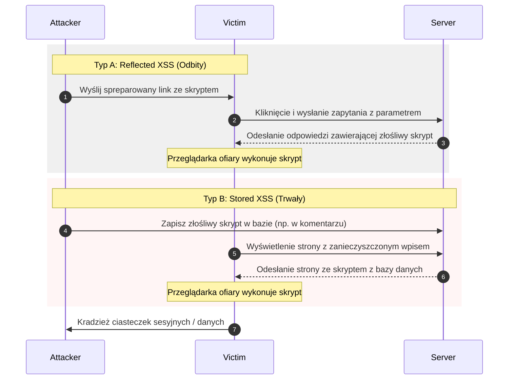


---

# Pytanie 12: Zdefiniuj atak SQL Injection, podaj typy ataków SQL Injection na aplikacje internetowe, ich skutki i metody obrony przed nimi.

## Kluczowe pojęcia
- **SQL Injection (SQLi / Wstrzykiwanie kodu SQL)**: Podatność polegająca na wstrzyknięciu złośliwego kodu SQL do parametrów zapytania wysyłanego przez aplikację do bazy danych, co pozwala na zmianę logiki pierwotnego zapytania i wykonanie nieautoryzowanych instrukcji.
- **Zapytanie parametryzowane (Prepared Statements)**: Technika bezpiecznego budowania zapytań SQL, w której struktura zapytania jest definiowana oddzielnie od danych wejściowych, co uniemożliwia interpretację danych jako kodu.
- **Fuzzing**: Metoda testowania polegająca na wysyłaniu do aplikacji losowych, nieoczekiwanych lub zniekształconych danych wejściowych w celu wykrycia błędów i luk.

## Szczegółowe omówienie tematu

### 1. Definicja i mechanizm działania SQL Injection
Do wstrzykiwania kodu SQL dochodzi, gdy programista buduje zapytanie SQL dynamicznie poprzez konkatenację (łączenie) ciągów tekstowych z danymi pochodzącymi od użytkownika. Przeglądarka lub aplikacja kliencka wysyła te dane, a baza danych interpretuje je jako instrukcje sterujące, a nie jako zwykłe wartości (literały).

*Przykład podatnego kodu (Java/JDBC)*:
```java
String query = "SELECT * FROM users WHERE login = '" + request.getParameter("user") + "'";
```
Jeśli użytkownik wpisze login: `admin' OR '1'='1`, zapytanie przetworzone przez bazę danych przyjmie postać:
```sql
SELECT * FROM users WHERE login = 'admin' OR '1'='1'
```
Ponieważ warunek `'1'='1'` jest zawsze prawdziwy, baza danych zwróci rekordy wszystkich użytkowników (lub pierwszego z nich, czyli zazwyczaj administratora), omijając proces weryfikacji hasła.

---

### 2. Typy ataków SQL Injection

Ataki SQLi klasyfikuje się na podstawie metody, w jaki sposób atakujący wyciąga dane z bazy:

#### A. In-band SQLi (Klasyczny / W kanale komunikacji):
Najprostsza i najszybsza forma ataku, w której wyniki zapytania oraz ewentualne błędy są zwracane bezpośrednio w odpowiedzi aplikacji (np. na wyświetlanej stronie).
- **Union-based SQLi**: Wykorzystuje operator `UNION` do połączenia wyników oryginalnego zapytania z wynikami zapytania wstrzykniętego przez atakującego. Pozwala to na wyciągnięcie zawartości dowolnej tabeli w bazie danych (np. `UNION SELECT username, password FROM admin_users`).
- **Error-based SQLi**: Wywoływanie błędów bazy danych (np. dzielenie przez zero, konwersja typów) w taki sposób, aby treść błędu wyświetlana na stronie zawierała poszukiwane dane (np. wersję serwera bazy danych czy nazwę bieżącej bazy).

#### B. Blind SQLi (Ślepy / Inferencyjny):
Aplikacja nie wyświetla wyników zapytania SQL ani komunikatów o błędach. Atakujący musi wnioskować o danych poprzez zadawanie bazie danych pytań typu prawda/fałsz.
- **Boolean-based Blind SQLi**: Atakujący modyfikuje zapytanie tak, aby zwracało prawdę (np. `AND 1=1`) lub fałsz (`AND 1=2`). Jeśli aplikacja reaguje subtelną zmianą wyglądu strony (np. brakiem jakiegoś elementu), atakujący może odczytywać dane znak po znaku (np. "Czy pierwsza litera hasła administratora to 'A'?").
- **Time-based Blind SQLi**: Używany, gdy aplikacja zachowuje się identycznie niezależnie od wyniku zapytania. Atakujący zmusza bazę danych do opóźnienia odpowiedzi (np. `AND IF(1=1, SLEEP(5), 0)`). Jeśli serwer odpowie po 5 sekundach, oznacza to, że postawiony warunek był prawdziwy.

#### C. Out-of-band SQLi (Poza kanałem komunikacji):
Stosowany, gdy serwer bazy danych jest odizolowany, a zapytania ślepe są zbyt powolne. Atakujący zmusza bazę danych do wysłania żądania sieciowego (np. zapytania DNS o domenę `kradzione-dane.atakujacy.com`) za pomocą wbudowanych funkcji bazy danych.

---

### 3. Skutki ataku SQLi
Udana eksploatacja SQLi może doprowadzić do:
- **Naruszenia poufności**: Kradzież baz danych, w tym haseł, danych osobowych (RODO) i tajemnic handlowych.
- **Naruszenia integralności**: Modyfikacja danych w bazie (np. zmiana salda konta, uprawnień użytkownika) lub usuwanie danych (`DROP TABLE`).
- **Naruszenia dostępności**: Zablokowanie bazy danych.
- **Remote Code Execution (RCE)**: W niektórych konfiguracjach (np. `xp_cmdshell` w MS SQL) atakujący może za pośrednictwem bazy danych uruchamiać polecenia w systemie operacyjnym serwera, co prowadzi do pełnego przejęcia komputera.

---

### 4. Metody obrony przed SQLi
Obrona przed SQLi jest relatywnie prosta, o ile zasady są konsekwentnie stosowane w całym projekcie:

1. **Używanie zapytań parametryzowanych (Prepared Statements)**:
   Dane wejściowe od użytkownika są przesyłane do bazy danych osobno jako parametry, a nie jako część instrukcji SQL. Baza najpierw kompiluje zapytanie, a parametry traktuje wyłącznie jako wartości tekstowe/liczbowe, przez co znaki takie jak `'` tracą swoje znaczenie sterujące.
   *Przykład bezpiecznego kodu (Java)*:
   ```java
   String query = "SELECT * FROM users WHERE login = ?";
   PreparedStatement stmt = connection.prepareStatement(query);
   stmt.setString(1, request.getParameter("user"));
   ```

2. **Stosowanie ORM (Object-Relational Mapping)**:
   Korzystanie z frameworków takich jak Hibernate, JPA czy Entity Framework chroni przed SQLi, ponieważ pod spodem automatycznie generują one zapytania parametryzowane. (Należy jednak unikać ręcznej konkatenacji stringów w zapytaniach typu HQL/JPQL).

3. **Zasada minimalnych uprawnień (Least Privilege)**:
   Konto bazy danych używane przez aplikację powinno mieć uprawnienia ograniczone tylko do niezbędnych tabel i operacji (np. brak praw do modyfikacji struktury bazy - `DROP`, `ALTER`).

4. **Walidacja danych wejściowych**:
   Wprowadzenie białej listy dopuszczalnych znaków oraz weryfikacja typów danych (np. upewnienie się, że parametr `id` zawiera wyłącznie cyfry przed wykonaniem zapytania).

## Wizualizacja

Oto schemat blokowy / diagram ułatwiający zrozumienie zagadnienia:

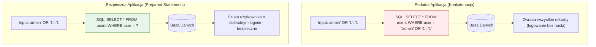


---

# Pytanie 13: Scharakteryzuj trzy techniki ataków stosowanych w sieciach komputerowych.

## Kluczowe pojęcia
- **ARP Spoofing (Zatruwanie tablicy ARP)**: Wysyłanie fałszywych komunikatów ARP w sieci lokalnej (LAN) w celu powiązania adresu IP ofiary (lub bramy) z adresem MAC karty sieciowej atakującego.
- **DNS Spoofing (Zatruwanie pamięci podręcznej DNS)**: Atak polegający na modyfikacji wpisów w pamięci podręcznej serwera DNS, co skutkuje przekierowaniem użytkownika na fałszywy adres IP.
- **IP Spoofing (Fałszowanie adresu IP)**: Tworzenie pakietów IP z fałszywym adresem źródłowym w nagłówku, mające na celu ukrycie tożsamości nadawcy lub ominięcie zabezpieczeń sieciowych.
- **Man-in-the-Middle (MitM)**: Atak polegający na przechwytywaniu komunikacji sieciowej między dwoma punktami bez wiedzy i zgody uczestników.

## Szczegółowe omówienie tematu

Wiele protokołów sieciowych (takich jak ARP, DNS czy bazowy protokół IP) zostało zaprojektowanych w czasach, gdy sieć była środowiskiem zaufanym. Brak mechanizmów uwierzytelniania w tych protokołach jest podstawą większości współczesnych ataków sieciowych. Poniżej scharakteryzowano trzy kluczowe techniki takich ataków.

---

### Technika 1: ARP Spoofing (Zatruwanie ARP / ARP Cache Poisoning)
- **Zasada działania**: 
  Protokół ARP służy w sieciach lokalnych do tłumaczenia adresów IP (warstwa 3) na fizyczne adresy MAC (warstwa 2). Gdy urządzenie chce wysłać dane do innego komputera w tej samej sieci, wysyła zapytanie ARP: *Kto ma IP X.X.X.X?*. Urządzenia nie weryfikują odpowiedzi i akceptują również zapytania nieproszone (*gratuitous ARP*). Atakujący wysyła do ofiary fałszywy pakiet ARP informujący, że adres IP bramy domyślnej (routera) ma teraz adres MAC atakującego. Jednocześnie wysyła do routera informację, że adres IP ofiary ma adres MAC atakującego.
- **Skutki**:
  Cały ruch sieciowy wymieniany między komputerem ofiary a siecią zewnętrzną przechodzi przez komputer atakującego. Umożliwia to przeprowadzenie ataku **Man-in-the-Middle (MitM)**, podsłuchiwanie nieszyfrowanego ruchu (np. haseł przesyłanych przez HTTP, FTP) oraz modyfikację danych w locie.
- **Metody obrony**:
  - Wdrożenie funkcji **DAI (Dynamic ARP Inspection)** na przełącznikach sieciowych (switche Cisco itp.), która weryfikuje poprawność pakietów ARP na podstawie bazy DHCP Snooping.
  - Statyczne wpisywanie adresów MAC bramy w konfiguracji urządzeń.

---

### Technika 2: DNS Spoofing (DNS Cache Poisoning / Zatruwanie DNS)
- **Zasada działania**:
  Serwer DNS tłumaczy nazwy domenowe (np. `bank.pl`) na adresy IP. Aby przyspieszyć działanie, serwery DNS przechowują odpowiedzi w pamięci podręcznej (cache). DNS Spoofing polega na wprowadzeniu do tej pamięci fałszywego rekordu. Atakujący wysyła do serwera DNS zapytanie o domenę i natychmiast zalewa go tysiącami fałszywych odpowiedzi (zanim nadejdzie odpowiedź od autorytatywnego serwera), zgadując numer identyfikacyjny zapytania (Transaction ID).
- **Skutki**:
  Kiedy legalny użytkownik próbuje wejść na stronę `bank.pl`, zainfekowany serwer DNS zwraca adres IP serwera kontrolowanego przez atakującego. Użytkownik widzi w przeglądarce poprawną domenę, ale treść strony (np. formularz logowania) jest w pełni kontrolowana przez przestępcę (phishing).
- **Metody obrony**:
  - Wdrożenie protokołu **DNSSEC** (rozszerzenie DNS wykorzystujące podpisy cyfrowe w celu weryfikacji autentyczności odpowiedzi).
  - Szyfrowanie ruchu DNS za pomocą **DoH** (DNS over HTTPS) lub **DoT** (DNS over TLS).

---

### Technika 3: IP Spoofing (Fałszowanie adresu IP)
- **Zasada działania**:
  Protokół IP nie weryfikuje, czy adres źródłowy wpisany w nagłówku pakietu rzeczywiście należy do nadawcy. Atakujący ręcznie modyfikuje nagłówek pakietu, wpisując tam inny (np. zaufany wewnątrz danej sieci) adres IP. Jest to atak typu "wyślij i zapomnij", ponieważ wszelkie odpowiedzi na sfałszowany pakiet trafią do ofiary, której adres został wpisany, a nie do prawdziwego atakującego.
- **Skutki**:
  - Ominięcie systemów autoryzacji opartych wyłącznie na adresacji IP (np. zapór sieciowych zezwalających na ruch tylko z określonych adresów).
  - Wykorzystanie w atakach DDoS typu **Reflection/Amplification** – atakujący wysyła zapytania do serwerów DNS/NTP, podając jako nadawcę adres IP ofiary. Odpowiedzi serwerów o ogromnym wolumenie trafiają bezpośrednio w cel, paraliżując jego działanie.
- **Metody obrony**:
  - Konfiguracja reguł **Egress/Ingress Filtering** na routerach brzegowych (blokowanie pakietów wychodzących z sieci lokalnej, które mają adresy źródłowe spoza tej sieci, oraz pakietów wchodzących mających adresy źródłowe z wewnątrz – standard **BCP 38**).
  - Stosowanie mechanizmu **uRPF** (Unicast Reverse Path Forwarding).

## Wizualizacja

Oto schemat blokowy / diagram ułatwiający zrozumienie zagadnienia:

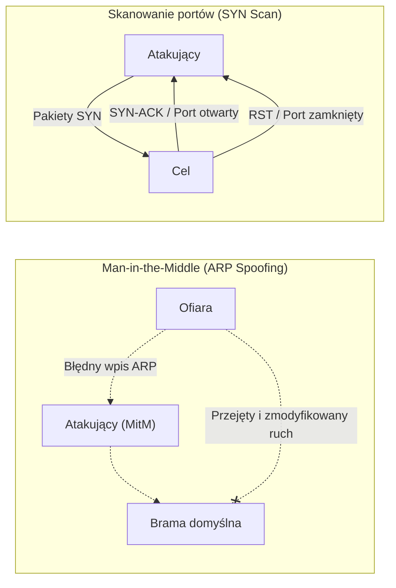


---

# Pytania 14-15: Zdefiniuj pojęcie "socjotechnika". W jaki sposób socjotechnika jest wykorzystywana w sieciach komputerowych?

## Kluczowe pojęcia
- **Socjotechnika (Inżynieria społeczna / ang. Social Engineering)**: Zbiór technik mających na celu manipulowanie ludźmi w celu skłonienia ich do wykonania określonych czynności (np. uruchomienia złośliwego oprogramowania) lub wyjawienia poufnych informacji (np. haseł, danych dostępowych).
- **Phishing**: Metoda ataku socjotechnicznego polegająca na wysyłaniu fałszywych wiadomości (e-mail, SMS) w celu wyłudzenia danych lub zainfekowania systemu.
- **Spear Phishing**: Spersonalizowany atak phishingowy wymierzony w konkretną osobę lub małą grupę osób na podstawie wcześniejszego rozpoznania (OSINT).
- **Baiting (Przynęta)**: Nakłonienie ofiary do wykonania czynności poprzez zaoferowanie jej obietnicy korzyści (np. darmowego oprogramowania lub pozostawienie zainfekowanego nośnika USB w miejscu publicznym).

## Szczegółowe omówienie tematu

### 1. Definicja socjotechniki (Inżynierii społecznej)
W kontekście bezpieczeństwa IT socjotechnika opiera się na założeniu, że **najsłabszym ogniwem każdego systemu bezpieczeństwa jest człowiek**. Atakujący zamiast szukać skomplikowanych podatności technicznych w oprogramowaniu (np. luk typu zero-day w zaporach sieciowych), manipuluje psychiką i emocjami użytkowników (strachem, ciekawością, chciwością, pośpiechem, szacunkiem do autorytetów), aby skłonić ich do samodzielnego otwarcia drzwi do systemu.

---

### 2. Wykorzystanie socjotechniki w sieciach komputerowych
Inżynieria społeczna w środowisku sieciowym przybiera różne formy komunikacji cyfrowej i metod infekcji:

#### A. Phishing i jego odmiany
Jest to najczęstszy wektor ataku w sieciach komputerowych.
- **Masowy Phishing**: Rozsyłanie milionów wiadomości e-mail/SMS (tzw. *Smishing*) podszywających się pod znane marki (np. DHL, Netflix, PGE) z informacją o konieczności dopłaty drobnej kwoty lub zweryfikowania konta. Link w wiadomości prowadzi do sfałszowanej bramki płatności lub panelu logowania.
- **Spear Phishing**: Atakujący bada cel przy użyciu białego wywiadu (OSINT) np. na portalach społecznościowych LinkedIn czy Facebook. Księgowa w firmie X otrzymuje maila od rzekomego klienta z zapytaniem o fakturę. Załącznik PDF (w rzeczywistości złośliwy plik `.exe` lub dokument z makrami) infekuje system i daje atakującemu dostęp do sieci firmowej.
- **Whaling (Polowanie na wieloryby)**: Odmiana spear phishingu wymierzona w kadrę zarządzającą wyższego szczebla (CEO, CFO).

#### B. BEC (Business Email Compromise) / CEO Fraud
Atak polegający na podszywaniu się pod dyrektora generalnego lub kontrahenta. Atakujący, często po uprzednim włamaniu na skrzynkę e-mail prezesa lub używając domeny łudząco podobnej (typosquatting), wysyła do działu finansowego pilne polecenie wykonania przelewu na nowe konto bankowe pod pretekstem "poufnej transakcji przejęcia firmy".

#### C. Pretexting i Vishing (Voice Phishing)
Atakujący dzwoni do ofiary (często fałszując numer telefonu nadawcy, tzw. *Caller ID Spoofing*) podając się za pracownika banku, policjanta lub dział IT (np. Microsoft Support). Przedstawia wymyśloną historię (pretekst) – np. wykrycie próby kradzieży środków z konta. Instruuje ofiarę, by zainstalowała oprogramowanie do zdalnego pulpitu (np. AnyDesk, TeamViewer), za pomocą którego przestępca przejmuje kontrolę nad jej komputerem i kontem bankowym.

#### D. Watering Hole Attack (Atak u żłopu)
Napastnik nie atakuje bezpośrednio wybranej firmy. Zamiast tego identyfikuje strony internetowe, z których pracownicy tej firmy często korzystają (np. lokalne forum branżowe, portal informacyjny, strona pobliskiej restauracji oferującej lunch). Atakujący włamuje się na tę witrynę i umieszcza na niej złośliwy kod, który infekuje komputery odwiedzających ją pracowników, wykorzystując podatności w ich przeglądarkach.

---

### 3. Psychologiczne mechanizmy wywierania wpływu (wg R. Cialdiniego)
Ataki socjotechniczne są skuteczne, ponieważ bazują na automatyzmach ludzkiego zachowania:
- **Autorytet**: Ludzie chętnie wykonują polecenia osób, które uznają za przełożonych lub przedstawicieli prawa (np. "Dyrektor IT", "Policja").
- **Reguła pilności (Niedostępności)**: Wywieranie presji czasu ("Twoje konto zostanie zablokowane za 15 minut"). W pośpiechu ludzie wyłączają racjonalne myślenie.
- **Sympatia i zaufanie**: Budowanie fałszywej więzi przez atakującego przed poproszeniem o przysługę.

---

### 4. Metody obrony przed socjotechniką
Ponieważ nie da się zainstalować antywirusa w ludzkim mózgu, obrona musi łączyć procedury organizacyjne z technologią:

1. **Szkolenia typu Security Awareness**: Systematyczne edukowanie pracowników i przeprowadzanie kontrolowanych, próbnych ataków phishingowych w celu wyrobienia nawyku ograniczonego zaufania.
2. **Techniczne uwierzytelnianie wieloskładnikowe (MFA)**: Wdrożenie kluczy sprzętowych (np. **YubiKey** w standardzie FIDO2/U2F). Są one odporne na phishing – nawet jeśli użytkownik poda hasło na fałszywej stronie, klucz sprzętowy nie wygeneruje tokenu dla fałszywej domeny.
3. **Zabezpieczenia poczty e-mail**: Konfiguracja mechanizmów autoryzacji poczty:
   - **SPF (Sender Policy Framework)**: Wskazuje, które serwery mogą wysyłać maile z danej domeny.
   - **DKIM (DomainKeys Identified Mail)**: Podpisuje maile kryptograficznie.
   - **DMARC (Domain-based Message Authentication, Reporting and Conformance)**: Określa, co serwer odbiorcy ma zrobić z mailem, który nie przeszedł testów SPF/DKIM.
4. **Zasada Zero Trust (Brak zaufania)**: Każda nietypowa prośba (np. zmiana numeru konta do faktury, prośba o podanie hasła) musi być zweryfikowana innym kanałem komunikacji (np. osobista rozmowa lub oddzwonienie na oficjalny numer).

## Wizualizacja

Oto schemat blokowy / diagram ułatwiający zrozumienie zagadnienia:

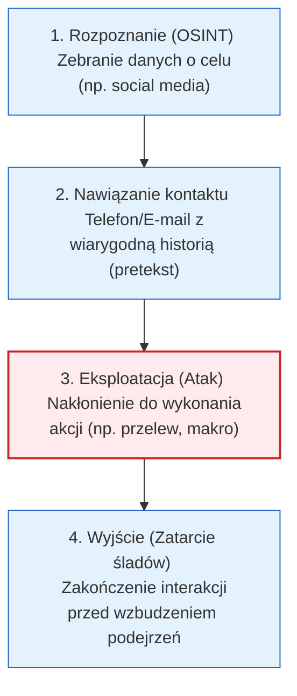


---

# Pytanie 16: Zdefiniuj pojęcia: Phishing, Spam, Trojan.

## Kluczowe pojęcia
- **Phishing**: Technika wyłudzania poufnych informacji oparta na inżynierii społecznej.
- **Spam**: Masowo wysyłane niechciane wiadomości elektroniczne.
- **Trojan (Koń trojański)**: Złośliwe oprogramowanie ukryte pod maską pożytecznej aplikacji, wymagające interakcji użytkownika do uruchomienia.
- **Malware**: Ogólne określenie na złośliwe oprogramowanie (w tym trojany).

## Szczegółowe omówienie tematu

Choć te trzy pojęcia często występują razem w kontekście cyberzagrożeń, odnoszą się do zupełnie innych elementów: metody ataku, sposobu komunikacji oraz rodzaju złośliwego kodu.

---

### 1. Phishing (Wędkarstwo)
- **Definicja**: 
  Jest to metoda cyberataku oparta na manipulacji psychologicznej (socjotechnice). Atakujący podszywa się pod wiarygodną instytucję (np. bank, urząd skarbowy, firmę kurierską, dostawcę poczty e-mail) w celu skłonienia ofiary do ujawnienia wrażliwych informacji, takich jak loginy i hasła, dane kart kredytowych lub numery PESEL.
- **Mechanizm działania**: 
  Ofiara otrzymuje wiadomość (np. e-mail lub SMS – tzw. *Smishing*) zawierającą informację o pilnej potrzebie podjęcia działania (np. "Twoja paczka została wstrzymana z powodu niedopłaty 1.50 zł"). Wiadomość zawiera link kierujący do sfałszowanej strony internetowej, która wizualnie nie różni się od oryginalnej witryny instytucji. Wpisane tam dane trafiają bezpośrednio do rąk przestępcy.
- **Odmiany**: 
  *Spear phishing* (atak celowany w konkretną osobę), *Whaling* (atak na osoby decyzyjne, np. zarząd firmy).

---

### 2. Spam
- **Definicja**: 
  Niezamówione wiadomości elektroniczne (najczęściej e-mail, ale również wiadomości na komunikatorach czy SMS-y) rozsyłane masowo do bardzo dużej liczby odbiorców jednocześnie.
- **Cechy charakterystyczne**:
  - **Masowość**: Ta sama wiadomość trafia do tysięcy lub milionów użytkowników.
  - **Brak zgody**: Odbiorcy nie wyrazili chęci otrzymywania tych treści.
  - **Anonimowość**: Nadawca często maskuje swoją tożsamość i fałszuje nagłówki wiadomości.
- **Zagrożenie**: 
  Większość spamu ma charakter reklamowy (np. kasyna online, leki bez recepty). Jednak spam jest również głównym wektorem rozprzestrzeniania złośliwego oprogramowania oraz phishingu – złośliwe wiadomości są często maskowane jako spam w nadziei, że ułamek procenta odbiorców otworzy załącznik (np. plik ZIP udający fakturę).

---

### 3. Trojan (Koń trojański / Trojan Horse)
- **Definicja**: 
  Rodzaj złośliwego oprogramowania (malware), które maskuje swoje prawdziwe szkodliwe przeznaczenie pod postacią legalnego i użytecznego programu. Nazwa wprost nawiązuje do mitu o zdobyciu Troi.
- **Mechanizm działania**: 
  W przeciwieństwie do wirusów i robaków, trojan **nie potrafi samodzielnie się replikować** ani infekować innych plików. Aby zainfekować system, potrzebuje interakcji ze strony użytkownika – użytkownik musi sam pobrać i uruchomić dany plik (np. pobrać fałszywy odtwarzacz wideo wymagany do obejrzenia filmu, zainstalować darmową grę z nieoficjalnego źródła lub uruchomić "generator kluczy" - crack).
- **Szkodliwy ładunek (Payload)**: 
  Po uruchomieniu, trojan potajemnie instaluje swój złośliwy kod w tle. Najczęstsze rodzaje trojanów to:
    - **RAT (Remote Access Trojan)**: Daje atakującemu pełny, zdalny dostęp do komputera ofiary.
    - **Trojan bankowy**: Podmienia numery kont w schowku systemowym lub wstrzykuje fałszywe panele logowania do przeglądarek internetowych.
    - **Backdoor**: Tworzy ukrytą furtkę umożliwiającą późniejsze zalogowanie się atakującego do systemu.

---

### Zależności między pojęciami – Scenariusz ataku
Współczesne ataki łączą te elementy w łańcuch infekcji:
```
[ SPAM ] (Kanał wysyłki) -> Masowa wysyłka e-maili
     |
[ PHISHING ] (Treść/Metoda) -> E-mail udaje fakturę od operatora i nakłania do pobrania pliku
     |
[ TROJAN ] (Złośliwy kod) -> Użytkownik uruchamia plik, który potajemnie przejmuje komputer (RAT)
```

## Wizualizacja

Oto schemat blokowy / diagram ułatwiający zrozumienie zagadnienia:

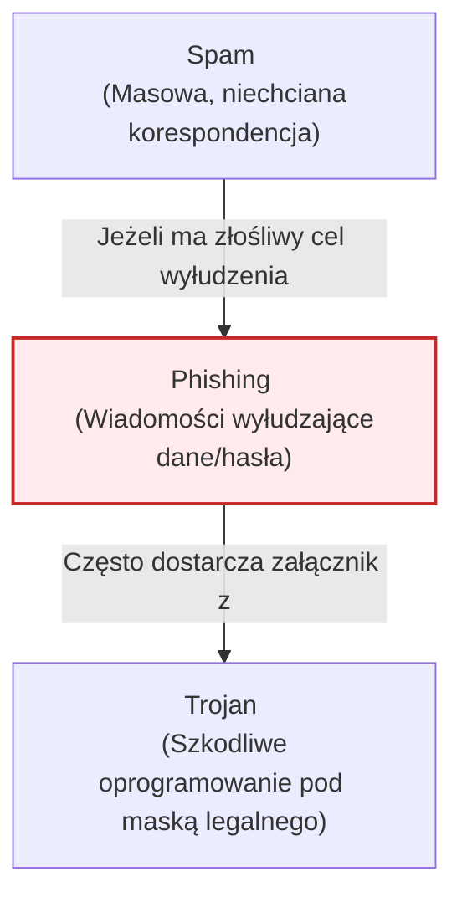


---

# Pytanie 17: Omów mechanizmy zabezpieczeń stosowane w sieciach bezprzewodowych Wi-Fi.

## Kluczowe pojęcia
- **WEP (Wired Equivalent Privacy)**: Pierwszy, przestarzały i całkowicie złamany standard szyfrowania Wi-Fi.
- **WPA2 (Wi-Fi Protected Access 2)**: Szeroko stosowany standard bezpieczeństwa, wprowadzający silne szyfrowanie AES-CCMP.
- **WPA3**: Najnowsza generacja zabezpieczeń Wi-Fi, zastępująca podatny mechanizm PSK protokołem SAE (Simultaneous Authentication of Equals).
- **TKIP (Temporal Key Integrity Protocol)**: Protokół szyfrowania oparty na RC4, wprowadzony jako tymczasowa łata na WEP, obecnie uznawany za niebezpieczny.
- **RADIUS**: Serwer uwierzytelniania stosowany w sieciach korporacyjnych (Enterprise) do weryfikacji tożsamości użytkowników.

## Szczegółowe omówienie tematu

Ponieważ fale radiowe sieci Wi-Fi rozchodzą się w przestrzeni publicznej, fizyczna ochrona medium transmisyjnego jest niemożliwa. Bezpieczeństwo Wi-Fi opiera się w całości na mechanizmach kryptograficznych realizujących dwa cele: **uwierzytelnianie** (kto może się połączyć) oraz **szyfrowanie** (ochrona przed podsłuchem).

---

### 1. Protokoły zabezpieczeń Wi-Fi i ich ewolucja

#### WEP (Wired Equivalent Privacy) - *Standard wycofany i niebezpieczny*
- **Szyfrowanie**: Wykorzystuje algorytm strumieniowy RC4. Klucz szyfrujący jest łączony z 24-bitowym Wektorem Inicjującym (IV).
- **Podatności**: Ze względu na krótki wektor IV, w sieci o dużym natężeniu ruchu te same wektory szybko się powtarzają. Atakujący, przechwytując odpowiednią liczbę ramek (za pomocą np. `aircrack-ng`), może matematycznie odtworzyć klucz główny sieci w czasie krótszym niż minuta.

#### WPA (Wi-Fi Protected Access) - *Standard przejściowy*
- **Szyfrowanie**: Wprowadził protokół **TKIP** (Temporal Key Integrity Protocol), który dynamicznie generował nowy klucz dla każdego pakietu danych, co eliminowało problem powtarzalności IV z WEP. Pod spodem jednak nadal działał algorytm RC4. Obecnie WPA-TKIP jest uznawany za przestarzały i podatny na ataki.

#### WPA2 (Wi-Fi Protected Access 2) - *Standard powszechny*
- **Szyfrowanie**: Zastąpił TKIP bezpiecznym protokołem **CCMP** opartym na zaawansowanym algorytmie szyfrowania symetrycznego **AES** (Advanced Encryption Standard).
- **Warianty**:
  - **WPA2-PSK (Personal)**: Autoryzacja za pomocą jednego, wspólnego hasła (Pre-Shared Key).
    *Słabość*: Podatność na offline-owe ataki słownikowe. Atakujący podsłuchuje proces logowania klienta do stacji bazowej (tzw. *4-way handshake*). Następnie na własnym komputerze próbuje dopasować hasło ze słownika do przechwyconego hashu. Dodatkowo w 2017 r. ujawniono podatność **KRACK** (Key Reinstallation Attack) w samym protokole nawiązywania połączenia.
  - **WPA2-Enterprise**: Używany w korporacjach. Wykorzystuje standard **IEEE 802.1X**. Użytkownicy logują się indywidualnie (login/hasło, certyfikat cyfrowy) przez zewnętrzny serwer **RADIUS**, który generuje unikalne klucze szyfrujące dla każdej sesji.

#### WPA3 - *Najnowszy i zalecany standard*
- **Dragonfly Handshake (SAE)**: Klucz współdzielony został zastąpiony protokołem **SAE (Simultaneous Authentication of Equals)**. Protokół ten uniemożliwia przeprowadzanie offline-owych ataków słownikowych (brute-force) na przechwycony ruch. Nawet jeśli hasło jest słabe, atakujący nie może go złamać bez interakcji online z punktem dostępowym (AP), co pozwala na łatwe zablokowanie takich prób.
- **Forward Secrecy (Poufność przekazywania)**: Nawet jeśli hasło do sieci zostanie złamane w przyszłości, nie pozwoli to na odszyfrowanie ruchu sieciowego zarejestrowanego wcześniej.
- **OWE (Opportunistic Wireless Encryption)**: Szyfrowanie ruchu w sieciach otwartych (bezhasłowych, np. w hotelach). Chroni użytkowników przed podsłuchiwaniem ich transmisji przez inne osoby w tej samej sieci.

---

### 2. Pomocnicze i przestarzałe mechanizmy (antywzorce)
W przeszłości stosowano metody, które dziś nie są uznawane za rzeczywiste zabezpieczenia:
- **Ukrywanie SSID**: Wyłączenie rozgłaszania nazwy sieci w ramkach typu Beacon. Jest to nieskuteczne, ponieważ nazwa sieci (SSID) jest przesyłana jawnym tekstem w ramkach żądania asocjacji (Association Requests), gdy legalne urządzenia próbują się połączyć.
- **Filtrowanie adresów MAC**: Blokowanie urządzeń o nieznanych adresach fizycznych MAC. Adresy te są przesyłane otwartym tekstem w nagłówkach ramek 802.11. Atakujący może łatwo odczytać dozwolony adres MAC i podrobić go na swoim urządzeniu (tzw. *MAC Spoofing*).
- **WPS (Wi-Fi Protected Setup)**: Standard ułatwiający łączenie urządzeń (np. za pomocą 8-cyfrowego kodu PIN). Posiada krytyczną lukę projektową (podatność na atak brute-force za pomocą narzędzia *Reaver*), umożliwiającą odzyskanie hasła sieci w kilka godzin. **Powinien być bezwzględnie wyłączony**.

## Wizualizacja

Oto schemat blokowy / diagram ułatwiający zrozumienie zagadnienia:

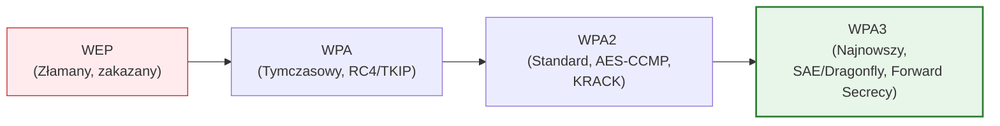

## Podsumowanie
W celu zapewnienia bezpieczeństwa sieci Wi-Fi należy bezwzględnie wyłączyć obsługę protokołów WEP, WPA oraz WPS. Rekomendowaną konfiguracją jest stosowanie **WPA3-SAE** dla sieci domowych oraz **WPA3-Enterprise** (z uwierzytelnianiem 802.1X i serwerem RADIUS) w środowiskach biznesowych.


---

# Pytanie 18: Omów miary bezpieczeństwa systemu komputerowego.

## Kluczowe pojęcia
- **Miary bezpieczeństwa (Security Metrics)**: Standardy i wartości liczbowe służące do ilościowej oceny poziomu bezpieczeństwa, odporności systemów oraz efektywności procesów obronnych.
- **Triada CIA (Poufność, Integralność, Dostępność)**: Trzy podstawowe cele ochrony danych, wokół których definiuje się miary bezpieczeństwa.
- **MTTD (Mean Time to Detect)**: Średni czas potrzebny na wykrycie incydentu bezpieczeństwa od momentu jego wystąpienia.
- **MTTR (Mean Time to Respond / Repair)**: Średni czas potrzebny na reakcję, powstrzymanie (mitigation) i usunięcie skutków incydentu.
- **CVSS (Common Vulnerability Scoring System)**: Standardowy system oceny powagi podatności w oprogramowaniu (skala od 0 do 10).

## Szczegółowe omówienie tematu

### 1. Rola miar bezpieczeństwa w inżynierii systemów
W myśl zasady „nie możesz zarządzać czymś, czego nie potrafisz zmierzyć”, miary bezpieczeństwa są niezbędne do oceny stanu ochrony systemów komputerowych. Pozwalają one na:
- Identyfikację słabych punktów w infrastrukturze IT.
- Weryfikację skuteczności wdrożonych zabezpieczeń (np. firewalli, systemów EDR).
- Porównywanie poziomu bezpieczeństwa w czasie (analiza trendów).
- Uzasadnienie wydatków na cyberbezpieczeństwo (ROI) przed zarządem.
- Wykazanie zgodności (compliance) z normami prawnymi (np. RODO, ISO 27001, NIS2).

---

### 2. Klasyfikacja miar bezpieczeństwa

Miary bezpieczeństwa można podzielić na trzy główne kategorie:

#### A. Miary techniczne (systemowe)
Koncentrują się na parametrach technicznych infrastruktury i oprogramowania:
- **Gęstość i krytyczność podatności**: Liczba wykrytych luk bezpieczeństwa w systemie operacyjnym i aplikacjach, często ważona ich punktacją w skali **CVSS** (np. liczba luk o statusie *Critical* / CVSS >= 9.0).
- **Patch Latency (Opóźnienie aktualizacji)**: Średni czas (w dniach) pomiędzy wydaniem poprawki bezpieczeństwa przez producenta oprogramowania a jej faktycznym wdrożeniem na serwerach.
- **Wskaźnik pokrycia zabezpieczeniami**: Procent urządzeń w sieci posiadających aktywne i zaktualizowane oprogramowanie antywirusowe/EDR lub objętych monitoringiem logów (SIEM).
- **Dostępność usług (Availability)**: Procent czasu poprawnego działania systemu w skali roku (np. SLA na poziomie 99.9% oznacza dopuszczalny przestój ok. 8.76 godziny rocznie).

#### B. Miary operacyjne (procesowe)
Mierzą efektywność i sprawność działania zespołów odpowiedzialnych za bezpieczeństwo (np. Security Operations Center – SOC):
- **MTTD (Mean Time to Detect)**: Średni czas od momentu przełamania zabezpieczeń przez atakującego do chwili wykrycia tego faktu przez systemy monitorowania. Krótki MTTD ogranicza tzw. *dwell time* (czas przebywania włamywacza w sieci).
- **MTTR (Mean Time to Respond / Resolve)**: Średni czas potrzebny na powstrzymanie incydentu (np. zablokowanie konta, odizolowanie zainfekowanej maszyny od sieci) i przywrócenie normalnego działania.
- **False Positive Rate (Wskaźnik fałszywych alarmów)**: Stosunek liczby alertów błędnych (generowanych przez normalną aktywność użytkowników) do całkowitej liczby alertów wygenerowanych przez systemy detekcji (IDS/IPS/SIEM).

#### C. Miary ludzkie (behawioralne)
Mierzą świadomość użytkowników końcowych, którzy często są celem ataków socjotechnicznych:
- **Współczynnik podatności na phishing (Phishing Click Rate)**: Odsetek pracowników, którzy kliknęli w podejrzany link lub otworzyli załącznik podczas kontrolowanych, próbnych testów phishingowych.
- **Współczynnik raportowania incydentów**: Odsetek pracowników, którzy poprawnie rozpoznali podejrzaną wiadomość i zgłosili ją do działu bezpieczeństwa zamiast ją zignorować lub otworzyć.

---

### 3. Cechy skutecznych miar (Zasada SMART)
Właściwie zaprojektowane metryki bezpieczeństwa powinny być:
- **Obiektywne i ilościowe**: Oparte na faktach i liczbach, a nie na subiektywnej ocenie (np. "98% serwerów jest aktualnych" zamiast "serwery są bezpieczne").
- **Łatwe do pozyskania**: Proces zbierania danych powinien być w miarę możliwości zautomatyzowany, aby nie obciążać administratorów pracą manualną.
- **Zrozumiałe dla biznesu**: Powinny pozwalać na przełożenie ryzyka technicznego na ryzyko biznesowe i finansowe (np. czas przestoju systemu przeliczony na straty finansowe).

## Wizualizacja

Oto schemat blokowy / diagram ułatwiający zrozumienie zagadnienia:

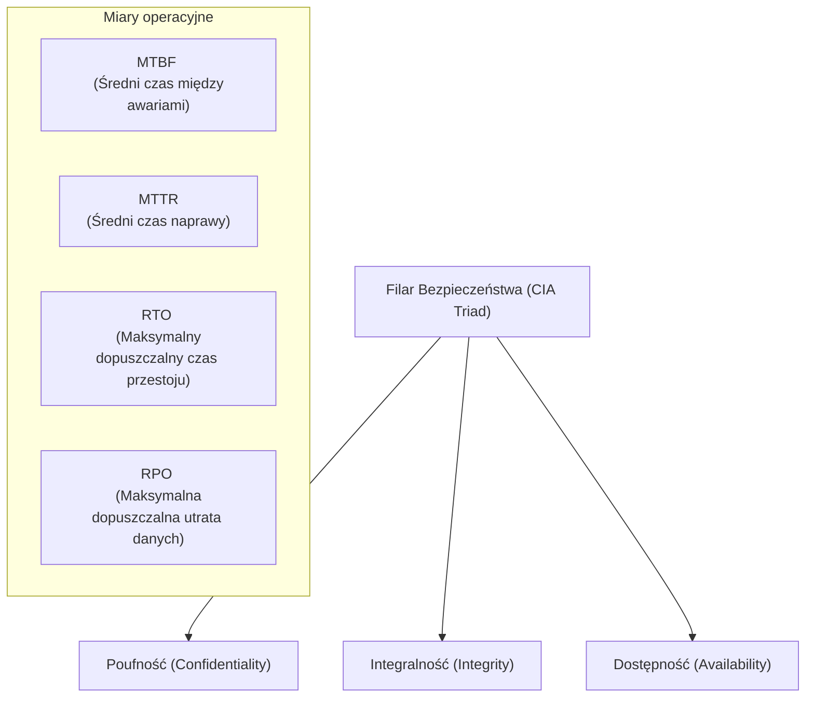

## Podsumowanie
Miary bezpieczeństwa systemu komputerowego to niezbędne narzędzie zarządcze. Pozwalają one na przejście od reaktywnego gaszenia pożarów do proaktywnego zarządzania ryzykiem. Skuteczna obrona opiera się na ciągłym monitorowaniu kluczowych wskaźników, takich jak czas wykrycia (MTTD), czas reakcji (MTTR) oraz stopień załatania podatności (Patch Latency).


---

# Pytanie 19: Omów jedno z narzędzi modelowania zagrożeń systemów komputerowych.

## Kluczowe pojęcia
- **Modelowanie zagrożeń (Threat Modeling)**: Systematyczny proces identyfikacji, oceny i mitygowania ryzyk bezpieczeństwa na etapie projektowania architektury systemu IT (podejście *Secure by Design*).
- **STRIDE**: Metodologia klasyfikacji zagrożeń opracowana przez Microsoft (Spoofing, Tampering, Repudiation, Information Disclosure, Denial of Service, Elevation of Privilege).
- **DFD (Data Flow Diagram / Diagram Przepływu Danych)**: Graficzny model systemu przedstawiający procesy, magazyny danych, elementy zewnętrzne i przepływy informacji przez granice zaufania.
- **Granica zaufania (Trust Boundary)**: Umowna linia oddzielająca obszary systemu o różnych poziomach uprawnień i zaufania (np. sieć publiczna a sieć prywatna).

## Szczegółowe omówienie tematu

Jednym z najbardziej znanych i najszerzej stosowanych narzędzi do modelowania zagrożeń jest **Microsoft Threat Modeling Tool (TMT)**. Jest to bezpłatne narzędzie stworzone w celu wsparcia bezpiecznego cyklu wytwarzania oprogramowania (SDL - Security Development Lifecycle).

---

### 1. Idea działania Microsoft Threat Modeling Tool (TMT)
Narzędzie opiera się na koncepcji, że najtaniej i najskuteczniej poprawia się błędy bezpieczeństwa na etapie **projektowania architektury**, zanim powstanie kod źródłowy. TMT pozwala na graficzne zamodelowanie systemu, a następnie automatycznie (na podstawie wbudowanego silnika reguł) generuje listę potencjalnych zagrożeń, które architekt lub inżynier bezpieczeństwa musi przeanalizować.

---

### 2. Główne elementy modelowania w TMT
Podczas tworzenia modelu w narzędziu użytkownik rysuje diagram DFD, korzystając z następujących komponentów (szablonów):
- **External Interactor (Podmiot zewnętrzny)**: Elementy poza bezpośrednią kontrolą systemu (np. użytkownik, przeglądarka internetowa, zewnętrzne API).
- **Process (Proces)**: Dowolny kod wykonujący operacje (np. aplikacja webowa, mikrousługa, zadanie w tle).
- **Data Store (Magazyn danych)**: Miejsce, w którym dane są zapisywane (np. baza danych SQL, plik konfiguracyjny, pamięć cache).
- **Data Flow (Przepływ danych)**: Kanał komunikacji między elementami (np. zapytanie HTTPS, połączenie TCP, potok systemowy).
- **Trust Boundary (Granica zaufania)**: Zaznaczana czerwoną przerywaną linią. Rozgranicza strefy o różnym poziomie zaufania. Przejście danych przez granicę zaufania (np. od użytkownika z Internetu do bazy danych w sieci lokalnej) to miejsce, w którym najczęściej dochodzi do ataków.

---

### 3. Automatyczna analiza zagrożeń (Metodologia STRIDE)
Gdy diagram DFD jest gotowy, użytkownik przełącza narzędzie w tryb analizy (*Analysis View*). TMT automatycznie generuje zagrożenia dopasowane do narysowanej architektury, klasyfikując je według modelu **STRIDE**:

| Litera | Zagrożenie (ang.) | Tłumaczenie / Opis | Przykład generowany przez TMT |
| :--- | :--- | :--- | :--- |
| **S** | **Spoofing** | Podszywanie się pod kogoś/coś | Brak uwierzytelniania użytkownika przesyłającego dane. |
| **T** | **Tampering** | Manipulacja danymi | Dane przesyłane przez granicę zaufania jawnym tekstem (możliwość modyfikacji). |
| **R** | **Repudiation** | Zaprzeczalność czynu | Brak logowania zdarzeń (użytkownik może zaprzeczyć, że wykonał akcję). |
| **I** | **Information Disclosure** | Ujawnienie informacji (wyciek) | Baza danych zapisuje poufne informacje bez szyfrowania. |
| **D** | **Denial of Service** | Odmowa usługi (przeciążenie) | Brak limitów zapytań (rate limiting) na serwerze WWW. |
| **E** | **Elevation of Privilege** | Eskalacja uprawnień | Brak autoryzacji (użytkownik może wywołać funkcje admina). |

---

### 4. Cykl zarządzania zagrożeniami w TMT
Dla każdego wygenerowanego przez narzędzie zagrożenia, zespół projektowy musi określić jego status oraz opisać sposób mitygacji:
1. **Mitigated (Rozwiązane)**: Wskazanie konkretnego zabezpieczenia technicznego (np. „Połączenie zabezpieczone TLS 1.3, hasła hashowane za pomocą bcrypt”).
2. **Accepted (Zaakceptowane)**: Świadome ryzyko biznesowe (np. „Serwer nie ma rate-limitera, ponieważ działa wyłącznie w zamkniętej sieci testowej”).
3. **Needs Investigation**: Wymaga dalszej analizy.

Narzędzie umożliwia wygenerowanie kompletnego raportu (w formacie HTML), który służy jako dokumentacja bezpieczeństwa dla audytorów oraz wytyczne dla programistów wdrażających system.

## Wizualizacja

Oto schemat blokowy / diagram ułatwiający zrozumienie zagadnienia:

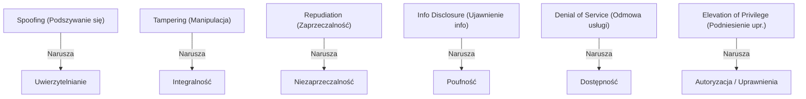

## Podsumowanie
Microsoft Threat Modeling Tool to potężne, ustrukturyzowane narzędzie, które przekłada architekturę logiczną systemu na konkretne zagrożenia bezpieczeństwa przy użyciu metodologii STRIDE. Pomaga ono deweloperom i architektom myśleć jak atakujący, co pozwala na eliminację luk bezpieczeństwa na najwcześniejszym etapie SDLC.


---

# Pytanie 20: Omów model FAIR pozwalający na szacowanie ryzyka zagrożenia bezpieczeństwa systemu komputerowego.

## Kluczowe pojęcia
- **FAIR (Factor Analysis of Information Risk - Analiza Czynnikowa Ryzyka Informacyjnego)**: Międzynarodowy standard i jedyny powszechnie akceptowany model ilościowej analizy ryzyka operacyjnego i cyberbezpieczeństwa.
- **Ilościowa analiza ryzyka**: Szacowanie ryzyka w konkretnych wartościach liczbowych i finansowych (np. roczna oczekiwana strata w PLN), w przeciwieństwie do analizy jakościowej (np. ryzyko „wysokie”, „czerwone”).
- **Loss Event Frequency (Częstotliwość zdarzeń powodujących stratę)**: Prawdopodobieństwo lub liczba przypadków wystąpienia udanego ataku w określonym przedziale czasu (np. raz na rok).
- **Loss Magnitude (Wielkość straty)**: Całkowity wymiar finansowy szkód (kosztów) wywołanych przez pojedynczy incydent.

## Szczegółowe omówienie tematu

### 1. Czym jest model FAIR?
Tradycyjne metody oceny ryzyka IT (np. na podstawie ISO 27005 lub NIST SP 800-30) często opierają się na subiektywnych macierzach ryzyka (np. Prawdopodobieństwo 1-5 x Skutki 1-5 = Poziom Ryzyka). Prowadzi to do ocen typu „ryzyko średnio-wysokie”, które są trudne do zinterpretowania przez zarząd firmy podejmujący decyzje finansowe.

**Model FAIR** rozwiązuje ten problem poprzez zdefiniowanie ryzyka jako **prawdopodobieństwa wystąpienia i wielkości przyszłej straty finansowej**. FAIR rozkłada ryzyko na czynniki składowe, tworząc matematyczne drzewo zależności, i pozwala wyliczyć ryzyko w walucie (np. PLN, USD).

---

### 2. Struktura czynników ryzyka w modelu FAIR
Model FAIR dzieli ryzyko na dwie główne gałęzie: **Częstotliwość zdarzeń powodujących stratę (Loss Event Frequency)** oraz **Wielkość straty (Loss Magnitude)**.

```
                          [ RYZYKO (RISK) ]
                                  |
            +---------------------+---------------------+
            |                                           |
[ Loss Event Frequency (LEF) ]             [ Loss Magnitude (LM) ]
            |                                           |
     +------+------+                             +------+------+
     |             |                             |             |
  [ TEF ]    [ Podatność ]                    [ Straty ]    [ Straty ]
            (Vulnerability)                 [ Pierwotne ] [ Wtórne ]
```

#### A. Loss Event Frequency (LEF) – Częstotliwość strat
Określa, jak często w danym okresie dojdzie do pomyślnego ataku skutkującego stratą. Zależy od:
- **TEF (Threat Event Frequency - Częstotliwość zdarzeń zagrożeń)**: Jak często profilowany napastnik (Threat Agent) podejmie próbę ataku na nasz zasób. Zależy to od częstotliwości kontaktu (*Contact*) oraz siły działania (*Force*).
- **Vulnerability (Podatność)**: Prawdopodobieństwo, że próba ataku zakończy się sukcesem. Wynika bezpośrednio z porównania zdolności/siły napastnika (**Threat Capability**) z poziomem wdrożonych przez nas zabezpieczeń (**Control Strength**).

#### B. Loss Magnitude (LM) – Wielkość straty
Określa finansowe konsekwencje jednego incydentu. FAIR rozróżnia dwa rodzaje strat:
- **Primary Loss (Straty pierwotne)**: Bezpośrednie koszty poniesione przez samą organizację w celu usunięcia awarii (np. koszt pracy programistów naprawiających system, utracone przychody w czasie przestoju sklepu internetowego).
- **Secondary Loss (Straty wtórne)**: Koszty wynikające z reakcji otoczenia zewnętrznego na incydent (np. kary administracyjne od UODO za wyciek danych osobowych, odszkodowania dla klientów, koszty PR mające na celu ratowanie wizerunku, utrata klientów na rzecz konkurencji).

---

### 3. Zastosowanie statystyki (Metoda Monte Carlo)
W modelu FAIR rzadko podaje się dane wejściowe jako pojedyncze, sztywne wartości (np. "dokładnie 12 ataków rocznie"), ponieważ cyberbezpieczeństwo jest pełne niepewności. Zamiast tego analitycy wprowadzają zakresy danych: **wartość minimalną, maksymalną oraz najbardziej prawdopodobną** (tworząc rozkład prawdopodobieństwa PERT lub trójkątny).

Następnie silnik FAIR wykorzystuje **symulację Monte Carlo**, która wykonuje tysiące (np. 10 000) losowań scenariuszy w celu wygenerowania krzywej rozkładu prawdopodobieństwa rocznych strat. Wynik pozwala określić:
- Średnią (oczekiwaną) wartość strat rocznych (ALE - Annual Loss Expectancy).
- Najgorszy możliwy scenariusz (np. z prawdopodobieństwem 5%).

## Wizualizacja

Oto schemat blokowy / diagram ułatwiający zrozumienie zagadnienia:

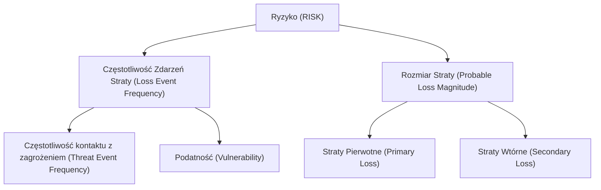

## Podsumowanie
Model FAIR to potężne narzędzie łączące techniczną inżynierię bezpieczeństwa z zarządzaniem biznesowym. Pozwala on na precyzyjne uzasadnienie budżetów bezpieczeństwa. Zamiast argumentować: „musimy kupić ten system, bo bez niego ryzyko jest wysokie”, oficer bezpieczeństwa (CISO) korzystający z FAIR może powiedzieć: „wydanie 50 000 PLN na to zabezpieczenie zmniejszy naszą roczną oczekiwaną stratę z tytułu wycieku danych z 400 000 PLN do 120 000 PLN, co daje oszczędność 280 000 PLN rocznie”.


---

# Pytanie 21: Omów rolę bibliotek ataków na systemy komputerowe w procesie zapewniania ich bezpieczeństwa.

## Kluczowe pojęcia
- **Biblioteka ataków (Attack Library / Knowledge Base)**: Ustrukturyzowana, publiczna lub wewnętrzna baza wiedzy opisująca zachowania, techniki, taktyki i metody działania rzeczywistych cyberprzestępców (np. MITRE ATT&CK, CAPEC).
- **TTP (Tactics, Techniques, and Procedures)**: Taktyki (cel pośredni, np. kradzież haseł), Techniki (metoda realizacji, np. zrzut pamięci LSASS) i Procedury (konkretne wykonanie za pomocą danego narzędzia) stosowane przez napastników.
- **MITRE ATT&CK**: Globalnie uznawana macierz i baza wiedzy opisująca techniki ataków na podstawie rzeczywistych obserwacji incydentów na świecie.
- **CAPEC (Common Attack Pattern Enumeration and Classification)**: Klasyfikacja wzorców ataków skupiona głównie na słabościach i lukach w oprogramowaniu (aplikacjach).

## Szczegółowe omówienie tematu

### 1. Geneza i cel powstania bibliotek ataków
Przez wiele lat obrona systemów komputerowych opierała się na wykrywaniu **Wskaźników Kompromitacji (IoC - Indicators of Compromise)**, takich jak adresy IP serwerów C2, nazwy domenowe czy sumy kontrolne (hashe MD5/SHA256) złośliwych plików. Atakujący nauczyli się jednak niezwykle szybko modyfikować te parametry (np. kompilować złośliwy plik na nowo, co zmienia jego hash), przez co tradycyjne antywirusy stawały się bezradne.

Rozwiązaniem stało się skupienie na **behawiorze (zachowaniu)** napastników. Biblioteki ataków powstały po to, aby skatalogować i opisać **TTP (Taktyki, Techniki i Procedury)**. Zmiana zachowania (np. metody eskalacji uprawnień) wymaga od napastnika znacznie więcej wysiłku i czasu niż zmiana adresu IP czy hashu pliku (koncepcja ta opisywana jest tzw. *Piramidą Bólu* - *Pyramid of Pain* autorstwa Davida Bianco).

---

### 2. Główne przykłady bibliotek ataków

#### A. MITRE ATT&CK (Adversarial Tactics, Techniques, and Common Knowledge)
To de facto standard branżowy. Reprezentuje model macierzowy podzielony na:
- **Taktyki (Tactics)**: Reprezentują cel biznesowy ataku (np. *Initial Access* – uzyskanie dostępu, *Persistence* – utrzymanie dostępu, *Lateral Movement* – poruszanie się po sieci lokalnej, *Exfiltration* – kradzież danych).
- **Techniki (Techniques)**: Sposób, w jaki atakujący realizuje daną taktykę (np. w ramach taktyki *Initial Access* techniką jest *Phishing*).
- **Podtechniki (Sub-techniques)**: Dokładniejszy opis techniki (np. w ramach techniki *Phishing* podtechniką jest *Spearphishing Attachment* – załącznik phishingowy).
- **Procedury (Procedures)**: Konkretne wdrożenie techniki przez zidentyfikowane grupy APT (Advanced Persistent Threat) lub oprogramowanie (np. „Grupa APT28 użyła zainfekowanego dokumentu Word w celu wdrożenia malware X”).

#### B. CAPEC (Common Attack Pattern Enumeration and Classification)
Zbiór wzorców ataków dedykowany dla inżynierów oprogramowania (AppSec). Opisuje typowe mechanizmy atakowania aplikacji (np. SQL Injection, Cross-Site Scripting, OS Command Injection), wskazując słabe punkty w kodzie i sposoby obrony przed nimi.

---

### 3. Rola bibliotek w procesie zapewniania bezpieczeństwa
Wdrożenie bibliotek ataków do procesów bezpieczeństwa organizacji (podejście *Threat-Informed Defense*) niesie za sobą kluczowe korzyści:

1. **Projektowanie systemów detekcji (SOC / SIEM / EDR)**:
   Zamiast pisać reguły wykrywania dla konkretnych plików, analitycy SOC piszą reguły behawioralne oparte na technikach ATT&CK. Przykładowo, reguła może generować alert, gdy *„dowolny proces inny niż systemowy próbuje uzyskać dostęp do odczytu procesu lsass.exe”* (jest to technika zrzucania poświadczeń z pamięci Windows - T1003.001).

2. **Analiza luk w obronie (Gap Analysis)**:
   Organizacja może zmapować posiadane systemy bezpieczeństwa na macierz ATT&CK. Ujawnia to natychmiast, na jakie techniki ataków system jest odporny (np. posiada antywirusa blokującego technikę X), a gdzie występują „ślepe plamy” (brak jakiejkolwiek detekcji dla techniki Y).

3. **Emulacja ataków i Purple Teaming (Testowanie)**:
   Zespoły testujące bezpieczeństwo (Red Team) używają TTP z bibliotek do symulowania rzeczywistych scenariuszy włamań (np. "Dzisiaj emulujemy grupę APT29 i sprawdzamy, czy nasz Blue Team wykryje ich techniki"). Pozwala to na realną ocenę skuteczności obrony.

4. **Wymiana wiedzy o zagrożeniach (Cyber Threat Intelligence - CTI)**:
   Biblioteki dają jednolity, znormalizowany słownik pojęć. Dzięki temu raporty o nowych zagrożeniach publikowane na świecie mogą od razu referować do konkretnych numerów technik (np. T1190 – Exploit Public-Facing Application), co ułatwia automatyzację i konfigurację systemów ochronnych.

## Wizualizacja

Oto schemat blokowy / diagram ułatwiający zrozumienie zagadnienia:

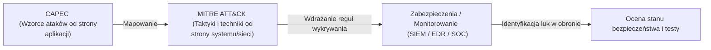

## Podsumowanie
Biblioteki ataków (szczególnie MITRE ATT&CK) stanowią fundament nowoczesnego cyberbezpieczeństwa. Pozwalają organizacjom odejść od reaktywnego podejścia sygnaturowego na rzecz proaktywnego monitorowania zachowań i technik stosowanych przez napastników. Integrują one pracę architektów oprogramowania, administratorów sieci, testerów penetracyjnych oraz analityków systemów detekcji, tworząc spójne i mierzalne środowisko obronne.


---

# Pytanie 22: Omów znane Ci metodyki realizacji przedsięwzięcia projektowego. Porównaj wybrane metodyki: tradycyjną i zwinną.

## Kluczowe pojęcia
- **Metodyka zarządzania projektami**: Zbiór zasad, metod i procesów określających sposób planowania, realizacji, monitorowania i zamykania projektów.
- **Metodyka tradycyjna (kaskadowa / Waterfall)**: Liniowe podejście do zarządzania projektem, w którym fazy następują sekwencyjnie, a każda kolejna rozpoczyna się dopiero po zakończeniu poprzedniej.
- **Metodyka zwinna (Agile)**: Iteracyjne podejście skupione na ciągłym dostarczaniu wartości, elastyczności wobec zmian wymagań oraz bliskiej współpracy z klientem.
- **Manifest Agile (2001)**: Deklaracja zasad zwinnego tworzenia oprogramowania, stawiająca ludzi i interakcje ponad procesy, a działające oprogramowanie ponad dokumentację.

## Szczegółowe omówienie tematu

Wytwarzanie systemów informatycznych charakteryzuje się dynamicznie zmieniającymi się wymaganiami oraz wysokim stopniem złożoności. Do zarządzania tym procesem stosuje się różne podejścia, z których dwa główne to podejście tradycyjne oraz zwinne.

---

### 1. Metodyki tradycyjne (Kaskadowe / Waterfall)
Klasyczny model kaskadowy (Waterfall) zakłada, że proces wytwórczy oprogramowania składa się z następujących po sobie, sztywno zdefiniowanych faz:
1. **Analiza wymagań** (zebranie i zatwierdzenie pełnej specyfikacji).
2. **Projektowanie systemu** (architektura baz danych, struktura kodu, interfejsy).
3. **Implementacja** (pisanie kodu źródłowego).
4. **Integracja i testy** (weryfikacja całego systemu).
5. **Wdrożenie i utrzymanie** (przekazanie systemu użytkownikowi i naprawa błędów).

Głównym założeniem Waterfall jest **przewidywalność** i dokładne zaplanowanie każdego etapu przed jego rozpoczęciem. Zmiana wymagań w późniejszej fazie (np. podczas testów) wiąże się z ogromnymi kosztami.

---

### 2. Metodyki zwinne (Agile)
Podejście zwinne zakłada, że wymagania projektu będą się zmieniać w miarę upływu czasu. Zamiast planować całość z góry, projekt dzieli się na krótkie, powtarzalne cykle zwane **iteracjami** (trwające od 1 do 4 tygodni, np. Sprinty w Scrumie).
W trakcie każdej iteracji zespół realizuje pełny mikro-cykl deweloperski: od analizy, przez kodowanie, aż po testowanie. Wynikiem każdej iteracji jest działający, przetestowany i potencjalnie gotowy do wdrożenia przyrost produktu (**Increment**).

Najpopularniejszymi ramami postępowania w nurcie Agile są:
- **Scrum**: Koncentruje się na podziale ról (Product Owner, Scrum Master, Zespół Deweloperski) i cyklicznych spotkaniach (Daily Scrum, Planning, Review, Retrospective).
- **Kanban**: Skupia się na wizualizacji przepływu pracy (tablica Kanban) i ograniczaniu pracy w toku (WIP - Work in Progress) w celu eliminacji wąskich gardeł.

---

### 3. Porównanie: Metodyka tradycyjna vs zwinna

| Kryterium | Metodyka Tradycyjna (Waterfall) | Metodyka Zwinna (Agile) |
| :--- | :--- | :--- |
| **Struktura projektu** | Liniowa, sekwencyjna (fazy). | Iteracyjna, przyrostowa (cykle). |
| **Definiowanie wymagań** | Określane szczegółowo na początku projektu. | Definiowane ogólnie na początku, uszczegóławiane na bieżąco. |
| **Zarządzanie zmianą** | Zmiany są utrudnione i wymagają formalnych procedur (Change Request). | Zmiany są naturalną częścią procesu i są mile widziane. |
| **Udział klienta** | Głównie na początku (zbieranie wymagań) i na końcu (odbiór). | Ciągły – klient bierze udział w pokazach po każdej iteracji. |
| **Dostarczanie wartości** | Klient otrzymuje działający system dopiero na końcu projektu. | Wartość biznesowa jest dostarczana przyrostowo w trakcie trwania projektu. |
| **Poziom ryzyka** | Wysokie ryzyko porażki (błędy w analizie ujawniają się dopiero przy odbiorze). | Niskie ryzyko (szybka weryfikacja założeń projektowych z rynkiem). |

---

### 4. Kryteria wyboru metodyki
- **Waterfall jest rekomendowany, gdy**:
  - Wymagania są stabilne, dobrze znane i nie ulegną zmianie (np. projekty rządowe, systemy o krytycznym znaczeniu bezpieczeństwa jak oprogramowanie medyczne, lotnicze).
  - Klient nie ma możliwości ani chęci bieżącego angażowania się w prace zespołu.
  - Technologia realizacyjna jest dobrze znana zespołowi.
- **Agile jest rekomendowany, gdy**:
  - Projekt dotyczy innowacyjnego produktu, gdzie wymagania dopiero się kształtują (np. startupy, aplikacje mobilne, e-commerce).
  - Kluczowy jest krótki czas wejścia na rynek (Time-to-Market) z wersją MVP (Minimum Viable Product).
  - Istnieje potrzeba szybkiego reagowania na działania konkurencji.

## Wizualizacja

Oto schemat blokowy / diagram ułatwiający zrozumienie zagadnienia:

```mermaid
graph TD
    subgraph "Tradycyjna - Waterfall (Liniowa, sztywna)"
        Plan["Planowanie"] --> Design["Projektowanie"] --> Dev["Kodowanie"] --> Test["Testy"] --> Deploy["Wdrożenie"]
    end
    subgraph "Zwinna - Agile/Scrum (Iteracyjna, elastyczna)"
        Backlog["Product Backlog"] --> Sprint["Sprint: 1-4 tygodnie <br/> (Plan -> Kod -> Test -> Review)"]
        Sprint --> Increment["Działający Przyrost Oprogramowania"]
        Increment --> Backlog
    end
```

## Podsumowanie
Metodyka tradycyjna i zwinna reprezentują odmienne filozofie zarządzania. Pierwsza stawia na kontrolę, plan i przewidywalność, natomiast druga na elastyczność, szybkość i adaptację do zmian. Wybór odpowiedniej metodyki powinien zależeć od specyfiki projektu, stabilności wymagań, technologii oraz kultury organizacyjnej klienta i zespołu wykonawczego.


---

# Pytanie 23: Wskaż rodzaje projektów informatycznych. Wymień oraz scharakteryzuj metody estymacji kosztu wybranego przedsięwzięcia projektowego.

## Kluczowe pojęcia
- **Projekt informatyczny (IT)**: Celowe, ograniczone w czasie i budżecie przedsięwzięcie zmierzające do wytworzenia nowego lub modyfikacji istniejącego systemu teleinformatycznego.
- **Estymacja kosztów**: Proces szacowania nakładów pracy (pracochłonności wyrażonej w roboczogodzinach lub osobo-miesiącach), czasu trwania oraz budżetu finansowego niezbędnego do zrealizowania projektu.
- **WBS (Work Breakdown Structure)**: Struktura podziału pracy – hierarchiczna dekompozycja całości zakresu projektu na mniejsze, łatwiejsze do zarządzenia zadania.
- **COCOMO (Constructive Cost Model)**: Matematyczny model regresyjny służący do szacowania pracochłonności i czasu trwania projektów oprogramowania.

## Szczegółowe omówienie tematu

### 1. Rodzaje projektów informatycznych
Projekty informatyczne różnią się zakresem, specyfiką techniczną oraz celami biznesowymi. Do podstawowych rodzajów należą:

- **Projekty wytwórcze (Development)**:
  Tworzenie oprogramowania od podstaw (np. napisanie dedykowanego systemu CRM dla firmy ubezpieczeniowej). Charakteryzują się najwyższym stopniem ryzyka i niepewności co do wymagań.
- **Projekty wdrożeniowe (Implementation)**:
  Instalacja, konfiguracja i dostosowanie gotowych systemów (np. wdrożenie systemu ERP SAP, Salesforce czy Microsoft Dynamics) do procesów biznesowych klienta. Kluczowa jest tu integracja z istniejącymi systemami.
- **Projekty migracyjne i integracyjne**:
  - *Migracja*: Przeniesienie systemów i danych na nową platformę sprzętową lub programową (np. migracja lokalnej bazy danych do chmury AWS/Azure).
  - *Integracja*: Połączenie niezależnie działających aplikacji (np. poprzez szynę usług ESB lub API REST) w jeden spójny ekosystem.
- **Projekty infrastrukturalne**:
  Budowa lub modernizacja fizycznego zaplecza IT (np. budowa sieci komputerowej LAN/WAN w nowym biurowcu, wdrożenie nowej infrastruktury serwerowej).

---

### 2. Metody estymacji kosztów i pracochłonności projektów IT
Szacowanie kosztów jest jednym z najtrudniejszych etapów planowania projektu IT. Błędna estymacja jest główną przyczyną przekraczania budżetów. Metody estymacji dzielimy na trzy główne grupy:

#### A. Metody eksperckie (heurystyczne)
Opierają się na wiedzy, intuicji i doświadczeniu inżynierów.
- **Metoda Delficka (Delphi Method)**:
  Ustrukturyzowany proces grupowy. Anonimowi eksperci niezależnie szacują pracochłonność projektu. Koordynator zbiera wyniki, przedstawia je grupie (również anonimowo) i prosi o ponowną ocenę w kolejnej rundzie (szczególnie tych, których oceny skrajnie odbiegały od średniej). Proces powtarza się do momentu osiągnięcia konsensusu. Metoda ta eliminuje wpływ silnych osobowości w zespole.
- **Estymacja przez analogię (Analogous Estimating)**:
  Porównanie nowego projektu ze zrealizowanym wcześniej, podobnym przedsięwzięciem i dostosowanie kosztów o współczynnik różnic (np. skali). Metoda szybka i tania, ale obarczona dużym ryzykiem błędu.

#### B. Metody algorytmiczne (parametryczne)
Wykorzystują modele matematyczne i statystykę historyczną.
- **COCOMO (Constructive Cost Model)**:
  Model opracowany przez Barry'ego Boehma. Szacuje pracochłonność ($PM$ - osobo-miesiące) na podstawie liczby linii kodu źródłowego ($KLOC$ - tysiące linii kodu) przy użyciu wzoru:
  $$PM = a \times (KLOC)^b \times EAF$$
  gdzie $a$ i $b$ to stałe zależne od typu projektu (np. organiczny, wbudowany), a $EAF$ (Effort Adjustment Factor) to iloczyn współczynników korygujących (np. wymagana niezawodność, doświadczenie programistów, presja czasu). Nowszy model **COCOMO II** pozwala na estymację na podstawie Punktów Aplikacyjnych lub Funkcyjnych.
- **Analiza Punktów Funkcyjnych (Function Point Analysis - FPA)**:
  Metoda niezależna od technologii. Mierzy rozmiar systemu z punktu widzenia użytkownika biznesowego, analizując 5 typów komponentów: zewnętrzne wejścia (Inputs), zewnętrzne wyjścia (Outputs), zewnętrzne zapytania (Queries), wewnętrzne pliki logiczne (Logical Files) oraz zewnętrzne interfejsy (Interfaces). Uzyskana liczba punktów funkcyjnych jest następnie przeliczana na pracochłonność na podstawie wydajności zespołu.

#### C. Podejścia strukturalne
- **Estymacja oddolna (Bottom-Up)**:
  Wymaga stworzenia struktury podziału pracy (**WBS**). Każde najmniejsze zadanie (pakiet roboczy) jest szacowane osobno przez osoby, które będą je realizować. Następnie koszty są sumowane w górę struktury. Jest to **najdokładniejsza**, ale najbardziej czasochłonna metoda estymacji.
- **Estymacja trójpunktowa (PERT)**:
  Dla każdego zadania szacuje się trzy wartości czasu/kosztu: optymistyczną ($O$), pesymistyczną ($P$) oraz najbardziej prawdopodobną ($M$). Ostateczną estymację wylicza się ze wzoru:
  $$E = \frac{O + 4M + P}{6}$$
  Pozwala to uwzględnić ryzyko i niepewność w obliczeniach.

## Wizualizacja

Oto schemat blokowy / diagram ułatwiający zrozumienie zagadnienia:

```mermaid
graph TD
    Est["Metody Estymacji Kosztów"] --> Analogy["Analogia <br/> (Porównanie z minionymi projektami)"]
    Est --> Expert["Sąd ekspercki <br/> (Metoda Delficka, konsensus)"]
    Est --> Parametric["Parametryczne <br/> (Wzory matematyczne np. COCOMO)"]
    Est --> ThreePoint["Szacowanie trójpunktowe <br/> (optymistyczny, pesymistyczny, realistyczny)"]
    Est --> BottomUp["Oddolne (Bottom-Up) <br/> (Szacowanie cząstkowych zadań WBS)"]
```

## Podsumowanie
W praktyce zarządzania projektami IT nie należy opierać się wyłącznie na jednej metodzie. W fazie koncepcyjnej (inicjacji) stosuje się estymację analogową lub top-down. Po zebraniu wymagań tworzy się strukturę WBS i przeprowadza dokładną estymację oddolną (Bottom-Up) przy użyciu metody PERT, co pozwala na precyzyjne określenie budżetu i harmonogramu projektu.


---

# Pytanie 24: Wskaż fazy realizacji projektu informatycznego wytwórczego i wdrożeniowego. Wymień i omów metody śledzenia postępu projektu w czasie.

## Kluczowe pojęcia
- **Cykl życia projektu (Project Lifecycle)**: Zbiór kolejnych faz, przez które przechodzi projekt od momentu jego rozpoczęcia do zakończenia.
- **Projekt wytwórczy (Development)**: Przedsięwzięcie polegające na zaprojektowaniu i napisaniu nowego oprogramowania od podstaw.
- **Projekt wdrożeniowy (Implementation)**: Proces polegający na dostosowaniu, konfiguracji i instalacji gotowego systemu (np. ERP, CRM) w organizacji klienta.
- **EVM (Earned Value Management)**: Metoda wartości wypracowanej – technika zarządzania projektami służąca do mierzenia postępu i wydajności projektu w oparciu o zakres, czas i koszty.

## Szczegółowe omówienie tematu

### 1. Fazy realizacji projektów informatycznych

#### A. Projekt wytwórczy (Software Development)
Cykl życia takiego projektu opiera się na inżynierii oprogramowania (często reprezentowanej przez model SDLC):
1. **Inicjacja i Analiza Wymagań**: Określenie celów projektu, analiza wykonalności oraz szczegółowe zebranie wymagań funkcjonalnych i niefunkcjonalnych (np. w postaci przypadków użycia lub User Stories).
2. **Projektowanie (Design)**: Opracowanie architektury oprogramowania, schematów baz danych, interfejsów API oraz makiet interfejsu użytkownika (UI/UX).
3. **Implementacja (Kodowanie)**: Właściwy etap programowania, w którym deweloperzy piszą kod źródłowy systemu.
4. **Testowanie i Integracja (QA)**: Weryfikacja kodu przez testerów (testy jednostkowe, integracyjne, regresyjne, wydajnościowe) oraz testy akceptacyjne użytkowników (UAT).
5. **Wdrożenie i Utrzymanie (Deployment & Maintenance)**: Instalacja oprogramowania na środowisku produkcyjnym oraz późniejsze wsparcie techniczne, naprawa błędów i rozwój.

#### B. Projekt wdrożeniowy (Software Implementation)
W tym przypadku system już istnieje (np. SAP, Microsoft Dynamics), a celem jest jego implementacja w przedsiębiorstwie klienta:
1. **Przygotowanie Projektu**: Ustalenie zespołu wdrożeniowego, przygotowanie harmonogramu oraz instalacja bazowego środowiska testowego.
2. **Analiza Przedwdrożeniowa (Business Blueprint)**: Zmapowanie procesów biznesowych klienta i porównanie ich z możliwościami systemu. Identyfikacja rozbieżności (tzw. analiza *Fit-Gap*).
3. **Konfiguracja i Dostosowanie (Realization)**: Konfiguracja systemu pod wymagania klienta, programowanie dedykowanych rozszerzeń i raportów oraz integracja z systemami zewnętrznymi.
4. **Przygotowanie Końcowe**: Migracja danych (oczyszczenie i przeniesienie danych historycznych z dotychczasowych systemów), szkolenia kluczowych użytkowników, ostateczne testy systemu.
5. **Start Produkcyjny i Wsparcie (Go-Live & Hypercare)**: Uruchomienie systemu w codziennej pracy firmy oraz intensywne wsparcie powdrożeniowe.

---

### 2. Metody śledzenia postępu projektu w czasie

Aby kontrolować, czy projekt nie opóźnia się i mieści się w budżecie, kierownicy projektów (Project Managers) stosują różne metody śledzenia postępu:

#### A. Metoda Wartości Wypracowanej (EVM - Earned Value Management)
Jest to najbardziej ustrukturyzowana, ilościowa metoda oceny kondycji projektu. Wykorzystuje trzy kluczowe wskaźniki bazowe:
- **PV (Planned Value - Wartość Planowana)**: Budżet przypisany do prac zaplanowanych do wykonania do określonego punktu w czasie.
- **AC (Actual Cost - Koszt Rzeczywisty)**: Koszty rzeczywiście poniesione na wykonanie prac zrealizowanych do tego punktu.
- **EV (Earned Value - Wartość Wypracowana)**: Budżetowa wartość prac faktycznie ukończonych do tego momentu.

Na ich podstawie oblicza się wskaźniki efektywności:
- **CV (Cost Variance - Odchylenie Kosztów)**: $CV = EV - AC$ (wartość ujemna oznacza przekroczenie budżetu).
- **SV (Schedule Variance - Odchylenie Harmonogramu)**: $SV = EV - PV$ (wartość ujemna oznacza opóźnienie).
- **CPI (Cost Performance Index)**: $CPI = EV / AC$ (pokazuje wydajność kosztową; $CPI < 1$ oznacza przekroczenie kosztów).
- **SPI (Schedule Performance Index)**: $SPI = EV / PV$ (pokazuje wydajność harmonogramową; $SPI < 1$ oznacza opóźnienie).

#### B. Wykres Gantta i Kamienie Milowe (Milestones)
- **Wykres Gantta**: Graficzny harmonogram przedstawiający zadania w postaci poziomych pasków na osi czasu. Pokazuje zależności między zadaniami (np. zadanie B nie może się zacząć przed zakończeniem zadania A) oraz stopień ukończenia zadań wyrażony w procentach.
- **Kamienie Milowe**: Ważne punkty kontrolne na wykresie Gantta (np. "Koniec fazy projektowania"). Nie mają one czasu trwania (są zdarzeniami typu tak/nie). Śledzenie ich terminowości daje szybki obraz postępu projektu.

#### C. Wykresy Spalania (Burn-down / Burn-up) – Metodyki Zwinne
Metody stosowane głównie w projektach prowadzonych w metodyce Scrum:
- **Burn-down Chart (Wykres Spalania)**: Wykres pokazujący ilość pracy pozostałej do wykonania w Sprincie w stosunku do czasu. Pionowa oś reprezentuje pozostały zakres (np. w Story Pointach), a pozioma oś – kolejne dni Sprintu. Linia wykresu powinna schodzić do zera. Odchylenie w górę od linii idealnej oznacza opóźnienie prac.
- **Burn-up Chart**: Wykres pokazujący ilość ukończonej pracy w czasie na tle całkowitego zakresu projektu. Pomaga w wizualizacji przyrostu zakresu (*scope creep*) – jeśli całkowita linia zakresu rośnie w górę, oznacza to dodawanie nowych wymagań przez klienta w trakcie projektu.

## Wizualizacja

Oto schemat blokowy / diagram ułatwiający zrozumienie zagadnienia:

```mermaid
graph TD
    Fazy["Fazy realizacji projektu"] --> Wyt["Wytwórczy <br/> (Analiza -> Projekt -> Implementacja -> Testy -> Wdrożenie)"]
    Fazy --> Wdr["Wdrożeniowy <br/> (Przygotowanie -> Migracja -> Konfiguracja -> Akceptacja -> Go-Live)"]

    Sledzenie["Metody Śledzenia Postępu"] --> Gantt["Wykres Gantta <br/> (harmonogram i zależności)"]
    Sledzenie --> Burndown["Wykres Burndown <br/> (spalanie zadań w sprincie)"]
    Sledzenie --> EVM["EVM (Earned Value Management) <br/> (analiza odchyleń kosztu i czasu)"]
```

## Podsumowanie
Wdrożenie i wytworzenie oprogramowania różnią się zakresem i wyzwaniami – wytworzenie skupia się na programowaniu, natomiast wdrożenie na analizie procesów biznesowych i migracji danych. Do śledzenia postępu w projektach tradycyjnych (Waterfall) stosuje się Wykresy Gantta oraz wskaźniki EVM (SPI, CPI), natomiast w projektach zwinnych (Agile) podstawą są tablice zadań i wykresy spalania (Burn-down).


---

# Pytanie 25: Omów sposoby tworzenia struktury zadań w projekcie. Co to jest ścieżka krytyczna? Podaj co najmniej dwie metody wyznaczania ścieżki krytycznej w projekcie informatycznym.

## Kluczowe pojęcia
- **WBS (Work Breakdown Structure - Struktura Podziału Pracy)**: Hierarchiczna dekompozycja całości zakresu projektu na mniejsze, bardziej mierzalne zadania i pakiety robocze.
- **Ścieżka krytyczna (Critical Path)**: Najdłuższa pod względem czasu sekwencja zależnych zadań od rozpoczęcia do zakończenia projektu, która określa minimalny czas trwania całego projektu.
- **Luz całkowity (Total Float / Slack)**: Czas, o jaki można opóźnić wykonanie danego zadania bez wpływu na termin zakończenia całego projektu.
- **CPM (Critical Path Method)**: Metoda ścieżki krytycznej – deterministyczny algorytm analizy sieciowej harmonogramu.
- **PERT (Program Evaluation and Review Technique)**: Probabilistyczna metoda planowania sieciowego, uwzględniająca niepewność czasową poszczególnych zadań.

## Szczegółowe omówienie tematu

### 1. Sposoby tworzenia struktury zadań w projekcie (WBS)
Struktura Podziału Pracy (WBS) jest graficznym lub tabelarycznym podziałem projektu na mniejsze komponenty. Pozwala to na precyzyjne przypisanie odpowiedzialności, oszacowanie kosztów i czasu trwania prac.

Podczas tworzenia WBS stosuje się dwa główne podejścia dekompozycji:
- **Podejście zorientowane na produkty (Deliverable-oriented)**:
  Podział projektu na podstawie fizycznych lub logicznych elementów, które mają zostać dostarczone (np. dla systemu e-commerce: 1. Baza danych, 2. Panel klienta, 3. Moduł płatności, 4. Panel administratora). Pod każdym z tych produktów umieszcza się zadania niezbędne do ich wytworzenia. Jest to podejście rekomendowane przez standardy takie jak PMBOK.
- **Podejście zorientowane na fazy (Phase-oriented / Process-oriented)**:
  Podział oparty na etapach cyklu życia projektu (np. 1. Analiza, 2. Projektowanie, 3. Programowanie, 4. Testowanie, 5. Wdrożenie). Pod każdą fazą wypisywane są konkretne zadania.

#### Główne zasady tworzenia WBS:
- **Zasada 100%**: WBS musi obejmować 100% prac określonych w zakresie projektu i ani kroku więcej. Suma podzadań musi dokładnie dawać zakres zadania nadrzędnego.
- **Reguła 8/80**: Najniższe pakiety robocze (Work Packages) powinny wymagać od 8 do 80 roboczogodzin pracy, co ułatwia ich monitorowanie i rozliczanie.

---

### 2. Ścieżka krytyczna (Critical Path)
Ścieżka krytyczna to ciąg powiązanych ze sobą zadań w projekcie, których suma czasów trwania jest najdłuższa. Determinuje ona najkrótszy możliwy czas realizacji całego projektu.
- **Cechy zadań na ścieżce krytycznej**:
  Zadania te nazywamy zadaniami krytycznymi. Charakteryzują się one **zerowym luzem czasowym** ($Luz = 0$). Oznacza to, że jakiekolwiek opóźnienie w rozpoczęciu lub zakończeniu zadania krytycznego o np. 2 dni spowoduje automatyczne opóźnienie zakończenia całego projektu również o 2 dni.
- **Zastosowanie**:
  Znajomość ścieżki krytycznej pozwala menedżerowi projektu na odpowiednie zarządzanie zasobami (np. przesuwanie zasobów z zadań o dużym luzie w celu ratowania zagrożonych zadań krytycznych).

---

### 3. Metody wyznaczania ścieżki krytycznej
Do wyznaczania ścieżki krytycznej w projektach IT stosuje się metody matematycznej analizy sieciowej:

#### Metoda 1: Metoda CPM (Critical Path Method) – Algorytm przejścia w przód i w tył
Jest to podejście deterministyczne, w którym czas trwania zadań jest stały i znany.
Algorytm opiera się na wyliczeniu dla każdego zadania czterech parametrów czasowych:
- **ES (Early Start)**: Najwcześniejszy możliwy termin rozpoczęcia zadania.
- **EF (Early Finish)**: Najwcześniejszy możliwy termin zakończenia ($EF = ES + czas\_trwania$).
- **LS (Late Start)**: Najpóźniejszy możliwy termin rozpoczęcia bez opóźniania projektu.
- **LF (Late Finish)**: Najpóźniejszy możliwy termin zakończenia bez opóźniania projektu ($LF = LS + czas\_trwania$).

**Kroki algorytmu**:
1. **Przejście w przód (Forward Pass)**: Idąc od startu do końca sieci, oblicza się $ES$ i $EF$. Jeśli zadanie zależy od kilku zadań poprzedzających, jego $ES$ jest równe maksymalnemu $EF$ z zadań poprzedzających. Całkowity czas projektu to maksymalny czas zakończenia zadań końcowych.
2. **Przejście w tył (Backward Pass)**: Idąc od końca sieci do jej startu, oblicza się $LF$ i $LS$. Jeśli zadanie poprzedza kilka innych, jego $LF$ jest równe minimalnemu $LS$ z zadań następujących.
3. **Obliczenie luzu**: Wylicza się luz: $Luz = LF - EF$ (lub $LS - ES$). Zadania, dla których luz wynosi zero, tworzą ścieżkę krytyczną.

#### Metoda 2: Metoda PERT (Program Evaluation and Review Technique)
Podejście probabilistyczne, stosowane gdy czasy trwania zadań są trudne do precyzyjnego określenia (częsta sytuacja w projektach innowacyjnych IT).
- **Kroki metody**:
  1. Dla każdego zadania eksperci określają trzy szacunki czasowe: optymistyczny ($o$), pesymistyczny ($p$) oraz najbardziej prawdopodobny ($m$).
  2. Wylicza się średni oczekiwany czas trwania zadania ($t_e$) według wzoru:
     $$t_e = \frac{o + 4m + p}{6}$$
  3. Oblicza się wariancję ($\sigma^2$) czasu trwania każdego zadania:
     $$\sigma^2 = \left(\frac{p - o}{6}\right)^2$$
  4. Po podstawieniu średnich czasów ($t_e$) jako stałych czasów trwania zadań, wyznacza się ścieżkę krytyczną dokładnie tak samo, jak w metodzie CPM.
  5. Sumując wariancje zadań na ścieżce krytycznej, można obliczyć odchylenie standardowe projektu i oszacować prawdopodobieństwo ukończenia projektu w określonym terminie (korzystając z rozkładu normalnego).

## Wizualizacja

Oto schemat blokowy / diagram ułatwiający zrozumienie zagadnienia:

```mermaid
graph LR
    A["Zadanie A <br/> t = 3 dni"] --> B["Zadanie B <br/> t = 4 dni"]
    A --> C["Zadanie C <br/> t = 2 dni"]
    B --> D["Zadanie D <br/> t = 3 dni"]
    C --> D
    D --> E["Zadanie E <br/> t = 2 dni"]

    linkStyle 0,2,4 stroke:#d32f2f,stroke-width:3px;
    style A fill:#ffebee,stroke:#d32f2f
    style B fill:#ffebee,stroke:#d32f2f
    style D fill:#ffebee,stroke:#d32f2f
    style E fill:#ffebee,stroke:#d32f2f
```

*Legenda: Czerwone krawędzie i wierzchołki oznaczają Ścieżkę Krytyczną (łączny czas: 12 dni): **A ➔ B ➔ D ➔ E**.*

## Podsumowanie
Struktura podziału pracy (WBS) pozwala na zdekomponowanie skomplikowanego projektu na małe zadania. Następnie, poprzez połączenie ich zależnościami logicznymi, tworzy się sieć powiązań. Wyznaczenie ścieżki krytycznej przy użyciu algorytmów CPM (dla stałych czasów) lub PERT (dla zakresów czasów) pozwala zidentyfikować kluczowe zadania decydujące o terminie końcowym projektu i zminimalizować ryzyko opóźnień.


---

# Pytanie 26: Charakterystyka systemów rozproszonych - zalety i wady.

## Kluczowe pojęcia
- **System rozproszony**: Zbiór autonomicznych komputerów (węzłów) połączonych siecią, które komunikują się i koordynują swoje działania poprzez przesyłanie komunikatów, sprawiając wrażenie jednego, spójnego systemu dla użytkownika.
- **Skalowalność horyzontalna (w poziomie)**: Zwiększanie wydajności systemu poprzez dodawanie kolejnych komputerów do klastra.
- **Tolerancja na awarie (Fault Tolerance)**: Zdolność systemu do poprawnego działania nawet w przypadku uszkodzenia niektórych jego elementów.
- **Twierdzenie CAP**: Twierdzenie mówiące, że w rozproszonym magazynie danych można jednocześnie zapewnić tylko dwie z trzech cech: Spójność (Consistency), Dostępność (Availability) i Tolerancję na podział sieci (Partition Tolerance).

## Szczegółowe omówienie tematu

### 1. Charakterystyka systemów rozproszonych
Systemy rozproszone charakteryzują się brakiem wspólnej pamięci fizycznej (każdy węzeł ma własny procesor i pamięć RAM) oraz brakiem globalnego zegara systemowego (węzły muszą synchronizować czas za pomocą protokołów sieciowych, np. NTP, lub zegarów logicznych Lamporta). Kluczowe cechy to:
- **Współbieżność**: Wiele procesów działa w tym samym czasie na różnych maszynach.
- **Brak centralnego zegara**: Zdarzenia są porządkowane logicznie, a nie na podstawie bezwzględnego czasu fizycznego.
- **Niezależne awarie**: Awaria jednego komputera nie oznacza awarii całego systemu.

---

### 2. Zalety systemów rozproszonych

- **Skalowalność (Scalability)**:
  Możliwość niemal nieograniczonego skalowania w poziomie. Zamiast kupować jeden bardzo drogi superkomputer (skalowanie pionowe), można łączyć setki lub tysiące tanich, standardowych serwerów w klaster.
- **Wysoka dostępność (High Availability) i niezawodność**:
  Dzięki replikacji danych i nadmiarowości (redundancji) awaria jednego lub kilku serwerów nie przerywa działania aplikacji. Brak pojedynczego punktu awarii (SPOF - Single Point of Failure).
- **Efektywność kosztowa (Cost Effectiveness)**:
  Stosunek wydajności do ceny dla klastra złożonego ze zwykłych komputerów (commodity hardware) jest zazwyczaj znacznie korzystniejszy niż dla maszyn typu Mainframe.
- **Wydajność i lokalizacja geograficzna**:
  Zasoby mogą być rozproszone geograficznie (np. sieci CDN, takie jak Cloudflare). Serwery znajdujące się fizycznie najbliżej użytkownika obsługują jego zapytania, co minimalizuje opóźnienia sieciowe (latency).
- **Podział ról i elastyczność**:
  Różne węzły mogą realizować różne zadania (np. baza danych, serwer plików, serwer aplikacyjny) i działać na różnych systemach operacyjnych (heterogeniczność).

---

### 3. Wady i wyzwania systemów rozproszonych

- **Wysoka złożoność programistyczna**:
  Programowanie systemów rozproszonych jest znacznie trudniejsze. Deweloper musi obsłużyć problemy takie jak: utrata pakietów, opóźnienia sieciowe, brak odpowiedzi z innych węzłów, wyścigi o zasoby oraz transakcje rozproszone (np. protokół dwufazowego zatwierdzania - 2PC).
- **Problem spójności danych (Twierdzenie CAP)**:
  W przypadku wystąpienia awarii sieci i jej podziału na odizolowane segmenty (Partition), architekt musi wybrać:
    - *Spójność (C)*: Blokujemy zapis do czasu przywrócenia łączności, aby dane wszędzie były identyczne (kosztem utraty dostępności).
    - *Dostępność (A)*: Zezwalamy na zapis na dowolnym węźle, ale dane w różnych częściach sieci będą się różnić (brak spójności).
  Wiele systemów wybiera model **spójności ostatecznej (Eventual Consistency)**, gdzie dane stają się spójne po pewnym czasie.
- **Bezpieczeństwo**:
  Komunikacja sieciowa między węzłami zwiększa powierzchnię ataku. Konieczne jest wdrażanie zaawansowanego szyfrowania transmisji (np. mTLS) oraz uwierzytelniania każdego węzła.
- **Trudność w diagnostyce i monitorowaniu**:
  Tradycyjne logowanie nie sprawdza się, gdy zapytanie użytkownika przechodzi przez 20 mikrousług na różnych serwerach. Wymaga to wdrożenia skomplikowanych systemów rozproszonego śledzenia (Distributed Tracing, np. Zipkin, Jaeger) oraz centralizacji logów (np. stos ELK).
- **Synchronizacja i porządkowanie zdarzeń**:
  Z powodu braku globalnego zegara fizycznego określenie, która operacja zapisu w bazie danych wydarzyła się pierwsza, wymaga stosowania skomplikowanych algorytmów synchronizacji (np. algorytm Paxos, Raft lub zegary wektorowe).

## Wizualizacja

Oto schemat blokowy / diagram ułatwiający zrozumienie zagadnienia:

```mermaid
graph TD
    subgraph "Monolit / System Centralny"
        Client1["Klient 1"] & Client2["Klient 2"] --> Server["Pojedynczy Serwer Bazy <br/> (SPOF - Single Point of Failure)"]
    end
    subgraph "System Rozproszony"
        C1["Klient 1"] & C2["Klient 2"] --> LoadBalancer["Load Balancer"]
        LoadBalancer --> Node1["Węzeł 1"] & Node2["Węzeł 2"] & Node3["Węzeł 3"]
        Node1 <--> Node2 <--> Node3
    end
```

## Podsumowanie
Systemy rozproszone to fundament nowoczesnego IT, na którym opierają się największe platformy na świecie (Netflix, Google, Facebook). Zapewniają one niezrównaną skalowalność i odporność na awarie, jednak ceną za te korzyści jest drastyczny wzrost złożoności kodu, konieczność radzenia sobie z problemem spójności danych oraz trudniejsze administrowanie infrastrukturą.


---

# Pytanie 27: Modele programowania równoległego.

## Kluczowe pojęcia
- **Przetwarzanie równoległe (Parallel Processing)**: Równoczesne wykonywanie wielu obliczeń przez różne rdzenie procesora lub różne komputery w klastrze w celu skrócenia czasu wykonania zadania.
- **Pamięć współdzielona (Shared Memory)**: Architektura, w której wszystkie procesory/wątki mają dostęp do tej samej fizycznej przestrzeni adresowej pamięci operacyjnej.
- **Pamięć rozproszona (Distributed Memory)**: Architektura klastrowa, w której każdy węzeł ma własną fizyczną pamięć, a komunikacja zachodzi przez sieć.
- **MPI (Message Passing Interface)**: Standard przesyłania komunikatów w systemach z pamięcią rozproszoną.
- **OpenMP**: Standard programowania wielowątkowego dla systemów z pamięcią współdzieloną.

## Szczegółowe omówienie tematu

Model programowania równoległego to abstrakcja określająca, w jaki sposób procesory lub wątki współpracują, komunikują się oraz jak uzyskują dostęp do pamięci. Wybór modelu zależy od architektury sprzętowej komputera lub klastra.

---

### 1. Klasyfikacja modeli ze względu na zarządzanie pamięcią

#### A. Model z pamięcią współdzieloną (Shared Memory Model)
W tym modelu wszystkie wątki lub procesy działają na tej samej przestrzeni adresowej RAM.
- **Komunikacja**: Odbywa się bezpośrednio. Zmiana wartości zmiennej przez jeden wątek jest natychmiast widoczna dla innych wątków.
- **Zalety**: Prosta wymiana danych, nie ma potrzeby jawnego pakowania i wysyłania komunikatów przez sieć.
- **Wyzwania**: Ryzyko **wyścigów (race conditions)**, kiedy dwa wątki próbują jednocześnie zapisać dane w tym samym miejscu w pamięci. Wymaga stosowania mechanizmów synchronizacji (blokad, muteksów, semaforów, sekcji krytycznych).
- **Implementacje**:
  - **OpenMP**: Standard oparty na dyrektywach kompilatora dla języków C/C++ i Fortran, ułatwiający zrównoleglanie pętli (np. `#pragma omp parallel for`).
  - **Wątki systemowe / biblioteczne**: Np. Pthreads (POSIX), `std::thread` w C++, wątki w Javie.

#### B. Model z pamięcią rozproszoną (Distributed Memory / Message Passing Model)
Stosowany w klastrach komputerowych (np. superkomputerach). Każdy procesor (węzeł) ma swoją prywatną pamięć i nie może bezpośrednio odczytać ani zapisać pamięci innego węzła.
- **Komunikacja**: Musi być jawnie zaprogramowana za pomocą przesyłania komunikatów (Message Passing) przez sieć (Ethernet, InfiniBand).
- **Zalety**: Doskonała skalowalność (możliwość łączenia tysięcy maszyn). Brak problemu wyścigów w pamięci współdzielonej (stan jest odizolowany).
- **Wyzwania**: Narzut sieciowy na przesyłanie komunikatów, trudniejsza implementacja (programista musi ręcznie zarządzać wysyłaniem i odbieraniem danych).
- **Implementacje**:
  - **MPI (Message Passing Interface)**: Standard definiujący funkcje do przesyłania danych punkt-do-punktu (`MPI_Send`, `MPI_Recv`) oraz operacje grupowe (np. `MPI_Bcast` – rozgłaszanie danych, `MPI_Reduce` – agregacja wyników).

#### C. Model hybrydowy (Hybrid Model)
Łączy oba powyższe podejścia. Stosowany w klastrach, w których każdy węzeł ma procesor wielordzeniowy. Wewnątrz jednego węzła stosuje się pamięć współdzieloną (np. OpenMP), a komunikacja między węzłami odbywa się poprzez sieć z użyciem MPI (tzw. podejście **MPI + OpenMP**).

---

### 2. Inne modele programowania równoległego

#### A. Model równoległości danych (Data-Parallel Model / SIMD)
Te same operacje matematyczne wykonywane są jednocześnie na różnych elementach dużego zbioru danych. Jest to fundament obliczeń na kartach graficznych (GPGPU).
- **Mechanizm**: Karta graficzna uruchamia tysiące bardzo prostych wątków, z których każdy wykonuje tę samą instrukcję dla innej komórki macierzy.
- **Narzędzia**: **CUDA** (architektura własnościowa firmy NVIDIA) oraz **OpenCL** (standard otwarty).

#### B. Model aktorów (Actor Model)
Model, w którym podstawową jednostką obliczeniową jest samodzielny obiekt zwany „aktorem”. Aktorzy nie współdzielą stanu. Każdy aktor ma skrzynkę pocztową i przetwarza przychodzące wiadomości asynchronicznie. W odpowiedzi na wiadomość aktor może zmodyfikować swój stan, utworzyć nowych aktorów lub wysłać kolejne wiadomości.
- **Zalety**: Całkowity brak blokad (lock-free) i wyścigów w kodzie aplikacji.
- **Narzędzia**: Język Erlang (używany np. w systemach telekomunikacyjnych), biblioteka Akka dla języków Java/Scala.

#### C. Model MapReduce
Wprowadzony przez Google model do przetwarzania wielkich zbiorów danych (Big Data) w klastrach rozproszonych.
- **Faza Map**: Podział dużego problemu na małe części i równoległe przetworzenie ich przez węzły robotnicze do postaci par klucz-wartość.
- **Faza Reduce**: Agregacja pośrednich wyników przez węzły redukujące na podstawie klucza.
- **Narzędzia**: Apache Hadoop, Apache Spark.

## Wizualizacja

Oto schemat blokowy / diagram ułatwiający zrozumienie zagadnienia:

```mermaid
graph TD
    subgraph "Pamięć Współdzielona (np. OpenMP)"
        P1["Procesor 1"] & P2["Procesor 2"] & P3["Procesor 3"] --> SharedMem[("Wspólna Pamięć RAM")]
    end
    subgraph "Przesyłanie Wiadomości (np. MPI)"
        NodeA["Węzeł A: Procesor 1 + RAM A"] <-->|Komunikacja sieciowa (MPI Send/Recv)| NodeB["Węzeł B: Procesor 2 + RAM B"]
    end
```

## Podsumowanie
Współczesne programowanie równoległe opiera się na dopasowaniu modelu programowania do architektury sprzętowej. Do obliczeń na komputerach wielordzeniowych stosuje się pamięć współdzieloną (OpenMP/wątki), w klastrach rozproszonych standardem jest przekazywanie komunikatów (MPI), w obliczeniach naukowych i sztucznej inteligencji dominuje równoległość danych na kartach GPU (CUDA), natomiast w systemach wysoko-dostępnych i mikrousługach popularność zyskuje model aktorów.


---

# Pytanie 28: Miary efektywności obliczeń równoległych.

## Kluczowe pojęcia
- **Przyspieszenie (Speedup - $S_p$)**: Stosunek czasu wykonania algorytmu sekwencyjnego na jednym procesorze do czasu wykonania jego wersji równoległej na $p$ procesorach.
- **Efektywność (Efficiency - $E_p$)**: Procentowy stopień wykorzystania procesorów w obliczeniach równoległych.
- **Prawo Amdahla**: Model opisujący maksymalne teoretyczne przyspieszenie programu przy stałym rozmiarze problemu (skalowanie silne).
- **Prawo Gustafsona**: Model opisujący przyspieszenie programu przy założeniu, że rozmiar problemu rośnie wraz z liczbą procesorów (skalowanie słabe).
- **Narzut równoległości (Overhead)**: Czas tracony przez procesory na komunikację, synchronizację oraz bezczynność.

## Szczegółowe omówienie tematu

Głównym celem stosowania obliczeń równoległych jest skrócenie czasu rozwiązywania problemu obliczeniowego. Aby ocenić korzyści i straty wynikające z zaangażowania wielu procesorów, stosuje się metryki matematyczne.

---

### 1. Podstawowe metryki efektywności

#### A. Przyspieszenie (Speedup - $S_p$)
Mierzy zysk czasowy uzyskany dzięki zrównolegleniu zadania:
$$S_p = \frac{T_1}{T_p}$$
gdzie:
- $T_1$ to czas wykonania najlepszego algorytmu sekwencyjnego na jednym procesorze.
- $T_p$ to czas wykonania algorytmu równoległego na $p$ procesorach.

**Przypadki szczególne**:
- **Przyspieszenie liniowe (idealne)**: $S_p = p$. Podwojenie liczby procesorów skraca czas o połowę.
- **Przyspieszenie podliniowe**: $S_p < p$. Najczęstsza sytuacja w praktyce – narzuty komunikacji sieciowej i synchronizacji ograniczają zysk z kolejnych rdzeni.
- **Przyspieszenie superliniowe**: $S_p > p$. Rzadka sytuacja, w której algorytm działa szybciej niż wskazuje liczba rdzeni. Wynika to najczęściej z faktu, że podział danych sprawia, iż mieszczą się one w całości w szybkich pamięciach podręcznych (Cache L1/L2/L3) poszczególnych rdzeni, drastycznie ograniczając powolny dostęp do RAM.

#### B. Efektywność (Efficiency - $E_p$)
Pokazuje, w jakim stopniu procesory pracują nad rozwiązaniem problemu, a w jakim marnują czas na narzuty:
$$E_p = \frac{S_p}{p} = \frac{T_1}{p \times T_p}$$
Przyjmuje wartości z zakresu $[0, 1]$ (lub $0\% - 100\%$). Wartość $E_p = 0.8$ oznacza, że procesory przez 80% czasu wykonują obliczenia użyteczne, a przez 20% czasu zajmują się komunikacją (np. przesyłaniem komunikatów w MPI) lub oczekiwaniem na wątek spowalniający (brak zbalansowania obciążenia - *load balancing*).

---

### 2. Prawa ograniczające efektywność obliczeń

#### A. Prawo Amdahla (Silne skalowanie / Strong Scaling)
Określa granice przyspieszenia przy **stałym rozmiarze zadania obliczeniowego** (np. przetwarzanie jednego konkretnego obrazu). Prawo to zakłada, że program składa się z ułamka kodu, który musi zostać wykonany sekwencyjnie ($s$) oraz ułamka, który można zrównoleglić ($1-s$).
Wzór:
$$S_p = \frac{1}{s + \frac{1-s}{p}}$$
gdzie:
- $s$: część sekwencyjna algorytmu (np. odczyt plików z dysku, inicjalizacja zmiennych).
- $p$: liczba procesorów.

**Kluczowy wniosek**:
Gdy liczba procesorów dąży do nieskończoności ($p \to \infty$), maksymalne przyspieszenie dąży do wartości:
$$S_{limit} = \frac{1}{s}$$
*Przykład*: Jeśli tylko 5% programu działa sekwencyjnie ($s = 0.05$), to nawet przy użyciu milionów procesorów maksymalne osiągalne przyspieszenie nie przekroczy 20 razy ($1 / 0.05$).

#### B. Prawo Gustafsona (Słabe skalowanie / Weak Scaling)
Odnosi się do sytuacji, w której wraz ze wzrostem liczby procesorów **zwiększamy rozmiar problemu** tak, aby czas wykonania programu pozostał zbliżony (np. zamiast dokładniejszej analizy jednej klatki wideo, analizujemy dłuższy film).
Wzór:
$$S_p = p - s(p-1)$$
gdzie $s$ to czas spędzony na zadaniach sekwencyjnych w programie o powiększonym rozmiarze.

**Kluczowy wniosek**:
Prawo Gustafsona pokazuje bardziej optymistyczny obraz obliczeń równoległych. Przyspieszenie rośnie w nim niemal liniowo wraz z dodawaniem nowych procesorów, pod warunkiem, że rozmiar przetwarzanych danych skaluje się proporcjonalnie do mocy obliczeniowej.

## Wizualizacja

Oto schemat blokowy / diagram ułatwiający zrozumienie zagadnienia:

```mermaid
graph TD
    subgraph "Prawo Amdahla (Stały rozmiar zadania)"
        Amdahl["Maksymalne przyspieszenie jest ograniczone <br/> przez część programu, która musi być wykonana szeregowo"]
    end
    subgraph "Prawo Gustafsona (Zmieniający się rozmiar zadania)"
        Gustafson["Rozmiar problemu rośnie wraz z liczbą rdzeni; <br/> pozwala na uzyskanie lepszej dokładności w stałym czasie"]
    end
```

## Podsumowanie
Projektowanie algorytmów równoległych wymaga ciągłej optymalizacji dwóch parametrów: minimalizowania sekwencyjnej części kodu (zgodnie z prawem Amdahla) oraz ograniczania narzutów komunikacyjnych i synchronizacyjnych, aby utrzymać wysoką efektywność ($E_p$) przy skalowaniu systemu obliczeniowego.


---

# Pytanie 29: Środowiska programowania równoległego.

## Kluczowe pojęcia
- **Środowisko programowania równoległego**: Zestaw narzędzi, bibliotek i kompilatorów umożliwiających tworzenie, debugowanie oraz uruchamianie aplikacji wykorzystujących wiele jednostek obliczeniowych (rdzeni, procesorów, maszyn, układów GPU).
- **OpenMP (Open Multi-Processing)**: Środowisko programowania wielowątkowego oparte na pamięci współdzielonej, wykorzystujące dyrektywy kompilatora.
- **MPI (Message Passing Interface)**: Standard komunikacyjny dla systemów z pamięcią rozproszoną (klastry komputerowe).
- **CUDA (Compute Unified Device Architecture)**: Zamknięta platforma stworzona przez firmę NVIDIA do programowania obliczeń ogólnego przeznaczenia na kartach graficznych (GPGPU).
- **OpenCL (Open Computing Language)**: Otwarty, przenośny standard do obliczeń na systemach heterogenicznych (różne modele CPU, GPU, układy FPGA).

## Szczegółowe omówienie tematu

Współczesne systemy komputerowe są heterogeniczne i wielopoziomowe. Aby ułatwić tworzenie oprogramowania potrafiącego wykorzystać tę moc obliczeniową, stosuje się wyspecjalizowane środowiska programistyczne. Dzielą się one na kilka kategorii w zależności od obsługiwanej architektury sprzętowej.

---

### 1. Środowiska dla pamięci współdzielonej (Wielordzeniowe CPU)

#### OpenMP
- **Charakterystyka**: 
  Standard wspierany przez większość współczesnych kompilatorów C/C++ i Fortran (np. GCC, Clang, Intel C++ Compiler).
- **Zasada działania**: 
  Programista nie tworzy wątków ręcznie. Zamiast tego dodaje do istniejącego kodu sekwencyjnego specjalne pragramy (dyrektywy kompilatora, np. `#pragma omp parallel for`), które wskazują sekcje kodu (np. pętle), które mogą być wykonywane równolegle. Kompilator automatycznie generuje kod zarządzający wątkami (zgodnie z modelem *Fork-Join*).
- **Zastosowanie**: 
  Szybka i prosta równoleglizacja istniejącego kodu naukowego i inżynieryjnego.

---

### 2. Środowiska dla pamięci rozproszonej (Klastry i Superkomputery)

#### MPI (Message Passing Interface)
- **Charakterystyka**: 
  Standard biblioteczny definiujący interfejsy dla języków C, C++ oraz Fortran. 
- **Zasada działania**: 
  Aplikacja uruchamiana jest jako zestaw niezależnych procesów (zazwyczaj na różnych maszynach w klastrze). Ponieważ procesy te nie współdzielą pamięci, cała komunikacja i wymiana danych musi być zaprogramowana jawnie za pomocą wywołań funkcji bibliotecznych.
- **Najpopularniejsze implementacje**:
  - **OpenMPI**: Darmowe, szeroko rozwijane środowisko o otwartym kodzie źródłowym.
  - **MPICH**: Otwarta implementacja stanowiąca bazę dla wielu wersji komercyjnych (np. Intel MPI).
- **Zastosowanie**: 
  Wielkoskalowe obliczenia naukowe (prognozowanie pogody, fizyka cząstek elementarnych, symulacje aerodynamiczne).

---

### 3. Środowiska dla akceleratorów graficznych (GPGPU)

Zrównoleglanie obliczeń na kartach graficznych (GPU) pozwala na jednoczesne uruchamianie dziesiątek tysięcy wątków.

#### CUDA
- **Charakterystyka**: 
  Własnościowa (zamknięta) platforma firmy NVIDIA, działająca wyłącznie na kartach graficznych tego producenta.
- **Zasada działania**: 
  Udostępnia rozszerzenie języków C/C++ oraz specjalny kompilator (`nvcc`). Programista dzieli kod na:
    - *Host*: Kod uruchamiany na tradycyjnym procesorze (CPU), zarządzający pamięcią i przepływem.
    - *Kernel*: Funkcja obliczeniowa wykonywana równolegle przez tysiące rdzeni GPU.
- **Zastosowanie**: 
  Sztuczna inteligencja i głębokie uczenie maszynowe (podstawa bibliotek PyTorch, TensorFlow), symulacje fizyczne, kryptografia, renderowanie 3D.

#### OpenCL
- **Charakterystyka**: 
  Otwarty standard zarządzany przez Khronos Group.
- **Zasada działania**: 
  Pozwala pisać programy działające na urządzeniach heterogenicznych różnych producentów (np. procesory Intel, karty graficzne AMD/NVIDIA, akceleratory FPGA).
- **Zaleta**: Kod jest przenośny (zadziała na sprzęcie różnych producentów).
- **Wada**: Trudniejszy w pisaniu i optymalizacji w porównaniu do dedykowanego środowiska CUDA.

---

### 4. Porównanie środowisk programowania równoległego

| Środowisko | Architektura pamięci | Model komunikacji | Główny wektor zastosowań |
| :--- | :--- | :--- | :--- |
| **OpenMP** | Współdzielona | Zmienne dzielone w RAM | Lokalne stacje robocze, pętle CPU |
| **MPI** | Rozproszona | Przekazywanie komunikatów | Klastry serwerów, HPC (Superkomputery) |
| **CUDA** | Rozproszona (CPU/GPU) | Transfery pamięciowe PCIe | Akceleracja GPU (NVIDIA), AI / Deep Learning |
| **OpenCL** | Heterogeniczna | Transfery pamięciowe | Przenośne obliczenia na kartach różnych marek |

## Wizualizacja

Oto schemat blokowy / diagram ułatwiający zrozumienie zagadnienia:

```mermaid
graph TD
    Env["Środowiska programowania równoległego"] --> SM["Pamięć współdzielona"]
    Env --> DM["Pamięć rozproszona"]
    Env --> GPU["Akceleratory graficzne"]

    SM --> OpenMP["OpenMP <br/> (dyrektywy kompilatora, łatwy w użyciu)"]
    SM --> Pthreads["Pthreads / Wątki <br/> (niskopoziomowe watki systemowe)"]
    DM --> MPI["MPI <br/> (Message Passing Interface, klastry)"]
    GPU --> CUDA["CUDA / OpenCL <br/> (tysiące rdzeni karty graficznej)"]
```

## Podsumowanie
Współczesne wyzwania obliczeniowe wymagają od programistów znajomości wielu środowisk. W celu pełnego wykorzystania nowoczesnego superkomputera często stosuje się **programowanie hybrydowe (MPI + OpenMP + CUDA)**, gdzie MPI odpowiada za komunikację między serwerami, OpenMP za wielowątkowość w ramach jednego serwera, a CUDA przyspiesza najcięższe obliczenia matematyczne na kartach GPU.


---

# Pytanie 30: Szyfry podstawieniowe (proste i wieloalfabetowe).

## Kluczowe pojęcia
- **Szyfr podstawieniowy (szyfr substytucyjny)**: Szyfr klasyczny, w którym poszczególne litery (lub grupy liter) tekstu jawnego są zastępowane innymi znakami według określonego schematu (klucza).
- **Szyfr jednoalfabetowy (monoalfabetowy)**: Szyfr podstawieniowy wykorzystujący dokładnie jedno, stałe przyporządkowanie (jeden alfabet szyfrowy) dla całego procesu szyfrowania.
- **Szyfr wieloalfabetowy (polialfabetowy)**: Szyfr podstawieniowy wykorzystujący wiele różnych przyporządkowań (wiele alfabetów szyfrowych) w zależności od pozycji litery w szyfrowanym tekście.
- **Analiza częstotliwościowa**: Metoda łamania szyfrów klasycznych oparta na statystycznej częstotliwości występowania poszczególnych liter w danym języku naturalnym.

## Szczegółowe omówienie tematu

Szyfry podstawieniowe stanowią jedną z dwóch głównych gałęzi kryptografii klasycznej (obok szyfrów przestawieniowych). Ich podstawowym założeniem jest zachowanie pozycji znaków w tekście, ale zmiana ich tożsamości.

---

### 1. Szyfry jednoalfabetowe (Monoalfabetowe / Proste)
W szyfrach jednoalfabetowych każda konkretna litera tekstu jawnego (np. 'A') jest zawsze zastępowana tą samą, z góry określoną literą szyfrową (np. 'X').

#### Przykłady:
- **Szyfr Cezara**: Najprostszy historyczny szyfr. Każda litera tekstu jawnego zostaje przesunięta w alfabecie o stałą liczbę miejsc (klucz $k$). Dla standardowego alfabetu łacińskiego o rozmiarze $n = 26$ i przesunięcia $k = 3$:
  $$C_i = (P_i + 3) \pmod{26}$$
  W tym przypadku 'A' przechodzi w 'D', 'B' w 'E' itp.
- **Szyfr Afiniczny**: Rozszerzenie szyfru Cezara. Funkcja szyfrująca wykorzystuje mnożenie i dodawanie modulo:
  $$C_i = (a \times P_i + b) \pmod{n}$$
  gdzie $a$ i $n$ muszą być względnie pierwsze.
- **Ogólny szyfr podstawieniowy**: Kluczem jest dowolna permutacja alfabetu. Daje to ogromną przestrzeń kluczy ($26! \approx 4 \times 10^{26}$).

#### Kryptoanaliza (Łamanie):
Mimo teoretycznie dużej przestrzeni kluczy w ogólnym szyfrze podstawieniowym, wszystkie szyfry jednoalfabetowe są **niebezpieczne i bardzo łatwe do złamania**. Wynika to z faktu, że szyfrowanie jednoalfabetowe **nie maskuje statystyki języka**. Każda litera tekstu jawnego ma swój unikalny odpowiednik. Analityk bada częstotliwość występowania liter w zaszyfrowanym tekście (np. w języku polskim najczęstsza litera to 'A' i 'E', najrzadsza to 'Ź' czy 'F') i dopasowuje je do rozkładu statystycznego danego języka, co pozwala na błyskawiczne odczytanie wiadomości.

---

### 2. Szyfry wieloalfabetowe (Polialfabetowe)
Aby obronić się przed analizą częstotliwościową, opracowano szyfry wieloalfabetowe. Ich idea polega na tym, że ta sama litera tekstu jawnego (np. 'A') w zależności od swojej pozycji w tekście może zostać zaszyfrowana na różne sposoby (np. raz jako 'X', raz jako 'M', raz jako 'O').

#### Przykłady:
- **Szyfr Vigenère'a**: 
  Wykorzystuje słowo-klucz. Kolejne litery klucza definiują przesunięcie dla kolejnych liter tekstu jawnego. Szyfrowanie realizuje się najczęściej za pomocą tzw. Tablicy Vigenère'a (kwadratu o wymiarach 26x26 zawierającego przesunięte alfabety).
  *Przykład*: Jeśli klucz to `KOT` (przesunięcia: K=10, O=14, T=19), to pierwsza litera tekstu jawnego jest przesuwana o 10 pozycji, druga o 14, trzecia o 19, czwarta znów o 10 (klucz powtarza się w pętli).
- **Maszyna Enigma**:
  Elektromechaniczna maszyna szyfrująca używana przez Niemców podczas II Wojny Światowej. Była zaawansowanym szyfrem polialfabetowym, w którym każde naciśnięcie klawisza powodowało obrót wirników, co zmieniało ścieżkę elektryczną (czyli alfabet szyfrowy) dla kolejnego znaku.

#### Kryptoanaliza (Łamanie):
Szyfr Vigenère'a przez stulecia uchodził za nie do złamania. Został złamany w XIX w. przy użyciu metod:
- **Test Kasiski'ego**: Szukanie powtarzających się sekwencji znaków w szyfrogramie. Odległości między nimi wskazują na potencjalną długość słowa-klucza ($d$). Po ustaleniu $d$, szyfrogram dzieli się na $d$ podtekstów i każdy z nich łamie się osobno klasyczną analizą częstotliwościową.
- **Wskaźnik koincydencji (metoda Friedmana)**: Statystyczne badanie rozkładu liter pozwalające na matematyczne wyznaczenie długości klucza bez szukania powtórzeń.

## Wizualizacja

Oto schemat blokowy / diagram ułatwiający zrozumienie zagadnienia:

```mermaid
graph LR
    subgraph "Szyfr Cezara (Proste podstawienie - przesunięcie o 3)"
        TextIn["A"] -->|Przesunięcie| TextOut["D"]
    end
    subgraph "Szyfr Vigenere'a (Wieloalfabetowy)"
        Key["Klucz powtarzany: K L U C Z K L U"]
        Plain["Tekst jawny:      T E K S T J A W"]
        Key & Plain --> Table["Kwadrat Vigenere'a (Lookup)"]
        Table --> Cipher["Szyfrogram"]
    end
```

## Podsumowanie
Szyfry podstawieniowe stanowią fundament historii kryptografii. Szyfry jednoalfabetowe oferują zerowe bezpieczeństwo z powodu podatności na analizę częstotliwościową. Szyfry wieloalfabetowe znacząco utrudniły kryptoanalizę poprzez maskowanie statystyk tekstu jawnego. Ich ostatecznym rozwinięciem jest **klucz jednorazowy (One-Time Pad)** – szyfr wieloalfabetowy o długości klucza równej długości wiadomości, który jako jedyny gwarantuje matematycznie udowodnione bezpieczeństwo (tajność doskonałą).


---

# Pytanie 31: Tajność doskonała. Twierdzenie Shannona.

## Kluczowe pojęcia
- **Tajność doskonała (Perfect Secrecy)**: Właściwość kryptosystemu gwarantująca, że posiadanie szyfrogramu nie daje żadnej dodatkowej wiedzy na temat tekstu jawnego.
- **Claude Shannon**: Amerykański matematyk i inżynier, uznawany za ojca teorii informacji, który w 1949 r. opisał matematyczne podstawy kryptografii.
- **Klucz jednorazowy (One-Time Pad - OTP)**: Klasyczny szyfr binarny, który jako jedyny udowodniony matematycznie zapewnia tajność doskonałą.
- **Prawdopodobieństwo warunkowe**: Prawdopodobieństwo zajścia zdarzenia pod warunkiem zajścia innego zdarzenia.

## Szczegółowe omówienie tematu

### 1. Definicja tajności doskonałej
Szyfr zapewnia tajność doskonałą (zwaną też bezpieczeństwem informacyjnym), jeśli przechwycenie szyfrogramu ($C$) przez przeciwnika w żaden sposób nie przybliża go do poznania tekstu jawnego ($M$). 

Z perspektywy teorii prawdopodobieństwa oznacza to, że a posteriori (po zapoznaniu się z szyfrogramem) prawdopodobieństwo, że tekst jawny ma określoną wartość, jest identyczne jak prawdopodobieństwo a priori (przed zobaczeniem szyfrogramu):
$$P(M = m \mid C = c) = P(M = m)$$
dla każdego komunikatu $m$ i każdego szyfrogramu $c$.

W praktyce: niezależnie od tego, jak dużą mocą obliczeniową dysponuje kryptoanalityk, nie jest on w stanie odszyfrować wiadomości, ponieważ przy próbie ataku brute-force (przetestowania wszystkich kluczy) otrzyma **wszystkie możliwe sensowne teksty jawne** o danej długości, nie mając żadnej metody na wskazanie, który z nich jest prawdziwy.

---

### 2. Twierdzenie Shannona
Claude Shannon sformułował fundamentalne twierdzenie, które precyzuje warunki konieczne i dostateczne do zaistnienia tajności doskonałej w systemach o skończonej liczbie komunikatów.

**Treść twierdzenia**:
Załóżmy, że mamy kryptosystem, w którym przestrzeń tekstów jawnych $\mathcal{M}$, przestrzeń kluczy $\mathcal{K}$ oraz przestrzeń szyfrogramów $\mathcal{C}$ mają taki sam rozmiar ($|\mathcal{M}| = |\mathcal{K}| = |\mathcal{C}|$). Kryptosystem ten zapewnia tajność doskonałą wtedy i tylko wtedy, gdy spełnione są dwa warunki:
1. Każdy klucz $k \in \mathcal{K}$ jest wybierany z jednakowym prawdopodobieństwem (rozkład jednostajny):
   $$P(K = k) = \frac{1}{|\mathcal{K}|}$$
2. Dla każdej wiadomości $m \in \mathcal{M}$ i każdego szyfrogramu $c \in \mathcal{C}$ istnieje dokładnie jeden klucz $k \in \mathcal{K}$ taki, że:
   $$E_k(m) = c$$

#### Kluczowy wniosek (Ograniczenie Shannona):
Z twierdzenia Shannona wynika bezpośrednio, że aby kryptosystem był doskonale bezpieczny, rozmiar przestrzeni kluczy musi być co najmniej tak duży jak rozmiar przestrzeni wiadomości:
$$|\mathcal{K}| \ge |\mathcal{M}|$$
Oznacza to, że **klucz szyfrujący musi być co najmniej tak długi jak szyfrowana wiadomość**. Jest to powód, dla którego tajność doskonała jest skrajnie trudna do zastosowania w codziennej komunikacji.

---

### 3. Szyfr z kluczem jednorazowym (One-Time Pad) jako realizacja tajności doskonałej
Szyfr z kluczem jednorazowym (OTP, szyfr Vernama) działa na bitach reprezentujących tekst jawny ($M$) oraz klucz ($K$):
- **Szyfrowanie**:
  $$C = M \oplus K$$ (operacja XOR bit po bicie).
- **Odszyfrowanie**:
  $$M = C \oplus K$$

#### Dlaczego OTP jest doskonale bezpieczny w myśl twierdzenia Shannona?
1. Klucz $K$ musi składać się z bitów wygenerowanych w sposób **prawdziwie losowy** (rozkład jednostajny).
2. Długość klucza $K$ jest **równa** długości wiadomości $M$.
3. Klucz jest używany **tylko jeden raz** (stąd nazwa *One-Time*). Jeśli klucz zostanie użyty dwukrotnie, to z dwóch szyfrogramów:
   $$C_1 = M_1 \oplus K \quad \text{i} \quad C_2 = M_2 \oplus K$$
   kryptoanalityk może wyliczyć:
   $$C_1 \oplus C_2 = M_1 \oplus M_2$$
   co całkowicie eliminuje losowy klucz i pozwala na łatwe odczytanie obu wiadomości metodami statystycznymi.

## Wizualizacja

Oto schemat blokowy / diagram ułatwiający zrozumienie zagadnienia:

```mermaid
graph TD
    PS["Tajność Doskonała (Perfect Secrecy)"] --> Crit1["1. Prawdopodobieństwo otrzymania danego tekstu jawnego <br/> dla szyfrogramu jest równe prawdopodobieństwu a priori"]
    PS --> Crit2["2. Szyfrogram nie udostępnia żadnych informacji o tekście jawnym"]
    PS --> Crit3["3. Warunki Twierdzenia Shannona"]

    Crit3 --> S1["Klucz musi być całkowicie losowy"]
    Crit3 --> S2["Długość klucza >= Długość tekstu jawnego"]
    Crit3 --> S3["Klucz używany jednorazowo (One-Time Pad)"]
```

## Podsumowanie
Tajność doskonała to najwyższy możliwy poziom bezpieczeństwa kryptograficznego. Chroni ona dane niezależnie od mocy obliczeniowej przeciwnika (jest odporna nawet na komputery kwantowe). Zgodnie z twierdzeniem Shannona wymaga to jednak klucza o długości równej długości wiadomości, który musi być przesłany bezpiecznym kanałem i użyty tylko raz. Z tego powodu współczesna kryptografia użytkowa (np. HTTPS, AES, RSA) opiera się na **bezpieczeństwie obliczeniowym** – szyfry te można teoretycznie złamać, ale wymagałoby to miliardów lat obliczeń na współczesnych komputerach.


---

# Pytanie 32: Problem pakowania plecaka. Szyfry plecakowe.

## Kluczowe pojęcia
- **Problem pakowania plecaka (Knapsack Problem)**: Problem optymalizacyjny (wersja decyzyjna: **Suma podzbioru**), w którym mając dany zbiór liczb (wag) należy wskazać podzbiór, którego suma jest równa zadanej wartości. Jest to problem **NP-zupełny**.
- **Ciąg superrosnący (Superincreasing Sequence)**: Ciąg liczb, w którym każdy kolejny wyraz jest większy niż suma wszystkich poprzednich wyrazów. Problem plecakowy oparty na takim ciągu jest łatwy do rozwiązania w czasie liniowym $O(n)$.
- **Kryptosystem Merkle-Hellmana (1978)**: Pierwszy praktyczny kryptosystem asymetryczny (z kluczem publicznym), którego bezpieczeństwo oparto na trudności ogólnego problemu plecakowego.

## Szczegółowe omówienie tematu

### 1. Matematyczna definicja problemu plecakowego (Suma podzbioru)
Dany jest zbiór wag $W = \{w_1, w_2, \dots, w_n\}$ oraz docelowa suma $S$. Zadaniem jest znalezienie takiego ciągu binarnego $X = \{x_1, x_2, \dots, x_n\}$, gdzie $x_i \in \{0, 1\}$, aby spełnione było równanie:
$$\sum_{i=1}^n x_i \cdot w_i = S$$

Dla losowo wybranych wag problem ten jest **NP-zupełny**. Oznacza to, że przy dużym $n$ najskuteczniejszy znany klasyczny algorytm wymaga czasu wykładniczego $O(2^n)$ (przeszukiwanie wyczerpujące). Tę asymetrię (łatwo sprawdzić wynik, trudno go znaleźć) próbowano wykorzystać do budowy szyfrów z kluczem publicznym.

---

### 2. Szyfr Merkle-Hellmana (Konstrukcja i Działanie)
Szyfr ten opiera się na koncepcji tzw. **funkcji z zapadnią (trapdoor function)**. Zwykły problem plecakowy jest trudny, ale jeśli wagi tworzą ciąg superrosnący, rozwiązanie jest trywialne. Zaprojektowano system, w którym klucz prywatny bazuje na ciągu łatwym, a klucz publiczny to ten sam ciąg zamaskowany tak, że wygląda na trudny (losowy).

#### A. Generowanie kluczy:
1. **Klucz prywatny**:
   - Wybór ciągu superrosnącego $A = (a_1, a_2, \dots, a_n)$, dla którego zachodzi: $a_i > \sum_{j=1}^{i-1} a_j$.
   - Wybór liczby modulo $M$ większej niż suma wszystkich elementów ciągu $A$: $M > \sum_{i=1}^n a_i$.
   - Wybór mnożnika $W$, który jest względnie pierwszy z $M$: $\gcd(W, M) = 1$.
2. **Klucz publiczny**:
   - Generowany jest ciąg wag $B = (b_1, b_2, \dots, b_n)$ poprzez modularne przemnożenie elementów ciągu superrosnącego:
     $$b_i = (a_i \times W) \pmod{M}$$
   Ciąg $B$ traci właściwość superrosnącą i dla osoby nieznającej $W$ i $M$ rozwiązanie plecaka dla ciągu $B$ jest problemem trudnym.

#### B. Szyfrowanie (Kluczem publicznym $B$):
Wiadomość dzielona jest na bloki o długości $n$ bitów. Każdy blok jest reprezentowany jako wektor binarny $X = (x_1, x_2, \dots, x_n)$. Szyfrogram $S$ to suma wag z klucza publicznego odpowiadających bitom o wartości 1:
$$S = \sum_{i=1}^n x_i \cdot b_i$$

#### C. Odszyfrowanie (Kluczem prywatnym $A, M, W$):
Odbiorca otrzymuje szyfrogram $S$. Korzystając z klucza prywatnego, eliminuje maskowanie mnożnika $W$, mnożąc $S$ przez odwrotność modularną $W^{-1} \pmod{M}$:
$$S' = (S \times W^{-1}) \pmod{M}$$
Wartość $S'$ odpowiada sumie bitów pomnożonej przez ciąg superrosnący $A$. Odbiorca rozwiązuje łatwy problem plecaka dla $S'$ i ciągu $A$ za pomocą prostego algorytmu zachłannego (idąc od największej wagi $a_n$ do najmniejszej $a_1$), odtwarzając oryginalne bity wiadomości $X$.

---

### 3. Dlaczego szyfry plecakowe nie są dziś stosowane?
Kryptosystem Merkle-Hellmana **został całkowicie złamany** w 1982 r. przez Adi Shamira. 
Shamir udowodnił, że klucz publiczny $B$ wcale nie jest w pełni losowy i zachowuje strukturę matematyczną powiązaną z ciągiem superrosnącym. Wykorzystując metodę redukcji baz sieci (krat) – **algorytm LLL** (Lenstra-Lenstra-Lovász) – można w czasie wielomianowym wyliczyć parametry $W$ i $M$ bezpośrednio z klucza publicznego $B$, co pozwala na pełne odszyfrowanie wiadomości. Wszystkie kolejne modyfikacje szyfrów plecakowych również okazały się podatne na ten rodzaj kryptoanalizy.

## Wizualizacja

Oto schemat blokowy / diagram ułatwiający zrozumienie zagadnienia:

```mermaid
graph TD
    subgraph "Nadawca (Szyfrowanie)"
        Plain["Wiadomość binarna (np. 1101)"] -->|Szyfrowanie| Pub["Klucz publiczny: trudny plecak"]
        Pub -->|Suma wybranych elementów| Cipher["Szyfrogram S"]
    end
    subgraph "Odbiorca (Deszyfrowanie)"
        Cipher -->|Transformacja modularna (mod n, w^-1)| Easy["Prostszy plecak"]
        Easy -->|Rozwiązanie algorytmem zachłannym| Priv["Klucz prywatny: plecak superrosnący"]
        Priv --> Decrypt["Wiadomość zdeszyfrowana: 1101"]
    end
```

## Podsumowanie
Szyfry plecakowe odegrały ważną rolę w historii kryptografii jako pierwsza próba konstrukcji kryptosystemu asymetrycznego opartego na problemie NP-zupełnym (zamiast faktoryzacji liczb, jak w RSA). Choć sam algorytm okazał się dziurawy ze względu na słabość strukturalną ukrytą w ciągach superrosnących, matematyka leżąca u podstaw ich łamania (kraty/sieci punktów) dała początek **kryptografii opartej na kratach (Lattice-based cryptography)**, która jest dziś głównym kandydatem na standardy kryptografii postkwantowej.


---

# Pytanie 33: Algorytmy asymetryczne. Szyfr RSA.

## Kluczowe pojęcia
- **Kryptografia asymetryczna (kryptografia z kluczem publicznym)**: Schemat kryptograficzny wykorzystujący parę powiązanych matematycznie kluczy: klucz publiczny (szeroko udostępniany, służący do szyfrowania lub weryfikacji podpisu) oraz klucz prywatny (tajny, służący do deszyfrowania lub składania podpisu).
- **RSA (Rivest-Shamir-Adleman)**: Pierwszy i najpopularniejszy algorytm asymetryczny z możliwością szyfrowania oraz tworzenia podpisów cyfrowych.
- **Faktoryzacja**: Proces rozkładu liczby złożonej na czynniki pierwsze. Trudność tego problemu matematycznego dla bardzo dużych liczb stanowi o sile RSA.
- **Funkcja Eulera ($\phi(n)$)**: Funkcja określająca liczbę liczb naturalnych mniejszych od $n$, które są względnie pierwsze z $n$.
- **OAEP (Optimal Asymmetric Encryption Padding)**: Schemat dopełniania danych stosowany w celu uodpornienia szyfrowania RSA na ataki wybiórcze i deterministyczne.

## Szczegółowe omówienie tematu

Kryptografia asymetryczna rozwiązała największy problem kryptografii symetrycznej – konieczność bezpiecznego przekazania klucza deszyfrującego odbiorcy. W schemacie asymetrycznym nadawca szyfruje wiadomość powszechnie dostępnym kluczem publicznym odbiorcy, a sam proces odszyfrowania może wykonać wyłącznie odbiorca za pomocą swojego tajnego klucza prywatnego.

---

### 1. Algorytm RSA – Matematyczne podstawy i generowanie kluczy

Algorytm RSA opiera się na teorii liczb i arytmetyce modularnej. Proces generowania pary kluczy przebiega w następujących krokach:

1. **Wybór liczb pierwszych**: 
   Wybieramy dwie bardzo duże, losowe i różne liczby pierwsze $p$ i $q$.
2. **Obliczenie modułu**:
   Obliczamy ich iloczyn $n = p \cdot q$. Długość bitowa liczby $n$ (np. 2048, 4096 bitów) określa długość klucza. Liczba $n$ jest publiczna.
3. **Obliczenie wartości funkcji Eulera**:
   Obliczamy wartość funkcji $\phi(n)$ dla modułu:
   $$\phi(n) = (p-1)(q-1)$$
4. **Wybór wykładnika publicznego ($e$)**:
   Wybieramy liczbę $e$, taką aby:
   $$1 < e < \phi(n) \quad \text{oraz} \quad \gcd(e, \phi(n)) = 1$$
   (liczba $e$ musi być względnie pierwsza z $\phi(n)$). W praktyce najczęściej wybiera się liczbę $e = 65537$ ($2^{16}+1$).
5. **Obliczenie wykładnika prywatnego ($d$)**:
   Obliczamy liczbę $d$, która jest odwrotnością modularną liczby $e$ modulo $\phi(n)$ (przy użyciu Rozszerzonego Algorytmu Euklidesa):
   $$d \cdot e \equiv 1 \pmod{\phi(n)}$$

- **Klucz publiczny**: Para $(e, n)$
- **Klucz prywatny**: Para $(d, n)$ (liczby $p$, $q$ oraz $\phi(n)$ muszą zostać zniszczone).

---

### 2. Szyfrowanie i deszyfrowanie w RSA

- **Szyfrowanie**:
  Aby zaszyfrować wiadomość (reprezentowaną jako liczba $M < n$), nadawca oblicza szyfrogram $C$ przy użyciu klucza publicznego $(e, n)$:
  $$C = M^e \pmod{n}$$
- **Deszyfrowanie**:
  Odbiorca odzyskuje tekst jawny $M$ z szyfrogramu $C$ za pomocą swojego klucza prywatnego $(d, n)$:
  $$M = C^d \pmod{n}$$

**Poprawność matematyczna** algorytmu gwarantuje, że $(M^e)^d \equiv M^{e \cdot d} \equiv M \pmod{n}$, co bezpośrednio wynika z Małego Twierdzenia Fermata oraz Twierdzenia Eulera.

---

### 3. Zastosowanie w podpisach cyfrowych
RSA umożliwia również weryfikację autentyczności wiadomości (podpis cyfrowy). Proces ten przebiega odwrotnie do szyfrowania:
- **Podpisywanie**: Nadawca oblicza skrót wiadomości (hash, np. SHA-256) i "szyfruje" go swoim **kluczem prywatnym** $d$:
  $$\text{Podpis} = (\text{Hash})^d \pmod{n}$$
- **Weryfikacja**: Odbiorca oblicza hash otrzymanej wiadomości, a następnie "odszyfrowuje" podpis za pomocą **klucza publicznego** nadawcy $e$:
  $$\text{Odzyskany Hash} = (\text{Podpis})^e \pmod{n}$$
  Jeśli oba hashe są identyczne, oznacza to, że wiadomość nie została zmodyfikowana (integralność) i pochodzi od właściciela klucza prywatnego (autentyczność i niezaprzeczalność).

---

### 4. Bezpieczeństwo i zalecenia wdrożeniowe
- **Problem faktoryzacji**: Siła RSA tkwi w trudności rozkładu liczby $n$ na czynniki $p$ i $q$. Dla kluczy 2048-bitowych i większych zadanie to wymagałoby miliardów lat pracy najlepszych współczesnych superkomputerów.
- **Zalecana długość klucza**: Współcześnie absolutnym minimum bezpieczeństwa są klucze **2048-bitowe** (zalecane do nowych systemów: 3072 lub 4096 bitów).
- **Zastosowanie paddingu (OAEP)**: "Surowe" szyfrowanie RSA ($C = M^e \pmod{n}$) jest deterministyczne. Atakujący może zgadnąć treść wiadomości, zaszyfrować ją kluczem publicznym i porównać z przechwyconym szyfrogramem. Aby temu zapobiec, stosuje się schemat **OAEP**, który dodaje losowy szum do wiadomości przed szyfrowaniem, czyniąc proces probabilistycznym.
- **Podatność na komputery kwantowe**: Algorytm RSA jest podatny na **algorytm Shora** realizowany na komputerach kwantowych. W momencie powstania stabilnego komputera kwantowego o odpowiedniej liczbie kubitów, klucze RSA zostaną natychmiast złamane. Stąd trwają prace nad migracją na algorytmy postkwantowe (PQC).

## Wizualizacja

Oto schemat blokowy / diagram ułatwiający zrozumienie zagadnienia:

```mermaid
sequenceDiagram
    actor Alice as Nadawca (Alice)
    actor Bob as Odbiorca (Bob)

    Note over Bob: Generowanie Kluczy RSA:<br/>1. Wybierz p, q (duże pierwsze)<br/>2. n = p*q oraz phi(n) = (p-1)*(q-1)<br/>3. Wybierz e względnie pierwsze z phi(n)<br/>4. Oblicz d (d*e = 1 mod phi(n))
    Bob->>Alice: Udostępnij klucz publiczny (e, n)
    Note over Alice: Szyfrowanie:<br/>Wiadomość m <br/> Szyfrogram c = m^e mod n
    Alice->>Bob: Wyślij szyfrogram c
    Note over Bob: Deszyfrowanie:<br/>c^d mod n = m (Wiadomość oryginalna)
```

## Podsumowanie
Algorytm RSA to fundamentalny protokół współczesnego bezpieczeństwa sieciowego (stanowiący m.in. podstawę certyfikatów SSL/TLS). Oparty na trudności faktoryzacji dużych liczb złożonych, realizuje zarówno szyfrowanie asymetryczne, jak i podpisy cyfrowe. Dla zachowania bezpieczeństwa wymaga kluczy o długości minimum 2048 bitów oraz stosowania schematów dopełniania takich jak OAEP.


---

# Pytanie 34: Opisz trzy zagrożenia dotyczące aplikacji mobilnych według projektu OWASP.

## Kluczowe pojęcia
- **OWASP Mobile Top 10**: Cykliczne zestawienie najpoważniejszych zagrożeń bezpieczeństwa dla aplikacji mobilnych (Android, iOS) opracowane przez organizację OWASP.
- **SSL Pinning**: Mechanizm zabezpieczający komunikację sieciową przed atakami MitM poprzez powiązanie aplikacji mobilnej z konkretnym certyfikatem serwera.
- **Obfuskacja (Zaciemnianie kodu)**: Przekształcenie kodu źródłowego do postaci nieczytelnej dla człowieka w celu utrudnienia inżynierii wstecznej (dekompilacji).
- **EDR / RASP**: Technologie ochrony aplikacji w czasie rzeczywistym (Runtime Application Self-Protection) przed modyfikacjami i uruchamianiem na urządzeniach z root/jailbreak.

## Szczegółowe omówienie tematu

Projekt OWASP tworzy dedykowaną listę zagrożeń specyficznych dla urządzeń mobilnych, uwzględniając fakt, że aplikacja mobilna działa w środowisku klienta (fizyczne urządzenie użytkownika), co daje atakującemu znacznie większe możliwości ingerencji w jej kod i dane lokalne. Poniżej przedstawiono charakterystykę trzech głównych zagrożeń według OWASP.

---

### Zagrożenie 1: Insecure Data Storage (Niezabezpieczone przechowywanie danych)
- **Charakterystyka**:
  Aplikacja mobilna przechowuje poufne informacje (np. hasła, tokeny uwierzytelniające JWT, dane osobowe, numery kart płatniczych, klucze szyfrujące) bezpośrednio w pamięci flash urządzenia bez odpowiedniego szyfrowania. Dane te są często zapisywane w plikach konfiguracyjnych (np. `SharedPreferences` w Androidzie, pliki `.plist` w iOS), lokalnych bazach danych SQLite lub w logach systemowych aplikacji (logcat).
- **Zagrożenie**:
  W przypadku fizycznej kradzieży lub zgubienia telefonu, osoba nieuprawniona może zrzucić pamięć urządzenia. Jeśli telefon ma odblokowane uprawnienia administratora (Root na Androidzie / Jailbreak na iOS), złośliwe oprogramowanie zainstalowane w systemie może uzyskać dostęp do prywatnego katalogu aplikacji i skraść te dane.
- **Metody obrony**:
  - Przechowywanie danych uwierzytelniających wyłącznie w bezpiecznych, sprzętowo izolowanych kontenerach systemowych: **Android Keystore System** oraz **iOS Keychain**.
  - Szyfrowanie lokalnych baz danych SQLite za pomocą biblioteki **SQLCipher**.
  - Bezwzględny zakaz logowania danych wrażliwych w konsoli deweloperskiej.

---

### Zagrożenie 2: Insecure Communication (Niezabezpieczona komunikacja)
- **Charakterystyka**:
  Aplikacja mobilna komunikuje się z serwerem (API backendowym) za pomocą nieszyfrowanego protokołu HTTP, używa przestarzałych wersji protokołu TLS (np. TLS 1.0, 1.1) lub nie weryfikuje poprawności certyfikatu SSL/TLS wystawionego przez serwer (np. akceptuje certyfikaty podpisane samodzielnie - self-signed).
- **Zagrożenie**:
  Podatność na ataki typu **Man-in-the-Middle (MitM)**. Gdy użytkownik łączy się z publiczną, niezabezpieczoną siecią Wi-Fi (np. w kawiarni), atakujący może przechwycić cały ruch sieciowy, w tym tokeny sesyjne i hasła, lub wstrzyknąć fałszywe dane do aplikacji.
- **Metody obrony**:
  - Wymuszenie komunikacji wyłącznie przez bezpieczny protokół **HTTPS** (wspierający TLS 1.2/1.3) przy użyciu mechanizmów systemowych (np. Network Security Configuration w Androidzie).
  - Wdrożenie **SSL/Certificate Pinning** – zapisanie w kodzie aplikacji sumy kontrolnej klucza publicznego certyfikatu serwera. Dzięki temu aplikacja odrzuci połączenie z serwerem, jeśli certyfikat zostanie podmieniony (nawet jeśli system operacyjny uzna fałszywy certyfikat za zaufany).

---

### Zagrożenie 3: Reverse Engineering (Inżynieria wsteczna)
- **Charakterystyka**:
  Brak odpowiednich zabezpieczeń binarnych aplikacji. Paczkę instalacyjną aplikacji (plik `.apk` na Androidzie lub `.ipa` na iOS) można łatwo pobrać ze sklepu i dekompilować do niemal oryginalnego kodu źródłowego przy użyciu bezpłatnych narzędzi (np. *Jadx*, *Apktool*, *Hopper*).
- **Zagrożenie**:
  Atakujący analizuje kod źródłowy aplikacji w celu:
    - Odszukania ukrytych kluczy API, haseł do baz danych lub kluczy kryptograficznych zahardkodowanych w kodzie.
    - Zrozumienia logiki biznesowej i znalezienia luk w API backendowym.
    - Modyfikacji kodu binarnego (np. usunięcia weryfikacji licencji lub reklam), ponownego podpisania aplikacji i opublikowania jej zainfekowanej wersji w nieoficjalnych sklepach.
- **Metody obrony**:
  - Stosowanie narzędzi do **obfuskacji (zaciemniania)** kodu (np. *ProGuard*, *R8* w Androidzie) – zmieniają one nazwy klas i funkcji na losowe ciągi znaków, utrudniając analizę.
  - Implementacja mechanizmów anty-dekompilacji i detekcji modyfikacji kodu (Root/Jailbreak detection) – aplikacja powinna odmówić uruchomienia, jeśli wykryje, że działa na zmodyfikowanym urządzeniu lub jej podpis cyfrowy został zmieniony.

## Wizualizacja

Oto schemat blokowy / diagram ułatwiający zrozumienie zagadnienia:

```mermaid
graph TD
    M["Kluczowe Zagrożenia Mobilne (OWASP)"] --> M1["1. Niewłaściwe użycie platformy (np. Keychain/Keystore)"]
    M --> M2["2. Niepewne przechowywanie danych (np. pliki tekstowe)"]
    M --> M3["3. Niepewna komunikacja (brak weryfikacji SSL/TLS)"]
    M --> M4["4. Słaba autoryzacja/uwierzytelnianie (weryfikacja po stronie klienta)"]
```


---

# Pytanie 35: W jaki sposób systemy mobilne (Android, iOS) zabezpieczają dane przed dostępem nieautoryzowanych aplikacji?

## Kluczowe pojęcia
- **Piaskownica aplikacji (Application Sandboxing)**: Podstawowy mechanizm izolacji systemowej, w którym każda aplikacja działa w osobnym środowisku z ograniczonym dostępem do zasobów i plików innych aplikacji.
- **UID (User Identifier)**: Unikalny identyfikator użytkownika przypisywany aplikacji w systemie Android na poziomie jądra Linux w celu separacji uprawnień do plików.
- **Secure Enclave / TEE (Trusted Execution Environment)**: Wydzielony sprzętowo, bezpieczny koprocesor (moduł bezpieczeństwa) odpowiedzialny za operacje kryptograficzne i ochronę kluczy.
- **FBE (File-Based Encryption)**: Szyfrowanie oparte na plikach, w którym różne pliki są szyfrowane różnymi kluczami powiązanymi z kodem blokady ekranu.

## Szczegółowe omówienie tematu

W przeciwieństwie do tradycyjnych systemów desktopowych (gdzie każda uruchomiona aplikacja ma dostęp do katalogu domowego użytkownika), systemy mobilne Android i iOS zostały zaprojektowane według modelu **braku domyślnego zaufania (Zero Trust)**. Ochrona danych przed dostępem ze strony nieautoryzowanych (innych) aplikacji opiera się na kilku warstwach zabezpieczeń.

---

### 1. Piaskownica aplikacji (Sandboxing) – Izolacja procesów i plików
Jest to fundamentalna bariera ochronna na poziomie systemu operacyjnego. Każda zainstalowana aplikacja otrzymuje własny, wydzielony katalog w pamięci urządzenia i działa w odrębnym procesie.

- **System Android**:
  Pod spodem Android bazuje na jądrze Linux. Podczas instalacji każdej aplikacji system przypisuje unikalny identyfikator użytkownika systemu Linux (**UID**). Każdy proces aplikacji działa jako ten unikalny użytkownik. Uprawnienia systemu plików Linux (rwx) gwarantują, że aplikacja A (np. działająca z UID `u0_a112`) nie ma prawa odczytu ani zapisu danych w katalogu prywatnym aplikacji B (działającej z UID `u0_a113`). Dodatkowo wdrożony jest mechanizm **SELinux (Security-Enhanced Linux)**, który definiuje ścisłe reguły dostępu do zasobów systemowych, uniemożliwiając procesom wyjście poza ich uprawnienia (nawet przy próbie eskalacji).
- **System iOS**:
  W iOS (bazującym na jadrze Darwin/XNU) każda aplikacja działa we własnym, losowo wygenerowanym kontenerze (sandbox). Polityka piaskownicy jest kontrolowana przez profil systemowy (Sandbox profile) na poziomie jądra. Aplikacja nie ma fizycznej możliwości poruszania się po strukturze katalogów innych aplikacji ani odczytywania plików systemowych.

---

### 2. Szyfrowanie pamięci (Encryption at Rest)
Wszystkie nowoczesne urządzenia mobilne domyślnie szyfrują pamięć flash. Dane są bezpieczne, nawet jeśli napastnik fizycznie wymontuje kości pamięci z płyty głównej.

- **Android (File-Based Encryption - FBE)**:
  Wprowadzony jako standard od Androida 10. Każdy plik jest szyfrowany niezależnym kluczem. Klucze te są powiązane ze sprzętem (modułem bezpieczeństwa TEE) oraz kodem blokady ekranu użytkownika. Dane dzielą się na:
    - *Device Encrypted (DE)*: Dane dostępne od razu po uruchomieniu telefonu (np. aby działał budzik czy przychodziły powiadomienia przed wpisaniem PIN-u).
    - *Credential Encrypted (CE)*: Dane odszyfrowywane dopiero po poprawnym odblokowaniu ekranu przez użytkownika.
- **iOS (Data Protection Architecture)**:
  iOS przypisuje plikom tzw. Klasy Ochrony (Protection Classes). Najbardziej restrykcyjna klasa (*NSFileProtectionComplete*) szyfruje plik kluczem powiązanym z kodem blokady ekranu. Klucz ten jest usuwany z pamięci RAM natychmiast po zablokowaniu ekranu. Oznacza to, że gdy telefon jest zablokowany, pliki te są fizycznie niemożliwe do odczytania (nawet dla procesów systemowych działających w tle). Szyfrowanie opiera się na dedykowanym koprocesorze sprzętowym **Secure Enclave**.

---

### 3. Bezpieczne magazyny kluczy (Keychain i Keystore)
Aplikacje nie powinny przechowywać haseł ani kluczy kryptograficznych we własnych plikach konfiguracyjnych. Zamiast tego korzystają z bezpiecznych usług systemowych:

- **iOS Keychain**:
  Bezpieczny, scentralizowany kontener haseł i certyfikatów zarządzany przez system operacyjny. Dostęp do niego jest chroniony sprzętowo. System gwarantuje, że dana aplikacja może odczytać wyłącznie te wpisy z Keychaina, które sama utworzyła (wyjątkiem jest współdzielenie w ramach tzw. *App Groups* zdefiniowanych przez tego samego dewelopera).
- **Android Keystore System**:
  Pozwala aplikacji wygenerować parę kluczy kryptograficznych (np. AES, RSA) wewnątrz bezpiecznego środowiska **TEE (Trusted Execution Environment)** lub sprzętowego modułu HSM (np. chip Titan M). Klucze te mogą być używane do szyfrowania danych aplikacji, ale **nigdy nie mogą zostać wyeksportowane ani odczytane** w postaci jawnej przez samą aplikację. Aplikacja może jedynie zlecić systemowi wykonanie operacji kryptograficznej tym kluczem.

---

### 4. Kontrola komunikacji między aplikacjami (IPC)
Aplikacje czasami muszą wymieniać informacje (np. aplikacja bankowa otwiera aplikację BLIK). Systemy mobilne blokują bezpośredni dostęp do pamięci procesów (IPC blocking). Wymiana danych jest ściśle kontrolowana:
- W Androidzie odbywa się to za pomocą mechanizmu **Intents** (Intencji) oraz usług systemowych, gdzie nadawca może określić uprawnienia wymagane od odbiorcy.
- W iOS wymiana danych jest skrajnie ograniczona do tzw. *URL Schemes* (wywołań adresów URL przypisanych do aplikacji) oraz ściśle zdefiniowanych rozszerzeń systemowych (*App Extensions*).

## Wizualizacja

Oto schemat blokowy / diagram ułatwiający zrozumienie zagadnienia:

```mermaid
graph TD
    subgraph "Android Sandbox (Oparty na UID Linuxa)"
        AppA["Aplikacja A <br/> (UID: 10001)"] -.->|Brak dostępu do plików B| DirectoryB[("Katalog Aplikacji B")]
        AppB["Aplikacja B <br/> (UID: 10002)"] -.->|Brak dostępu do plików A| DirectoryA[("Katalog Aplikacji A")]
    end
    subgraph "iOS Sandbox (Oparty na kontenerach i piaskownicy Seatbelt)"
        AppC["Aplikacja C"] -->|Wydzielony kontener| ContainerC["Bundle Container / Data Container"]
        AppD["Aplikacja D"] -->|Wydzielony kontener| ContainerD["Bundle Container / Data Container"]
    end
```

## Podsumowanie
Izolacja danych w systemach mobilnych opiera się na **piaskownicy (sandboxing)** wymuszanej na poziomie jądra systemu, systemowym **szyfrowaniu plików (FBE / Data Protection)** zintegrowanym ze sprzętem (Secure Enclave / TEE) oraz dedykowanych interfejsach **Keychain/Keystore**, które uniemożliwiają aplikacjom wzajemny podsłuch i kradzież danych sesyjnych.


---

# Pytanie 36: W jaki sposób systemy mobilne zabezpieczają użytkownika przed dostępem aplikacji do funkcji takich jak kamera, wykonywanie/ odbieranie połączeń, bluetooth, położenie?

## Kluczowe pojęcia
- **Uprawnienia dynamiczne (Runtime Permissions)**: Uprawnienia do wrażliwych sensorów i danych, o które aplikacja musi zapytać użytkownika w trakcie działania programu, a nie podczas instalacji.
- **Wskaźniki prywatności (Privacy Indicators)**: Wizualne alerty na pasku stanu systemu (np. kropki), informujące o aktywnym korzystaniu z kamery lub mikrofonu przez aplikacje.
- **Zasada piaskownicy (Sandboxing)**: Ograniczenie możliwości interakcji aplikacji ze sprzętem i systemem operacyjnym bez pośrednictwa bezpiecznych warstw API.

## Szczegółowe omówienie tematu

Systemy Android i iOS stosują zaawansowane mechanizmy kontroli dostępu do zasobów sprzętowych urządzenia, chroniąc prywatność użytkownika przed aplikacjami szpiegującymi oraz nadużyciami (np. potajemnym nagrywaniem lub śledzeniem lokalizacji).

---

### 1. Model uprawnień w czasie uruchomienia (Runtime Permissions)
W starszych wersjach systemów (np. Android 5.0 i starsze) użytkownik akceptował listę uprawnień zbiorczo podczas instalacji aplikacji ze sklepu. Nie miał możliwości zablokowania pojedynczego uprawnienia – musiał zgodzić się na wszystkie albo zrezygnować z instalacji.

Współczesne wersje Androida (od wersji 6.0) oraz iOS od początku stosują model **uprawnień dynamicznych (Runtime/On-Demand Permissions)**.
- **Deklaracja statyczna**: Deweloper musi najpierw zadeklarować chęć użycia sensora w kodzie konfiguracji aplikacji (plik `AndroidManifest.xml` w Androidzie lub `Info.plist` w iOS z podaniem opisu uzasadnienia wyświetlanego użytkownikowi).
- **Zgoda użytkownika**: Przy próbie pierwszego użycia funkcji (np. kliknięcie ikony aparatu) system operacyjny zawiesza działanie aplikacji i wyświetla systemowe, niepodrabialne okno dialogowe z zapytaniem o zgodę. Użytkownik ma do wyboru opcje:
  - *Zezwól zawsze* (lub tylko podczas korzystania z aplikacji).
  - *Zezwól tylko tym razem* (jednorazowy dostęp, po zamknięciu aplikacji uprawnienie wygasa).
  - *Nie zezwalaj* (aplikacja nie otrzyma dostępu, a próba odczytu zwróci pusty wynik lub błąd, który aplikacja musi bezpiecznie obsłużyć bez awarii systemu).

---

### 2. Ochrona poszczególnych funkcji sprzętowych i programowych

#### A. Położenie (Lokalizacja GPS / Wi-Fi / Bluetooth)
Lokalizacja jest jednym z najbardziej chronionych zasobów.
- **Lokalizacja precyzyjna vs przybliżona**: Użytkownik może zdecydować, czy aplikacja (np. pogodowa) ma znać dokładne współrzędne GPS (Fine Location), czy jedynie przybliżone położenie na podstawie nadajników sieci komórkowej i Wi-Fi (Coarse Location).
- **Blokada lokalizacji w tle**: Aplikacje działające w tle mają drastycznie ograniczony dostęp do lokalizacji. Aby uzyskać dostęp w tle (np. aplikacje do śledzenia aktywności sportowej), deweloper musi przejść przez specjalny, rygorystyczny proces akceptacji w sklepach z aplikacjami, a użytkownik musi wyrazić na to osobną zgodę w głębokich ustawieniach systemu.

#### B. Kamera i mikrofon (Sensory rejestracji obrazu i dźwięku)
- **Wskaźniki nagrywania (Privacy Indicators)**: Wdrożone w iOS 14 i Androidzie 12. Na pasku stanu u góry ekranu wyświetla się kolorowa kropka (najczęściej zielona dla kamery, pomarańczowa dla mikrofonu), jeśli jakikolwiek proces korzysta z tych sensorów. Rozwinięcie paska pozwala natychmiast sprawdzić, która aplikacja nas nagrywa.
- **Całkowita blokada w tle**: System operacyjny uniemożliwia aplikacjom działającym w tle (zminimalizowanym) dostęp do strumienia wideo z kamery i audio z mikrofonu. Wyjątkiem są aplikacje wykonujące aktywne połączenia głosowe, które muszą wyświetlać stałe powiadomienie na ekranie (np. ikona połączenia).

#### C. Bluetooth i Wi-Fi (Skanowanie otoczenia)
W przeszłości aplikacje skanowały otoczenie w poszukiwaniu nadajników Bluetooth (Beaconów) i sieci Wi-Fi, co pozwalało na precyzyjne śledzenie pozycji użytkownika w galeriach handlowych bez jego wiedzy.
- **Zabezpieczenie**: Współczesne systemy traktują skanowanie Bluetooth i Wi-Fi jako operacje ujawniające lokalizację. Aplikacja nie może wyszukać urządzeń Bluetooth ani sieci bez posiadania aktywnego uprawnienia do lokalizacji (Android) lub specjalnego uprawnienia do skanowania sieci lokalnej/Bluetooth (iOS).

#### D. Wykonywanie połączeń i SMS (GSM)
- **Ograniczenie uprawnień systemowych**: Uprawnienia do bezpośredniego nawiązywania połączeń (`CALL_PHONE`) i wysyłania SMS (`SEND_SMS`) mogą być nadużywane do generowania kosztów (numery Premium). 
- **Zabezpieczenie**: Aplikacja może wysłać żądanie nawiązania połączenia lub wysłania SMS, ale system domyślnie przekazuje te dane do **systemowego dialera / aplikacji wiadomości**, gdzie to użytkownik musi ostatecznie fizycznie kliknąć przycisk "Zadzwoń" lub "Wyślij". Bezpośrednie wysłanie bez wiedzy użytkownika jest zablokowane dla zwykłych aplikacji.

## Wizualizacja

Oto schemat blokowy / diagram ułatwiający zrozumienie zagadnienia:

```mermaid
flowchart TD
    Start["Aplikacja żąda dostępu (np. do kamery)"] --> Check{"Czy uprawnienie jest przyznane w OS?"}
    Check -->|Tak| Access["Wykonaj operację / Dostęp przyznany"]
    Check -->|Nie| Show["Pokaż systemowe okno dialogowe zapytania"]
    Show --> UserDecision{"Decyzja użytkownika"}
    UserDecision -->|Zezwól| Grant["Zapisz uprawnienie w OS"] --> Access
    UserDecision -->|Odrzuć| Deny["Zablokuj dostęp i obsłuż brak uprawnienia"]
```

## Podsumowanie
Nowoczesne systemy mobilne zabezpieczają wrażliwe funkcje sprzętowe poprzez ustrukturyzowany model **uprawnień dynamicznych**, rygorystyczne **blokowanie dostępu w tle** oraz systemowe **wskaźniki wizualne** informujące użytkownika o działaniu kamery i mikrofonu. Podejście to oddaje pełną kontrolę nad prywatnością w ręce użytkownika urządzenia.


---

# Pytanie 37: W jaki sposób programista powinien chronić wrażliwe dane użytkowników aplikacji mobilnych?

## Kluczowe pojęcia
- **Obrona w głąb (Defense in Depth)**: Strategia bezpieczeństwa polegająca na stosowaniu wielu niezależnych mechanizmów zabezpieczających, tak aby przełamanie jednego nie powodowało kompromitacji całego systemu.
- **Jetpack Security (EncryptedSharedPreferences)**: Biblioteka w systemie Android służąca do automatycznego szyfrowania kluczy i wartości w plikach konfiguracyjnych przy użyciu algorytmu AES-256.
- **SSL Pinning**: Technika kryptograficzna zapobiegająca atakom Man-in-the-Middle poprzez weryfikację poprawności klucza publicznego certyfikatu serwera bezpośrednio w kodzie aplikacji.
- **RASP (Runtime Application Self-Protection)**: Mechanizmy pozwalające aplikacji na wykrywanie zagrożeń w czasie rzeczywistym (np. wykrycie roota, debuggera) i odpowiednie reagowanie (np. zamknięcie aplikacji).

## Szczegółowe omówienie tematu

Programista aplikacji mobilnej musi zakładać, że fizyczne urządzenie, na którym uruchamiany jest jego program, może być środowiskiem wrogim (np. zgubiony telefon, obecność złośliwego oprogramowania, uprawnienia roota/jailbreaka). Bezpieczeństwo danych użytkownika leży po stronie kodu aplikacji i powinno obejmować kilka obszarów.

---

### 1. Bezpieczne przechowywanie danych lokalnych (Data at Rest)
Programista nie może zapisywać danych wrażliwych (haseł, tokenów sesyjnych, danych osobowych) otwartym tekstem na partycjach pamięci.
- **Wykorzystanie systemowych magazynów**:
  - **Android**: Stosowanie biblioteki **EncryptedSharedPreferences** z pakietu *Android Jetpack Security*. Szyfruje ona automatycznie klucze i wartości algorytmem AES-256 w trybie GCM, przechowując klucz deszyfrujący w sprzętowo odizolowanym **Android Keystore**.
  - **iOS**: Zapisywanie haseł i tokenów wyłącznie w **Keychain** z ustawieniem klasy dostępności (np. `kSecAttrAccessibleAfterFirstUnlockThisDeviceOnly` – dane są niedostępne, gdy ekran telefonu jest zablokowany).
- **Szyfrowanie baz danych**: W przypadku zapisu dużych ilości danych strukturalnych należy wdrożyć bazę SQLite zaszyfrowaną przy użyciu biblioteki **SQLCipher**.
- **Maskowanie ekranu w tle (Backgrounding Protection)**:
  Podczas minimalizowania aplikacji system operacyjny robi jej zrzut ekranu w celu wyświetlenia go w menedżerze zadań. Programista powinien zaimplementować mechanizm podmieniający widok na pusty ekran (lub logo firmy) w metodzie cyklu życia aplikacji (np. `onPause()` w Androidzie lub `applicationWillResignActive()` w iOS), aby zapobiec wyciekowi danych (np. stanu konta) na zrzutach ekranu.
- **Zabezpieczenie przed zapamiętywaniem (Autofill i Cache)**:
  Wyłączenie autouzupełniania i autokorekty dla wrażliwych pól tekstowych (np. PESEL, numer karty) oraz blokowanie zapisu odpowiedzi API w cache przeglądarki/klienta HTTP.

---

### 2. Bezpieczna komunikacja sieciowa (Data in Transit)
- **Wymuszenie szyfrowania**: Całkowite zablokowanie ruchu nieszyfrowanego (HTTP) w konfiguracji aplikacji (parametr `cleartextTrafficPermitted="false"` w Androidzie oraz restrykcje `App Transport Security - ATS` w iOS).
- **SSL Pinning**: Zaimplementowanie powiązania certyfikatu (np. przy użyciu biblioteki OkHttp CertificatePinner w Androidzie). Zapobiega to przechwyceniu ruchu HTTPS przez napastnika, który zainstalował na urządzeniu własny, zaufany certyfikat CA (częsty scenariusz przy podsłuchu przez oprogramowanie szpiegujące).

---

### 3. Ochrona przed analizą kodu i modyfikacją (Inżynieria wsteczna)
Ponieważ paczka aplikacji (APK/IPA) jest publicznie dostępna, kod źródłowy musi być chroniony.
- **Zaciemnianie kodu (Obfuskacja)**: Konfiguracja narzędzi takich jak **R8/ProGuard** (Android) w celu skrócenia i zaciemnienia nazw metod, zmiennych i klas, co drastycznie utrudnia analizę kodu po dekompilacji.
- **Zakaz przechowywania sekretów w kodzie (Hardcoding)**: Programista **nigdy** nie powinien umieszczać kluczy prywatnych ani kluczy API (np. do bramek płatniczych, baz danych) bezpośrednio w kodzie źródłowym. Dostęp do zewnętrznych usług powinien być realizowany przez serwer pośredniczący (backend), który autoryzuje zapytania od aplikacji mobilnej.
- **Mechanizmy RASP (Runtime Application Self-Protection)**:
  Implementacja testów bezpieczeństwa środowiska uruchomieniowego:
    - *Wykrywanie Root/Jailbreak*: Aplikacja powinna wykryć obecność plików takich jak `su` czy aplikacji takich jak *Magisk*/*Cydia* i zablokować dostęp do funkcji wrażliwych.
    - *Anti-debugging / Anti-emulator*: Blokowanie możliwości podłączenia debugera (np. za pomocą JDWP) lub działania w środowisku emulowanym.
    - *Weryfikacja podpisu (Tamper Detection)*: Sprawdzanie w czasie działania, czy podpis cyfrowy aplikacji nie uległ zmianie (co wskazywałoby na modyfikację kodu i ponowne spakowanie aplikacji przez hakera).

---

### 4. Bezpieczne uwierzytelnianie i autoryzacja
- **Uwierzytelnianie biometryczne**: Integracja z systemowym interfejsem biometrii (BiometricPrompt / FaceID). Weryfikacja biometryczna powinna być zintegrowana kryptograficznie – np. poprawny odczyt odcisku palca odblokowuje dostęp do klucza w Keystore/Keychain, którym szyfrowany jest token sesji.
- **Zarządzanie tokenami**: Stosowanie tokenów dostępowych (np. OAuth 2.0 / JWT) o krótkim czasie ważności, wymuszanie ponownego logowania przy próbie wykonania operacji krytycznych (np. zmiana hasła, przelew).

## Wizualizacja

Oto schemat blokowy / diagram ułatwiający zrozumienie zagadnienia:

```mermaid
graph TD
    Secure["Bezpieczeństwo danych w Mobile"] --> Storage["Bezpieczne przechowywanie"]
    Secure --> Transport["Bezpieczny transport"]
    Secure --> Obf["Ochrona aplikacji (Obfuscation)"]

    Storage --> Android["Android Keystore + EncryptedSharedPreferences"]
    Storage --> iOS["iOS Keychain + Data Protection API"]
    Transport --> Pinning["SSL Pinning (przypinanie certyfikatu)"]
```

## Podsumowanie
Bezpieczeństwo aplikacji mobilnej zależy od świadomości programisty. Stosując zasadę **obrony w głąb**, należy zabezpieczyć dane lokalne przy użyciu sprzętowo chronionych kluczy (Keystore/Keychain) i szyfrowania (EncryptedSharedPreferences, SQLCipher), wymusić bezpieczną komunikację sieciową (HTTPS, SSL Pinning) oraz zabezpieczyć sam plik binarny przed dekompilacją i uruchomieniem w niezaufanym środowisku (obfuskacja, RASP).


---

# Pytanie 38: Wyjaśnij na czym polega strategia budowania pozycji firmy na rynkach krajowych i zagranicznych w oparciu o fuzje, przejęcia, alianse strategiczne.

## Kluczowe pojęcia
- **M&A (Mergers & Acquisitions - Fuzje i Przejęcia)**: Transakcje kapitałowe prowadzące do połączenia się przedsiębiorstw (fuzja) lub przejęcia kontroli nad jedną firmą przez drugą (przejęcie).
- **Alians strategiczny**: Umowa o współpracy pomiędzy dwoma lub więcej niezależnymi przedsiębiorstwami w celu osiągnięcia wspólnych korzyści rynkowych, przy zachowaniu odrębności prawnej i kapitałowej.
- **Joint Venture (Wspólne Przedsięwzięcie)**: Forma aliansu polegająca na utworzeniu przez niezależne firmy nowego, wspólnie kontrolowanego podmiotu gospodarczego.
- **Synergia**: Efekt współdziałania, w którym połączone zasoby generują większą wartość niż suma tych zasobów działających osobno (efekt $2 + 2 = 5$).

## Szczegółowe omówienie tematu

Przedsiębiorstwa dążące do zwiększenia swojej pozycji na rynkach krajowych i międzynarodowych mają do wyboru dwie ścieżki wzrostu: **wewnętrzny (organiczny)** – np. poprzez budowę nowych fabryk, rozwój własnej technologii – oraz **zewnętrzny**, opierający się na fuzjach, przejęciach lub aliansach. Wzrost zewnętrzny pozwala na znacznie szybszą ekspansję geograficzną i technologiczną.

---

### 1. Fuzje i Przejęcia (M&A) jako strategie budowania pozycji
Fuzje i przejęcia to głębokie formy integracji kapitałowej:
- **Fuzja (Merger)**: Dwie zbliżone rozmiarem firmy decydują się na dobrowolne połączenie, tworząc zupełnie nową tożsamość prawną (np. fuzja banków).
- **Przejęcie (Acquisition)**: Jedna firma (przejmujący) wykupuje pakiet kontrolny akcji lub udziałów drugiej firmy (przejmowanej). Przejęta firma staje się spółką zależną lub zostaje wchłonięta.

#### Cele i zalety stosowania M&A na rynkach zagranicznych:
- **Szybkość wejścia na rynek (Speed to Market)**: Zamiast budować sieć dystrybucji, markę i bazę klientów od zera, przejmuje się działające, lokalne przedsiębiorstwo z jego udziałami w rynku.
- **Efekt skali i synergii**:
  - *Synergie operacyjne*: Likwidacja dublujących się struktur (np. wspólne działy administracji, logistyki), co obniża koszty jednostkowe.
  - *Synergie rynkowe*: Możliwość oferowania produktów nowym klientom (cross-selling).
- **Dostęp do zasobów i kompetencji (Know-how)**: Pozyskanie patentów, unikalnej technologii lub wykwalifikowanej kadry inżynierskiej (tzw. *acqui-hiring*, kluczowy w branży IT).
- **Bariery wejścia**: Ominięcie barier prawnych, kulturowych czy politycznych na rynkach zagranicznych poprzez działanie pod marką lokalnego, przejętego podmiotu.

#### Główne ryzyka M&A:
- **Konflikt kulturowy**: Trudności w integracji pracowników o różnych kulturach organizacyjnych i stylach zarządzania.
- **Problemy techniczne**: Kosztowna i skomplikowana integracja systemów informatycznych (ERP, bazy danych, systemy bezpieczeństwa).
- **Przepłacenie (Overpayment)**: Złe oszacowanie wartości przejmowanej spółki (brak rzetelnej analizy *Due Diligence*).

---

### 2. Alianse strategiczne jako alternatywa dla integracji kapitałowej
Alianse strategiczne to elastyczniejsze formy partnerstwa oparte na umowach kooperacyjnych, bez konieczności fuzji kapitałowej.

#### Formy aliansów:
- **Joint Venture (Współwłasność)**: Partnerzy powołują nową, wspólną spółkę, dzieląc się kosztami i zyskami. Często stosowane przy wejściu na rynki o dużym stopniu protekcjonizmu (np. w Chinach zagraniczni inwestorzy musieli tworzyć Joint Venture z lokalnymi firmami).
- **Alianse technologiczne (B+R)**: Wspólne finansowanie kosztownych badań naukowych i technologicznych (np. alianse producentów aut w celu stworzenia silników elektrycznych).
- **Alianse marketingowo-dystrybucyjne**: Wykorzystanie sieci dystrybucji partnera w zamian za podział zysków (np. linie lotnicze zrzeszone w *Star Alliance*).

#### Zalety aliansów:
- Zdecydowanie mniejsze nakłady finansowe i mniejsze ryzyko niż przy przejęciu.
- Szybki dostęp do zasobów partnera przy zachowaniu pełnej niezależności prawnej.
- Łatwość wycofania się z porozumienia w przypadku niepowodzenia.

#### Wady aliansów:
- **Ryzyko utraty kontroli**: Brak pełnej władzy nad operacjami partnera.
- **Transfer wiedzy do konkurenta**: Ryzyko, że partner pozyska nasze technologie i know-how, a po zakończeniu aliansu stanie się bezpośrednim rywalem.
- **Konflikty decyzyjne**: Trudniejsze zarządzanie z powodu konieczności ciągłego wypracowywania kompromisów.

## Wizualizacja

Oto schemat blokowy / diagram ułatwiający zrozumienie zagadnienia:

```mermaid
graph TD
    Growth["Strategie Rozwoju Zewnętrznego"] --> Fuzja["Fuzja (Merger) <br/> Połączenie dwóch firm w nowy podmiot"]
    Growth --> Przejecie["Przejęcie (Acquisition) <br/> Wykupienie jednej firmy przez drugą"]
    Growth --> Alians["Alians Strategiczny <br/> Współpraca firm bez fuzji kapitałowej"]

    style Fuzja fill:#e3f2fd,stroke:#1565c0,stroke-width:1px
    style Przejecie fill:#e8f5e9,stroke:#2e7d32,stroke-width:1px
    style Alians fill:#fff3e0,stroke:#ef6c00,stroke-width:1px
```

## Podsumowanie
Wybór strategii zależy od celów, budżetu i akceptacji ryzyka. Fuzje i przejęcia (M&A) to strategie agresywne, zapewniające pełną kontrolę i wysokie synergie, ale niosące ogromne ryzyko finansowe i integracyjne. Alianse strategiczne to podejście partnerskie, tańsze i bardziej elastyczne, idealne na rynkach o wysokiej niepewności lub specyficznych barierach prawno-kulturowych.


---

# Pytanie 39: Wymień i opisz podstawowe metody wykorzystywane w analizie strategicznej makrootoczenia, otoczenia branżowego firmy.

## Kluczowe pojęcia
- **Analiza strategiczna**: Zestaw metod badawczych służących do diagnozowania pozycji strategicznej przedsiębiorstwa, w tym badania jego wnętrza oraz otoczenia.
- **Makrootoczenie (Otoczenie dalsze)**: Ogół czynników globalnych (np. inflacja, prawo, trendy demograficzne), które wpływają na funkcjonowanie firmy, ale na które firma nie ma żadnego wpływu.
- **Otoczenie branżowe (Mikrootoczenie / konkurencyjne)**: Bezpośrednie otoczenie firmy, obejmujące dostawców, odbiorców, konkurentów oraz producentów substytutów. Firma ma możliwość interakcji i częściowego wpływu na te podmioty.
- **PESTEL**: Narzędzie analizy makrootoczenia dzielące je na sześć głównych obszarów.
- **Pięć sił Portera**: Model strukturalnej analizy atrakcyjności (rentowności) sektora przemysłowego.

## Szczegółowe omówienie tematu

Analiza strategiczna jest pierwszym krokiem formułowania strategii biznesowej. Dzieli się ją na badanie makrootoczenia oraz badanie otoczenia konkurencyjnego (branżowego).

---

### 1. Metody analizy makrootoczenia (Otoczenia dalszego)

#### A. Analiza PEST / PESTEL
Najpopularniejsza, systematyczna metoda oceny wpływu czynników globalnych. Polega na zidentyfikowaniu kluczowych zjawisk w sześciu obszarach i ocenie ich wpływu na działalność firmy (jako szanse lub zagrożenia):
- **P (Political) – Polityczne**: Stabilność rządu, polityka celna, programy subsydiów (np. dotacje z UE), relacje międzynarodowe.
- **E (Economic) – Ekonomiczne**: Tempo wzrostu PKB, poziom inflacji, stopy procentowe (koszt kredytu), kursy walut, stopa bezrobocia.
- **S (Social) – Społeczno-kulturowe**: Demografia (starzenie się społeczeństwa), poziom wykształcenia, trendy konsumenckie, zmiana stylu życia.
- **T (Technological) – Technologiczne**: Cyfryzacja, tempo rozwoju innowacji, wydatki na badania i rozwój (R&D), powszechność sztucznej inteligencji.
- **E (Environmental) – Środowiskowe**: Polityka klimatyczna, wymogi redukcji śladu węglowego, recykling, dostępność surowców naturalnych.
- **L (Legal) – Prawne**: Przepisy podatkowe, prawo pracy, ochrona danych osobowych (RODO), prawo antymonopolowe.

#### B. Metoda scenariuszowa (Scenariusze stanów otoczenia)
Wykorzystywana w środowiskach o wysokiej zmienności. Polega na opracowaniu alternatywnych wizji przyszłości (np. scenariusz optymistyczny, pesymistyczny, najbardziej prawdopodobny i niespodziewany) w oparciu o trendy makroekonomiczne. Umożliwia to firmie elastyczne przygotowanie planów awaryjnych.

---

### 2. Metody analizy otoczenia branżowego (konkurencyjnego)

#### A. Model Pięciu Sił Portera
Służy do oceny atrakcyjności (rentowności) danej branży. Model zakłada, że na zyskowność sektora wpływa pięć czynników konkurencyjnych:
1. **Rywalizacja między istniejącymi konkurentami**: Liczba konkurentów, tempo wzrostu rynku, stopień zróżnicowania produktów. Silna walka cenowa obniża marże w branży.
2. **Groźba nowych wejść (Bariery wejścia)**: Łatwość, z jaką nowe firmy mogą wejść do branży. Barierami są: wysoki kapitał początkowy, patenty, lojalność klientów wobec istniejących marek, efekt skali.
3. **Groźba pojawienia się substytutów**: Dostępność alternatywnych produktów lub usług zaspokajających tę samą potrzebę (np. wideokonferencje jako substytut podróży biznesowych).
4. **Siła przetargowa nabywców (klientów)**: Zdolność klientów do negocjowania niższych cen lub wyższej jakości. Jest wysoka, gdy klientów jest niewielu (są skoncentrowani), kupują hurtowo lub łatwo mogą zmienić dostawcę.
5. **Siła przetargowa dostawców**: Zdolność dostawców surowców/usług do dyktowania cen. Jest wysoka, gdy rynek dostawców jest zmonopolizowany lub brak jest materiałów alternatywnych.

#### B. Mapa grup strategicznych
Metoda polegająca na pogrupowaniu konkurentów w branży według określonych kryteriów strategicznych (np. szerokość asortymentu vs poziom cen). Pozwala to na zidentyfikowanie bezpośrednich konkurentów (w tej samej grupie) oraz wykrycie luk rynkowych (niezagospodarowanych nisz).

---

### 3. Metoda syntetyzująca: Analiza SWOT / TOWS
Metoda łącząca analizę otoczenia z analizą wnętrza firmy:
- **Analiza wewnętrzna**:
  - **S (Strengths)** – Mocne strony: unikalne zasoby, wysoka jakość kodu, silna marka.
  - **W (Weaknesses)** – Słabe strony: brak kapitału, dług technologiczny.
- **Analiza zewnętrzna**:
  - **O (Opportunities)** – Szanse: nowe rynki zbytu, dotacje rządowe na cyfryzację.
  - **T (Threats)** – Zagrożenia: wzrost kosztów energii, nowe regulacje prawne.

## Wizualizacja

Oto schemat blokowy / diagram ułatwiający zrozumienie zagadnienia:

```mermaid
graph TD
    subgraph PESTEL - Makrootoczenie
        P["Polityczne"] & E["Ekonomiczne"] & S["Społeczne"] & T["Technologiczne"] & E2["Środowiskowe"] & L["Prawne"]
    end
    subgraph Pięć Sił Portera - Branża
        Forces["Konkurencja wewnątrz sektora"]
        Forces1["Siła dostawców"] --> Forces
        Forces2["Siła nabywców"] --> Forces
        Forces3["Groźba nowych wejść"] --> Forces
        Forces4["Groźba substytutów"] --> Forces
    end
```

## Podsumowanie
W analizie strategicznej makrootoczenie bada się metodą **PESTEL** w celu określenia globalnych trendów. Sytuację wewnątrz samej branży ocenia się za pomocą **modelu pięciu sił Portera** i **mapy grup strategicznych**. Zwieńczeniem całego procesu jest integracja tych danych w macierzy **SWOT**, która pozwala sformułować konkretne kierunki strategiczne (np. strategię agresywną, konserwatywną czy naprawczą).


---

# Pytanie 40: Przedstaw zestaw celów i mierników dla wybranej strategii (wzrostu/ stabilizacji/redukcji).

## Kluczowe pojęcia
- **Strategia biznesowa**: Długofalowy kierunek i zakres działania organizacji mający na celu zdobycie przewagi konkurencyjnej.
- **Strategia wzrostu (ekspansji)**: Strategia nastawiona na dynamiczne zwiększanie skali działania przedsiębiorstwa (przychody, udziały w rynku, baza klientów).
- **KPI (Key Performance Indicators)**: Kluczowe wskaźniki efektywności – finansowe i niefinansowe mierniki pozwalające ocenić stopień realizacji celów strategicznych.
- **LTV / CAC**: Wskaźniki relacji wartości klienta w czasie (Lifetime Value) do kosztu jego pozyskania (Customer Acquisition Cost), kluczowe dla oceny efektywności wzrostu.

## Szczegółowe omówienie tematu

Do celów niniejszego opracowania wybrano **strategię wzrostu (ekspansji)**. Jest to najczęściej stosowana strategia w sektorze nowych technologii (IT), startupów oraz cyberbezpieczeństwa, gdzie szybkie zdobycie udziałów w rynku (Time-to-Market) decyduje o przetrwaniu i sukcesie firmy.

---

### 1. Cele dla strategii wzrostu
Zgodnie z metodologią zarządzania przez cele (MBO) oraz zasadą **SMART**, cele strategiczne muszą być jasno określone w czasie i ilościowo mierzalne. Cele te dzielimy na cztery perspektywy (zgodnie z koncepcją Zrównoważonej Karty Wyników – *Balanced Scorecard*):

#### A. Perspektywa finansowa:
1. Dynamiczny wzrost rocznych przychodów operacyjnych.
2. Zwiększenie rentowności i wartości powtarzalnych przychodów (szczególnie w modelach subskrypcyjnych SaaS).
3. Zwiększenie udziału przychodów z rynków zagranicznych.

#### B. Perspektywa klienta (rynkowa):
1. Zwiększenie udziału w rynku krajowym.
2. Skuteczna ekspansja geograficzna na nowe rynki (np. kraje DAX lub USA).
3. Zwiększenie lojalności klientów i ograniczenie ich odpływu.

#### C. Perspektywa procesów wewnętrznych (operacyjna):
1. Skrócenie czasu dostarczania nowych produktów/funkcji na rynek (Time-to-Market).
2. Zwiększenie stabilności i skalowalności architektury IT w celu obsługi rosnącej bazy użytkowników.

---

### 2. Zestaw mierników (KPI) dla strategii wzrostu

Poniższa tabela prezentuje przyporządkowanie mierników (KPI) do określonych celów, wraz z metodą ich wyliczania oraz przykładowymi wartościami docelowymi:

| Perspektywa | Cel strategiczny | Miernik (KPI) | Sposób wyliczenia / Opis | Wartość docelowa (Przykładowa) |
| :--- | :--- | :--- | :--- | :--- |
| **Finansowa** | Wzrost przychodów | **ARR (Annual Recurring Revenue)** | Roczny przychód powtarzalny z subskrypcji. | Wzrost o **30% rok do roku (r/r)** |
| **Finansowa** | Rentowność ekspansji | **LTV : CAC** | Stosunek wartości klienta w cyklu życia do kosztu jego pozyskania. | Wskaźnik **> 3 : 1** (zdrowy wzrost) |
| **Klienta** | Udział w rynku | **Market Share** | Udział procentowy przychodów firmy w całkowitej wartości rynku. | Wzrost z **8% do 12% w ciągu 2 lat** |
| **Klienta** | Ekspansja zagraniczna | **Przychody z eksportu** | Procentowy udział sprzedaży zagranicznej w przychodach ogółem. | Osiągnięcie **40% przychodów ogółem** |
| **Klienta** | Lojalność klientów | **Churn Rate** | Procent klientów, którzy zrezygnowali z subskrypcji w danym miesiącu. | Spadek wskaźnika **poniżej 1% miesięcznie** |
| **Procesów** | Szybkość wdrożeń | **Time-to-Market (TTM)** | Średni czas od zatwierdzenia pomysłu (feature) do wdrożenia na produkcję. | Skrócenie TTM z **60 dni do 21 dni** |
| **Procesów** | Skalowalność systemów | **Dostępność SLA** | Procent czasu bezawaryjnego działania aplikacji webowej/mobilnej. | Utrzymanie poziomu **99.9% (trzy dziewiątki)** |
| **Rozwoju** | Baza użytkowników | **MAU (Monthly Active Users)** | Liczba unikalnych użytkowników aktywnych w systemie w ciągu miesiąca. | Osiągnięcie **100 000 MAU do końca roku** |

---

### 3. Alternatywne strategie (dla porównania)

- **Strategia stabilizacji**:
  *Cel*: Utrzymanie obecnej pozycji rynkowej, ochrona udziałów przed konkurencją.
  *Kluczowe KPI*: Wskaźnik retencji klientów (CRR - Customer Retention Rate), marża operacyjna (EBITDA), wskaźnik satysfakcji klienta (NPS).
- **Strategia redukcji**:
  *Cel*: Uratowanie firmy przed bankructwem, restrukturyzacja.
  *Kluczowe KPI*: Poziom kosztów stałych (redukcja o X%), rentowność poszczególnych oddziałów (likwidacja nierentownych), przepływy pieniężne (Cash Flow).

## Wizualizacja

Oto schemat blokowy / diagram ułatwiający zrozumienie zagadnienia:

```mermaid
graph TD
    BSC["Zrównoważona Karta Wyników (BSC)"] --> Fin["Perspektywa Finansowa <br/> (Rentowność, ARR, LTV/CAC)"]
    BSC --> Client["Perspektywa Klienta <br/> (NPS, Churn Rate, Udział w rynku)"]
    BSC --> Proc["Perspektywa Procesów Wewnętrznych <br/> (Time-to-Market, SLA, Skalowanie)"]
    BSC --> Dev["Perspektywa Rozwoju i Nauki <br/> (Szkolenia, Retencja pracowników, MAU)"]
```

## Podsumowanie
Wdrożenie strategii wzrostu wymaga ciągłego monitorowania wskaźników finansowych i operacyjnych. Kluczowymi metrykami w branży technologicznej są **ARR** (odzwierciedlający stabilność przychodów), relacja **LTV do CAC** (sprawność ekonomiczna pozyskiwania klientów), **Churn Rate** (utrzymanie bazy) oraz operacyjny **Time-to-Market** (szybkość innowacji). Ich właściwa analityka pozwala korygować działania marketingowe i deweloperskie na bieżąco.


---

# Pytanie 41: Wyjaśnij pojęcie model biznesu, scharakteryzuj składowe modelu biznesu.

## Kluczowe pojęcia
- **Model biznesu (Business Model)**: Koncepcyjne narzędzie opisujące logikę działania przedsiębiorstwa, określające sposób, w jaki firma tworzy, dostarcza i przechwytuje wartość (generuje zyski).
- **Business Model Canvas (Osterwalder Canvas)**: Szablon biznesowy autorstwa Alexandra Osterwaldera, składający się z 9 bloków, stanowiący standard wizualizacji i projektowania modeli biznesowych.
- **Propozycja wartości (Value Proposition)**: Kluczowy element modelu biznesu określający, jaki problem klienta rozwiązuje produkt/usługa i dlaczego warto wybrać ofertę tej firmy.
- **Strumienie przychodów (Revenue Streams)**: Metody i mechanizmy generowania wpływów finansowych z poszczególnych segmentów klientów.

## Szczegółowe omówienie tematu

### 1. Pojęcie modelu biznesu
Model biznesu to architektura operacyjno-finansowa przedsiębiorstwa. Podczas gdy strategia określa, *dokąd* firma zmierza i *jak konkuruje*, a biznesplan szczegółowo opisuje *sposób wdrożenia*, model biznesu wyjaśnia podstawową logikę ekonomiczną: **jak firma generuje zyski poprzez zaspokajanie potrzeb klientów**.

---

### 2. Składowe modelu biznesu według Business Model Canvas (BMC)
Najpopularniejszym standardem opisu modelu biznesu jest szablon Osterwaldera, który dzieli model na 9 wzajemnie powiązanych składowych pogrupowanych w cztery obszary:

#### Obszar I: Klient i Rynek (Kto?)
1. **Segmenty klientów (Customer Segments)**:
   Określenie grup odbiorców (osób lub organizacji), do których firma kieruje swoją ofertę. Mogą to być: rynek masowy, rynek niszowy, rynek zdywersyfikowany lub platformy wielostronne (np. Google łączący wyszukujących z reklamodawcami).
2. **Kanały dotarcia (Channels)**:
   Punkty styku z klientem, za pośrednictwem których firma dostarcza mu wartość (np. sklep internetowy, bezpośredni zespół handlowców, dystrybutorzy).
3. **Relacje z klientami (Customer Relationships)**:
   Charakter interakcji z odbiorcami. Przykłady to: pomoc osobista (dedykowany opiekun), samoobsługa, usługi zautomatyzowane (np. chatboty), współtworzenie (np. recenzje na Amazonie) czy społeczności wokół marki.

#### Obszar II: Wartość (Co?)
4. **Propozycja wartości (Value Proposition)**:
   Serce modelu biznesu. Pakiet produktów lub usług tworzący wartość dla klienta. Wartość może wynikać z nowości na rynku, wysokiej wydajności, personalizacji (dostosowania do klienta), unikalnego designu, statusu marki, niskiej ceny, redukcji kosztów lub ułatwienia dostępu.

#### Obszar III: Infrastruktura i Operacje (Jak?)
5. **Kluczowe działania (Key Activities)**:
   Najważniejsze czynności, które firma musi stale wykonywać, aby jej model działał (np. tworzenie oprogramowania w firmie IT, zarządzanie łańcuchem dostaw w e-commerce, rozwiązywanie problemów w doradztwie).
6. **Kluczowe zasoby (Key Resources)**:
   Środki niezbędne do stworzenia i dostarczenia propozycji wartości. Dzielą się na: fizyczne (fabryki, serwery), intelektualne (patenty, bazy danych, prawa autorskie), ludzkie (programiści, naukowcy) oraz finansowe (gotówka, linie kredytowe).
7. **Kluczowi partnerzy (Key Partnerships)**:
   Sieć dostawców i kooperantów. Partnerstwa tworzy się w celu optymalizacji kosztów, redukcji ryzyka rynkowego lub pozyskania zasobów (np. alianse strategiczne, joint venture, partnerstwo z dostawcą chmury AWS/Azure).

#### Obszar IV: Finanse (Za ile?)
8. **Struktura kosztów (Cost Structure)**:
   Wszystkie wydatki ponoszone w związku z funkcjonowaniem modelu. Wyróżnia się modele *zorientowane na koszty* (szukanie oszczędności, np. Ryanair) oraz *zorientowane na wartość* (skupienie na unikalności oferty, np. marki luksusowe). Koszty dzielimy na stałe i zmienne.
9. **Strumienie przychodów (Revenue Streams)**:
   Sposób, w jaki firma przechwytuje wartość w postaci gotówki. Wyróżnia się:
     - Sprzedaż aktywów (jednorazowa zapłata za produkt).
     - Opłatę za użytkowanie (np. minuty wypożyczenia auta).
     - Abonament / Subskrypcję (SaaS, np. Netflix, Spotify, Adobe).
     - Licencjonowanie (udostępnienie własności intelektualnej).
     - Reklamę.

## Wizualizacja

Oto schemat blokowy / diagram ułatwiający zrozumienie zagadnienia:

```mermaid
graph TD
    subgraph "Jak? (Infrastruktura)"
        KP["Kluczowi Partnerzy"]
        KD["Kluczowe Działania"]
        KZ["Kluczowe Zasoby"]
    end
    subgraph "Co? (Oferta)"
        PW["Propozycja Wartości"]
    end
    subgraph "Kto? (Klient)"
        RK["Relacje z Klientami"]
        K["Kanały Dotarcia"]
        SK["Segmenty Klientów"]
    end
    subgraph "Za ile? (Finanse)"
        SKo["Struktura Kosztów"]
        SP["Strumienie Przychodów"]
    end

    KP & KD & KZ --> PW
    PW --> RK & K & SK
    SKo & SP
```

## Podsumowanie
Model biznesu to system naczyń połączonych. Zmiana jednego elementu (np. przejście ze sprzedaży licencji na model subskrypcyjny SaaS w bloku *Strumienie przychodów*) pociąga za sobą zmiany w innych blokach (wymaga innych *Kluczowych zasobów* w postaci serwerów chmurowych oraz innych *Relacji z klientami*). Analiza modelu przy użyciu Business Model Canvas pozwala na wdrożenie spójnego i trwałego mechanizmu rynkowego gwarantującego stabilność ekonomiczną przedsiębiorstwa.
