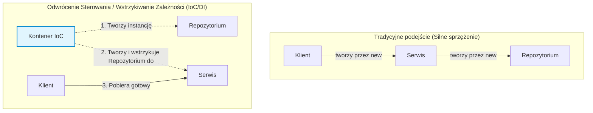

# Pytanie 1: Mechanizm wstrzykiwania zależności oraz rola i podstawowa funkcjonalność kontenera IoC.

## Kluczowe pojęcia
- **Inversion of Control (Odwrócenie sterowania - IoC)**: Ogólna zasada projektowania oprogramowania, w której kontrola nad przepływem programu zostaje przekazana zewnętrznemu frameworkowi lub kontenerowi.
- **Dependency Injection (Wstrzykiwanie zależności - DI)**: Konkretny wzorzec projektowy będący realizacją zasady IoC. Polega na dostarczaniu gotowych obiektów (zależności) z zewnątrz, zamiast tworzenia ich wewnątrz klasy korzystającej z tych obiektów.
- **Kontener IoC**: Narzędzie/biblioteka (np. Spring w Java/Kotlin, Microsoft.Extensions.DependencyInjection w .NET) odpowiedzialne za zarządzanie cyklem życia obiektów (komponentów) oraz ich automatyczne wstrzykiwanie.
- **Zależność (Dependency)**: Obiekt (serwis, repozytorium itp.), którego inna klasa potrzebuje do prawidłowego działania.

## Szczegółowe omówienie tematu

### 1. Inwersja sterowania (IoC) a Wstrzykiwanie zależności (DI)
W tradycyjnym podejściu programistycznym to klasa decyduje, kiedy i jaki obiekt utworzyć (np. używając słowa kluczowego `new`). Powoduje to silne sprzężenie (tight coupling). IoC odwraca ten schemat – to framework decyduje o tworzeniu obiektów i zarządzaniu nimi. DI to najpopularniejsza technika implementacji IoC, obok np. Service Locator lub wzorca Template Method.

### 2. Sposoby wstrzykiwania zależności (DI)
Wstrzykiwanie może odbywać się na kilka sposobów:
- **Przez konstruktor (Constructor Injection)**: Najbardziej zalecana metoda. Wszystkie wymagane zależności są przekazywane przy tworzeniu obiektu. Zapewnia niezmienność (immutability) i ułatwia testowanie (wszystkie zależności muszą być jawnie przekazane).
- **Przez metody ustawiające (Setter Injection)**: Zależności są wstrzykiwane za pomocą metod typu `setX(...)`. Przydatne dla opcjonalnych zależności, ale może prowadzić do niespójnego stanu obiektu (obiekt może zostać zainicjalizowany bez wymaganych zależności).
- **Przez pole (Field Injection)**: Bezpośrednie oznaczanie pola adnotacją (np. `@Autowired` w Springu). Niepopularyzowane i uważane za antywzorzec, ponieważ utrudnia testowanie jednostkowe (wymaga refleksji) i ukrywa rzeczywiste zależności klasy.

### 3. Rola i funkcjonalność kontenera IoC
Kontener IoC jest sercem nowoczesnych aplikacji biznesowych. Jego główne zadania to:
- **Zarządzanie cyklem życia obiektów (Lifecycle Management)**: Tworzenie instancji klas (tzw. "ziaren" / "beans" lub "services"), inicjalizacja, oraz czyszczenie zasobów przy ich niszczeniu.
- **Rozwiązywanie zależności (Dependency Resolution)**: Analiza struktury klas (np. poprzez refleksję lub metadane) i automatyczne dopasowywanie wymaganych obiektów do konstruktorów/metod.
- **Zarządzanie zasięgiem (Scope Management)**: Decydowanie o tym, jak długo dany obiekt żyje i jak jest współdzielony:
  - **Singleton**: Jedna instancja na cały kontener (domyślna dla większości kontenerów).
  - **Prototype/Transient**: Nowa instancja przy każdym żądaniu.
  - **Request**: Jedna instancja na jedno żądanie HTTP (w aplikacjach webowych).
  - **Session**: Jedna instancja na sesję użytkownika HTTP.

## Wizualizacja

Oto schemat blokowy / diagram ułatwiający zrozumienie zagadnienia:

## Podsumowanie
Stosowanie IoC i DI pozwala na tworzenie kodu o niskim stopniu sprzężenia (loose coupling), co znacząco zwiększa testowalność (łatwość mockowania zależności), modułowość i czytelność aplikacji. Kontener IoC zwalnia programistę z ręcznego tworzenia skomplikowanych drzew obiektów, automatyzując ten proces.