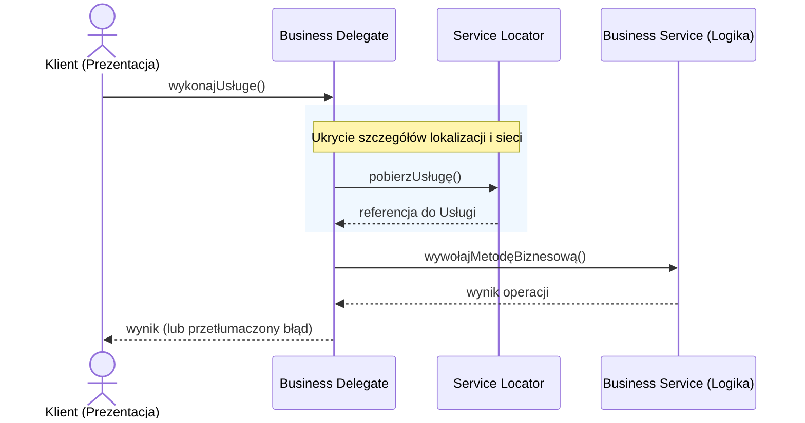

# Pytanie 3: Wzorzec architektury Business Delegate, obszar zastosowań.

## Kluczowe pojęcia
- **Business Delegate (Delegat biznesowy)**: Wzorzec projektowy warstwy prezentacji (często kojarzony ze specyfikacją Enterprise Java Beans - EJB / J2EE), którego celem jest odizolowanie warstwy prezentacji od fizycznej lokalizacji i implementacji usług biznesowych.
- **Service Locator (Lokalizator usług)**: Pomocniczy wzorzec projektowy odpowiedzialny za wyszukiwanie i pobieranie referencji do usług biznesowych (np. przy użyciu JNDI w środowiskach Java).
- **Business Service (Usługa biznesowa)**: Komponent realizujący logikę biznesową (np. Session Bean w EJB, serwis Springowy).
- **Luźne sprzężenie (Loose Coupling)**: Minimalizowanie bezpośrednich powiązań między warstwami, co ułatwia testowanie i modyfikację kodu.

## Szczegółowe omówienie tematu

### 1. Problem architektoniczny i rola Business Delegate
W złożonych systemach rozproszonych warstwa prezentacji (np. servlety, kontrolery MVC, aplikacje klienckie) musi wchodzić w interakcję z usługami biznesowymi działającymi na serwerze aplikacji. Bez stosowania delegata, kod prezentacji musiałby bezpośrednio:
- Znać API wyszukiwania usług rozproszonych (np. JNDI lookups).
- Radzić sobie ze specyficznymi wyjątkami sieciowymi (np. `RemoteException`).
- Być podatnym na zmiany w interfejsach i konfiguracji wdrożeniowej usług backendowych.

Wprowadzenie **Business Delegate** polega na stworzeniu lokalnej klasy pośredniczącej, która przejmuje te obowiązki. Warstwa prezentacji wywołuje metody na lokalnym obiekcie delegata, nie wiedząc, czy pod spodem wywoływana usługa znajduje się na tym samym serwerze, czy jest rozproszona geograficznie.

### 2. Architektura i komponenty wzorca
Wzorzec składa się z czterech głównych elementów:
1. **Client**: Warstwa prezentacji, która inicjuje żądanie.
2. **Business Delegate**: Pojedynczy punkt kontaktu dla klienta. Zapewnia kontrolę dostępu do usług biznesowych, ukrywa szczegóły techniczne wywołań zdalnych oraz obsługuje wyjątki systemowe/sieciowe.
3. **Service Locator**: Komponent używany przez `Business Delegate` do lokalizowania usług biznesowych. Odpowiada za enkapsulację logiki wyszukiwania i ewentualne buforowanie (caching) referencji do usług w celu poprawy wydajności.
4. **Business Service**: Rzeczywista usługa realizująca logikę biznesową aplikacji.

```
[ Client ] ---> [ Business Delegate ] ---> [ Service Locator ]
                       |
                       +-----------------> [ Business Service ]
```

### 3. Obszar zastosowań
- **Tradycyjne aplikacje typu Enterprise**: Systemy oparte na architekturze wielowarstwowej z fizycznie wydzielonym serwerem aplikacji i serwerem webowym.
- **Integracja z usługami zewnętrznymi**: Sytuacje, w których system integruje się z wieloma zewnętrznymi API (np. systemy płatności, kurierskie) i chcemy uchronić kod aplikacji przed zmianami w ich implementacji.
- **Zwiększenie odporności systemów rozproszonych**: Kiedy zachodzi potrzeba centralnego wdrożenia mechanizmów ponawiania prób (retry), obwodów ochronnych (circuit breaker) lub konwersji wyjątków technicznych na zrozumiałe dla użytkownika komunikaty biznesowe.

### 4. Zalety i wady
- **Zalety**:
  - Ukrycie przed klientem złożoności wyszukiwania usług i komunikacji zdalnej.
  - Zwiększenie niezależności warstw (zmiana lokalizacji usługi biznesowej nie wpływa na kod prezentacji).
  - Możliwość implementacji buforowania danych wewnątrz delegata w celu redukcji narzutu sieciowego.
- **Wady**:
  - Wprowadzenie dodatkowej, często nadmiarowej warstwy (boilerplate code) w mniejszych aplikacjach monolitycznych.
  - Potencjalne maskowanie problemów sieciowych, co może utrudnić debugowanie w skomplikowanych środowiskach.

## Wizualizacja

Oto schemat blokowy / diagram ułatwiający zrozumienie zagadnienia:



## Podsumowanie
Wzorzec Business Delegate jest kluczowym narzędziem do redukcji sprzężenia w aplikacjach o architekturze wielowarstwowej. Działa jako tarcza ochronna dla warstwy prezentacji, przejmując na siebie całą złożoność integracji sieciowej i wyszukiwania usług, co zwiększa czytelność i łatwość konserwacji kodu klienta.