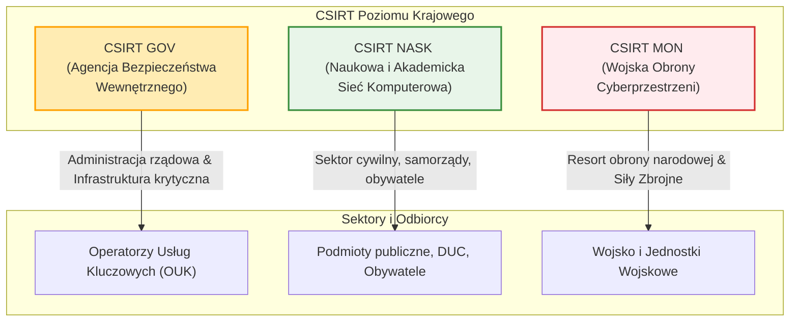

# Pytanie 5: Omów doktrynę cyberbezpieczeństwa RP - przedstaw przyjęte definicje.

## Kluczowe pojęcia
- **Doktryna Cyberbezpieczeństwa Rzeczypospolitej Polskiej**: Dokument strategiczny wydany przez Biuro Bezpieczeństwa Narodowego (BBN) we współpracy z innymi organami, określający cele, zasady i kierunki działań mających na celu zapewnienie bezpieczeństwa RP w cyberprzestrzeni.
- **Cyberbezpieczeństwo (wg ustawy o KSC)**: Odporność systemów informacyjnych na działania naruszające poufność, integralność, dostępność i autentyczność przetwarzanych danych lub powiązanych z nimi usług oferowanych przez te systemy.
- **Krajowy System Cyberbezpieczeństwa (KSC)**: Ramy organizacyjno-prawne powołane ustawą z 2018 r. w celu zapewnienia niezakłóconego świadczenia usług kluczowych i cyfrowych w państwie.
- **Incydent**: Zdarzenie, które ma lub może mieć niekorzystny wpływ na cyberbezpieczeństwo.

## Szczegółowe omówienie tematu

### 1. Geneza i cel Doktryny Cyberbezpieczeństwa RP
Doktryna Cyberbezpieczeństwa RP stanowi rozwinięcie Strategii Bezpieczeństwa Narodowego RP. Jej głównym celem jest zdefiniowanie i usystematyzowanie działań państwa w nowym wymiarze operacyjnym, jakim jest cyberprzestrzeń. Dokument ten określa:
- Zagrożenia, wyzwania oraz szanse RP w cyberprzestrzeni.
- Cele strategiczne (np. ochrona suwerenności w wymiarze cyfrowym, podnoszenie odporności infrastruktury krytycznej).
- Kierunki przygotowań obronnych i prewencyjnych (współpraca cywilno-wojskowa, partnerstwo publiczno-prywatne, edukacja społeczna).

### 2. Krajowy System Cyberbezpieczeństwa (KSC) i kluczowe podmioty
Ustawa z dnia 5 lipca 2018 r. o krajowym systemie cyberbezpieczeństwa (wdrażająca dyrektywę unijną NIS) definiuje strukturę organizacyjną odpowiedzialną za obronę cyberprzestrzeni RP. Do kluczowych podmiotów należą:

1. **Zespoły CSIRT poziomu krajowego (Computer Security Incident Response Team)**:
   - **CSIRT GOV (prowadzony przez Szefa Agencji Bezpieczeństwa Wewnętrznego)**: Odpowiada za ochronę infrastruktury administracji rządowej oraz systemów infrastruktury krytycznej.
   - **CSIRT NASK (prowadzony przez Naukową i Akademicką Sieć Komputerową)**: Odpowiada za ochronę sektora cywilnego, w tym samorządów, przedsiębiorców oraz zgłoszeń od obywateli.
   - **CSIRT MON (prowadzony przez Dowództwo Komponentu Wojsk Obrony Cyberprzestrzeni)**: Odpowiada za resort obrony narodowej oraz Siły Zbrojne RP.

2. **Operatorzy Usług Kluczowych (OUK)**:
   Podmioty z sektorów kluczowych (np. energetyka, transport, bankowość, ochrona zdrowia), których zakłócenie działania miałoby poważne konsekwencje dla państwa. Mają oni obowiązek wdrażania odpowiednich zabezpieczeń, szacowania ryzyka i zgłaszania incydentów.

3. **Dostawcy Usług Cyfrowych (DUC)**:
   Wyszukiwarki, platformy handlowe i dostawcy usług w chmurze, na których ciążą obowiązki bezpieczeństwa dostosowane do specyfiki ich działalności.

### 3. Klasyfikacja i definicje incydentów
W polskim systemie prawnym i doktrynalnym wyróżnia się trzy główne kategorie incydentów:
- **Incydent w podmiocie publicznym**: Incydent powodujący lub mogący spowodować obniżenie jakości bądź zakłócenie realizacji zadania publicznego (np. niedostępność e-usług urzędu gminy).
- **Incydent istotny**: Incydent, który ma istotny wpływ na świadczenie usługi przez dostawcę usług cyfrowych lub operatora usługi kluczowej. Kryteria istotności są ściśle określone (np. liczba dotkniętych użytkowników, czas trwania).
- **Incydent krytyczny**: Incydent skutkujący znaczną szkodą dla bezpieczeństwa lub obronności państwa, bezpieczeństwa publicznego, życia i zdrowia ludzi lub funkcjonowania instytucji państwowych (rozstrzyga o nim właściwy CSIRT poziomu krajowego).

## Wizualizacja

Oto schemat blokowy / diagram ułatwiający zrozumienie zagadnienia:

## Podsumowanie
Doktryna Cyberbezpieczeństwa RP określa podejście państwa do obrony w sieci, oparte na współpracy trójfilarowej (wojskowym, rządowym i cywilnym). System ten stawia jasne wymagania bezpieczeństwa przed podmiotami kluczowymi i publicznymi, narzucając im ścisłe ramy czasowe na zgłaszanie incydentów (zazwyczaj do 24 godzin od wykrycia) oraz nakazuje ciągłe monitorowanie zagrożeń w koordynacji z krajowymi zespołami CSIRT.