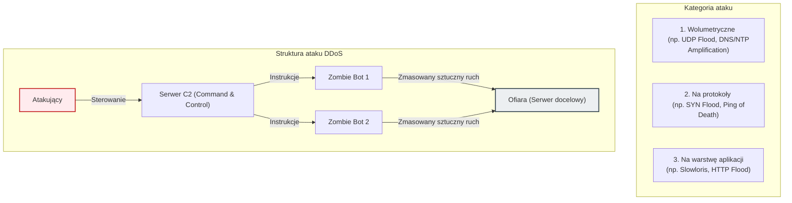

# Pytanie 7: Przedstaw ideę ataków typu DoS i krótko scharakteryzuj ich rodzaje.

## Kluczowe pojęcia
- **DoS (Denial of Service - Odmowa usługi)**: Atak mający na celu uniemożliwienie uprawnionym użytkownikom dostępu do usługi, systemu komputerowego lub sieci.
- **DDoS (Distributed Denial of Service - Rozproszona odmowa usługi)**: Odmiana ataku DoS przeprowadzana jednocześnie z wielu maszyn (często z tysięcy zainfekowanych komputerów tworzących tzw. botnet), co znacznie utrudnia obronę.
- **SYN Flood**: Atak na warstwę transportową TCP polegający na zasypywaniu serwera pakietami inicjującymi połączenie (SYN) i ignorowaniu odpowiedzi (SYN-ACK), co prowadzi do przepełnienia kolejki połączeń.
- **Slowloris**: Atak na warstwę aplikacji polegający na powolnym wysyłaniu nagłówków HTTP, co zmusza serwer do utrzymywania otwartych połączeń i wyczerpuje jego zasoby wątków.
- **Amplifikacja (Wzmocnienie ataku)**: Technika wykorzystująca publiczne usługi sieciowe (np. DNS, NTP) do zwielokrotnienia wolumenu ruchu skierowanego w ofiarę.

## Szczegółowe omówienie tematu

### 1. Idea ataków DoS i DDoS
Głównym celem ataku DoS/DDoS jest **naruszenie dostępności** (jednego z trzech filarów bezpieczeństwa informacji CIA Triad). W przeciwieństwie do włamań, intruz nie próbuje wykraść danych, lecz dąży do paraliżu infrastruktury ofiary. Paraliż ten osiąga się poprzez:
- **Przeciążenie łącza sieciowego** (ruchem sieciowym o wolumenie przekraczającym przepustowość).
- **Wyczerpanie zasobów sprzętowych** serwera (procesora, pamięci RAM, limitu otwartych plików/procesów).
- **Wykorzystanie błędów w oprogramowaniu** prowadzących do awarii systemu (tzw. crash).

---

### 2. Klasyfikacja i rodzaje ataków DoS / DDoS

Ataki DDoS dzieli się najczęściej ze względu na warstwę modelu OSI, w którą są wymierzone:

#### A. Ataki wolumetryczne (Volumetric Attacks)
Ich celem jest całkowite zapewnienie (zatkanie) dostępnego pasma sieciowego ofiary. Mierzy się je w bitach na sekundę (bps) lub pakietach na sekundę (pps).
- **UDP Flood**: Atakujący wysyła masowo pakiety UDP na losowe porty ofiary. Serwer próbuje obsłużyć te pakiety, sprawdzając, czy nasłuchuje na nich jakaś usługa, a gdy jej nie ma, generuje pakiet ICMP "Destination Unreachable", co dodatkowo obciąża procesor i łącze.
- **Ataki z amplifikacją i refleksją (np. DNS/NTP Amplification)**: Atakujący wysyła zapytania do otwartych serwerów DNS lub NTP, fałszując adres IP nadawcy (IP Spoofing) i wpisując tam adres IP ofiary. Zapytanie jest celowo małe (np. kilkadziesiąt bajtów), natomiast odpowiedź odsyłana przez serwer DNS do ofiary jest bardzo duża (np. kilka kilobajtów). Dzięki temu atakujący generuje ruch o sile wielokrotnie większej niż jego własne łącze.

#### B. Ataki na protokoły (Protocol Attacks)
Koncentrują się na wyczerpaniu zasobów systemowych urządzeń sieciowych (zapór ogniowych, load balancerów, systemów operacyjnych).
- **SYN Flood**: Atakujący wykorzystuje mechanizm nawiązywania połączenia TCP (tzw. trójstopniowy uścisk dłoni - *three-way handshake*). Wysyła pakiety `SYN` z fałszywych adresów IP. Serwer odpowiada pakietem `SYN-ACK` i rezerwuje zasoby w pamięci (w tzw. SYN Backlog), oczekując na ostateczny pakiet `ACK` od klienta. Ponieważ adresy są sfałszowane, pakiet `ACK` nigdy nie przychodzi, a zasoby serwera pozostają zablokowane do momentu przekroczenia limitu czasu (timeout).
- **Ping of Death / Smurf Attack**: Wysyłanie zniekształconych lub zbyt dużych pakietów ICMP (ping), które podczas składania po stronie odbiorcy powodują przepełnienie bufora pamięci i awarię systemu.

#### C. Ataki na warstwę aplikacji (Application Layer Attacks)
Najbardziej wyrafinowane ataki, naśladujące zachowanie legalnych użytkowników. Wymierzone są w konkretne aplikacje (np. serwery WWW WordPress, IIS, Apache). Mierzy się je w zapytaniach na sekundę (rps).
- **HTTP Flood**: Symulacja masowych żądań pobrania strony internetowej (np. `GET /`) lub wywoływania skomplikowanych obliczeniowo skryptów (np. wyszukiwarek, generowania PDF).
- **Slowloris**: Narzędzie to otwiera setki połączeń HTTP z serwerem WWW i utrzymuje je otwarte tak długo, jak to możliwe. Robi to poprzez wysyłanie niepełnych nagłówków HTTP (np. wysyła kolejny nagłówek tuż przed upływem limitu czasu serwera). Serwer rezerwuje osobny wątek dla każdego połączenia, co szybko blokuje całą pulę dostępnych wątków serwera (np. 150-250 wątków), uniemożliwiając obsługę prawdziwych klientów.

---

### 3. Metody przeciwdziałania atakom DoS / DDoS
Obrona przed atakami o dużym nasileniu jest trudna i wymaga zaawansowanych systemów:
- **SYN Cookies**: Technika obrony przed SYN Flood, w której serwer nie rezerwuje pamięci na połączenie półotwarte, lecz generuje unikalny numer sekwencyjny (cookie) w pakiecie `SYN-ACK`. Dopiero po otrzymaniu poprawnego pakietu `ACK` od klienta alokowane są zasoby.
- **Centra czyszczące (Scrubbing Centers)**: Rozwiązania dostawców chmurowych (np. Cloudflare, AWS Shield), gdzie cały ruch sieciowy przechodzi przez serwery filtrujące, które odrzucają pakiety DoS na podstawie sygnatur oraz analizy behawioralnej, wpuszczając do serwera docelowego jedynie czysty ruch.
- **Rate Limiting i WAF (Web Application Firewall)**: Ograniczanie liczby połączeń z jednego adresu IP oraz analiza reguł aplikacji (np. blokowanie ruchu wykazującego cechy narzędzi typu Slowloris).

## Wizualizacja

Oto schemat blokowy / diagram ułatwiający zrozumienie zagadnienia:

