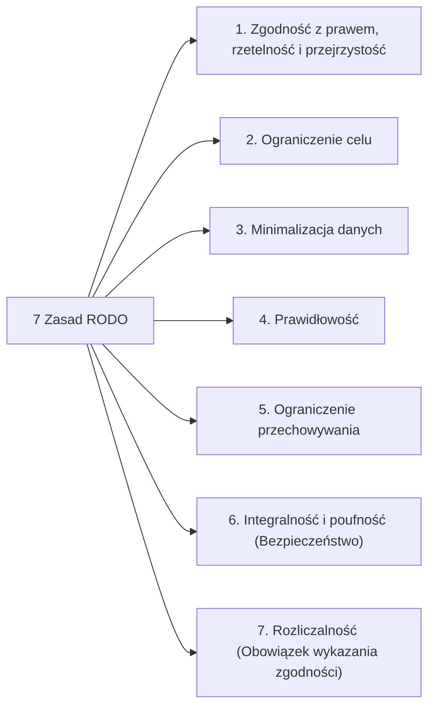

# Pytanie 8: Wymień i omów siedem zasad RODO.

## Kluczowe pojęcia
- **RODO (Rozporządzenie o Ochronie Danych Osobowych / ang. GDPR)**: Ogólne rozporządzenie unijne z 2016 r. regulujące zasady ochrony danych osobowych osób fizycznych na terenie UE.
- **Dane osobowe**: Wszelkie informacje pozwalające bezpośrednio lub pośrednio zidentyfikować osobę fizyczną (np. PESEL, e-mail, IP, dane lokalizacyjne).
- **Administrator Danych Osobowych (ADO)**: Organ, jednostka organizacyjna lub podmiot decydujący o celach i sposobach przetwarzania danych osobowych.
- **Privacy by Design**: Projektowanie systemów IT z uwzględnieniem ochrony prywatności od samego początku procesu tworzenia oprogramowania.

## Szczegółowe omówienie tematu

Artykuł 5 ust. 1 i 2 rozporządzenia RODO formułuje siedem fundamentalnych zasad, według których musi odbywać się każde przetwarzanie danych osobowych. Złamanie którejkolwiek z nich grozi wysokimi karami administracyjnymi.

---

### 1. Zgodność z prawem, rzetelność i przejrzystość
- **Zgodność z prawem (legalność)**: Dane mogą być przetwarzane tylko na podstawie przynajmniej jednej z przesłanek prawnych wymienionych w art. 6 RODO (np. dobrowolna zgoda użytkownika, konieczność wykonania umowy, obowiązek prawny ciążący na administratorze).
- **Rzetelność**: Przetwarzanie danych nie może odbywać się w sposób ukryty, manipulacyjny lub wbrew uzasadnionym oczekiwaniom osoby.
- **Przejrzystość**: Administrator ma obowiązek sformułować politykę prywatności i klauzule informacyjne prostym, zrozumiałym i łatwo dostępnym językiem (koniec z drobnym drukiem i zawiłym językiem prawniczym).

### 2. Ograniczenie celu
Dane osobowe mogą być zbierane wyłącznie w konkretnych, wyraźnych i prawnie uzasadnionych celach. Niedozwolone jest dalsze przetwarzanie danych w sposób niezgodny z tymi celami.
*Przykład*: Jeśli sklep zbiera dane adresowe w celu wysłania paczki, nie może ich bez dodatkowej zgody przekazać zewnętrznej firmie pożyczkowej do celów marketingowych.

### 3. Minimalizacja danych
Administrator może zbierać tylko te dane, które są absolutnie niezbędne do osiągnięcia celu przetwarzania. Dane muszą być adekwatne i ograniczone do minimum.
*Przykład*: Aplikacja latarki na smartfon nie powinna wymagać dostępu do lokalizacji GPS, listy kontaktów czy galerii zdjęć, gdyż narusza to zasadę minimalizacji.

### 4. Prawidłowość
Dane osobowe muszą być poprawne i w razie potrzeby aktualizowane. Administrator jest zobowiązany podjąć wszelkie działania, aby dane nieprawidłowe (np. przedawnione lub błędne) były niezwłocznie usuwane lub prostowane (np. na wniosek osoby, której dotyczą).

### 5. Ograniczenie przechowywania
Dane osobowe mogą być przechowywane w formie umożliwiającej identyfikację osoby przez okres nie dłuższy, niż jest to niezbędne do celów, w których są przetwarzane. Po tym czasie dane powinny być trwale usunięte lub zanonimizowane.
*Wyjątek*: Przetwarzanie do celów archiwalnych w interesie publicznym, do celów badań naukowych lub historycznych.

### 6. Integralność i poufność (Bezpieczeństwo)
Zasada ta nakłada na administratora obowiązek zapewnienia odpowiedniego bezpieczeństwa technicznego i organizacyjnego przetwarzanych danych. Obejmuje to m.in. ochronę przed:
- Nieautoryzowanym lub bezprawnym przetwarzaniem (dostęp osób trzecich).
- Przypadkową utratą, zniszczeniem lub uszkodzeniem.
*Metody techniczne*: Szyfrowanie (np. protokół TLS/HTTPS, szyfrowanie baz danych), pseudonimizacja danych, silna kontrola dostępu (RBAC) oraz regularne testy penetracyjne.

### 7. Rozliczalność
Jest to zasada kluczowa, spajająca pozostałe. Administrator jest nie tylko odpowiedzialny za przestrzeganie wszystkich sześciu zasad opisanych powyżej, ale musi być w stanie **wykazać (udowodnić)** ich przestrzeganie przed organem nadzorczym (w Polsce jest to UODO - Urząd Ochrony Danych Osobowych).
*Dowody rozliczalności*: Posiadanie Rejestru Czynności Przetwarzania (RCP), procedur zgłaszania wycieków (w ciągu 72 godzin), analiz ryzyka (DPIA) czy powołanie Inspektora Ochrony Danych (IOD).

## Wizualizacja

Oto schemat blokowy / diagram ułatwiający zrozumienie zagadnienia:

## Podsumowanie
Siedem zasad RODO stanowi ramy projektowe dla współczesnych inżynierów oprogramowania. Zgodnie z nimi, systemy IT powinny domyślnie chronić prywatność (**Privacy by Default** – np. domyślnie niezaznaczone zgody marketingowe) oraz wbudowywać mechanizmy ochrony danych w samą strukturę aplikacji (**Privacy by Design** – np. szyfrowanie haseł w bazie danych przy użyciu algorytmów typu bcrypt).