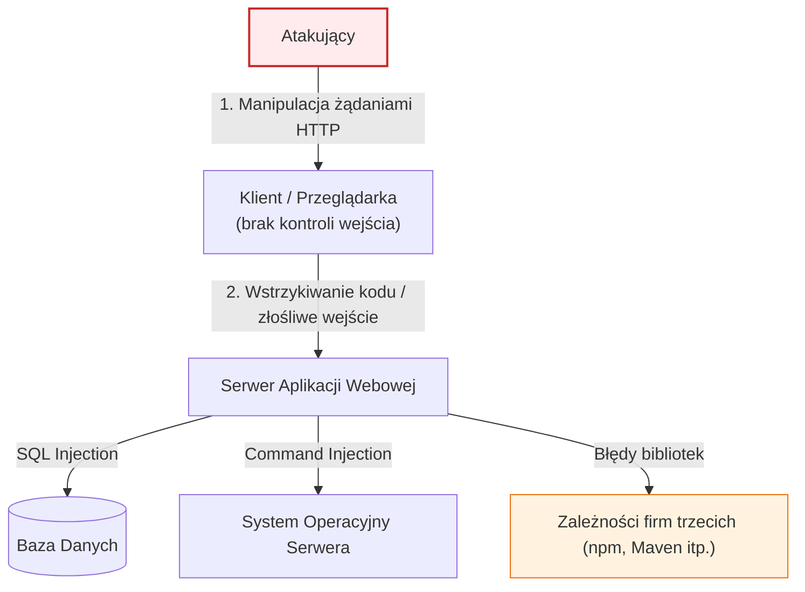

# Pytanie 9: Zdefiniuj pojęcie podatności aplikacji internetowej na ataki, podaj przykłady luk i uzasadnij dlaczego aplikacje internetowe są podatne na ataki.

## Kluczowe pojęcia
- **Podatność (Vulnerability)**: Słabość lub błąd w projekcie, implementacji, konfiguracji lub administracji systemu/aplikacji, który może zostać wykorzystany przez zagrożenie (atakującego) do naruszenia bezpieczeństwa (poufności, integralności lub dostępności).
- **OWASP Top 10**: Cyklicznie aktualizowany raport przedstawiający dziesięć najbardziej krytycznych podatności w aplikacjach internetowych.
- **Sanitacja danych**: Proces oczyszczania danych wejściowych pochodzących od użytkownika z potencjalnie złośliwych znaków lub kodu przed ich przetworzeniem przez system.
- **IDOR (Insecure Direct Object Reference)**: Podatność polegająca na braku autoryzacji dostępu do zasobu identyfikowanego kluczem (np. zmiana ID użytkownika w adresie URL umożliwia odczyt danych innej osoby).

## Szczegółowe omówienie tematu

### 1. Definicja podatności aplikacji internetowej
W kontekście aplikacji webowych, podatność to każda cecha systemu (błąd w kodzie źródłowym, niepoprawna konfiguracja serwera, brak zabezpieczeń w zewnętrznej bibliotece), która pozwala atakującemu na wykonanie nieautoryzowanych akcji. Podatności mogą prowadzić do wycieku danych, przejęcia serwera (RCE - Remote Code Execution), kradzieży sesji użytkowników lub paraliżu usługi (DoS).

---

### 2. Przykłady luk bezpieczeństwa w aplikacjach internetowych
Podatności w aplikacjach internetowych klasyfikuje się zazwyczaj w oparciu o standardy takie jak OWASP Top 10. Główne przykłady to:

- **Błędy wstrzykiwania (Injection)**: Występują, gdy dane dostarczone przez użytkownika są interpretowane przez aplikację jako polecenie. Najbardziej znanym przykładem jest **SQL Injection (SQLi)**, gdzie atakujący modyfikuje zapytanie SQL wysyłane do bazy danych. Innym przykładem jest **Command Injection** (uruchomienie poleceń powłoki systemu operacyjnego serwera).
- **Cross-Site Scripting (XSS)**: Wstrzyknięcie złośliwego skryptu JavaScript na stronę internetową wyświetlaną innym użytkownikom. Umożliwia m.in. kradzież ciasteczek sesyjnych.
- **Błędy kontroli dostępu (Broken Access Control)**: Sytuacja, w której aplikacja nie weryfikuje poprawnie uprawnień użytkownika do wykonania określonej akcji lub odczytu zasobu. Przykładem jest wspomniany **IDOR** lub możliwość wejścia do panelu administratora bez logowania przez bezpośrednie wpisanie adresu URL `/admin`.
- **Niewłaściwa konfiguracja zabezpieczeń (Security Misconfiguration)**: Pozostawienie domyślnych haseł do baz danych, włączona konsola debugowania na produkcji, brak nagłówków bezpieczeństwa (np. Content Security Policy - CSP) lub wystawienie na świat wrażliwych plików konfiguracyjnych (np. `.git`, `.env`).
- **CSRF (Cross-Site Request Forgery)**: Wymuszenie na przeglądarce zalogowanego użytkownika wykonania niechcianej akcji (np. zmiana hasła, transfer środków) na podatnej witrynie bez jego wiedzy.

---

### 3. Dlaczego aplikacje internetowe są podatne na ataki?
Aplikacje internetowe stanowią główny cel cyberataków z kilku kluczowych powodów:

1. **Dostępność z każdego miejsca na świecie**: Aplikacje webowe muszą być otwarte dla użytkowników (porty 80 i 443 są zawsze otwarte na zaporach sieciowych). Oznacza to, że każdy, w tym potencjalny atakujący z dowolnego zakątka globu, ma bezpośredni dostęp do punktu wejścia aplikacji.
2. **Architektura klient-serwer i brak kontroli nad klientem**: Kod frontendu (HTML/JS) jest w pełni kontrolowany przez użytkownika. Atakujący może dowolnie modyfikować żądania HTTP, nagłówki, ciasteczka czy parametry formularza za pomocą narzędzi deweloperskich lub proxy (np. Burp Suite). Zabezpieczenia zaimplementowane wyłącznie po stronie klienta są bezużyteczne.
3. **Złożoność techniczna i łańcuch dostaw (Software Supply Chain)**: Współczesne aplikacje webowe korzystają z tysięcy zewnętrznych pakietów (np. npm, Maven, NuGet). Błąd w jednej małej bibliotece (przykład podatności w bibliotece `Log4j` w Javie) natychmiast czyni podatną całą aplikację.
4. **Presja biznesowa i brak edukacji**: Często priorytetem w projektach IT jest czas dostarczenia na rynek (*time-to-market*). Programiści skupiają się na funkcjonalnościach biznesowych, a nie na bezpieczeństwie. Dodatkowo, brak systematycznego szkolenia z zakresu bezpiecznego kodowania (*Secure Coding*) sprawia, że w kodzie powielane są te same klasyczne błędy.

## Wizualizacja

Oto schemat blokowy / diagram ułatwiający zrozumienie zagadnienia:

## Podsumowanie
Podatności są stałym elementem cyklu życia oprogramowania. Zapewnienie bezpieczeństwa aplikacji internetowej nie jest jednorazowym zadaniem, ale ciągłym procesem (DevSecOps), który obejmuje automatyczne testy kodu (SAST/DAST), walidację wszystkich danych wejściowych po stronie serwera oraz regularne audyty i testy penetracyjne.