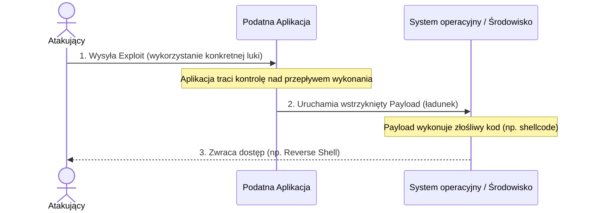

# Pytanie 10: Zdefiniuj pojęcie exploit i payload w kontekście ataków na aplikacje internetowe, podaj przykłady narzędzi do tworzenia exploitów oraz wykrywania podatności w aplikacjach internetowych.

## Kluczowe pojęcia
- **Exploit**: Kod, program lub sekwencja danych wykorzystująca lukę bezpieczeństwa (podatność) w oprogramowaniu w celu wywołania nieoczekiwanego lub niezamierzonego zachowania (np. przejęcie kontroli nad wątkiem procesora).
- **Payload (Ładunek)**: Właściwa część kodu złośliwego (np. shellcode), która jest dostarczana i wykonywana na maszynie ofiary po pomyślnym zadziałaniu exploita.
- **Skaner podatności (Vulnerability Scanner)**: Narzędzie automatyzujące proces wykrywania podatności w systemach, sieciach i aplikacjach.
- **DAST (Dynamic Application Security Testing)**: Testowanie bezpieczeństwa aplikacji w fazie uruchomieniowej (od zewnątrz), bez dostępu do kodu źródłowego.

## Szczegółowe omówienie tematu

### 1. Definicja: Exploit a Payload
W teorii bezpieczeństwa komputerowego te dwa pojęcia reprezentują dwa różne etapy ataku:

- **Exploit (Wykorzystanie podatności)**:
  Jest to "klucz" lub "narzędzie" otwierające zamknięte drzwi. Exploit ma za zadanie oszukać aplikację lub system operacyjny, wykorzystując konkretny błąd (np. przepełnienie bufora, brak walidacji wejścia w zapytaniu SQL). Sam exploit nie realizuje ostatecznego celu atakującego (np. nie pobiera plików, nie szyfruje dysku) – jego zadaniem jest jedynie zmanipulowanie programu tak, aby pozwolił na uruchomienie kodu zewnętrznego.
  
- **Payload (Ładunek)**:
  Jest to właściwe działanie, które atakujący chce podjąć po przełamaniu zabezpieczeń. Payload jest wykonywany dzięki temu, że exploit przejął kontrolę nad przepływem programu. Przykłady payloadów:
    - *Reverse Shell*: Zmuszenie serwera do nawiązania połączenia zwrotnego z komputerem atakującego i udostępnienia linii poleceń.
    - *Downloader*: Skrypt, który pobiera i instaluje w systemie kolejne moduły malware.
    - *Exfiltration Payload*: Kod mający na celu odczytanie bazy danych i przesłanie jej na zewnątrz.

---

### 2. Narzędzia do tworzenia exploitów i automatyzacji ataków
Tworzenie i uruchamianie exploitów w celach testowych (lub przestępczych) jest ułatwiane przez gotowe frameworki:

- **Metasploit Framework**: Najpopularniejsza platforma typu open-source ułatwiająca testy penetracyjne. Zawiera bazę tysięcy gotowych exploitów i payloadów (w tym zaawansowany payload *Meterpreter*). Pozwala użytkownikowi wybrać podatność, dopasować do niej odpowiedni ładunek, a następnie przeprowadzić automatyczny atak.
- **Exploit-DB**: Internetowe repozytorium gromadzące publicznie dostępne kody exploitów i dokumentacje podatności (PoC - Proof of Concept).
- **Python / Bash / C**: Języki programowania najczęściej używane do pisania dedykowanych exploitów (np. manipulujących surowymi pakietami sieciowymi za pomocą biblioteki `scapy`).

---

### 3. Narzędzia do wykrywania podatności w aplikacjach internetowych
Bezpieczeństwo aplikacji weryfikuje się za pomocą narzędzi do analizy dynamicznej (DAST), statycznej (SAST) oraz narzędzi typu intercepting proxy:

#### A. Narzędzia typu Intercepting Proxy (do testów manualnych i automatycznych):
Działają jako pośrednik między przeglądarką testera a serwerem aplikacji, umożliwiając przechwytywanie, analizę i modyfikowanie ruchu HTTP/HTTPS "w locie":
- **Burp Suite (Community/Professional/Enterprise)**: De facto standard w branży cybersecurity. Posiada zaawansowany moduł *Repeater* (do ręcznego modyfikowania żądań i wysyłania ich ponownie), *Intruder* (do automatyzacji ataków słownikowych i fuzzingu) oraz automatyczny skaner podatności (w wersji płatnej).
- **OWASP ZAP (Zed Attack Proxy)**: Bezpłatny, otwartoźródłowy odpowiednik Burp Suite wspierany przez organizację OWASP. Świetnie nadaje się do integracji ze środowiskiem CI/CD (automatyczne testy bezpieczeństwa przy każdym wdrożeniu).

#### B. Automatyczne skanery podatności (DAST):
Skanują aplikację poprzez wysyłanie tysięcy złośliwych zapytań (np. prób SQLi, XSS) i badanie odpowiedzi serwera:
- **Acunetix**: Zaawansowany, komercyjny skaner wyspecjalizowany w wykrywaniu podatności webowych.
- **Nessus**: Globalny skaner podatności sieciowych, potrafiący wykryć niepoprawne konfiguracje serwerów, przestarzałe usługi oraz otwarte porty.

#### C. Narzędzia analizy statycznej kodu (SAST):
Badają kod źródłowy aplikacji pod kątem błędów bezpieczeństwa zanim zostanie ona uruchomiona:
- **SonarQube / Semgrep**: Skanują repozytoria kodu źródłowego w poszukiwaniu podatności (np. zahardkodowane hasła, brak walidacji parametrów wejściowych).

## Wizualizacja

Oto schemat blokowy / diagram ułatwiający zrozumienie zagadnienia:

## Podsumowanie
W cyberbezpieczeństwie narzędzia są obosieczne. Te same skanery (np. OWASP ZAP) i frameworki (np. Metasploit) są wykorzystywane przez administratorów i pentesterów (tzw. *White Hat*) do zabezpieczania systemów, jak i przez cyberprzestępców (*Black Hat*) do wyszukiwania celów i przeprowadzania ataków. Skuteczna obrona wymaga regularnego audytowania aplikacji za pomocą tych narzędzi w celu usunięcia luk przed ich publicznym ujawnieniem.