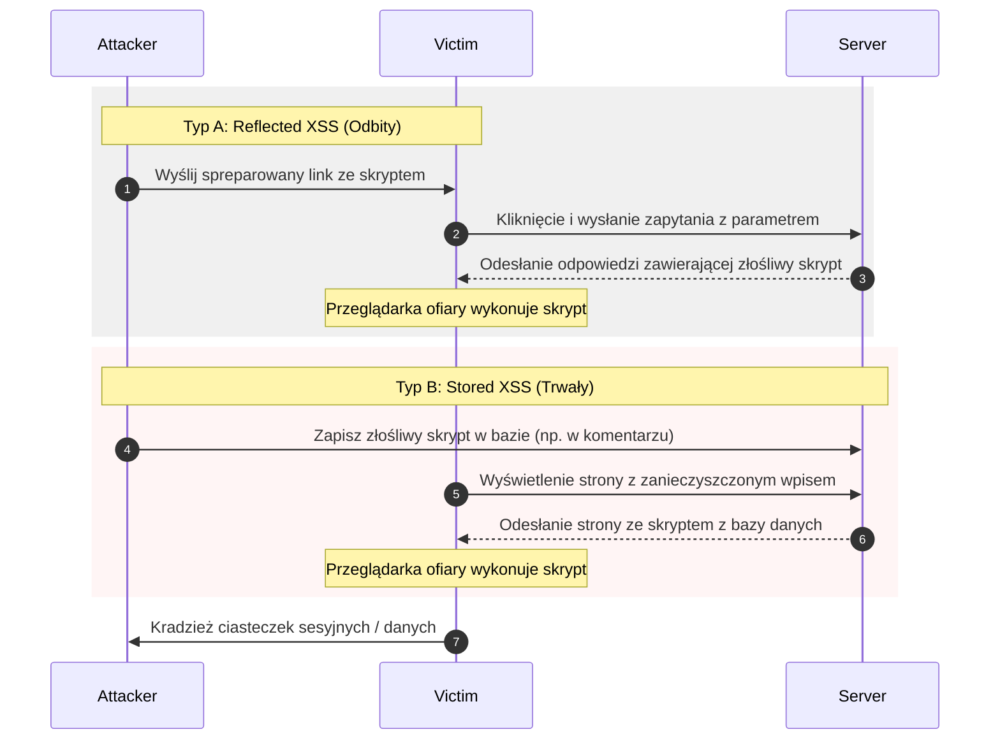

# Pytanie 11: Zdefiniuj atak Cross-Site Scripting na aplikację internetową, podaj typy ataków XSS oraz przykłady kontekstów ataków i metod obrony przed nimi.

## Kluczowe pojęcia
- **Cross-Site Scripting (XSS)**: Podatność aplikacji internetowej polegająca na wstrzyknięciu złośliwego kodu (najczęściej JavaScript) do zaufanej witryny, który jest następnie wykonywany w przeglądarce użytkownika.
- **SOP (Same-Origin Policy)**: Podstawowy mechanizm bezpieczeństwa przeglądarek blokujący skryptom z jednej domeny dostęp do zasobów (np. ciasteczek) innej domeny. XSS pozwala na obejście SOP, ponieważ złośliwy skrypt uruchamia się "w imieniu" zaufanej domeny.
- **Content Security Policy (CSP)**: Nagłówek HTTP określający zasady ładowania i wykonywania skryptów oraz innych zasobów przez przeglądarkę.
- **HttpOnly**: Atrybut ciasteczka HTTP uniemożliwiający dostęp do niego z poziomu kodu JavaScript.

## Szczegółowe omówienie tematu

### 1. Istota ataku XSS
XSS występuje, gdy aplikacja przyjmuje dane od użytkownika (np. pole wyszukiwania, komentarz) i umieszcza je w strukturze dokumentu HTML generowanego dla odbiorców bez uprzedniej walidacji, oczyszczenia (sanitacji) lub zakodowania znaków specjalnych. Z perspektywy przeglądarki złośliwy skrypt JavaScript wygląda jak integralna część strony internetowej i wykonuje się z pełnymi uprawnieniami zalogowanego użytkownika (ma dostęp do pamięci sesji, ciasteczek, formularzy).

---

### 2. Typy ataków XSS

Wyróżnia się trzy główne odmiany XSS:

#### A. Stored XSS (XSS utrwalony / zapisany):
Złośliwy skrypt jest trwale zapisywany w bazie danych serwera (lub w plikach, rejestrach).
- *Przebieg*: Atakujący wysyła formularz (np. dodanie opinii o produkcie) zawierający kod ``. Serwer zapisuje go w bazie. Każdy kolejny użytkownik odwiedzający podstronę z opiniami pobiera ten kod z bazy, a jego przeglądarka go uruchamia.
- *Zagrożenie*: Jest to najgroźniejsza odmiana, gdyż może zainfekować tysiące użytkowników bez konieczności interakcji z nimi.

#### B. Reflected XSS (XSS odbity / nietrwały):
Złośliwy skrypt nie jest zapisywany na serwerze. Jest przesyłany w parametrach żądania HTTP (np. w adresie URL) i natychmiast "odbijany" w kodzie wygenerowanej strony.
- *Przebieg*: Atakujący tworzy link: `http://bank.pl/szukaj?query=` i wysyła go ofierze (np. poprzez e-mail). Gdy ofiara kliknie w link, serwer generuje stronę z komunikatem: *Wyniki wyszukiwania dla: *. Przeglądarka uruchamia wstrzyknięty skrypt.

#### C. DOM-based XSS (XSS w strukturze DOM):
W tej odmianie podatność tkwi w całości po stronie klienta (w kodzie JavaScript uruchamianym w przeglądarce). Serwer nie bierze udziału w generowaniu podatnej odpowiedzi.
- *Przebieg*: Kod JavaScript na stronie pobiera dane bezpośrednio ze struktury DOM (np. z fragmentu URL po znaku `#`, czyli `location.hash`) i niebezpiecznie wstawia je do strony (np. używając metody `document.write(location.hash)` lub właściwości `.innerHTML`).

---

### 3. Konteksty ataków (Contexts)
Sposób wstrzyknięcia skryptu zależy od tego, w które miejsce kodu HTML trafiają dane użytkownika:
- **Kontekst HTML Body**: Dane wstawiane bezpośrednio między tagami (`
dane
`). Atakujący wstrzykuje tagi ``. Atakujący wstrzykuje: `'; alert(1); //`.

---

### 4. Metody obrony przed XSS
Obrona przed XSS polega na uniemożliwieniu przeglądarce interpretowania danych tekstowych jako kodu wykonywalnego:

1. **Kodowanie znaków wyjściowych (Output Encoding / Escaping) dostosowane do kontekstu**:
   Wszelkie dane przed wstawieniem do dokumentu HTML muszą zostać przekształcone tak, aby znaki specjalne były traktowane jako zwykły tekst.
   - W kontekście HTML: `<` zamieniamy na `&lt;`, `>` na `&gt;`, `&` na `&amp;`.
   - W kontekście atrybutów: `"` zamieniamy na `&quot;`, `'` na `&#x27;`.
   Większość współczesnych frameworków frontendowych (React, Angular, Vue) oraz silników szablonów backendowych (np. Thymeleaf) domyślnie koduje dane wyjściowe automatycznie.

2. **Sanitacja HTML**:
   Gdy aplikacja musi dopuszczać formatowany tekst HTML (np. w edytorach tekstu bloga), nie wolno stosować prostego kodowania. Należy użyć sprawdzonej biblioteki parsującej (np. **DOMPurify**), która analizuje strukturę HTML i usuwa niebezpieczne elementy (tagi `<script>`, `<iframe>`, atrybuty `onload`, `onerror`), przepuszczając jedynie bezpieczny kod (np. `<b>`, `<i>`, `
`).

3. **Flaga HttpOnly dla ciasteczek sesyjnych**:
   Oznaczenie ciasteczka identyfikatora sesji flagą `HttpOnly` sprawia, że próba jego odczytu przez `document.cookie` w JavaScript zwróci pusty ciąg. Nawet przy udanym ataku XSS, napastnik nie będzie mógł bezpośrednio ukraść sesji ofiary.

4. **Wdrożenie Content Security Policy (CSP)**:
   Nagłówek HTTP, który instruuje przeglądarkę, skąd może pobierać i uruchamiać skrypty. Przykładowo, polityka `Content-Security-Policy: default-src 'self';` zablokuje uruchamianie jakichkolwiek skryptów wplecionych bezpośrednio w kod HTML (tzw. inline scripts) oraz skryptów z zewnętrznych, niezaufanych domen.

## Wizualizacja

Oto schemat blokowy / diagram ułatwiający zrozumienie zagadnienia:

