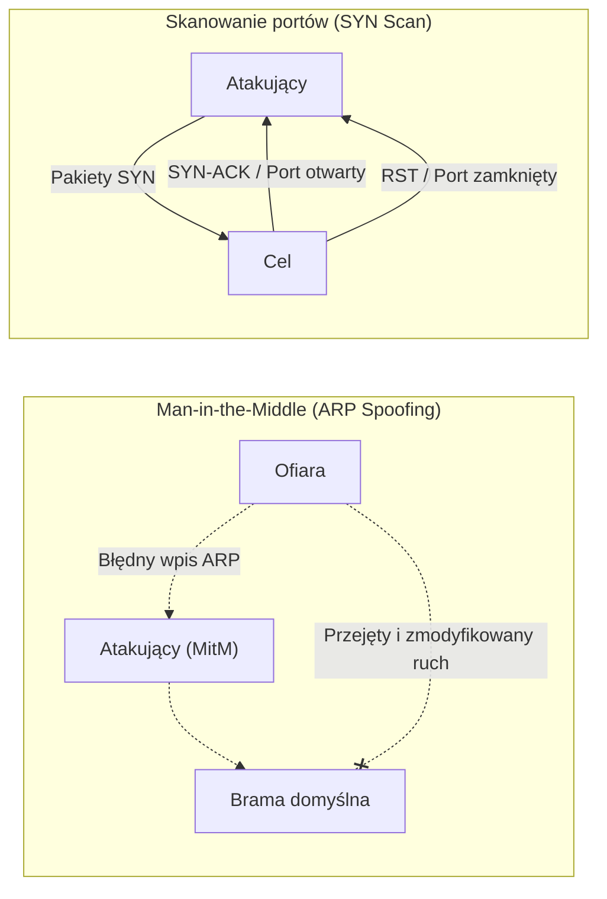

# Pytanie 13: Scharakteryzuj trzy techniki ataków stosowanych w sieciach komputerowych.

## Kluczowe pojęcia
- **ARP Spoofing (Zatruwanie tablicy ARP)**: Wysyłanie fałszywych komunikatów ARP w sieci lokalnej (LAN) w celu powiązania adresu IP ofiary (lub bramy) z adresem MAC karty sieciowej atakującego.
- **DNS Spoofing (Zatruwanie pamięci podręcznej DNS)**: Atak polegający na modyfikacji wpisów w pamięci podręcznej serwera DNS, co skutkuje przekierowaniem użytkownika na fałszywy adres IP.
- **IP Spoofing (Fałszowanie adresu IP)**: Tworzenie pakietów IP z fałszywym adresem źródłowym w nagłówku, mające na celu ukrycie tożsamości nadawcy lub ominięcie zabezpieczeń sieciowych.
- **Man-in-the-Middle (MitM)**: Atak polegający na przechwytywaniu komunikacji sieciowej między dwoma punktami bez wiedzy i zgody uczestników.

## Szczegółowe omówienie tematu

Wiele protokołów sieciowych (takich jak ARP, DNS czy bazowy protokół IP) zostało zaprojektowanych w czasach, gdy sieć była środowiskiem zaufanym. Brak mechanizmów uwierzytelniania w tych protokołach jest podstawą większości współczesnych ataków sieciowych. Poniżej scharakteryzowano trzy kluczowe techniki takich ataków.

---

### Technika 1: ARP Spoofing (Zatruwanie ARP / ARP Cache Poisoning)
- **Zasada działania**: 
  Protokół ARP służy w sieciach lokalnych do tłumaczenia adresów IP (warstwa 3) na fizyczne adresy MAC (warstwa 2). Gdy urządzenie chce wysłać dane do innego komputera w tej samej sieci, wysyła zapytanie ARP: *Kto ma IP X.X.X.X?*. Urządzenia nie weryfikują odpowiedzi i akceptują również zapytania nieproszone (*gratuitous ARP*). Atakujący wysyła do ofiary fałszywy pakiet ARP informujący, że adres IP bramy domyślnej (routera) ma teraz adres MAC atakującego. Jednocześnie wysyła do routera informację, że adres IP ofiary ma adres MAC atakującego.
- **Skutki**:
  Cały ruch sieciowy wymieniany między komputerem ofiary a siecią zewnętrzną przechodzi przez komputer atakującego. Umożliwia to przeprowadzenie ataku **Man-in-the-Middle (MitM)**, podsłuchiwanie nieszyfrowanego ruchu (np. haseł przesyłanych przez HTTP, FTP) oraz modyfikację danych w locie.
- **Metody obrony**:
  - Wdrożenie funkcji **DAI (Dynamic ARP Inspection)** na przełącznikach sieciowych (switche Cisco itp.), która weryfikuje poprawność pakietów ARP na podstawie bazy DHCP Snooping.
  - Statyczne wpisywanie adresów MAC bramy w konfiguracji urządzeń.

---

### Technika 2: DNS Spoofing (DNS Cache Poisoning / Zatruwanie DNS)
- **Zasada działania**:
  Serwer DNS tłumaczy nazwy domenowe (np. `bank.pl`) na adresy IP. Aby przyspieszyć działanie, serwery DNS przechowują odpowiedzi w pamięci podręcznej (cache). DNS Spoofing polega na wprowadzeniu do tej pamięci fałszywego rekordu. Atakujący wysyła do serwera DNS zapytanie o domenę i natychmiast zalewa go tysiącami fałszywych odpowiedzi (zanim nadejdzie odpowiedź od autorytatywnego serwera), zgadując numer identyfikacyjny zapytania (Transaction ID).
- **Skutki**:
  Kiedy legalny użytkownik próbuje wejść na stronę `bank.pl`, zainfekowany serwer DNS zwraca adres IP serwera kontrolowanego przez atakującego. Użytkownik widzi w przeglądarce poprawną domenę, ale treść strony (np. formularz logowania) jest w pełni kontrolowana przez przestępcę (phishing).
- **Metody obrony**:
  - Wdrożenie protokołu **DNSSEC** (rozszerzenie DNS wykorzystujące podpisy cyfrowe w celu weryfikacji autentyczności odpowiedzi).
  - Szyfrowanie ruchu DNS za pomocą **DoH** (DNS over HTTPS) lub **DoT** (DNS over TLS).

---

### Technika 3: IP Spoofing (Fałszowanie adresu IP)
- **Zasada działania**:
  Protokół IP nie weryfikuje, czy adres źródłowy wpisany w nagłówku pakietu rzeczywiście należy do nadawcy. Atakujący ręcznie modyfikuje nagłówek pakietu, wpisując tam inny (np. zaufany wewnątrz danej sieci) adres IP. Jest to atak typu "wyślij i zapomnij", ponieważ wszelkie odpowiedzi na sfałszowany pakiet trafią do ofiary, której adres został wpisany, a nie do prawdziwego atakującego.
- **Skutki**:
  - Ominięcie systemów autoryzacji opartych wyłącznie na adresacji IP (np. zapór sieciowych zezwalających na ruch tylko z określonych adresów).
  - Wykorzystanie w atakach DDoS typu **Reflection/Amplification** – atakujący wysyła zapytania do serwerów DNS/NTP, podając jako nadawcę adres IP ofiary. Odpowiedzi serwerów o ogromnym wolumenie trafiają bezpośrednio w cel, paraliżując jego działanie.
- **Metody obrony**:
  - Konfiguracja reguł **Egress/Ingress Filtering** na routerach brzegowych (blokowanie pakietów wychodzących z sieci lokalnej, które mają adresy źródłowe spoza tej sieci, oraz pakietów wchodzących mających adresy źródłowe z wewnątrz – standard **BCP 38**).
  - Stosowanie mechanizmu **uRPF** (Unicast Reverse Path Forwarding).

## Wizualizacja

Oto schemat blokowy / diagram ułatwiający zrozumienie zagadnienia:

