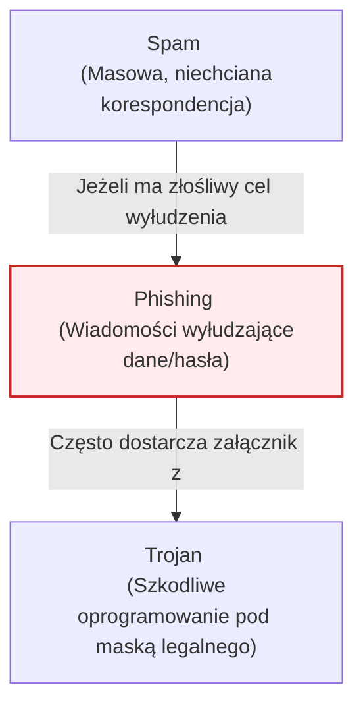

# Pytanie 16: Zdefiniuj pojęcia: Phishing, Spam, Trojan.

## Kluczowe pojęcia
- **Phishing**: Technika wyłudzania poufnych informacji oparta na inżynierii społecznej.
- **Spam**: Masowo wysyłane niechciane wiadomości elektroniczne.
- **Trojan (Koń trojański)**: Złośliwe oprogramowanie ukryte pod maską pożytecznej aplikacji, wymagające interakcji użytkownika do uruchomienia.
- **Malware**: Ogólne określenie na złośliwe oprogramowanie (w tym trojany).

## Szczegółowe omówienie tematu

Choć te trzy pojęcia często występują razem w kontekście cyberzagrożeń, odnoszą się do zupełnie innych elementów: metody ataku, sposobu komunikacji oraz rodzaju złośliwego kodu.

---

### 1. Phishing (Wędkarstwo)
- **Definicja**: 
  Jest to metoda cyberataku oparta na manipulacji psychologicznej (socjotechnice). Atakujący podszywa się pod wiarygodną instytucję (np. bank, urząd skarbowy, firmę kurierską, dostawcę poczty e-mail) w celu skłonienia ofiary do ujawnienia wrażliwych informacji, takich jak loginy i hasła, dane kart kredytowych lub numery PESEL.
- **Mechanizm działania**: 
  Ofiara otrzymuje wiadomość (np. e-mail lub SMS – tzw. *Smishing*) zawierającą informację o pilnej potrzebie podjęcia działania (np. "Twoja paczka została wstrzymana z powodu niedopłaty 1.50 zł"). Wiadomość zawiera link kierujący do sfałszowanej strony internetowej, która wizualnie nie różni się od oryginalnej witryny instytucji. Wpisane tam dane trafiają bezpośrednio do rąk przestępcy.
- **Odmiany**: 
  *Spear phishing* (atak celowany w konkretną osobę), *Whaling* (atak na osoby decyzyjne, np. zarząd firmy).

---

### 2. Spam
- **Definicja**: 
  Niezamówione wiadomości elektroniczne (najczęściej e-mail, ale również wiadomości na komunikatorach czy SMS-y) rozsyłane masowo do bardzo dużej liczby odbiorców jednocześnie.
- **Cechy charakterystyczne**:
  - **Masowość**: Ta sama wiadomość trafia do tysięcy lub milionów użytkowników.
  - **Brak zgody**: Odbiorcy nie wyrazili chęci otrzymywania tych treści.
  - **Anonimowość**: Nadawca często maskuje swoją tożsamość i fałszuje nagłówki wiadomości.
- **Zagrożenie**: 
  Większość spamu ma charakter reklamowy (np. kasyna online, leki bez recepty). Jednak spam jest również głównym wektorem rozprzestrzeniania złośliwego oprogramowania oraz phishingu – złośliwe wiadomości są często maskowane jako spam w nadziei, że ułamek procenta odbiorców otworzy załącznik (np. plik ZIP udający fakturę).

---

### 3. Trojan (Koń trojański / Trojan Horse)
- **Definicja**: 
  Rodzaj złośliwego oprogramowania (malware), które maskuje swoje prawdziwe szkodliwe przeznaczenie pod postacią legalnego i użytecznego programu. Nazwa wprost nawiązuje do mitu o zdobyciu Troi.
- **Mechanizm działania**: 
  W przeciwieństwie do wirusów i robaków, trojan **nie potrafi samodzielnie się replikować** ani infekować innych plików. Aby zainfekować system, potrzebuje interakcji ze strony użytkownika – użytkownik musi sam pobrać i uruchomić dany plik (np. pobrać fałszywy odtwarzacz wideo wymagany do obejrzenia filmu, zainstalować darmową grę z nieoficjalnego źródła lub uruchomić "generator kluczy" - crack).
- **Szkodliwy ładunek (Payload)**: 
  Po uruchomieniu, trojan potajemnie instaluje swój złośliwy kod w tle. Najczęstsze rodzaje trojanów to:
    - **RAT (Remote Access Trojan)**: Daje atakującemu pełny, zdalny dostęp do komputera ofiary.
    - **Trojan bankowy**: Podmienia numery kont w schowku systemowym lub wstrzykuje fałszywe panele logowania do przeglądarek internetowych.
    - **Backdoor**: Tworzy ukrytą furtkę umożliwiającą późniejsze zalogowanie się atakującego do systemu.

---

### Zależności między pojęciami – Scenariusz ataku
Współczesne ataki łączą te elementy w łańcuch infekcji:
```
[ SPAM ] (Kanał wysyłki) -> Masowa wysyłka e-maili
     |
[ PHISHING ] (Treść/Metoda) -> E-mail udaje fakturę od operatora i nakłania do pobrania pliku
     |
[ TROJAN ] (Złośliwy kod) -> Użytkownik uruchamia plik, który potajemnie przejmuje komputer (RAT)
```

## Wizualizacja

Oto schemat blokowy / diagram ułatwiający zrozumienie zagadnienia:


