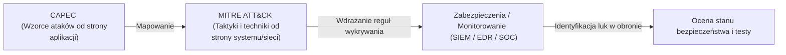

# Pytanie 21: Omów rolę bibliotek ataków na systemy komputerowe w procesie zapewniania ich bezpieczeństwa.

## Kluczowe pojęcia
- **Biblioteka ataków (Attack Library / Knowledge Base)**: Ustrukturyzowana, publiczna lub wewnętrzna baza wiedzy opisująca zachowania, techniki, taktyki i metody działania rzeczywistych cyberprzestępców (np. MITRE ATT&CK, CAPEC).
- **TTP (Tactics, Techniques, and Procedures)**: Taktyki (cel pośredni, np. kradzież haseł), Techniki (metoda realizacji, np. zrzut pamięci LSASS) i Procedury (konkretne wykonanie za pomocą danego narzędzia) stosowane przez napastników.
- **MITRE ATT&CK**: Globalnie uznawana macierz i baza wiedzy opisująca techniki ataków na podstawie rzeczywistych obserwacji incydentów na świecie.
- **CAPEC (Common Attack Pattern Enumeration and Classification)**: Klasyfikacja wzorców ataków skupiona głównie na słabościach i lukach w oprogramowaniu (aplikacjach).

## Szczegółowe omówienie tematu

### 1. Geneza i cel powstania bibliotek ataków
Przez wiele lat obrona systemów komputerowych opierała się na wykrywaniu **Wskaźników Kompromitacji (IoC - Indicators of Compromise)**, takich jak adresy IP serwerów C2, nazwy domenowe czy sumy kontrolne (hashe MD5/SHA256) złośliwych plików. Atakujący nauczyli się jednak niezwykle szybko modyfikować te parametry (np. kompilować złośliwy plik na nowo, co zmienia jego hash), przez co tradycyjne antywirusy stawały się bezradne.

Rozwiązaniem stało się skupienie na **behawiorze (zachowaniu)** napastników. Biblioteki ataków powstały po to, aby skatalogować i opisać **TTP (Taktyki, Techniki i Procedury)**. Zmiana zachowania (np. metody eskalacji uprawnień) wymaga od napastnika znacznie więcej wysiłku i czasu niż zmiana adresu IP czy hashu pliku (koncepcja ta opisywana jest tzw. *Piramidą Bólu* - *Pyramid of Pain* autorstwa Davida Bianco).

---

### 2. Główne przykłady bibliotek ataków

#### A. MITRE ATT&CK (Adversarial Tactics, Techniques, and Common Knowledge)
To de facto standard branżowy. Reprezentuje model macierzowy podzielony na:
- **Taktyki (Tactics)**: Reprezentują cel biznesowy ataku (np. *Initial Access* – uzyskanie dostępu, *Persistence* – utrzymanie dostępu, *Lateral Movement* – poruszanie się po sieci lokalnej, *Exfiltration* – kradzież danych).
- **Techniki (Techniques)**: Sposób, w jaki atakujący realizuje daną taktykę (np. w ramach taktyki *Initial Access* techniką jest *Phishing*).
- **Podtechniki (Sub-techniques)**: Dokładniejszy opis techniki (np. w ramach techniki *Phishing* podtechniką jest *Spearphishing Attachment* – załącznik phishingowy).
- **Procedury (Procedures)**: Konkretne wdrożenie techniki przez zidentyfikowane grupy APT (Advanced Persistent Threat) lub oprogramowanie (np. „Grupa APT28 użyła zainfekowanego dokumentu Word w celu wdrożenia malware X”).

#### B. CAPEC (Common Attack Pattern Enumeration and Classification)
Zbiór wzorców ataków dedykowany dla inżynierów oprogramowania (AppSec). Opisuje typowe mechanizmy atakowania aplikacji (np. SQL Injection, Cross-Site Scripting, OS Command Injection), wskazując słabe punkty w kodzie i sposoby obrony przed nimi.

---

### 3. Rola bibliotek w procesie zapewniania bezpieczeństwa
Wdrożenie bibliotek ataków do procesów bezpieczeństwa organizacji (podejście *Threat-Informed Defense*) niesie za sobą kluczowe korzyści:

1. **Projektowanie systemów detekcji (SOC / SIEM / EDR)**:
   Zamiast pisać reguły wykrywania dla konkretnych plików, analitycy SOC piszą reguły behawioralne oparte na technikach ATT&CK. Przykładowo, reguła może generować alert, gdy *„dowolny proces inny niż systemowy próbuje uzyskać dostęp do odczytu procesu lsass.exe”* (jest to technika zrzucania poświadczeń z pamięci Windows - T1003.001).

2. **Analiza luk w obronie (Gap Analysis)**:
   Organizacja może zmapować posiadane systemy bezpieczeństwa na macierz ATT&CK. Ujawnia to natychmiast, na jakie techniki ataków system jest odporny (np. posiada antywirusa blokującego technikę X), a gdzie występują „ślepe plamy” (brak jakiejkolwiek detekcji dla techniki Y).

3. **Emulacja ataków i Purple Teaming (Testowanie)**:
   Zespoły testujące bezpieczeństwo (Red Team) używają TTP z bibliotek do symulowania rzeczywistych scenariuszy włamań (np. "Dzisiaj emulujemy grupę APT29 i sprawdzamy, czy nasz Blue Team wykryje ich techniki"). Pozwala to na realną ocenę skuteczności obrony.

4. **Wymiana wiedzy o zagrożeniach (Cyber Threat Intelligence - CTI)**:
   Biblioteki dają jednolity, znormalizowany słownik pojęć. Dzięki temu raporty o nowych zagrożeniach publikowane na świecie mogą od razu referować do konkretnych numerów technik (np. T1190 – Exploit Public-Facing Application), co ułatwia automatyzację i konfigurację systemów ochronnych.

## Wizualizacja

Oto schemat blokowy / diagram ułatwiający zrozumienie zagadnienia:

## Podsumowanie
Biblioteki ataków (szczególnie MITRE ATT&CK) stanowią fundament nowoczesnego cyberbezpieczeństwa. Pozwalają organizacjom odejść od reaktywnego podejścia sygnaturowego na rzecz proaktywnego monitorowania zachowań i technik stosowanych przez napastników. Integrują one pracę architektów oprogramowania, administratorów sieci, testerów penetracyjnych oraz analityków systemów detekcji, tworząc spójne i mierzalne środowisko obronne.