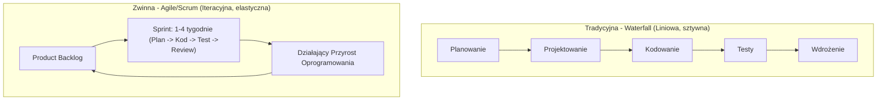

# Pytanie 22: Omów znane Ci metodyki realizacji przedsięwzięcia projektowego. Porównaj wybrane metodyki: tradycyjną i zwinną.

## Kluczowe pojęcia
- **Metodyka zarządzania projektami**: Zbiór zasad, metod i procesów określających sposób planowania, realizacji, monitorowania i zamykania projektów.
- **Metodyka tradycyjna (kaskadowa / Waterfall)**: Liniowe podejście do zarządzania projektem, w którym fazy następują sekwencyjnie, a każda kolejna rozpoczyna się dopiero po zakończeniu poprzedniej.
- **Metodyka zwinna (Agile)**: Iteracyjne podejście skupione na ciągłym dostarczaniu wartości, elastyczności wobec zmian wymagań oraz bliskiej współpracy z klientem.
- **Manifest Agile (2001)**: Deklaracja zasad zwinnego tworzenia oprogramowania, stawiająca ludzi i interakcje ponad procesy, a działające oprogramowanie ponad dokumentację.

## Szczegółowe omówienie tematu

Wytwarzanie systemów informatycznych charakteryzuje się dynamicznie zmieniającymi się wymaganiami oraz wysokim stopniem złożoności. Do zarządzania tym procesem stosuje się różne podejścia, z których dwa główne to podejście tradycyjne oraz zwinne.

---

### 1. Metodyki tradycyjne (Kaskadowe / Waterfall)
Klasyczny model kaskadowy (Waterfall) zakłada, że proces wytwórczy oprogramowania składa się z następujących po sobie, sztywno zdefiniowanych faz:
1. **Analiza wymagań** (zebranie i zatwierdzenie pełnej specyfikacji).
2. **Projektowanie systemu** (architektura baz danych, struktura kodu, interfejsy).
3. **Implementacja** (pisanie kodu źródłowego).
4. **Integracja i testy** (weryfikacja całego systemu).
5. **Wdrożenie i utrzymanie** (przekazanie systemu użytkownikowi i naprawa błędów).

Głównym założeniem Waterfall jest **przewidywalność** i dokładne zaplanowanie każdego etapu przed jego rozpoczęciem. Zmiana wymagań w późniejszej fazie (np. podczas testów) wiąże się z ogromnymi kosztami.

---

### 2. Metodyki zwinne (Agile)
Podejście zwinne zakłada, że wymagania projektu będą się zmieniać w miarę upływu czasu. Zamiast planować całość z góry, projekt dzieli się na krótkie, powtarzalne cykle zwane **iteracjami** (trwające od 1 do 4 tygodni, np. Sprinty w Scrumie).
W trakcie każdej iteracji zespół realizuje pełny mikro-cykl deweloperski: od analizy, przez kodowanie, aż po testowanie. Wynikiem każdej iteracji jest działający, przetestowany i potencjalnie gotowy do wdrożenia przyrost produktu (**Increment**).

Najpopularniejszymi ramami postępowania w nurcie Agile są:
- **Scrum**: Koncentruje się na podziale ról (Product Owner, Scrum Master, Zespół Deweloperski) i cyklicznych spotkaniach (Daily Scrum, Planning, Review, Retrospective).
- **Kanban**: Skupia się na wizualizacji przepływu pracy (tablica Kanban) i ograniczaniu pracy w toku (WIP - Work in Progress) w celu eliminacji wąskich gardeł.

---

### 3. Porównanie: Metodyka tradycyjna vs zwinna

| Kryterium | Metodyka Tradycyjna (Waterfall) | Metodyka Zwinna (Agile) |
| :--- | :--- | :--- |
| **Struktura projektu** | Liniowa, sekwencyjna (fazy). | Iteracyjna, przyrostowa (cykle). |
| **Definiowanie wymagań** | Określane szczegółowo na początku projektu. | Definiowane ogólnie na początku, uszczegóławiane na bieżąco. |
| **Zarządzanie zmianą** | Zmiany są utrudnione i wymagają formalnych procedur (Change Request). | Zmiany są naturalną częścią procesu i są mile widziane. |
| **Udział klienta** | Głównie na początku (zbieranie wymagań) i na końcu (odbiór). | Ciągły – klient bierze udział w pokazach po każdej iteracji. |
| **Dostarczanie wartości** | Klient otrzymuje działający system dopiero na końcu projektu. | Wartość biznesowa jest dostarczana przyrostowo w trakcie trwania projektu. |
| **Poziom ryzyka** | Wysokie ryzyko porażki (błędy w analizie ujawniają się dopiero przy odbiorze). | Niskie ryzyko (szybka weryfikacja założeń projektowych z rynkiem). |

---

### 4. Kryteria wyboru metodyki
- **Waterfall jest rekomendowany, gdy**:
  - Wymagania są stabilne, dobrze znane i nie ulegną zmianie (np. projekty rządowe, systemy o krytycznym znaczeniu bezpieczeństwa jak oprogramowanie medyczne, lotnicze).
  - Klient nie ma możliwości ani chęci bieżącego angażowania się w prace zespołu.
  - Technologia realizacyjna jest dobrze znana zespołowi.
- **Agile jest rekomendowany, gdy**:
  - Projekt dotyczy innowacyjnego produktu, gdzie wymagania dopiero się kształtują (np. startupy, aplikacje mobilne, e-commerce).
  - Kluczowy jest krótki czas wejścia na rynek (Time-to-Market) z wersją MVP (Minimum Viable Product).
  - Istnieje potrzeba szybkiego reagowania na działania konkurencji.

## Wizualizacja

Oto schemat blokowy / diagram ułatwiający zrozumienie zagadnienia:

## Podsumowanie
Metodyka tradycyjna i zwinna reprezentują odmienne filozofie zarządzania. Pierwsza stawia na kontrolę, plan i przewidywalność, natomiast druga na elastyczność, szybkość i adaptację do zmian. Wybór odpowiedniej metodyki powinien zależeć od specyfiki projektu, stabilności wymagań, technologii oraz kultury organizacyjnej klienta i zespołu wykonawczego.