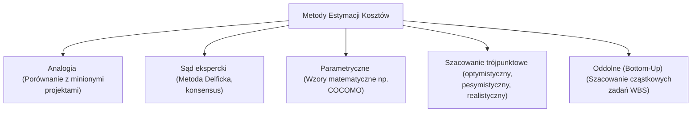

# Pytanie 23: Wskaż rodzaje projektów informatycznych. Wymień oraz scharakteryzuj metody estymacji kosztu wybranego przedsięwzięcia projektowego.

## Kluczowe pojęcia
- **Projekt informatyczny (IT)**: Celowe, ograniczone w czasie i budżecie przedsięwzięcie zmierzające do wytworzenia nowego lub modyfikacji istniejącego systemu teleinformatycznego.
- **Estymacja kosztów**: Proces szacowania nakładów pracy (pracochłonności wyrażonej w roboczogodzinach lub osobo-miesiącach), czasu trwania oraz budżetu finansowego niezbędnego do zrealizowania projektu.
- **WBS (Work Breakdown Structure)**: Struktura podziału pracy – hierarchiczna dekompozycja całości zakresu projektu na mniejsze, łatwiejsze do zarządzenia zadania.
- **COCOMO (Constructive Cost Model)**: Matematyczny model regresyjny służący do szacowania pracochłonności i czasu trwania projektów oprogramowania.

## Szczegółowe omówienie tematu

### 1. Rodzaje projektów informatycznych
Projekty informatyczne różnią się zakresem, specyfiką techniczną oraz celami biznesowymi. Do podstawowych rodzajów należą:

- **Projekty wytwórcze (Development)**:
  Tworzenie oprogramowania od podstaw (np. napisanie dedykowanego systemu CRM dla firmy ubezpieczeniowej). Charakteryzują się najwyższym stopniem ryzyka i niepewności co do wymagań.
- **Projekty wdrożeniowe (Implementation)**:
  Instalacja, konfiguracja i dostosowanie gotowych systemów (np. wdrożenie systemu ERP SAP, Salesforce czy Microsoft Dynamics) do procesów biznesowych klienta. Kluczowa jest tu integracja z istniejącymi systemami.
- **Projekty migracyjne i integracyjne**:
  - *Migracja*: Przeniesienie systemów i danych na nową platformę sprzętową lub programową (np. migracja lokalnej bazy danych do chmury AWS/Azure).
  - *Integracja*: Połączenie niezależnie działających aplikacji (np. poprzez szynę usług ESB lub API REST) w jeden spójny ekosystem.
- **Projekty infrastrukturalne**:
  Budowa lub modernizacja fizycznego zaplecza IT (np. budowa sieci komputerowej LAN/WAN w nowym biurowcu, wdrożenie nowej infrastruktury serwerowej).

---

### 2. Metody estymacji kosztów i pracochłonności projektów IT
Szacowanie kosztów jest jednym z najtrudniejszych etapów planowania projektu IT. Błędna estymacja jest główną przyczyną przekraczania budżetów. Metody estymacji dzielimy na trzy główne grupy:

#### A. Metody eksperckie (heurystyczne)
Opierają się na wiedzy, intuicji i doświadczeniu inżynierów.
- **Metoda Delficka (Delphi Method)**:
  Ustrukturyzowany proces grupowy. Anonimowi eksperci niezależnie szacują pracochłonność projektu. Koordynator zbiera wyniki, przedstawia je grupie (również anonimowo) i prosi o ponowną ocenę w kolejnej rundzie (szczególnie tych, których oceny skrajnie odbiegały od średniej). Proces powtarza się do momentu osiągnięcia konsensusu. Metoda ta eliminuje wpływ silnych osobowości w zespole.
- **Estymacja przez analogię (Analogous Estimating)**:
  Porównanie nowego projektu ze zrealizowanym wcześniej, podobnym przedsięwzięciem i dostosowanie kosztów o współczynnik różnic (np. skali). Metoda szybka i tania, ale obarczona dużym ryzykiem błędu.

#### B. Metody algorytmiczne (parametryczne)
Wykorzystują modele matematyczne i statystykę historyczną.
- **COCOMO (Constructive Cost Model)**:
  Model opracowany przez Barry'ego Boehma. Szacuje pracochłonność ($PM$ - osobo-miesiące) na podstawie liczby linii kodu źródłowego ($KLOC$ - tysiące linii kodu) przy użyciu wzoru:
  $$PM = a \times (KLOC)^b \times EAF$$
  gdzie $a$ i $b$ to stałe zależne od typu projektu (np. organiczny, wbudowany), a $EAF$ (Effort Adjustment Factor) to iloczyn współczynników korygujących (np. wymagana niezawodność, doświadczenie programistów, presja czasu). Nowszy model **COCOMO II** pozwala na estymację na podstawie Punktów Aplikacyjnych lub Funkcyjnych.
- **Analiza Punktów Funkcyjnych (Function Point Analysis - FPA)**:
  Metoda niezależna od technologii. Mierzy rozmiar systemu z punktu widzenia użytkownika biznesowego, analizując 5 typów komponentów: zewnętrzne wejścia (Inputs), zewnętrzne wyjścia (Outputs), zewnętrzne zapytania (Queries), wewnętrzne pliki logiczne (Logical Files) oraz zewnętrzne interfejsy (Interfaces). Uzyskana liczba punktów funkcyjnych jest następnie przeliczana na pracochłonność na podstawie wydajności zespołu.

#### C. Podejścia strukturalne
- **Estymacja oddolna (Bottom-Up)**:
  Wymaga stworzenia struktury podziału pracy (**WBS**). Każde najmniejsze zadanie (pakiet roboczy) jest szacowane osobno przez osoby, które będą je realizować. Następnie koszty są sumowane w górę struktury. Jest to **najdokładniejsza**, ale najbardziej czasochłonna metoda estymacji.
- **Estymacja trójpunktowa (PERT)**:
  Dla każdego zadania szacuje się trzy wartości czasu/kosztu: optymistyczną ($O$), pesymistyczną ($P$) oraz najbardziej prawdopodobną ($M$). Ostateczną estymację wylicza się ze wzoru:
  $$E = \frac{O + 4M + P}{6}$$
  Pozwala to uwzględnić ryzyko i niepewność w obliczeniach.

## Wizualizacja

Oto schemat blokowy / diagram ułatwiający zrozumienie zagadnienia:

## Podsumowanie
W praktyce zarządzania projektami IT nie należy opierać się wyłącznie na jednej metodzie. W fazie koncepcyjnej (inicjacji) stosuje się estymację analogową lub top-down. Po zebraniu wymagań tworzy się strukturę WBS i przeprowadza dokładną estymację oddolną (Bottom-Up) przy użyciu metody PERT, co pozwala na precyzyjne określenie budżetu i harmonogramu projektu.