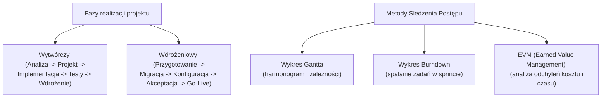

# Pytanie 24: Wskaż fazy realizacji projektu informatycznego wytwórczego i wdrożeniowego. Wymień i omów metody śledzenia postępu projektu w czasie.

## Kluczowe pojęcia
- **Cykl życia projektu (Project Lifecycle)**: Zbiór kolejnych faz, przez które przechodzi projekt od momentu jego rozpoczęcia do zakończenia.
- **Projekt wytwórczy (Development)**: Przedsięwzięcie polegające na zaprojektowaniu i napisaniu nowego oprogramowania od podstaw.
- **Projekt wdrożeniowy (Implementation)**: Proces polegający na dostosowaniu, konfiguracji i instalacji gotowego systemu (np. ERP, CRM) w organizacji klienta.
- **EVM (Earned Value Management)**: Metoda wartości wypracowanej – technika zarządzania projektami służąca do mierzenia postępu i wydajności projektu w oparciu o zakres, czas i koszty.

## Szczegółowe omówienie tematu

### 1. Fazy realizacji projektów informatycznych

#### A. Projekt wytwórczy (Software Development)
Cykl życia takiego projektu opiera się na inżynierii oprogramowania (często reprezentowanej przez model SDLC):
1. **Inicjacja i Analiza Wymagań**: Określenie celów projektu, analiza wykonalności oraz szczegółowe zebranie wymagań funkcjonalnych i niefunkcjonalnych (np. w postaci przypadków użycia lub User Stories).
2. **Projektowanie (Design)**: Opracowanie architektury oprogramowania, schematów baz danych, interfejsów API oraz makiet interfejsu użytkownika (UI/UX).
3. **Implementacja (Kodowanie)**: Właściwy etap programowania, w którym deweloperzy piszą kod źródłowy systemu.
4. **Testowanie i Integracja (QA)**: Weryfikacja kodu przez testerów (testy jednostkowe, integracyjne, regresyjne, wydajnościowe) oraz testy akceptacyjne użytkowników (UAT).
5. **Wdrożenie i Utrzymanie (Deployment & Maintenance)**: Instalacja oprogramowania na środowisku produkcyjnym oraz późniejsze wsparcie techniczne, naprawa błędów i rozwój.

#### B. Projekt wdrożeniowy (Software Implementation)
W tym przypadku system już istnieje (np. SAP, Microsoft Dynamics), a celem jest jego implementacja w przedsiębiorstwie klienta:
1. **Przygotowanie Projektu**: Ustalenie zespołu wdrożeniowego, przygotowanie harmonogramu oraz instalacja bazowego środowiska testowego.
2. **Analiza Przedwdrożeniowa (Business Blueprint)**: Zmapowanie procesów biznesowych klienta i porównanie ich z możliwościami systemu. Identyfikacja rozbieżności (tzw. analiza *Fit-Gap*).
3. **Konfiguracja i Dostosowanie (Realization)**: Konfiguracja systemu pod wymagania klienta, programowanie dedykowanych rozszerzeń i raportów oraz integracja z systemami zewnętrznymi.
4. **Przygotowanie Końcowe**: Migracja danych (oczyszczenie i przeniesienie danych historycznych z dotychczasowych systemów), szkolenia kluczowych użytkowników, ostateczne testy systemu.
5. **Start Produkcyjny i Wsparcie (Go-Live & Hypercare)**: Uruchomienie systemu w codziennej pracy firmy oraz intensywne wsparcie powdrożeniowe.

---

### 2. Metody śledzenia postępu projektu w czasie

Aby kontrolować, czy projekt nie opóźnia się i mieści się w budżecie, kierownicy projektów (Project Managers) stosują różne metody śledzenia postępu:

#### A. Metoda Wartości Wypracowanej (EVM - Earned Value Management)
Jest to najbardziej ustrukturyzowana, ilościowa metoda oceny kondycji projektu. Wykorzystuje trzy kluczowe wskaźniki bazowe:
- **PV (Planned Value - Wartość Planowana)**: Budżet przypisany do prac zaplanowanych do wykonania do określonego punktu w czasie.
- **AC (Actual Cost - Koszt Rzeczywisty)**: Koszty rzeczywiście poniesione na wykonanie prac zrealizowanych do tego punktu.
- **EV (Earned Value - Wartość Wypracowana)**: Budżetowa wartość prac faktycznie ukończonych do tego momentu.

Na ich podstawie oblicza się wskaźniki efektywności:
- **CV (Cost Variance - Odchylenie Kosztów)**: $CV = EV - AC$ (wartość ujemna oznacza przekroczenie budżetu).
- **SV (Schedule Variance - Odchylenie Harmonogramu)**: $SV = EV - PV$ (wartość ujemna oznacza opóźnienie).
- **CPI (Cost Performance Index)**: $CPI = EV / AC$ (pokazuje wydajność kosztową; $CPI < 1$ oznacza przekroczenie kosztów).
- **SPI (Schedule Performance Index)**: $SPI = EV / PV$ (pokazuje wydajność harmonogramową; $SPI < 1$ oznacza opóźnienie).

#### B. Wykres Gantta i Kamienie Milowe (Milestones)
- **Wykres Gantta**: Graficzny harmonogram przedstawiający zadania w postaci poziomych pasków na osi czasu. Pokazuje zależności między zadaniami (np. zadanie B nie może się zacząć przed zakończeniem zadania A) oraz stopień ukończenia zadań wyrażony w procentach.
- **Kamienie Milowe**: Ważne punkty kontrolne na wykresie Gantta (np. "Koniec fazy projektowania"). Nie mają one czasu trwania (są zdarzeniami typu tak/nie). Śledzenie ich terminowości daje szybki obraz postępu projektu.

#### C. Wykresy Spalania (Burn-down / Burn-up) – Metodyki Zwinne
Metody stosowane głównie w projektach prowadzonych w metodyce Scrum:
- **Burn-down Chart (Wykres Spalania)**: Wykres pokazujący ilość pracy pozostałej do wykonania w Sprincie w stosunku do czasu. Pionowa oś reprezentuje pozostały zakres (np. w Story Pointach), a pozioma oś – kolejne dni Sprintu. Linia wykresu powinna schodzić do zera. Odchylenie w górę od linii idealnej oznacza opóźnienie prac.
- **Burn-up Chart**: Wykres pokazujący ilość ukończonej pracy w czasie na tle całkowitego zakresu projektu. Pomaga w wizualizacji przyrostu zakresu (*scope creep*) – jeśli całkowita linia zakresu rośnie w górę, oznacza to dodawanie nowych wymagań przez klienta w trakcie projektu.

## Wizualizacja

Oto schemat blokowy / diagram ułatwiający zrozumienie zagadnienia:

## Podsumowanie
Wdrożenie i wytworzenie oprogramowania różnią się zakresem i wyzwaniami – wytworzenie skupia się na programowaniu, natomiast wdrożenie na analizie procesów biznesowych i migracji danych. Do śledzenia postępu w projektach tradycyjnych (Waterfall) stosuje się Wykresy Gantta oraz wskaźniki EVM (SPI, CPI), natomiast w projektach zwinnych (Agile) podstawą są tablice zadań i wykresy spalania (Burn-down).