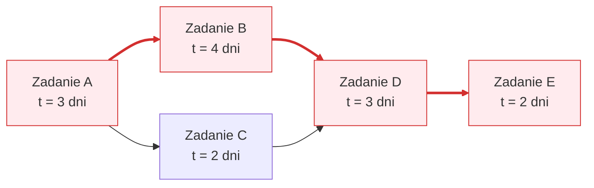

# Pytanie 25: Omów sposoby tworzenia struktury zadań w projekcie. Co to jest ścieżka krytyczna? Podaj co najmniej dwie metody wyznaczania ścieżki krytycznej w projekcie informatycznym.

## Kluczowe pojęcia
- **WBS (Work Breakdown Structure - Struktura Podziału Pracy)**: Hierarchiczna dekompozycja całości zakresu projektu na mniejsze, bardziej mierzalne zadania i pakiety robocze.
- **Ścieżka krytyczna (Critical Path)**: Najdłuższa pod względem czasu sekwencja zależnych zadań od rozpoczęcia do zakończenia projektu, która określa minimalny czas trwania całego projektu.
- **Luz całkowity (Total Float / Slack)**: Czas, o jaki można opóźnić wykonanie danego zadania bez wpływu na termin zakończenia całego projektu.
- **CPM (Critical Path Method)**: Metoda ścieżki krytycznej – deterministyczny algorytm analizy sieciowej harmonogramu.
- **PERT (Program Evaluation and Review Technique)**: Probabilistyczna metoda planowania sieciowego, uwzględniająca niepewność czasową poszczególnych zadań.

## Szczegółowe omówienie tematu

### 1. Sposoby tworzenia struktury zadań w projekcie (WBS)
Struktura Podziału Pracy (WBS) jest graficznym lub tabelarycznym podziałem projektu na mniejsze komponenty. Pozwala to na precyzyjne przypisanie odpowiedzialności, oszacowanie kosztów i czasu trwania prac.

Podczas tworzenia WBS stosuje się dwa główne podejścia dekompozycji:
- **Podejście zorientowane na produkty (Deliverable-oriented)**:
  Podział projektu na podstawie fizycznych lub logicznych elementów, które mają zostać dostarczone (np. dla systemu e-commerce: 1. Baza danych, 2. Panel klienta, 3. Moduł płatności, 4. Panel administratora). Pod każdym z tych produktów umieszcza się zadania niezbędne do ich wytworzenia. Jest to podejście rekomendowane przez standardy takie jak PMBOK.
- **Podejście zorientowane na fazy (Phase-oriented / Process-oriented)**:
  Podział oparty na etapach cyklu życia projektu (np. 1. Analiza, 2. Projektowanie, 3. Programowanie, 4. Testowanie, 5. Wdrożenie). Pod każdą fazą wypisywane są konkretne zadania.

#### Główne zasady tworzenia WBS:
- **Zasada 100%**: WBS musi obejmować 100% prac określonych w zakresie projektu i ani kroku więcej. Suma podzadań musi dokładnie dawać zakres zadania nadrzędnego.
- **Reguła 8/80**: Najniższe pakiety robocze (Work Packages) powinny wymagać od 8 do 80 roboczogodzin pracy, co ułatwia ich monitorowanie i rozliczanie.

---

### 2. Ścieżka krytyczna (Critical Path)
Ścieżka krytyczna to ciąg powiązanych ze sobą zadań w projekcie, których suma czasów trwania jest najdłuższa. Determinuje ona najkrótszy możliwy czas realizacji całego projektu.
- **Cechy zadań na ścieżce krytycznej**:
  Zadania te nazywamy zadaniami krytycznymi. Charakteryzują się one **zerowym luzem czasowym** ($Luz = 0$). Oznacza to, że jakiekolwiek opóźnienie w rozpoczęciu lub zakończeniu zadania krytycznego o np. 2 dni spowoduje automatyczne opóźnienie zakończenia całego projektu również o 2 dni.
- **Zastosowanie**:
  Znajomość ścieżki krytycznej pozwala menedżerowi projektu na odpowiednie zarządzanie zasobami (np. przesuwanie zasobów z zadań o dużym luzie w celu ratowania zagrożonych zadań krytycznych).

---

### 3. Metody wyznaczania ścieżki krytycznej
Do wyznaczania ścieżki krytycznej w projektach IT stosuje się metody matematycznej analizy sieciowej:

#### Metoda 1: Metoda CPM (Critical Path Method) – Algorytm przejścia w przód i w tył
Jest to podejście deterministyczne, w którym czas trwania zadań jest stały i znany.
Algorytm opiera się na wyliczeniu dla każdego zadania czterech parametrów czasowych:
- **ES (Early Start)**: Najwcześniejszy możliwy termin rozpoczęcia zadania.
- **EF (Early Finish)**: Najwcześniejszy możliwy termin zakończenia ($EF = ES + czas\_trwania$).
- **LS (Late Start)**: Najpóźniejszy możliwy termin rozpoczęcia bez opóźniania projektu.
- **LF (Late Finish)**: Najpóźniejszy możliwy termin zakończenia bez opóźniania projektu ($LF = LS + czas\_trwania$).

**Kroki algorytmu**:
1. **Przejście w przód (Forward Pass)**: Idąc od startu do końca sieci, oblicza się $ES$ i $EF$. Jeśli zadanie zależy od kilku zadań poprzedzających, jego $ES$ jest równe maksymalnemu $EF$ z zadań poprzedzających. Całkowity czas projektu to maksymalny czas zakończenia zadań końcowych.
2. **Przejście w tył (Backward Pass)**: Idąc od końca sieci do jej startu, oblicza się $LF$ i $LS$. Jeśli zadanie poprzedza kilka innych, jego $LF$ jest równe minimalnemu $LS$ z zadań następujących.
3. **Obliczenie luzu**: Wylicza się luz: $Luz = LF - EF$ (lub $LS - ES$). Zadania, dla których luz wynosi zero, tworzą ścieżkę krytyczną.

#### Metoda 2: Metoda PERT (Program Evaluation and Review Technique)
Podejście probabilistyczne, stosowane gdy czasy trwania zadań są trudne do precyzyjnego określenia (częsta sytuacja w projektach innowacyjnych IT).
- **Kroki metody**:
  1. Dla każdego zadania eksperci określają trzy szacunki czasowe: optymistyczny ($o$), pesymistyczny ($p$) oraz najbardziej prawdopodobny ($m$).
  2. Wylicza się średni oczekiwany czas trwania zadania ($t_e$) według wzoru:
     $$t_e = \frac{o + 4m + p}{6}$$
  3. Oblicza się wariancję ($\sigma^2$) czasu trwania każdego zadania:
     $$\sigma^2 = \left(\frac{p - o}{6}\right)^2$$
  4. Po podstawieniu średnich czasów ($t_e$) jako stałych czasów trwania zadań, wyznacza się ścieżkę krytyczną dokładnie tak samo, jak w metodzie CPM.
  5. Sumując wariancje zadań na ścieżce krytycznej, można obliczyć odchylenie standardowe projektu i oszacować prawdopodobieństwo ukończenia projektu w określonym terminie (korzystając z rozkładu normalnego).

## Wizualizacja

Oto schemat blokowy / diagram ułatwiający zrozumienie zagadnienia:

*Legenda: Czerwone krawędzie i wierzchołki oznaczają Ścieżkę Krytyczną (łączny czas: 12 dni): **A ➔ B ➔ D ➔ E**.*

## Podsumowanie
Struktura podziału pracy (WBS) pozwala na zdekomponowanie skomplikowanego projektu na małe zadania. Następnie, poprzez połączenie ich zależnościami logicznymi, tworzy się sieć powiązań. Wyznaczenie ścieżki krytycznej przy użyciu algorytmów CPM (dla stałych czasów) lub PERT (dla zakresów czasów) pozwala zidentyfikować kluczowe zadania decydujące o terminie końcowym projektu i zminimalizować ryzyko opóźnień.