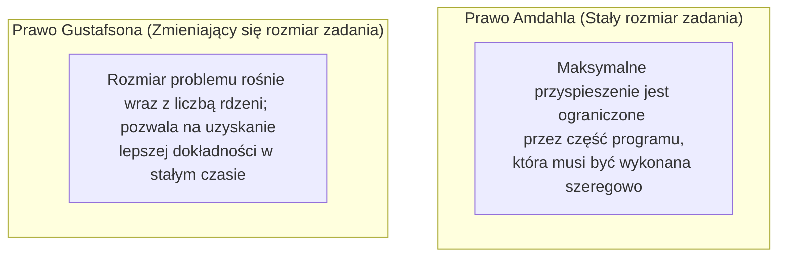

# Pytanie 28: Miary efektywności obliczeń równoległych.

## Kluczowe pojęcia
- **Przyspieszenie (Speedup - $S_p$)**: Stosunek czasu wykonania algorytmu sekwencyjnego na jednym procesorze do czasu wykonania jego wersji równoległej na $p$ procesorach.
- **Efektywność (Efficiency - $E_p$)**: Procentowy stopień wykorzystania procesorów w obliczeniach równoległych.
- **Prawo Amdahla**: Model opisujący maksymalne teoretyczne przyspieszenie programu przy stałym rozmiarze problemu (skalowanie silne).
- **Prawo Gustafsona**: Model opisujący przyspieszenie programu przy założeniu, że rozmiar problemu rośnie wraz z liczbą procesorów (skalowanie słabe).
- **Narzut równoległości (Overhead)**: Czas tracony przez procesory na komunikację, synchronizację oraz bezczynność.

## Szczegółowe omówienie tematu

Głównym celem stosowania obliczeń równoległych jest skrócenie czasu rozwiązywania problemu obliczeniowego. Aby ocenić korzyści i straty wynikające z zaangażowania wielu procesorów, stosuje się metryki matematyczne.

---

### 1. Podstawowe metryki efektywności

#### A. Przyspieszenie (Speedup - $S_p$)
Mierzy zysk czasowy uzyskany dzięki zrównolegleniu zadania:
$$S_p = \frac{T_1}{T_p}$$
gdzie:
- $T_1$ to czas wykonania najlepszego algorytmu sekwencyjnego na jednym procesorze.
- $T_p$ to czas wykonania algorytmu równoległego na $p$ procesorach.

**Przypadki szczególne**:
- **Przyspieszenie liniowe (idealne)**: $S_p = p$. Podwojenie liczby procesorów skraca czas o połowę.
- **Przyspieszenie podliniowe**: $S_p < p$. Najczęstsza sytuacja w praktyce – narzuty komunikacji sieciowej i synchronizacji ograniczają zysk z kolejnych rdzeni.
- **Przyspieszenie superliniowe**: $S_p > p$. Rzadka sytuacja, w której algorytm działa szybciej niż wskazuje liczba rdzeni. Wynika to najczęściej z faktu, że podział danych sprawia, iż mieszczą się one w całości w szybkich pamięciach podręcznych (Cache L1/L2/L3) poszczególnych rdzeni, drastycznie ograniczając powolny dostęp do RAM.

#### B. Efektywność (Efficiency - $E_p$)
Pokazuje, w jakim stopniu procesory pracują nad rozwiązaniem problemu, a w jakim marnują czas na narzuty:
$$E_p = \frac{S_p}{p} = \frac{T_1}{p \times T_p}$$
Przyjmuje wartości z zakresu $[0, 1]$ (lub $0\% - 100\%$). Wartość $E_p = 0.8$ oznacza, że procesory przez 80% czasu wykonują obliczenia użyteczne, a przez 20% czasu zajmują się komunikacją (np. przesyłaniem komunikatów w MPI) lub oczekiwaniem na wątek spowalniający (brak zbalansowania obciążenia - *load balancing*).

---

### 2. Prawa ograniczające efektywność obliczeń

#### A. Prawo Amdahla (Silne skalowanie / Strong Scaling)
Określa granice przyspieszenia przy **stałym rozmiarze zadania obliczeniowego** (np. przetwarzanie jednego konkretnego obrazu). Prawo to zakłada, że program składa się z ułamka kodu, który musi zostać wykonany sekwencyjnie ($s$) oraz ułamka, który można zrównoleglić ($1-s$).
Wzór:
$$S_p = \frac{1}{s + \frac{1-s}{p}}$$
gdzie:
- $s$: część sekwencyjna algorytmu (np. odczyt plików z dysku, inicjalizacja zmiennych).
- $p$: liczba procesorów.

**Kluczowy wniosek**:
Gdy liczba procesorów dąży do nieskończoności ($p \to \infty$), maksymalne przyspieszenie dąży do wartości:
$$S_{limit} = \frac{1}{s}$$
*Przykład*: Jeśli tylko 5% programu działa sekwencyjnie ($s = 0.05$), to nawet przy użyciu milionów procesorów maksymalne osiągalne przyspieszenie nie przekroczy 20 razy ($1 / 0.05$).

#### B. Prawo Gustafsona (Słabe skalowanie / Weak Scaling)
Odnosi się do sytuacji, w której wraz ze wzrostem liczby procesorów **zwiększamy rozmiar problemu** tak, aby czas wykonania programu pozostał zbliżony (np. zamiast dokładniejszej analizy jednej klatki wideo, analizujemy dłuższy film).
Wzór:
$$S_p = p - s(p-1)$$
gdzie $s$ to czas spędzony na zadaniach sekwencyjnych w programie o powiększonym rozmiarze.

**Kluczowy wniosek**:
Prawo Gustafsona pokazuje bardziej optymistyczny obraz obliczeń równoległych. Przyspieszenie rośnie w nim niemal liniowo wraz z dodawaniem nowych procesorów, pod warunkiem, że rozmiar przetwarzanych danych skaluje się proporcjonalnie do mocy obliczeniowej.

## Wizualizacja

Oto schemat blokowy / diagram ułatwiający zrozumienie zagadnienia:

## Podsumowanie
Projektowanie algorytmów równoległych wymaga ciągłej optymalizacji dwóch parametrów: minimalizowania sekwencyjnej części kodu (zgodnie z prawem Amdahla) oraz ograniczania narzutów komunikacyjnych i synchronizacyjnych, aby utrzymać wysoką efektywność ($E_p$) przy skalowaniu systemu obliczeniowego.