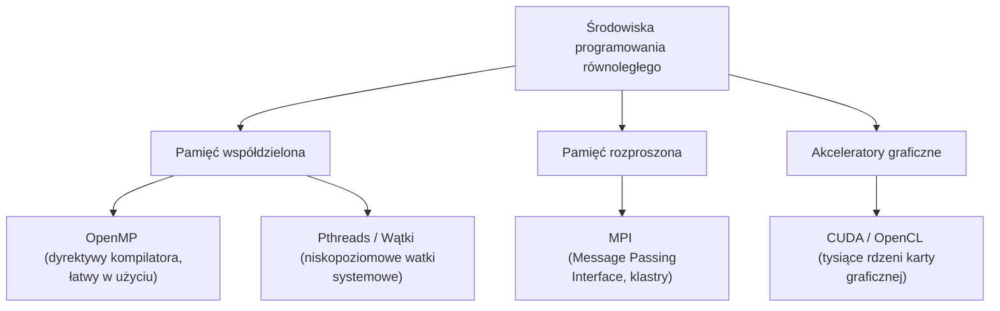

# Pytanie 29: Środowiska programowania równoległego.

## Kluczowe pojęcia
- **Środowisko programowania równoległego**: Zestaw narzędzi, bibliotek i kompilatorów umożliwiających tworzenie, debugowanie oraz uruchamianie aplikacji wykorzystujących wiele jednostek obliczeniowych (rdzeni, procesorów, maszyn, układów GPU).
- **OpenMP (Open Multi-Processing)**: Środowisko programowania wielowątkowego oparte na pamięci współdzielonej, wykorzystujące dyrektywy kompilatora.
- **MPI (Message Passing Interface)**: Standard komunikacyjny dla systemów z pamięcią rozproszoną (klastry komputerowe).
- **CUDA (Compute Unified Device Architecture)**: Zamknięta platforma stworzona przez firmę NVIDIA do programowania obliczeń ogólnego przeznaczenia na kartach graficznych (GPGPU).
- **OpenCL (Open Computing Language)**: Otwarty, przenośny standard do obliczeń na systemach heterogenicznych (różne modele CPU, GPU, układy FPGA).

## Szczegółowe omówienie tematu

Współczesne systemy komputerowe są heterogeniczne i wielopoziomowe. Aby ułatwić tworzenie oprogramowania potrafiącego wykorzystać tę moc obliczeniową, stosuje się wyspecjalizowane środowiska programistyczne. Dzielą się one na kilka kategorii w zależności od obsługiwanej architektury sprzętowej.

---

### 1. Środowiska dla pamięci współdzielonej (Wielordzeniowe CPU)

#### OpenMP
- **Charakterystyka**: 
  Standard wspierany przez większość współczesnych kompilatorów C/C++ i Fortran (np. GCC, Clang, Intel C++ Compiler).
- **Zasada działania**: 
  Programista nie tworzy wątków ręcznie. Zamiast tego dodaje do istniejącego kodu sekwencyjnego specjalne pragramy (dyrektywy kompilatora, np. `#pragma omp parallel for`), które wskazują sekcje kodu (np. pętle), które mogą być wykonywane równolegle. Kompilator automatycznie generuje kod zarządzający wątkami (zgodnie z modelem *Fork-Join*).
- **Zastosowanie**: 
  Szybka i prosta równoleglizacja istniejącego kodu naukowego i inżynieryjnego.

---

### 2. Środowiska dla pamięci rozproszonej (Klastry i Superkomputery)

#### MPI (Message Passing Interface)
- **Charakterystyka**: 
  Standard biblioteczny definiujący interfejsy dla języków C, C++ oraz Fortran. 
- **Zasada działania**: 
  Aplikacja uruchamiana jest jako zestaw niezależnych procesów (zazwyczaj na różnych maszynach w klastrze). Ponieważ procesy te nie współdzielą pamięci, cała komunikacja i wymiana danych musi być zaprogramowana jawnie za pomocą wywołań funkcji bibliotecznych.
- **Najpopularniejsze implementacje**:
  - **OpenMPI**: Darmowe, szeroko rozwijane środowisko o otwartym kodzie źródłowym.
  - **MPICH**: Otwarta implementacja stanowiąca bazę dla wielu wersji komercyjnych (np. Intel MPI).
- **Zastosowanie**: 
  Wielkoskalowe obliczenia naukowe (prognozowanie pogody, fizyka cząstek elementarnych, symulacje aerodynamiczne).

---

### 3. Środowiska dla akceleratorów graficznych (GPGPU)

Zrównoleglanie obliczeń na kartach graficznych (GPU) pozwala na jednoczesne uruchamianie dziesiątek tysięcy wątków.

#### CUDA
- **Charakterystyka**: 
  Własnościowa (zamknięta) platforma firmy NVIDIA, działająca wyłącznie na kartach graficznych tego producenta.
- **Zasada działania**: 
  Udostępnia rozszerzenie języków C/C++ oraz specjalny kompilator (`nvcc`). Programista dzieli kod na:
    - *Host*: Kod uruchamiany na tradycyjnym procesorze (CPU), zarządzający pamięcią i przepływem.
    - *Kernel*: Funkcja obliczeniowa wykonywana równolegle przez tysiące rdzeni GPU.
- **Zastosowanie**: 
  Sztuczna inteligencja i głębokie uczenie maszynowe (podstawa bibliotek PyTorch, TensorFlow), symulacje fizyczne, kryptografia, renderowanie 3D.

#### OpenCL
- **Charakterystyka**: 
  Otwarty standard zarządzany przez Khronos Group.
- **Zasada działania**: 
  Pozwala pisać programy działające na urządzeniach heterogenicznych różnych producentów (np. procesory Intel, karty graficzne AMD/NVIDIA, akceleratory FPGA).
- **Zaleta**: Kod jest przenośny (zadziała na sprzęcie różnych producentów).
- **Wada**: Trudniejszy w pisaniu i optymalizacji w porównaniu do dedykowanego środowiska CUDA.

---

### 4. Porównanie środowisk programowania równoległego

| Środowisko | Architektura pamięci | Model komunikacji | Główny wektor zastosowań |
| :--- | :--- | :--- | :--- |
| **OpenMP** | Współdzielona | Zmienne dzielone w RAM | Lokalne stacje robocze, pętle CPU |
| **MPI** | Rozproszona | Przekazywanie komunikatów | Klastry serwerów, HPC (Superkomputery) |
| **CUDA** | Rozproszona (CPU/GPU) | Transfery pamięciowe PCIe | Akceleracja GPU (NVIDIA), AI / Deep Learning |
| **OpenCL** | Heterogeniczna | Transfery pamięciowe | Przenośne obliczenia na kartach różnych marek |

## Wizualizacja

Oto schemat blokowy / diagram ułatwiający zrozumienie zagadnienia:

## Podsumowanie
Współczesne wyzwania obliczeniowe wymagają od programistów znajomości wielu środowisk. W celu pełnego wykorzystania nowoczesnego superkomputera często stosuje się **programowanie hybrydowe (MPI + OpenMP + CUDA)**, gdzie MPI odpowiada za komunikację między serwerami, OpenMP za wielowątkowość w ramach jednego serwera, a CUDA przyspiesza najcięższe obliczenia matematyczne na kartach GPU.