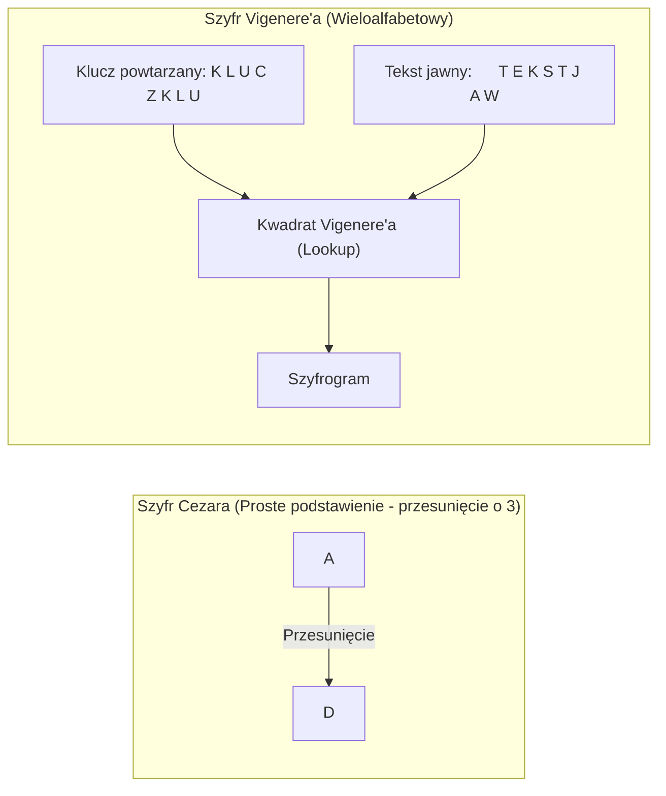

# Pytanie 30: Szyfry podstawieniowe (proste i wieloalfabetowe).

## Kluczowe pojęcia
- **Szyfr podstawieniowy (szyfr substytucyjny)**: Szyfr klasyczny, w którym poszczególne litery (lub grupy liter) tekstu jawnego są zastępowane innymi znakami według określonego schematu (klucza).
- **Szyfr jednoalfabetowy (monoalfabetowy)**: Szyfr podstawieniowy wykorzystujący dokładnie jedno, stałe przyporządkowanie (jeden alfabet szyfrowy) dla całego procesu szyfrowania.
- **Szyfr wieloalfabetowy (polialfabetowy)**: Szyfr podstawieniowy wykorzystujący wiele różnych przyporządkowań (wiele alfabetów szyfrowych) w zależności od pozycji litery w szyfrowanym tekście.
- **Analiza częstotliwościowa**: Metoda łamania szyfrów klasycznych oparta na statystycznej częstotliwości występowania poszczególnych liter w danym języku naturalnym.

## Szczegółowe omówienie tematu

Szyfry podstawieniowe stanowią jedną z dwóch głównych gałęzi kryptografii klasycznej (obok szyfrów przestawieniowych). Ich podstawowym założeniem jest zachowanie pozycji znaków w tekście, ale zmiana ich tożsamości.

---

### 1. Szyfry jednoalfabetowe (Monoalfabetowe / Proste)
W szyfrach jednoalfabetowych każda konkretna litera tekstu jawnego (np. 'A') jest zawsze zastępowana tą samą, z góry określoną literą szyfrową (np. 'X').

#### Przykłady:
- **Szyfr Cezara**: Najprostszy historyczny szyfr. Każda litera tekstu jawnego zostaje przesunięta w alfabecie o stałą liczbę miejsc (klucz $k$). Dla standardowego alfabetu łacińskiego o rozmiarze $n = 26$ i przesunięcia $k = 3$:
  $$C_i = (P_i + 3) \pmod{26}$$
  W tym przypadku 'A' przechodzi w 'D', 'B' w 'E' itp.
- **Szyfr Afiniczny**: Rozszerzenie szyfru Cezara. Funkcja szyfrująca wykorzystuje mnożenie i dodawanie modulo:
  $$C_i = (a \times P_i + b) \pmod{n}$$
  gdzie $a$ i $n$ muszą być względnie pierwsze.
- **Ogólny szyfr podstawieniowy**: Kluczem jest dowolna permutacja alfabetu. Daje to ogromną przestrzeń kluczy ($26! \approx 4 \times 10^{26}$).

#### Kryptoanaliza (Łamanie):
Mimo teoretycznie dużej przestrzeni kluczy w ogólnym szyfrze podstawieniowym, wszystkie szyfry jednoalfabetowe są **niebezpieczne i bardzo łatwe do złamania**. Wynika to z faktu, że szyfrowanie jednoalfabetowe **nie maskuje statystyki języka**. Każda litera tekstu jawnego ma swój unikalny odpowiednik. Analityk bada częstotliwość występowania liter w zaszyfrowanym tekście (np. w języku polskim najczęstsza litera to 'A' i 'E', najrzadsza to 'Ź' czy 'F') i dopasowuje je do rozkładu statystycznego danego języka, co pozwala na błyskawiczne odczytanie wiadomości.

---

### 2. Szyfry wieloalfabetowe (Polialfabetowe)
Aby obronić się przed analizą częstotliwościową, opracowano szyfry wieloalfabetowe. Ich idea polega na tym, że ta sama litera tekstu jawnego (np. 'A') w zależności od swojej pozycji w tekście może zostać zaszyfrowana na różne sposoby (np. raz jako 'X', raz jako 'M', raz jako 'O').

#### Przykłady:
- **Szyfr Vigenère'a**: 
  Wykorzystuje słowo-klucz. Kolejne litery klucza definiują przesunięcie dla kolejnych liter tekstu jawnego. Szyfrowanie realizuje się najczęściej za pomocą tzw. Tablicy Vigenère'a (kwadratu o wymiarach 26x26 zawierającego przesunięte alfabety).
  *Przykład*: Jeśli klucz to `KOT` (przesunięcia: K=10, O=14, T=19), to pierwsza litera tekstu jawnego jest przesuwana o 10 pozycji, druga o 14, trzecia o 19, czwarta znów o 10 (klucz powtarza się w pętli).
- **Maszyna Enigma**:
  Elektromechaniczna maszyna szyfrująca używana przez Niemców podczas II Wojny Światowej. Była zaawansowanym szyfrem polialfabetowym, w którym każde naciśnięcie klawisza powodowało obrót wirników, co zmieniało ścieżkę elektryczną (czyli alfabet szyfrowy) dla kolejnego znaku.

#### Kryptoanaliza (Łamanie):
Szyfr Vigenère'a przez stulecia uchodził za nie do złamania. Został złamany w XIX w. przy użyciu metod:
- **Test Kasiski'ego**: Szukanie powtarzających się sekwencji znaków w szyfrogramie. Odległości między nimi wskazują na potencjalną długość słowa-klucza ($d$). Po ustaleniu $d$, szyfrogram dzieli się na $d$ podtekstów i każdy z nich łamie się osobno klasyczną analizą częstotliwościową.
- **Wskaźnik koincydencji (metoda Friedmana)**: Statystyczne badanie rozkładu liter pozwalające na matematyczne wyznaczenie długości klucza bez szukania powtórzeń.

## Wizualizacja

Oto schemat blokowy / diagram ułatwiający zrozumienie zagadnienia:

## Podsumowanie
Szyfry podstawieniowe stanowią fundament historii kryptografii. Szyfry jednoalfabetowe oferują zerowe bezpieczeństwo z powodu podatności na analizę częstotliwościową. Szyfry wieloalfabetowe znacząco utrudniły kryptoanalizę poprzez maskowanie statystyk tekstu jawnego. Ich ostatecznym rozwinięciem jest **klucz jednorazowy (One-Time Pad)** – szyfr wieloalfabetowy o długości klucza równej długości wiadomości, który jako jedyny gwarantuje matematycznie udowodnione bezpieczeństwo (tajność doskonałą).