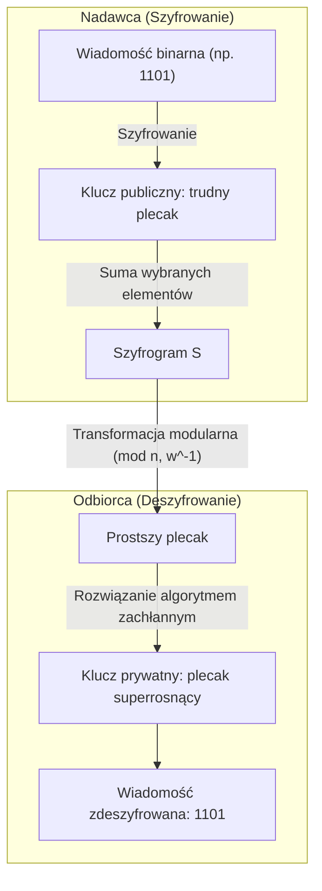

# Pytanie 32: Problem pakowania plecaka. Szyfry plecakowe.

## Kluczowe pojęcia
- **Problem pakowania plecaka (Knapsack Problem)**: Problem optymalizacyjny (wersja decyzyjna: **Suma podzbioru**), w którym mając dany zbiór liczb (wag) należy wskazać podzbiór, którego suma jest równa zadanej wartości. Jest to problem **NP-zupełny**.
- **Ciąg superrosnący (Superincreasing Sequence)**: Ciąg liczb, w którym każdy kolejny wyraz jest większy niż suma wszystkich poprzednich wyrazów. Problem plecakowy oparty na takim ciągu jest łatwy do rozwiązania w czasie liniowym $O(n)$.
- **Kryptosystem Merkle-Hellmana (1978)**: Pierwszy praktyczny kryptosystem asymetryczny (z kluczem publicznym), którego bezpieczeństwo oparto na trudności ogólnego problemu plecakowego.

## Szczegółowe omówienie tematu

### 1. Matematyczna definicja problemu plecakowego (Suma podzbioru)
Dany jest zbiór wag $W = \{w_1, w_2, \dots, w_n\}$ oraz docelowa suma $S$. Zadaniem jest znalezienie takiego ciągu binarnego $X = \{x_1, x_2, \dots, x_n\}$, gdzie $x_i \in \{0, 1\}$, aby spełnione było równanie:
$$\sum_{i=1}^n x_i \cdot w_i = S$$

Dla losowo wybranych wag problem ten jest **NP-zupełny**. Oznacza to, że przy dużym $n$ najskuteczniejszy znany klasyczny algorytm wymaga czasu wykładniczego $O(2^n)$ (przeszukiwanie wyczerpujące). Tę asymetrię (łatwo sprawdzić wynik, trudno go znaleźć) próbowano wykorzystać do budowy szyfrów z kluczem publicznym.

---

### 2. Szyfr Merkle-Hellmana (Konstrukcja i Działanie)
Szyfr ten opiera się na koncepcji tzw. **funkcji z zapadnią (trapdoor function)**. Zwykły problem plecakowy jest trudny, ale jeśli wagi tworzą ciąg superrosnący, rozwiązanie jest trywialne. Zaprojektowano system, w którym klucz prywatny bazuje na ciągu łatwym, a klucz publiczny to ten sam ciąg zamaskowany tak, że wygląda na trudny (losowy).

#### A. Generowanie kluczy:
1. **Klucz prywatny**:
   - Wybór ciągu superrosnącego $A = (a_1, a_2, \dots, a_n)$, dla którego zachodzi: $a_i > \sum_{j=1}^{i-1} a_j$.
   - Wybór liczby modulo $M$ większej niż suma wszystkich elementów ciągu $A$: $M > \sum_{i=1}^n a_i$.
   - Wybór mnożnika $W$, który jest względnie pierwszy z $M$: $\gcd(W, M) = 1$.
2. **Klucz publiczny**:
   - Generowany jest ciąg wag $B = (b_1, b_2, \dots, b_n)$ poprzez modularne przemnożenie elementów ciągu superrosnącego:
     $$b_i = (a_i \times W) \pmod{M}$$
   Ciąg $B$ traci właściwość superrosnącą i dla osoby nieznającej $W$ i $M$ rozwiązanie plecaka dla ciągu $B$ jest problemem trudnym.

#### B. Szyfrowanie (Kluczem publicznym $B$):
Wiadomość dzielona jest na bloki o długości $n$ bitów. Każdy blok jest reprezentowany jako wektor binarny $X = (x_1, x_2, \dots, x_n)$. Szyfrogram $S$ to suma wag z klucza publicznego odpowiadających bitom o wartości 1:
$$S = \sum_{i=1}^n x_i \cdot b_i$$

#### C. Odszyfrowanie (Kluczem prywatnym $A, M, W$):
Odbiorca otrzymuje szyfrogram $S$. Korzystając z klucza prywatnego, eliminuje maskowanie mnożnika $W$, mnożąc $S$ przez odwrotność modularną $W^{-1} \pmod{M}$:
$$S' = (S \times W^{-1}) \pmod{M}$$
Wartość $S'$ odpowiada sumie bitów pomnożonej przez ciąg superrosnący $A$. Odbiorca rozwiązuje łatwy problem plecaka dla $S'$ i ciągu $A$ za pomocą prostego algorytmu zachłannego (idąc od największej wagi $a_n$ do najmniejszej $a_1$), odtwarzając oryginalne bity wiadomości $X$.

---

### 3. Dlaczego szyfry plecakowe nie są dziś stosowane?
Kryptosystem Merkle-Hellmana **został całkowicie złamany** w 1982 r. przez Adi Shamira. 
Shamir udowodnił, że klucz publiczny $B$ wcale nie jest w pełni losowy i zachowuje strukturę matematyczną powiązaną z ciągiem superrosnącym. Wykorzystując metodę redukcji baz sieci (krat) – **algorytm LLL** (Lenstra-Lenstra-Lovász) – można w czasie wielomianowym wyliczyć parametry $W$ i $M$ bezpośrednio z klucza publicznego $B$, co pozwala na pełne odszyfrowanie wiadomości. Wszystkie kolejne modyfikacje szyfrów plecakowych również okazały się podatne na ten rodzaj kryptoanalizy.

## Wizualizacja

Oto schemat blokowy / diagram ułatwiający zrozumienie zagadnienia:

## Podsumowanie
Szyfry plecakowe odegrały ważną rolę w historii kryptografii jako pierwsza próba konstrukcji kryptosystemu asymetrycznego opartego na problemie NP-zupełnym (zamiast faktoryzacji liczb, jak w RSA). Choć sam algorytm okazał się dziurawy ze względu na słabość strukturalną ukrytą w ciągach superrosnących, matematyka leżąca u podstaw ich łamania (kraty/sieci punktów) dała początek **kryptografii opartej na kratach (Lattice-based cryptography)**, która jest dziś głównym kandydatem na standardy kryptografii postkwantowej.