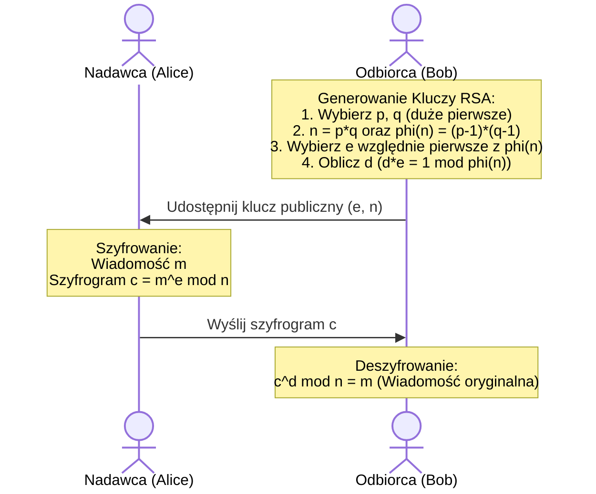

# Pytanie 33: Algorytmy asymetryczne. Szyfr RSA.

## Kluczowe pojęcia
- **Kryptografia asymetryczna (kryptografia z kluczem publicznym)**: Schemat kryptograficzny wykorzystujący parę powiązanych matematycznie kluczy: klucz publiczny (szeroko udostępniany, służący do szyfrowania lub weryfikacji podpisu) oraz klucz prywatny (tajny, służący do deszyfrowania lub składania podpisu).
- **RSA (Rivest-Shamir-Adleman)**: Pierwszy i najpopularniejszy algorytm asymetryczny z możliwością szyfrowania oraz tworzenia podpisów cyfrowych.
- **Faktoryzacja**: Proces rozkładu liczby złożonej na czynniki pierwsze. Trudność tego problemu matematycznego dla bardzo dużych liczb stanowi o sile RSA.
- **Funkcja Eulera ($\phi(n)$)**: Funkcja określająca liczbę liczb naturalnych mniejszych od $n$, które są względnie pierwsze z $n$.
- **OAEP (Optimal Asymmetric Encryption Padding)**: Schemat dopełniania danych stosowany w celu uodpornienia szyfrowania RSA na ataki wybiórcze i deterministyczne.

## Szczegółowe omówienie tematu

Kryptografia asymetryczna rozwiązała największy problem kryptografii symetrycznej – konieczność bezpiecznego przekazania klucza deszyfrującego odbiorcy. W schemacie asymetrycznym nadawca szyfruje wiadomość powszechnie dostępnym kluczem publicznym odbiorcy, a sam proces odszyfrowania może wykonać wyłącznie odbiorca za pomocą swojego tajnego klucza prywatnego.

---

### 1. Algorytm RSA – Matematyczne podstawy i generowanie kluczy

Algorytm RSA opiera się na teorii liczb i arytmetyce modularnej. Proces generowania pary kluczy przebiega w następujących krokach:

1. **Wybór liczb pierwszych**: 
   Wybieramy dwie bardzo duże, losowe i różne liczby pierwsze $p$ i $q$.
2. **Obliczenie modułu**:
   Obliczamy ich iloczyn $n = p \cdot q$. Długość bitowa liczby $n$ (np. 2048, 4096 bitów) określa długość klucza. Liczba $n$ jest publiczna.
3. **Obliczenie wartości funkcji Eulera**:
   Obliczamy wartość funkcji $\phi(n)$ dla modułu:
   $$\phi(n) = (p-1)(q-1)$$
4. **Wybór wykładnika publicznego ($e$)**:
   Wybieramy liczbę $e$, taką aby:
   $$1 < e < \phi(n) \quad \text{oraz} \quad \gcd(e, \phi(n)) = 1$$
   (liczba $e$ musi być względnie pierwsza z $\phi(n)$). W praktyce najczęściej wybiera się liczbę $e = 65537$ ($2^{16}+1$).
5. **Obliczenie wykładnika prywatnego ($d$)**:
   Obliczamy liczbę $d$, która jest odwrotnością modularną liczby $e$ modulo $\phi(n)$ (przy użyciu Rozszerzonego Algorytmu Euklidesa):
   $$d \cdot e \equiv 1 \pmod{\phi(n)}$$

- **Klucz publiczny**: Para $(e, n)$
- **Klucz prywatny**: Para $(d, n)$ (liczby $p$, $q$ oraz $\phi(n)$ muszą zostać zniszczone).

---

### 2. Szyfrowanie i deszyfrowanie w RSA

- **Szyfrowanie**:
  Aby zaszyfrować wiadomość (reprezentowaną jako liczba $M < n$), nadawca oblicza szyfrogram $C$ przy użyciu klucza publicznego $(e, n)$:
  $$C = M^e \pmod{n}$$
- **Deszyfrowanie**:
  Odbiorca odzyskuje tekst jawny $M$ z szyfrogramu $C$ za pomocą swojego klucza prywatnego $(d, n)$:
  $$M = C^d \pmod{n}$$

**Poprawność matematyczna** algorytmu gwarantuje, że $(M^e)^d \equiv M^{e \cdot d} \equiv M \pmod{n}$, co bezpośrednio wynika z Małego Twierdzenia Fermata oraz Twierdzenia Eulera.

---

### 3. Zastosowanie w podpisach cyfrowych
RSA umożliwia również weryfikację autentyczności wiadomości (podpis cyfrowy). Proces ten przebiega odwrotnie do szyfrowania:
- **Podpisywanie**: Nadawca oblicza skrót wiadomości (hash, np. SHA-256) i "szyfruje" go swoim **kluczem prywatnym** $d$:
  $$\text{Podpis} = (\text{Hash})^d \pmod{n}$$
- **Weryfikacja**: Odbiorca oblicza hash otrzymanej wiadomości, a następnie "odszyfrowuje" podpis za pomocą **klucza publicznego** nadawcy $e$:
  $$\text{Odzyskany Hash} = (\text{Podpis})^e \pmod{n}$$
  Jeśli oba hashe są identyczne, oznacza to, że wiadomość nie została zmodyfikowana (integralność) i pochodzi od właściciela klucza prywatnego (autentyczność i niezaprzeczalność).

---

### 4. Bezpieczeństwo i zalecenia wdrożeniowe
- **Problem faktoryzacji**: Siła RSA tkwi w trudności rozkładu liczby $n$ na czynniki $p$ i $q$. Dla kluczy 2048-bitowych i większych zadanie to wymagałoby miliardów lat pracy najlepszych współczesnych superkomputerów.
- **Zalecana długość klucza**: Współcześnie absolutnym minimum bezpieczeństwa są klucze **2048-bitowe** (zalecane do nowych systemów: 3072 lub 4096 bitów).
- **Zastosowanie paddingu (OAEP)**: "Surowe" szyfrowanie RSA ($C = M^e \pmod{n}$) jest deterministyczne. Atakujący może zgadnąć treść wiadomości, zaszyfrować ją kluczem publicznym i porównać z przechwyconym szyfrogramem. Aby temu zapobiec, stosuje się schemat **OAEP**, który dodaje losowy szum do wiadomości przed szyfrowaniem, czyniąc proces probabilistycznym.
- **Podatność na komputery kwantowe**: Algorytm RSA jest podatny na **algorytm Shora** realizowany na komputerach kwantowych. W momencie powstania stabilnego komputera kwantowego o odpowiedniej liczbie kubitów, klucze RSA zostaną natychmiast złamane. Stąd trwają prace nad migracją na algorytmy postkwantowe (PQC).

## Wizualizacja

Oto schemat blokowy / diagram ułatwiający zrozumienie zagadnienia:

## Podsumowanie
Algorytm RSA to fundamentalny protokół współczesnego bezpieczeństwa sieciowego (stanowiący m.in. podstawę certyfikatów SSL/TLS). Oparty na trudności faktoryzacji dużych liczb złożonych, realizuje zarówno szyfrowanie asymetryczne, jak i podpisy cyfrowe. Dla zachowania bezpieczeństwa wymaga kluczy o długości minimum 2048 bitów oraz stosowania schematów dopełniania takich jak OAEP.