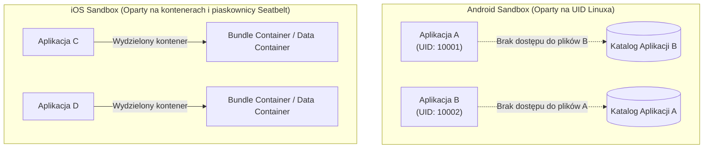

# Pytanie 35: W jaki sposób systemy mobilne (Android, iOS) zabezpieczają dane przed dostępem nieautoryzowanych aplikacji?

## Kluczowe pojęcia
- **Piaskownica aplikacji (Application Sandboxing)**: Podstawowy mechanizm izolacji systemowej, w którym każda aplikacja działa w osobnym środowisku z ograniczonym dostępem do zasobów i plików innych aplikacji.
- **UID (User Identifier)**: Unikalny identyfikator użytkownika przypisywany aplikacji w systemie Android na poziomie jądra Linux w celu separacji uprawnień do plików.
- **Secure Enclave / TEE (Trusted Execution Environment)**: Wydzielony sprzętowo, bezpieczny koprocesor (moduł bezpieczeństwa) odpowiedzialny za operacje kryptograficzne i ochronę kluczy.
- **FBE (File-Based Encryption)**: Szyfrowanie oparte na plikach, w którym różne pliki są szyfrowane różnymi kluczami powiązanymi z kodem blokady ekranu.

## Szczegółowe omówienie tematu

W przeciwieństwie do tradycyjnych systemów desktopowych (gdzie każda uruchomiona aplikacja ma dostęp do katalogu domowego użytkownika), systemy mobilne Android i iOS zostały zaprojektowane według modelu **braku domyślnego zaufania (Zero Trust)**. Ochrona danych przed dostępem ze strony nieautoryzowanych (innych) aplikacji opiera się na kilku warstwach zabezpieczeń.

---

### 1. Piaskownica aplikacji (Sandboxing) – Izolacja procesów i plików
Jest to fundamentalna bariera ochronna na poziomie systemu operacyjnego. Każda zainstalowana aplikacja otrzymuje własny, wydzielony katalog w pamięci urządzenia i działa w odrębnym procesie.

- **System Android**:
  Pod spodem Android bazuje na jądrze Linux. Podczas instalacji każdej aplikacji system przypisuje unikalny identyfikator użytkownika systemu Linux (**UID**). Każdy proces aplikacji działa jako ten unikalny użytkownik. Uprawnienia systemu plików Linux (rwx) gwarantują, że aplikacja A (np. działająca z UID `u0_a112`) nie ma prawa odczytu ani zapisu danych w katalogu prywatnym aplikacji B (działającej z UID `u0_a113`). Dodatkowo wdrożony jest mechanizm **SELinux (Security-Enhanced Linux)**, który definiuje ścisłe reguły dostępu do zasobów systemowych, uniemożliwiając procesom wyjście poza ich uprawnienia (nawet przy próbie eskalacji).
- **System iOS**:
  W iOS (bazującym na jadrze Darwin/XNU) każda aplikacja działa we własnym, losowo wygenerowanym kontenerze (sandbox). Polityka piaskownicy jest kontrolowana przez profil systemowy (Sandbox profile) na poziomie jądra. Aplikacja nie ma fizycznej możliwości poruszania się po strukturze katalogów innych aplikacji ani odczytywania plików systemowych.

---

### 2. Szyfrowanie pamięci (Encryption at Rest)
Wszystkie nowoczesne urządzenia mobilne domyślnie szyfrują pamięć flash. Dane są bezpieczne, nawet jeśli napastnik fizycznie wymontuje kości pamięci z płyty głównej.

- **Android (File-Based Encryption - FBE)**:
  Wprowadzony jako standard od Androida 10. Każdy plik jest szyfrowany niezależnym kluczem. Klucze te są powiązane ze sprzętem (modułem bezpieczeństwa TEE) oraz kodem blokady ekranu użytkownika. Dane dzielą się na:
    - *Device Encrypted (DE)*: Dane dostępne od razu po uruchomieniu telefonu (np. aby działał budzik czy przychodziły powiadomienia przed wpisaniem PIN-u).
    - *Credential Encrypted (CE)*: Dane odszyfrowywane dopiero po poprawnym odblokowaniu ekranu przez użytkownika.
- **iOS (Data Protection Architecture)**:
  iOS przypisuje plikom tzw. Klasy Ochrony (Protection Classes). Najbardziej restrykcyjna klasa (*NSFileProtectionComplete*) szyfruje plik kluczem powiązanym z kodem blokady ekranu. Klucz ten jest usuwany z pamięci RAM natychmiast po zablokowaniu ekranu. Oznacza to, że gdy telefon jest zablokowany, pliki te są fizycznie niemożliwe do odczytania (nawet dla procesów systemowych działających w tle). Szyfrowanie opiera się na dedykowanym koprocesorze sprzętowym **Secure Enclave**.

---

### 3. Bezpieczne magazyny kluczy (Keychain i Keystore)
Aplikacje nie powinny przechowywać haseł ani kluczy kryptograficznych we własnych plikach konfiguracyjnych. Zamiast tego korzystają z bezpiecznych usług systemowych:

- **iOS Keychain**:
  Bezpieczny, scentralizowany kontener haseł i certyfikatów zarządzany przez system operacyjny. Dostęp do niego jest chroniony sprzętowo. System gwarantuje, że dana aplikacja może odczytać wyłącznie te wpisy z Keychaina, które sama utworzyła (wyjątkiem jest współdzielenie w ramach tzw. *App Groups* zdefiniowanych przez tego samego dewelopera).
- **Android Keystore System**:
  Pozwala aplikacji wygenerować parę kluczy kryptograficznych (np. AES, RSA) wewnątrz bezpiecznego środowiska **TEE (Trusted Execution Environment)** lub sprzętowego modułu HSM (np. chip Titan M). Klucze te mogą być używane do szyfrowania danych aplikacji, ale **nigdy nie mogą zostać wyeksportowane ani odczytane** w postaci jawnej przez samą aplikację. Aplikacja może jedynie zlecić systemowi wykonanie operacji kryptograficznej tym kluczem.

---

### 4. Kontrola komunikacji między aplikacjami (IPC)
Aplikacje czasami muszą wymieniać informacje (np. aplikacja bankowa otwiera aplikację BLIK). Systemy mobilne blokują bezpośredni dostęp do pamięci procesów (IPC blocking). Wymiana danych jest ściśle kontrolowana:
- W Androidzie odbywa się to za pomocą mechanizmu **Intents** (Intencji) oraz usług systemowych, gdzie nadawca może określić uprawnienia wymagane od odbiorcy.
- W iOS wymiana danych jest skrajnie ograniczona do tzw. *URL Schemes* (wywołań adresów URL przypisanych do aplikacji) oraz ściśle zdefiniowanych rozszerzeń systemowych (*App Extensions*).

## Wizualizacja

Oto schemat blokowy / diagram ułatwiający zrozumienie zagadnienia:

## Podsumowanie
Izolacja danych w systemach mobilnych opiera się na **piaskownicy (sandboxing)** wymuszanej na poziomie jądra systemu, systemowym **szyfrowaniu plików (FBE / Data Protection)** zintegrowanym ze sprzętem (Secure Enclave / TEE) oraz dedykowanych interfejsach **Keychain/Keystore**, które uniemożliwiają aplikacjom wzajemny podsłuch i kradzież danych sesyjnych.