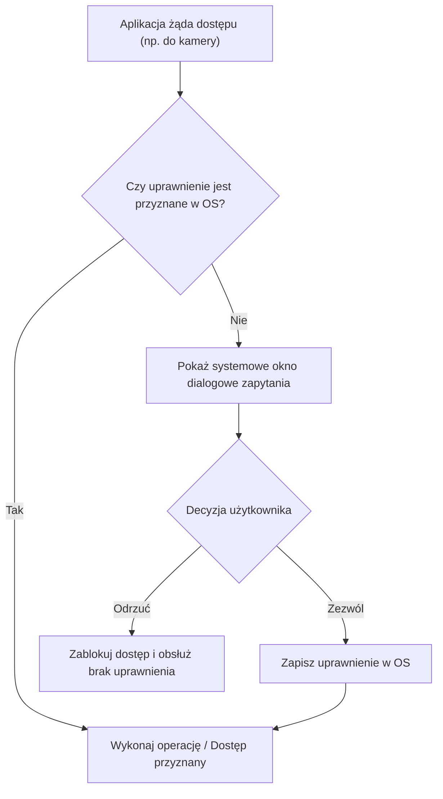

# Pytanie 36: W jaki sposób systemy mobilne zabezpieczają użytkownika przed dostępem aplikacji do funkcji takich jak kamera, wykonywanie/ odbieranie połączeń, bluetooth, położenie?

## Kluczowe pojęcia
- **Uprawnienia dynamiczne (Runtime Permissions)**: Uprawnienia do wrażliwych sensorów i danych, o które aplikacja musi zapytać użytkownika w trakcie działania programu, a nie podczas instalacji.
- **Wskaźniki prywatności (Privacy Indicators)**: Wizualne alerty na pasku stanu systemu (np. kropki), informujące o aktywnym korzystaniu z kamery lub mikrofonu przez aplikacje.
- **Zasada piaskownicy (Sandboxing)**: Ograniczenie możliwości interakcji aplikacji ze sprzętem i systemem operacyjnym bez pośrednictwa bezpiecznych warstw API.

## Szczegółowe omówienie tematu

Systemy Android i iOS stosują zaawansowane mechanizmy kontroli dostępu do zasobów sprzętowych urządzenia, chroniąc prywatność użytkownika przed aplikacjami szpiegującymi oraz nadużyciami (np. potajemnym nagrywaniem lub śledzeniem lokalizacji).

---

### 1. Model uprawnień w czasie uruchomienia (Runtime Permissions)
W starszych wersjach systemów (np. Android 5.0 i starsze) użytkownik akceptował listę uprawnień zbiorczo podczas instalacji aplikacji ze sklepu. Nie miał możliwości zablokowania pojedynczego uprawnienia – musiał zgodzić się na wszystkie albo zrezygnować z instalacji.

Współczesne wersje Androida (od wersji 6.0) oraz iOS od początku stosują model **uprawnień dynamicznych (Runtime/On-Demand Permissions)**.
- **Deklaracja statyczna**: Deweloper musi najpierw zadeklarować chęć użycia sensora w kodzie konfiguracji aplikacji (plik `AndroidManifest.xml` w Androidzie lub `Info.plist` w iOS z podaniem opisu uzasadnienia wyświetlanego użytkownikowi).
- **Zgoda użytkownika**: Przy próbie pierwszego użycia funkcji (np. kliknięcie ikony aparatu) system operacyjny zawiesza działanie aplikacji i wyświetla systemowe, niepodrabialne okno dialogowe z zapytaniem o zgodę. Użytkownik ma do wyboru opcje:
  - *Zezwól zawsze* (lub tylko podczas korzystania z aplikacji).
  - *Zezwól tylko tym razem* (jednorazowy dostęp, po zamknięciu aplikacji uprawnienie wygasa).
  - *Nie zezwalaj* (aplikacja nie otrzyma dostępu, a próba odczytu zwróci pusty wynik lub błąd, który aplikacja musi bezpiecznie obsłużyć bez awarii systemu).

---

### 2. Ochrona poszczególnych funkcji sprzętowych i programowych

#### A. Położenie (Lokalizacja GPS / Wi-Fi / Bluetooth)
Lokalizacja jest jednym z najbardziej chronionych zasobów.
- **Lokalizacja precyzyjna vs przybliżona**: Użytkownik może zdecydować, czy aplikacja (np. pogodowa) ma znać dokładne współrzędne GPS (Fine Location), czy jedynie przybliżone położenie na podstawie nadajników sieci komórkowej i Wi-Fi (Coarse Location).
- **Blokada lokalizacji w tle**: Aplikacje działające w tle mają drastycznie ograniczony dostęp do lokalizacji. Aby uzyskać dostęp w tle (np. aplikacje do śledzenia aktywności sportowej), deweloper musi przejść przez specjalny, rygorystyczny proces akceptacji w sklepach z aplikacjami, a użytkownik musi wyrazić na to osobną zgodę w głębokich ustawieniach systemu.

#### B. Kamera i mikrofon (Sensory rejestracji obrazu i dźwięku)
- **Wskaźniki nagrywania (Privacy Indicators)**: Wdrożone w iOS 14 i Androidzie 12. Na pasku stanu u góry ekranu wyświetla się kolorowa kropka (najczęściej zielona dla kamery, pomarańczowa dla mikrofonu), jeśli jakikolwiek proces korzysta z tych sensorów. Rozwinięcie paska pozwala natychmiast sprawdzić, która aplikacja nas nagrywa.
- **Całkowita blokada w tle**: System operacyjny uniemożliwia aplikacjom działającym w tle (zminimalizowanym) dostęp do strumienia wideo z kamery i audio z mikrofonu. Wyjątkiem są aplikacje wykonujące aktywne połączenia głosowe, które muszą wyświetlać stałe powiadomienie na ekranie (np. ikona połączenia).

#### C. Bluetooth i Wi-Fi (Skanowanie otoczenia)
W przeszłości aplikacje skanowały otoczenie w poszukiwaniu nadajników Bluetooth (Beaconów) i sieci Wi-Fi, co pozwalało na precyzyjne śledzenie pozycji użytkownika w galeriach handlowych bez jego wiedzy.
- **Zabezpieczenie**: Współczesne systemy traktują skanowanie Bluetooth i Wi-Fi jako operacje ujawniające lokalizację. Aplikacja nie może wyszukać urządzeń Bluetooth ani sieci bez posiadania aktywnego uprawnienia do lokalizacji (Android) lub specjalnego uprawnienia do skanowania sieci lokalnej/Bluetooth (iOS).

#### D. Wykonywanie połączeń i SMS (GSM)
- **Ograniczenie uprawnień systemowych**: Uprawnienia do bezpośredniego nawiązywania połączeń (`CALL_PHONE`) i wysyłania SMS (`SEND_SMS`) mogą być nadużywane do generowania kosztów (numery Premium). 
- **Zabezpieczenie**: Aplikacja może wysłać żądanie nawiązania połączenia lub wysłania SMS, ale system domyślnie przekazuje te dane do **systemowego dialera / aplikacji wiadomości**, gdzie to użytkownik musi ostatecznie fizycznie kliknąć przycisk "Zadzwoń" lub "Wyślij". Bezpośrednie wysłanie bez wiedzy użytkownika jest zablokowane dla zwykłych aplikacji.

## Wizualizacja

Oto schemat blokowy / diagram ułatwiający zrozumienie zagadnienia:

## Podsumowanie
Nowoczesne systemy mobilne zabezpieczają wrażliwe funkcje sprzętowe poprzez ustrukturyzowany model **uprawnień dynamicznych**, rygorystyczne **blokowanie dostępu w tle** oraz systemowe **wskaźniki wizualne** informujące użytkownika o działaniu kamery i mikrofonu. Podejście to oddaje pełną kontrolę nad prywatnością w ręce użytkownika urządzenia.