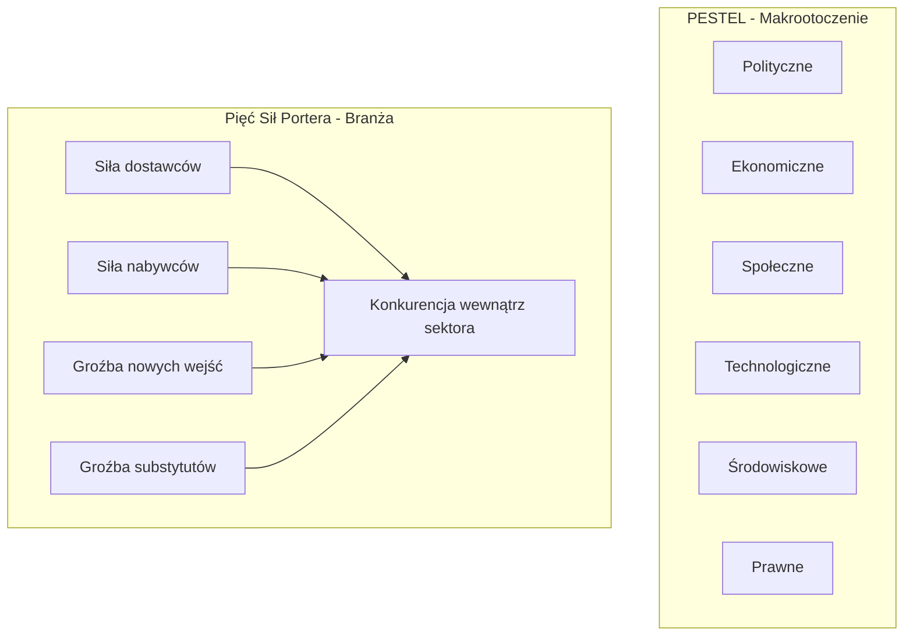

# Pytanie 39: Wymień i opisz podstawowe metody wykorzystywane w analizie strategicznej makrootoczenia, otoczenia branżowego firmy.

## Kluczowe pojęcia
- **Analiza strategiczna**: Zestaw metod badawczych służących do diagnozowania pozycji strategicznej przedsiębiorstwa, w tym badania jego wnętrza oraz otoczenia.
- **Makrootoczenie (Otoczenie dalsze)**: Ogół czynników globalnych (np. inflacja, prawo, trendy demograficzne), które wpływają na funkcjonowanie firmy, ale na które firma nie ma żadnego wpływu.
- **Otoczenie branżowe (Mikrootoczenie / konkurencyjne)**: Bezpośrednie otoczenie firmy, obejmujące dostawców, odbiorców, konkurentów oraz producentów substytutów. Firma ma możliwość interakcji i częściowego wpływu na te podmioty.
- **PESTEL**: Narzędzie analizy makrootoczenia dzielące je na sześć głównych obszarów.
- **Pięć sił Portera**: Model strukturalnej analizy atrakcyjności (rentowności) sektora przemysłowego.

## Szczegółowe omówienie tematu

Analiza strategiczna jest pierwszym krokiem formułowania strategii biznesowej. Dzieli się ją na badanie makrootoczenia oraz badanie otoczenia konkurencyjnego (branżowego).

---

### 1. Metody analizy makrootoczenia (Otoczenia dalszego)

#### A. Analiza PEST / PESTEL
Najpopularniejsza, systematyczna metoda oceny wpływu czynników globalnych. Polega na zidentyfikowaniu kluczowych zjawisk w sześciu obszarach i ocenie ich wpływu na działalność firmy (jako szanse lub zagrożenia):
- **P (Political) – Polityczne**: Stabilność rządu, polityka celna, programy subsydiów (np. dotacje z UE), relacje międzynarodowe.
- **E (Economic) – Ekonomiczne**: Tempo wzrostu PKB, poziom inflacji, stopy procentowe (koszt kredytu), kursy walut, stopa bezrobocia.
- **S (Social) – Społeczno-kulturowe**: Demografia (starzenie się społeczeństwa), poziom wykształcenia, trendy konsumenckie, zmiana stylu życia.
- **T (Technological) – Technologiczne**: Cyfryzacja, tempo rozwoju innowacji, wydatki na badania i rozwój (R&D), powszechność sztucznej inteligencji.
- **E (Environmental) – Środowiskowe**: Polityka klimatyczna, wymogi redukcji śladu węglowego, recykling, dostępność surowców naturalnych.
- **L (Legal) – Prawne**: Przepisy podatkowe, prawo pracy, ochrona danych osobowych (RODO), prawo antymonopolowe.

#### B. Metoda scenariuszowa (Scenariusze stanów otoczenia)
Wykorzystywana w środowiskach o wysokiej zmienności. Polega na opracowaniu alternatywnych wizji przyszłości (np. scenariusz optymistyczny, pesymistyczny, najbardziej prawdopodobny i niespodziewany) w oparciu o trendy makroekonomiczne. Umożliwia to firmie elastyczne przygotowanie planów awaryjnych.

---

### 2. Metody analizy otoczenia branżowego (konkurencyjnego)

#### A. Model Pięciu Sił Portera
Służy do oceny atrakcyjności (rentowności) danej branży. Model zakłada, że na zyskowność sektora wpływa pięć czynników konkurencyjnych:
1. **Rywalizacja między istniejącymi konkurentami**: Liczba konkurentów, tempo wzrostu rynku, stopień zróżnicowania produktów. Silna walka cenowa obniża marże w branży.
2. **Groźba nowych wejść (Bariery wejścia)**: Łatwość, z jaką nowe firmy mogą wejść do branży. Barierami są: wysoki kapitał początkowy, patenty, lojalność klientów wobec istniejących marek, efekt skali.
3. **Groźba pojawienia się substytutów**: Dostępność alternatywnych produktów lub usług zaspokajających tę samą potrzebę (np. wideokonferencje jako substytut podróży biznesowych).
4. **Siła przetargowa nabywców (klientów)**: Zdolność klientów do negocjowania niższych cen lub wyższej jakości. Jest wysoka, gdy klientów jest niewielu (są skoncentrowani), kupują hurtowo lub łatwo mogą zmienić dostawcę.
5. **Siła przetargowa dostawców**: Zdolność dostawców surowców/usług do dyktowania cen. Jest wysoka, gdy rynek dostawców jest zmonopolizowany lub brak jest materiałów alternatywnych.

#### B. Mapa grup strategicznych
Metoda polegająca na pogrupowaniu konkurentów w branży według określonych kryteriów strategicznych (np. szerokość asortymentu vs poziom cen). Pozwala to na zidentyfikowanie bezpośrednich konkurentów (w tej samej grupie) oraz wykrycie luk rynkowych (niezagospodarowanych nisz).

---

### 3. Metoda syntetyzująca: Analiza SWOT / TOWS
Metoda łącząca analizę otoczenia z analizą wnętrza firmy:
- **Analiza wewnętrzna**:
  - **S (Strengths)** – Mocne strony: unikalne zasoby, wysoka jakość kodu, silna marka.
  - **W (Weaknesses)** – Słabe strony: brak kapitału, dług technologiczny.
- **Analiza zewnętrzna**:
  - **O (Opportunities)** – Szanse: nowe rynki zbytu, dotacje rządowe na cyfryzację.
  - **T (Threats)** – Zagrożenia: wzrost kosztów energii, nowe regulacje prawne.

## Wizualizacja

Oto schemat blokowy / diagram ułatwiający zrozumienie zagadnienia:

## Podsumowanie
W analizie strategicznej makrootoczenie bada się metodą **PESTEL** w celu określenia globalnych trendów. Sytuację wewnątrz samej branży ocenia się za pomocą **modelu pięciu sił Portera** i **mapy grup strategicznych**. Zwieńczeniem całego procesu jest integracja tych danych w macierzy **SWOT**, która pozwala sformułować konkretne kierunki strategiczne (np. strategię agresywną, konserwatywną czy naprawczą).