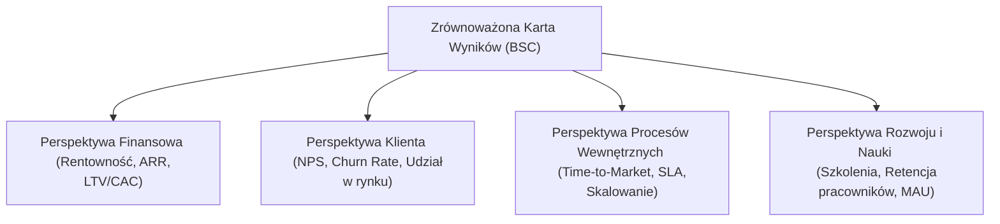

# Pytanie 40: Przedstaw zestaw celów i mierników dla wybranej strategii (wzrostu/ stabilizacji/redukcji).

## Kluczowe pojęcia
- **Strategia biznesowa**: Długofalowy kierunek i zakres działania organizacji mający na celu zdobycie przewagi konkurencyjnej.
- **Strategia wzrostu (ekspansji)**: Strategia nastawiona na dynamiczne zwiększanie skali działania przedsiębiorstwa (przychody, udziały w rynku, baza klientów).
- **KPI (Key Performance Indicators)**: Kluczowe wskaźniki efektywności – finansowe i niefinansowe mierniki pozwalające ocenić stopień realizacji celów strategicznych.
- **LTV / CAC**: Wskaźniki relacji wartości klienta w czasie (Lifetime Value) do kosztu jego pozyskania (Customer Acquisition Cost), kluczowe dla oceny efektywności wzrostu.

## Szczegółowe omówienie tematu

Do celów niniejszego opracowania wybrano **strategię wzrostu (ekspansji)**. Jest to najczęściej stosowana strategia w sektorze nowych technologii (IT), startupów oraz cyberbezpieczeństwa, gdzie szybkie zdobycie udziałów w rynku (Time-to-Market) decyduje o przetrwaniu i sukcesie firmy.

---

### 1. Cele dla strategii wzrostu
Zgodnie z metodologią zarządzania przez cele (MBO) oraz zasadą **SMART**, cele strategiczne muszą być jasno określone w czasie i ilościowo mierzalne. Cele te dzielimy na cztery perspektywy (zgodnie z koncepcją Zrównoważonej Karty Wyników – *Balanced Scorecard*):

#### A. Perspektywa finansowa:
1. Dynamiczny wzrost rocznych przychodów operacyjnych.
2. Zwiększenie rentowności i wartości powtarzalnych przychodów (szczególnie w modelach subskrypcyjnych SaaS).
3. Zwiększenie udziału przychodów z rynków zagranicznych.

#### B. Perspektywa klienta (rynkowa):
1. Zwiększenie udziału w rynku krajowym.
2. Skuteczna ekspansja geograficzna na nowe rynki (np. kraje DAX lub USA).
3. Zwiększenie lojalności klientów i ograniczenie ich odpływu.

#### C. Perspektywa procesów wewnętrznych (operacyjna):
1. Skrócenie czasu dostarczania nowych produktów/funkcji na rynek (Time-to-Market).
2. Zwiększenie stabilności i skalowalności architektury IT w celu obsługi rosnącej bazy użytkowników.

---

### 2. Zestaw mierników (KPI) dla strategii wzrostu

Poniższa tabela prezentuje przyporządkowanie mierników (KPI) do określonych celów, wraz z metodą ich wyliczania oraz przykładowymi wartościami docelowymi:

| Perspektywa | Cel strategiczny | Miernik (KPI) | Sposób wyliczenia / Opis | Wartość docelowa (Przykładowa) |
| :--- | :--- | :--- | :--- | :--- |
| **Finansowa** | Wzrost przychodów | **ARR (Annual Recurring Revenue)** | Roczny przychód powtarzalny z subskrypcji. | Wzrost o **30% rok do roku (r/r)** |
| **Finansowa** | Rentowność ekspansji | **LTV : CAC** | Stosunek wartości klienta w cyklu życia do kosztu jego pozyskania. | Wskaźnik **> 3 : 1** (zdrowy wzrost) |
| **Klienta** | Udział w rynku | **Market Share** | Udział procentowy przychodów firmy w całkowitej wartości rynku. | Wzrost z **8% do 12% w ciągu 2 lat** |
| **Klienta** | Ekspansja zagraniczna | **Przychody z eksportu** | Procentowy udział sprzedaży zagranicznej w przychodach ogółem. | Osiągnięcie **40% przychodów ogółem** |
| **Klienta** | Lojalność klientów | **Churn Rate** | Procent klientów, którzy zrezygnowali z subskrypcji w danym miesiącu. | Spadek wskaźnika **poniżej 1% miesięcznie** |
| **Procesów** | Szybkość wdrożeń | **Time-to-Market (TTM)** | Średni czas od zatwierdzenia pomysłu (feature) do wdrożenia na produkcję. | Skrócenie TTM z **60 dni do 21 dni** |
| **Procesów** | Skalowalność systemów | **Dostępność SLA** | Procent czasu bezawaryjnego działania aplikacji webowej/mobilnej. | Utrzymanie poziomu **99.9% (trzy dziewiątki)** |
| **Rozwoju** | Baza użytkowników | **MAU (Monthly Active Users)** | Liczba unikalnych użytkowników aktywnych w systemie w ciągu miesiąca. | Osiągnięcie **100 000 MAU do końca roku** |

---

### 3. Alternatywne strategie (dla porównania)

- **Strategia stabilizacji**:
  *Cel*: Utrzymanie obecnej pozycji rynkowej, ochrona udziałów przed konkurencją.
  *Kluczowe KPI*: Wskaźnik retencji klientów (CRR - Customer Retention Rate), marża operacyjna (EBITDA), wskaźnik satysfakcji klienta (NPS).
- **Strategia redukcji**:
  *Cel*: Uratowanie firmy przed bankructwem, restrukturyzacja.
  *Kluczowe KPI*: Poziom kosztów stałych (redukcja o X%), rentowność poszczególnych oddziałów (likwidacja nierentownych), przepływy pieniężne (Cash Flow).

## Wizualizacja

Oto schemat blokowy / diagram ułatwiający zrozumienie zagadnienia:

## Podsumowanie
Wdrożenie strategii wzrostu wymaga ciągłego monitorowania wskaźników finansowych i operacyjnych. Kluczowymi metrykami w branży technologicznej są **ARR** (odzwierciedlający stabilność przychodów), relacja **LTV do CAC** (sprawność ekonomiczna pozyskiwania klientów), **Churn Rate** (utrzymanie bazy) oraz operacyjny **Time-to-Market** (szybkość innowacji). Ich właściwa analityka pozwala korygować działania marketingowe i deweloperskie na bieżąco.