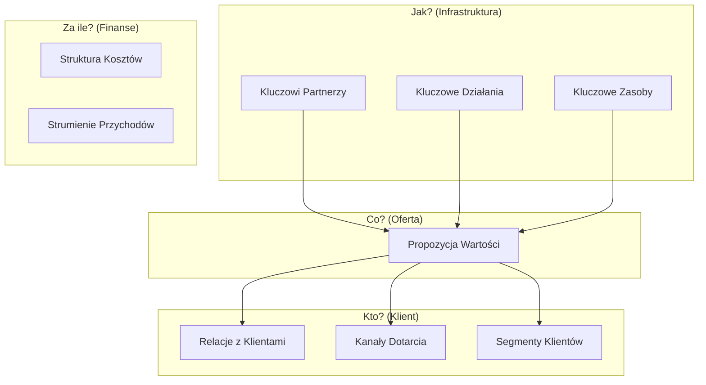

# Pytanie 41: Wyjaśnij pojęcie model biznesu, scharakteryzuj składowe modelu biznesu.

## Kluczowe pojęcia
- **Model biznesu (Business Model)**: Koncepcyjne narzędzie opisujące logikę działania przedsiębiorstwa, określające sposób, w jaki firma tworzy, dostarcza i przechwytuje wartość (generuje zyski).
- **Business Model Canvas (Osterwalder Canvas)**: Szablon biznesowy autorstwa Alexandra Osterwaldera, składający się z 9 bloków, stanowiący standard wizualizacji i projektowania modeli biznesowych.
- **Propozycja wartości (Value Proposition)**: Kluczowy element modelu biznesu określający, jaki problem klienta rozwiązuje produkt/usługa i dlaczego warto wybrać ofertę tej firmy.
- **Strumienie przychodów (Revenue Streams)**: Metody i mechanizmy generowania wpływów finansowych z poszczególnych segmentów klientów.

## Szczegółowe omówienie tematu

### 1. Pojęcie modelu biznesu
Model biznesu to architektura operacyjno-finansowa przedsiębiorstwa. Podczas gdy strategia określa, *dokąd* firma zmierza i *jak konkuruje*, a biznesplan szczegółowo opisuje *sposób wdrożenia*, model biznesu wyjaśnia podstawową logikę ekonomiczną: **jak firma generuje zyski poprzez zaspokajanie potrzeb klientów**.

---

### 2. Składowe modelu biznesu według Business Model Canvas (BMC)
Najpopularniejszym standardem opisu modelu biznesu jest szablon Osterwaldera, który dzieli model na 9 wzajemnie powiązanych składowych pogrupowanych w cztery obszary:

#### Obszar I: Klient i Rynek (Kto?)
1. **Segmenty klientów (Customer Segments)**:
   Określenie grup odbiorców (osób lub organizacji), do których firma kieruje swoją ofertę. Mogą to być: rynek masowy, rynek niszowy, rynek zdywersyfikowany lub platformy wielostronne (np. Google łączący wyszukujących z reklamodawcami).
2. **Kanały dotarcia (Channels)**:
   Punkty styku z klientem, za pośrednictwem których firma dostarcza mu wartość (np. sklep internetowy, bezpośredni zespół handlowców, dystrybutorzy).
3. **Relacje z klientami (Customer Relationships)**:
   Charakter interakcji z odbiorcami. Przykłady to: pomoc osobista (dedykowany opiekun), samoobsługa, usługi zautomatyzowane (np. chatboty), współtworzenie (np. recenzje na Amazonie) czy społeczności wokół marki.

#### Obszar II: Wartość (Co?)
4. **Propozycja wartości (Value Proposition)**:
   Serce modelu biznesu. Pakiet produktów lub usług tworzący wartość dla klienta. Wartość może wynikać z nowości na rynku, wysokiej wydajności, personalizacji (dostosowania do klienta), unikalnego designu, statusu marki, niskiej ceny, redukcji kosztów lub ułatwienia dostępu.

#### Obszar III: Infrastruktura i Operacje (Jak?)
5. **Kluczowe działania (Key Activities)**:
   Najważniejsze czynności, które firma musi stale wykonywać, aby jej model działał (np. tworzenie oprogramowania w firmie IT, zarządzanie łańcuchem dostaw w e-commerce, rozwiązywanie problemów w doradztwie).
6. **Kluczowe zasoby (Key Resources)**:
   Środki niezbędne do stworzenia i dostarczenia propozycji wartości. Dzielą się na: fizyczne (fabryki, serwery), intelektualne (patenty, bazy danych, prawa autorskie), ludzkie (programiści, naukowcy) oraz finansowe (gotówka, linie kredytowe).
7. **Kluczowi partnerzy (Key Partnerships)**:
   Sieć dostawców i kooperantów. Partnerstwa tworzy się w celu optymalizacji kosztów, redukcji ryzyka rynkowego lub pozyskania zasobów (np. alianse strategiczne, joint venture, partnerstwo z dostawcą chmury AWS/Azure).

#### Obszar IV: Finanse (Za ile?)
8. **Struktura kosztów (Cost Structure)**:
   Wszystkie wydatki ponoszone w związku z funkcjonowaniem modelu. Wyróżnia się modele *zorientowane na koszty* (szukanie oszczędności, np. Ryanair) oraz *zorientowane na wartość* (skupienie na unikalności oferty, np. marki luksusowe). Koszty dzielimy na stałe i zmienne.
9. **Strumienie przychodów (Revenue Streams)**:
   Sposób, w jaki firma przechwytuje wartość w postaci gotówki. Wyróżnia się:
     - Sprzedaż aktywów (jednorazowa zapłata za produkt).
     - Opłatę za użytkowanie (np. minuty wypożyczenia auta).
     - Abonament / Subskrypcję (SaaS, np. Netflix, Spotify, Adobe).
     - Licencjonowanie (udostępnienie własności intelektualnej).
     - Reklamę.

## Wizualizacja

Oto schemat blokowy / diagram ułatwiający zrozumienie zagadnienia:

## Podsumowanie
Model biznesu to system naczyń połączonych. Zmiana jednego elementu (np. przejście ze sprzedaży licencji na model subskrypcyjny SaaS w bloku *Strumienie przychodów*) pociąga za sobą zmiany w innych blokach (wymaga innych *Kluczowych zasobów* w postaci serwerów chmurowych oraz innych *Relacji z klientami*). Analiza modelu przy użyciu Business Model Canvas pozwala na wdrożenie spójnego i trwałego mechanizmu rynkowego gwarantującego stabilność ekonomiczną przedsiębiorstwa.